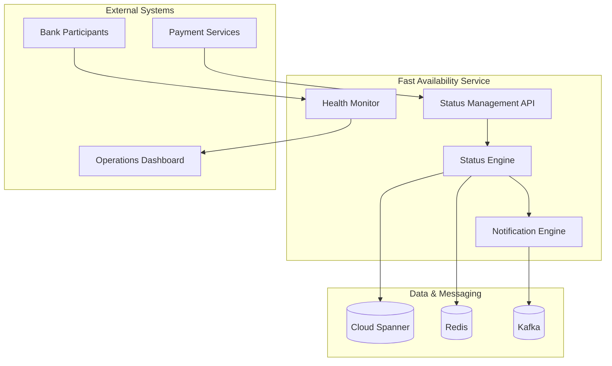

# Fast Availability Service - Implementation Overview

## Business Purpose
The Fast Availability Service manages **real-time bank participant status** and availability for Singapore's payment system, ensuring transactions are only routed to available banks and maintaining system-wide operational efficiency.

## Key Business Value
- **Real-time Status Management**: Instant updates on bank availability and maintenance windows
- **Intelligent Routing**: Ensures payments only route to available participants
- **Operational Efficiency**: Reduces failed transactions and processing delays
- **Regulatory Compliance**: Maintains accurate participant status for MAS reporting
- **System Resilience**: Prevents cascade failures from unavailable participants

## Service Capabilities

### Core Functions
- **Availability Tracking**: Real-time monitoring of bank participant status
- **Status Management**: Update and maintain participant availability states
- **Maintenance Scheduling**: Coordinate planned maintenance windows
- **Health Monitoring**: Continuous health checks for all participants
- **Status Broadcasting**: Notify other services of availability changes

### Performance Requirements
- **Status Checks**: < 100ms for availability verification
- **Status Updates**: < 50ms for availability state changes
- **Health Monitoring**: 30-second interval health checks
- **Availability**: 99.99% uptime (< 53 minutes downtime/year)
- **Consistency**: 100% accurate status across all services

## Technical Architecture

### System Overview

### Technology Foundation
- **Platform**: Java 21 with Virtual Threads for concurrent health monitoring
- **Database**: Cloud Spanner for consistent status data
- **Caching**: Redis for ultra-fast status lookups
- **Messaging**: Kafka for real-time status notifications
- **Monitoring**: Comprehensive health check framework

## Participant Management

### Availability States
| State | Description | Impact | Actions |
|-------|-------------|--------|---------|
| **AVAILABLE** | Fully operational | Normal routing | Continue processing |
| **DEGRADED** | Partial service | Reduced routing | Monitor closely |
| **MAINTENANCE** | Planned downtime | No routing | Route alternatives |
| **UNAVAILABLE** | Unplanned outage | No routing | Alert operations |
| **UNKNOWN** | Status uncertain | Hold routing | Investigate immediately |

### Health Check Framework
- **Connectivity Tests**: Regular ping and connection tests
- **Service Tests**: API endpoint health verification
- **Performance Tests**: Response time and throughput monitoring
- **Business Tests**: Transaction processing capability checks

## Real-time Monitoring & Alerting

### Health Monitoring Strategy
- **Proactive Monitoring**: Continuous health checks every 30 seconds
- **Multi-layer Checks**: Network, service, and business-level testing
- **Intelligent Alerting**: Smart thresholds to avoid false positives
- **Escalation Procedures**: Automated escalation for critical issues

### Status Broadcasting
- **Event-Driven Updates**: Immediate notification of status changes
- **Reliable Delivery**: Guaranteed message delivery to all subscribers
- **Status Synchronization**: Ensure all services have consistent status view
- **Audit Trail**: Complete history of all status changes

## API Design & Integration

### Core API Endpoints
| Endpoint | Purpose | SLA | Usage |
|----------|---------|-----|--------|
| `GET /availability/{participantId}` | Get participant status | < 50ms | Pre-transaction check |
| `POST /availability/{participantId}/status` | Update participant status | < 100ms | Status management |
| `GET /availability/all` | Get all participant statuses | < 100ms | System overview |
| `POST /availability/maintenance` | Schedule maintenance | < 200ms | Planned maintenance |
| `GET /health` | Service health check | < 10ms | Monitoring |

### Event Publishing
- **Status Change Events**: Real-time status update notifications
- **Maintenance Events**: Planned maintenance window notifications
- **Health Events**: Degraded performance or outage alerts
- **Recovery Events**: Service restoration notifications

## Data Architecture

### Status Data Management
| Component | Technology | Purpose | Retention |
|-----------|------------|---------|-----------|
| **Current Status** | Redis | Real-time status lookups | Live data |
| **Status History** | Cloud Spanner | Audit trail and reporting | 2 years |
| **Health Metrics** | Cloud Spanner | Performance tracking | 6 months |
| **Event Log** | Kafka | Real-time event streaming | 30 days |

### Data Consistency
- **Single Source of Truth**: Authoritative status in Cloud Spanner
- **Cache Synchronization**: Redis updated immediately on status changes
- **Event Ordering**: Kafka ensures ordered delivery of status events
- **Conflict Resolution**: Last-writer-wins with timestamp ordering

## Operations & Monitoring

### Operational Dashboard
- **Real-time Status Map**: Visual representation of all participant status
- **Health Trends**: Historical performance and availability trends
- **Alert Management**: Centralized alert handling and escalation
- **Maintenance Calendar**: Upcoming and current maintenance windows

### Performance Monitoring
- **Response Time Tracking**: API and health check performance metrics
- **Availability Metrics**: Uptime tracking for all participants
- **Error Rate Monitoring**: Failed health checks and status inconsistencies
- **Capacity Planning**: Usage patterns and scaling requirements

## Risk Management & Compliance

### Operational Risk Controls
- **Redundant Monitoring**: Multiple health check mechanisms
- **Automatic Fallback**: Graceful degradation for uncertain status
- **Manual Override**: Operations team can override automatic status
- **Change Management**: Controlled status change procedures

### Business Continuity
- **Alternative Routing**: Automatic rerouting around unavailable participants
- **Maintenance Coordination**: Minimize impact of planned downtime
- **Incident Response**: Rapid response to unplanned outages
- **Service Recovery**: Automated recovery verification and status restoration

## Success Metrics & KPIs

### Business Success Metrics
| Metric | Target | Business Impact |
|--------|--------|-----------------|
| **Status Check Time** | < 100ms | Enables fast payment routing decisions |
| **Status Accuracy** | 99.99% | Prevents failed transaction attempts |
| **Health Check Coverage** | 100% | Complete participant monitoring |
| **Alert Response Time** | < 2 minutes | Rapid incident response |
| **False Alert Rate** | < 1% | Efficient operations team utilization |

### Technical Success Indicators
- **Zero Status Inconsistencies**: All services have synchronized status view
- **Real-time Updates**: Status changes propagated within 1 second
- **High Availability**: Service available 99.99% of the time
- **Scalable Monitoring**: Linear scaling with participant additions
- **Comprehensive Audit**: Complete history of all status changes

## Implementation Roadmap

### Phase 1: Core Status Management (Weeks 1-3)
- Basic status API and data model
- Redis caching for fast status lookups
- Initial health check framework

### Phase 2: Advanced Monitoring (Weeks 4-6)
- Comprehensive health check suite
- Real-time event publishing to Kafka
- Operations dashboard development

### Phase 3: Automation & Intelligence (Weeks 7-9)
- Automated status detection and updates
- Intelligent alerting with threshold management
- Maintenance scheduling and coordination

### Phase 4: Production Operations (Weeks 10-12)
- 24/7 monitoring and alerting
- Incident response procedures
- Performance optimization and tuning

## Integration Strategy

### Service Dependencies
- **Payment Router**: Status checks before message routing
- **Liquidity Service**: Availability validation for balance checks
- **Sender Service**: Participant availability for message transmission
- **Operations Dashboard**: Real-time status visualization

### Event Consumers
- **Router Service**: Route around unavailable participants
- **Monitoring Service**: Alert on status changes
- **Analytics Service**: Track availability patterns
- **Reporting Service**: Generate availability reports

## Scalability & Performance

### Performance Optimization
- **Cache-First Strategy**: Redis for sub-millisecond status lookups
- **Batch Updates**: Efficient bulk status updates
- **Connection Pooling**: Optimized database and cache connections
- **Async Processing**: Non-blocking health checks and updates

### Scalability Design
- **Horizontal Scaling**: Auto-scaling based on monitoring load
- **Regional Distribution**: Multi-zone deployment for resilience
- **Resource Optimization**: Virtual threads for concurrent health monitoring
- **Capacity Planning**: Proactive scaling based on participant growth