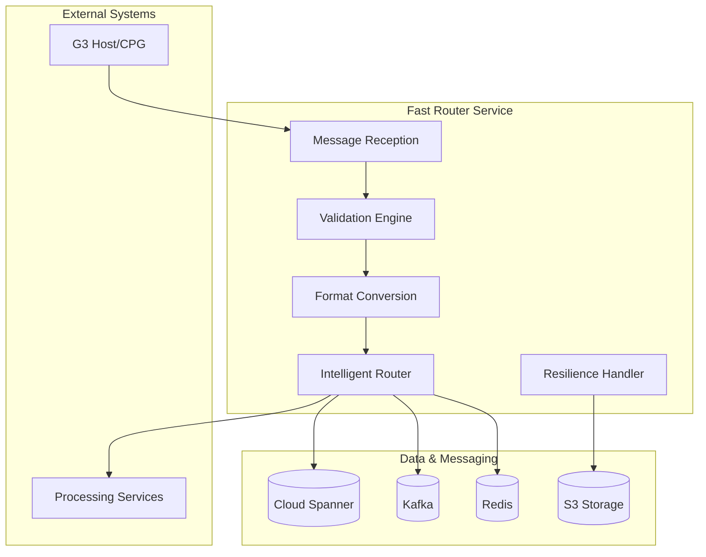

# Fast Router Service - Implementation Overview

## Business Purpose
The Fast Router Service acts as the **central message gateway** for Singapore's payment system, ensuring all payment messages are received, validated, and routed efficiently to the correct processing services. This service is critical for maintaining the 4.5-second payment SLA mandated by MAS.

## Key Business Value
- **Single Point of Entry**: Simplified integration with G3 Host/CPG
- **Message Transformation**: Converts complex ISO 20022 XML to standardized internal format
- **Intelligent Routing**: Ensures messages reach the right processor based on type and business rules
- **Audit Compliance**: Complete audit trail for regulatory requirements
- **Resilient Processing**: Guaranteed message delivery even during system failures

## Service Capabilities

### Core Functions
- **Message Reception & Validation**: Receive and validate ISO 20022 messages from G3 Host
- **Format Transformation**: Convert XML messages to unified JSON for internal processing  
- **Intelligent Routing**: Route messages to appropriate services based on type and rules
- **Response Handling**: Process acknowledgments and status responses
- **Audit & Compliance**: Maintain complete audit trail for regulatory compliance

### Performance Requirements
- **Routing Speed**: < 1 second for message routing
- **Throughput**: 20+ transactions per second peak capacity
- **Availability**: 99.95% uptime (< 4.4 hours downtime/year)
- **Recovery**: 15-minute recovery time, zero data loss

## Technical Architecture

### System Overview

### Technology Foundation
- **Platform**: Java 21 with Virtual Threads for high concurrency
- **Messaging**: Apache Kafka for reliable message queuing
- **Database**: Cloud Spanner for ACID transactions and global consistency
- **Caching**: Redis for high-performance data access
- **Monitoring**: Real-time metrics and alerting

## Data Architecture & Message Handling

### Data Storage Strategy
| Component | Technology | Purpose | Retention |
|-----------|------------|---------|-----------|
| **Transaction Data** | Cloud Spanner | ACID compliance, audit trail | 7 years (regulatory) |
| **Message Queue** | Apache Kafka | Reliable message delivery | 7 days |
| **Performance Cache** | Redis | Fast lookup, session data | 24 hours |
| **Backup Storage** | S3 | Disaster recovery, compliance | 10 years |

### Message Processing Flow
1. **Reception**: Messages received from G3 Host via secure API
2. **Validation**: Structure and business rule validation
3. **Transformation**: ISO 20022 XML → Unified JSON format
4. **Routing**: Dynamic routing based on message type and business rules
5. **Delivery**: Reliable delivery to target processing services

### Resilience & Reliability Features
- **Idempotency**: Prevents duplicate processing of messages
- **Circuit Breakers**: Protects against downstream service failures  
- **Multi-tier Fallback**: Kafka → Spanner → S3 for guaranteed message preservation
- **Automatic Retry**: Exponential backoff for transient failures
- **Real-time Monitoring**: Immediate alerts for SLA breaches

## Implementation Approach

### Message Processing Strategy
- **Reactive Architecture**: Non-blocking processing for optimal throughput
- **Validation Framework**: Multi-layered validation (structure, business rules, compliance)
- **Transformation Engine**: Automated XML-to-JSON conversion with field mapping
- **Dynamic Routing**: Rule-based routing with real-time configuration updates
- **Error Handling**: Comprehensive error recovery with detailed logging

### Key Technical Capabilities

#### Duplicate Prevention
- **Idempotency Management**: Prevents duplicate message processing using unique keys
- **Cache-First Strategy**: Redis-based fast duplicate detection
- **Database Verification**: Spanner-based persistent duplicate tracking

#### Performance Optimization  
- **Layered Caching**: Redis for hot data, Spanner for persistence
- **Parallel Processing**: Virtual threads for concurrent message handling
- **Connection Pooling**: Optimized database and messaging connections

#### Dynamic Routing Engine
- **Rule-Based Routing**: Messages routed based on configurable business rules
- **Topic Management**: Dynamic Kafka topic configuration without downtime
- **Load Balancing**: Intelligent partitioning for optimal throughput
- **Failover Logic**: Automatic rerouting during service disruptions

## Risk Mitigation & Compliance

### Operational Risk Controls
- **Circuit Breakers**: Automatic protection against cascade failures
- **Rate Limiting**: Protection against message flooding
- **Health Monitoring**: Real-time service health checks
- **Alerting**: Immediate notification of SLA breaches or failures

### Regulatory Compliance
- **Audit Trail**: Complete message lifecycle tracking (7-year retention)
- **Data Residency**: Singapore-only data storage compliance
- **Encryption**: End-to-end message encryption
- **Access Control**: Role-based access with full audit logging

## Deployment & Operations

### Deployment Strategy
- **Blue-Green Deployment**: Zero-downtime deployments with instant rollback capability
- **Canary Releases**: Gradual rollout starting with 10% traffic
- **Feature Flags**: Runtime feature toggling for safe deployments
- **Health Checks**: Comprehensive readiness and liveness probes

### Monitoring & Alerting
- **Real-time Metrics**: Message throughput, latency, error rates
- **SLA Dashboard**: Live tracking of 1-second routing SLA
- **Business Metrics**: Payment volume, success rates, processing times
- **Operational Alerts**: Immediate notification of issues requiring intervention

### Scalability & Performance
- **Horizontal Scaling**: Auto-scaling based on message volume
- **Resource Optimization**: Virtual threads for optimal resource utilization
- **Caching Strategy**: Multi-tier caching for sub-millisecond response times
- **Database Partitioning**: Optimized for high-throughput transaction processing

## Success Metrics & KPIs

### Business Success Metrics
| Metric | Target | Current Baseline | Business Impact |
|--------|--------|------------------|-----------------|
| **Message Routing Time** | < 1 second | N/A (new system) | Meets MAS SLA requirements |
| **System Availability** | 99.95% | N/A | < 4.4 hours downtime/year |
| **Message Throughput** | 20+ TPS | N/A | Supports projected payment volume |
| **Processing Accuracy** | 99.99% | N/A | Maintains payment integrity |
| **Regulatory Compliance** | 100% | N/A | Avoids regulatory penalties |

### Technical Success Indicators
- **Zero Message Loss**: 100% message delivery guarantee
- **Sub-second Latency**: Consistent performance under load
- **Horizontal Scalability**: Linear scaling with volume increases
- **Disaster Recovery**: < 15-minute recovery time
- **Security Compliance**: End-to-end encryption and audit trails

## Next Steps

### Phase 1: Foundation (Weeks 1-4)
- Core message reception and validation framework
- Basic routing engine with Kafka integration
- Initial monitoring and alerting setup

### Phase 2: Resilience (Weeks 5-8)  
- Multi-tier fallback implementation
- Circuit breaker and retry logic
- Comprehensive error handling

### Phase 3: Production (Weeks 9-12)
- Performance optimization and tuning
- Security hardening and compliance validation
- Disaster recovery testing and procedures

### Phase 4: Operations (Ongoing)
- 24/7 monitoring and support
- Continuous performance optimization
- Regular disaster recovery drills