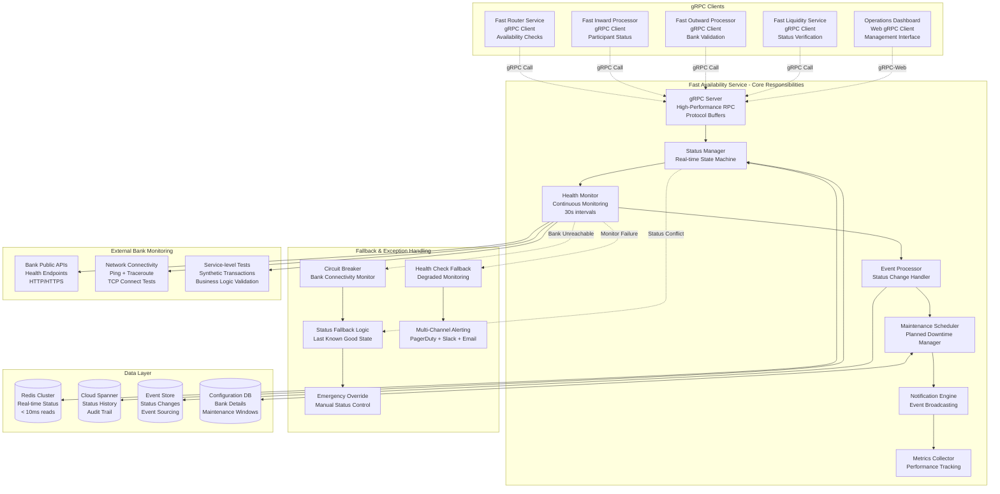
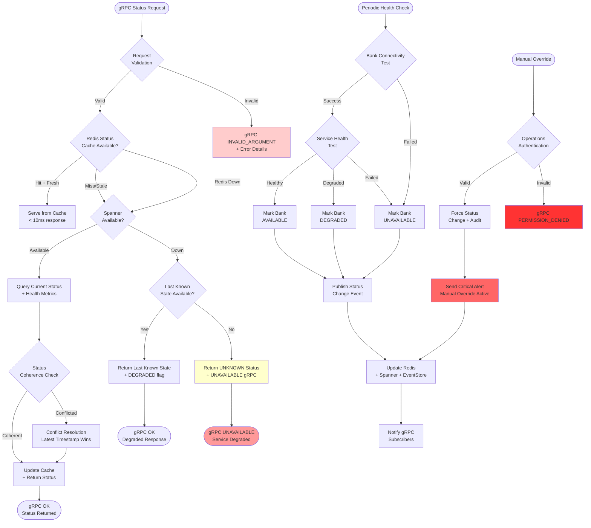
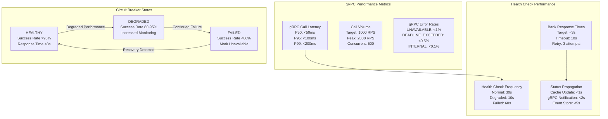

# Fast Availability Service - Technical Architecture & Exception Handling

## Service Responsibilities & gRPC Integration Architecture



## Exception Handling & Status Continuity



## gRPC Service Definition & Contracts

### 1. Protocol Buffer Definition

```protobuf
syntax = "proto3";

package fast.availability.v1;

import "google/protobuf/timestamp.proto";
import "google/protobuf/duration.proto";

option java_package = "com.anz.fastpayment.availability.grpc";
option java_multiple_files = true;

// Fast Availability Service
service AvailabilityService {
  // Get current status of a single participant
  rpc GetParticipantStatus(GetParticipantStatusRequest) returns (GetParticipantStatusResponse);
  
  // Get status of multiple participants (batch)
  rpc GetMultipleParticipantStatus(GetMultipleParticipantStatusRequest) returns (GetMultipleParticipantStatusResponse);
  
  // Subscribe to status changes (streaming)
  rpc SubscribeStatusChanges(SubscribeStatusChangesRequest) returns (stream StatusChangeEvent);
  
  // Update participant status (operations only)
  rpc UpdateParticipantStatus(UpdateParticipantStatusRequest) returns (UpdateParticipantStatusResponse);
  
  // Schedule maintenance window
  rpc ScheduleMaintenance(ScheduleMaintenanceRequest) returns (ScheduleMaintenanceResponse);
  
  // Get service health
  rpc GetServiceHealth(GetServiceHealthRequest) returns (GetServiceHealthResponse);
}

// Messages
message GetParticipantStatusRequest {
  string participant_id = 1; // BIC code (e.g., "OCBCSGSG")
  bool include_health_metrics = 2;
  bool include_maintenance_info = 3;
}

message GetParticipantStatusResponse {
  string participant_id = 1;
  ParticipantStatus status = 2;
  google.protobuf.Timestamp last_updated = 3;
  google.protobuf.Timestamp cache_timestamp = 4;
  HealthMetrics health_metrics = 5;
  MaintenanceInfo maintenance_info = 6;
  bool is_degraded_response = 7; // True if from fallback
}

message GetMultipleParticipantStatusRequest {
  repeated string participant_ids = 1;
  bool include_health_metrics = 2;
  bool include_maintenance_info = 3;
}

message GetMultipleParticipantStatusResponse {
  repeated ParticipantStatusInfo participants = 1;
  google.protobuf.Timestamp response_timestamp = 2;
  int32 total_participants = 3;
  int32 available_participants = 4;
  int32 degraded_participants = 5;
  int32 unavailable_participants = 6;
}

message SubscribeStatusChangesRequest {
  repeated string participant_ids = 1; // Empty = all participants
  repeated ParticipantStatus status_filter = 2; // Only these statuses
  string subscriber_id = 3;
}

message StatusChangeEvent {
  string event_id = 1;
  string participant_id = 2;
  ParticipantStatus previous_status = 3;
  ParticipantStatus new_status = 4;
  google.protobuf.Timestamp change_timestamp = 5;
  StatusChangeReason reason = 6;
  string additional_info = 7;
}

message UpdateParticipantStatusRequest {
  string participant_id = 1;
  ParticipantStatus new_status = 2;
  string reason = 3;
  string operator_id = 4;
  bool force_override = 5; // Emergency override
  google.protobuf.Duration duration = 6; // For temporary status
}

message UpdateParticipantStatusResponse {
  bool success = 1;
  string update_id = 2;
  google.protobuf.Timestamp effective_timestamp = 3;
  string previous_status = 4;
  string error_message = 5;
}

// Enums
enum ParticipantStatus {
  UNKNOWN = 0;
  AVAILABLE = 1;
  DEGRADED = 2;
  MAINTENANCE = 3;
  UNAVAILABLE = 4;
  SUSPENDED = 5;
}

enum StatusChangeReason {
  UNKNOWN_REASON = 0;
  HEALTH_CHECK_PASSED = 1;
  HEALTH_CHECK_FAILED = 2;
  NETWORK_CONNECTIVITY_LOST = 3;
  NETWORK_CONNECTIVITY_RESTORED = 4;
  PLANNED_MAINTENANCE = 5;
  UNPLANNED_OUTAGE = 6;
  MANUAL_OVERRIDE = 7;
  SYSTEM_STARTUP = 8;
  SYSTEM_SHUTDOWN = 9;
}

// Complex Types
message ParticipantStatusInfo {
  string participant_id = 1;
  ParticipantStatus status = 2;
  google.protobuf.Timestamp last_updated = 3;
  HealthMetrics health_metrics = 4;
  MaintenanceInfo maintenance_info = 5;
}

message HealthMetrics {
  double response_time_ms = 1;
  double availability_percentage = 2;
  int32 consecutive_failures = 3;
  google.protobuf.Timestamp last_health_check = 4;
  repeated HealthCheckResult recent_checks = 5;
}

message HealthCheckResult {
  google.protobuf.Timestamp timestamp = 1;
  bool success = 2;
  double response_time_ms = 3;
  string error_message = 4;
  string check_type = 5; // "CONNECTIVITY", "SERVICE", "BUSINESS"
}

message MaintenanceInfo {
  bool is_in_maintenance = 1;
  google.protobuf.Timestamp maintenance_start = 2;
  google.protobuf.Timestamp maintenance_end = 3;
  string maintenance_reason = 4;
  string maintenance_id = 5;
}
```

### 2. Java gRPC Client Implementation

```java
@Service
@Slf4j
public class AvailabilityServiceClient {

    private final AvailabilityServiceGrpc.AvailabilityServiceBlockingStub blockingStub;
    private final AvailabilityServiceGrpc.AvailabilityServiceStub asyncStub;
    private final MeterRegistry meterRegistry;
    
    @Value("${availability.service.timeout:100ms}")
    private Duration timeout;

    public Mono<ParticipantStatus> getParticipantStatus(String participantId) {
        Timer.Sample sample = Timer.start(meterRegistry);
        
        return Mono.fromCallable(() -> {
            GetParticipantStatusRequest request = GetParticipantStatusRequest.newBuilder()
                .setParticipantId(participantId)
                .setIncludeHealthMetrics(false) // Fast call
                .build();
            
            try {
                GetParticipantStatusResponse response = blockingStub
                    .withDeadlineAfter(timeout.toMillis(), TimeUnit.MILLISECONDS)
                    .getParticipantStatus(request);
                
                sample.stop(Timer.builder("grpc.availability.call.duration")
                    .tag("method", "getParticipantStatus")
                    .tag("status", "success")
                    .register(meterRegistry));
                
                return response.getStatus();
                
            } catch (StatusRuntimeException e) {
                sample.stop(Timer.builder("grpc.availability.call.duration")
                    .tag("method", "getParticipantStatus")
                    .tag("status", "error")
                    .tag("error.code", e.getStatus().getCode().name())
                    .register(meterRegistry));
                
                log.warn("gRPC call failed for participant {}: {}", participantId, e.getMessage());
                
                // Fallback based on error type
                return switch (e.getStatus().getCode()) {
                    case UNAVAILABLE, DEADLINE_EXCEEDED -> ParticipantStatus.UNKNOWN;
                    case NOT_FOUND -> ParticipantStatus.UNAVAILABLE;
                    default -> throw new AvailabilityServiceException("gRPC call failed", e);
                };
            }
        })
        .subscribeOn(Schedulers.boundedElastic())
        .timeout(timeout.plusMillis(50)) // Buffer for network overhead
        .onErrorReturn(ParticipantStatus.UNKNOWN);
    }

    public Flux<StatusChangeEvent> subscribeToStatusChanges(List<String> participantIds) {
        return Flux.create(sink -> {
            SubscribeStatusChangesRequest request = SubscribeStatusChangesRequest.newBuilder()
                .addAllParticipantIds(participantIds)
                .setSubscriberId("fast-router-service-" + UUID.randomUUID().toString())
                .build();
            
            StreamObserver<StatusChangeEvent> responseObserver = new StreamObserver<>() {
                @Override
                public void onNext(StatusChangeEvent event) {
                    sink.next(event);
                }
                
                @Override
                public void onError(Throwable t) {
                    log.error("Status change subscription failed", t);
                    sink.error(t);
                }
                
                @Override
                public void onCompleted() {
                    sink.complete();
                }
            };
            
            asyncStub.subscribeStatusChanges(request, responseObserver);
        });
    }
}
```

### 3. Sample gRPC Calls & Responses

**Router Service Status Check:**
```java
// Router Service calling Availability Service
GetParticipantStatusRequest request = GetParticipantStatusRequest.newBuilder()
    .setParticipantId("OCBCSGSG")
    .setIncludeHealthMetrics(false)
    .setIncludeMaintenanceInfo(false)
    .build();

// Response
GetParticipantStatusResponse response = GetParticipantStatusResponse.newBuilder()
    .setParticipantId("OCBCSGSG")
    .setStatus(ParticipantStatus.AVAILABLE)
    .setLastUpdated(Timestamp.newBuilder()
        .setSeconds(1733067600)
        .setNanos(500000000)
        .build())
    .setCacheTimestamp(Timestamp.newBuilder()
        .setSeconds(1733067700)
        .setNanos(125000000)
        .build())
    .setIsDegradedResponse(false)
    .build();
```

**Batch Status Check for Outward Processor:**
```java
GetMultipleParticipantStatusRequest request = GetMultipleParticipantStatusRequest.newBuilder()
    .addParticipantIds("OCBCSGSG")
    .addParticipantIds("DBSSSGSG")
    .addParticipantIds("UOBSSGSG")
    .setIncludeHealthMetrics(true)
    .build();

// Response
GetMultipleParticipantStatusResponse response = GetMultipleParticipantStatusResponse.newBuilder()
    .addParticipants(ParticipantStatusInfo.newBuilder()
        .setParticipantId("OCBCSGSG")
        .setStatus(ParticipantStatus.AVAILABLE)
        .setHealthMetrics(HealthMetrics.newBuilder()
            .setResponseTimeMs(45.5)
            .setAvailabilityPercentage(99.95)
            .setConsecutiveFailures(0)
            .build())
        .build())
    .addParticipants(ParticipantStatusInfo.newBuilder()
        .setParticipantId("DBSSSGSG")
        .setStatus(ParticipantStatus.DEGRADED)
        .setHealthMetrics(HealthMetrics.newBuilder()
            .setResponseTimeMs(1250.0)
            .setAvailabilityPercentage(95.2)
            .setConsecutiveFailures(2)
            .build())
        .build())
    .setTotalParticipants(3)
    .setAvailableParticipants(2)
    .setDegradedParticipants(1)
    .setUnavailableParticipants(0)
    .build();
```

## Performance Monitoring & gRPC Metrics



## Technology Stack & gRPC Configuration

```yaml
gRPC Server Configuration:
  grpc:
    server:
      port: 9090
      max-inbound-message-size: 4MB
      max-inbound-metadata-size: 8KB
      keep-alive-time: 30s
      keep-alive-timeout: 5s
      keep-alive-without-calls: true
      max-connection-idle: 60s
      max-connection-age: 120s
      max-connection-age-grace: 30s
      permit-keep-alive-time: 10s
      permit-keep-alive-without-calls: true

Health Monitoring:
  availability:
    health-check:
      interval: 30s
      timeout: 10s
      retry-attempts: 3
      retry-delay: 5s
    banks:
      - participant-id: OCBCSGSG
        health-url: https://api.ocbc.com.sg/health
        service-url: https://api.ocbc.com.sg/payments/status
        network-test: true
      - participant-id: DBSSSGSG
        health-url: https://api.dbs.com.sg/health
        service-url: https://api.dbs.com.sg/payments/status
        network-test: true

Circuit Breaker:
  resilience4j:
    circuitbreaker:
      instances:
        bank-health-check:
          failure-rate-threshold: 20
          slow-call-rate-threshold: 50
          slow-call-duration-threshold: 5s
          wait-duration-in-open-state: 60s
          sliding-window-size: 20
          minimum-number-of-calls: 10

JVM Configuration:
  memory: "-Xms2g -Xmx4g"
  gc: "-XX:+UseZGC"
  virtual-threads: "--enable-preview -XX:+UseVirtualThreads"
  grpc-netty: "-Dio.netty.allocator.type=pooled"
```