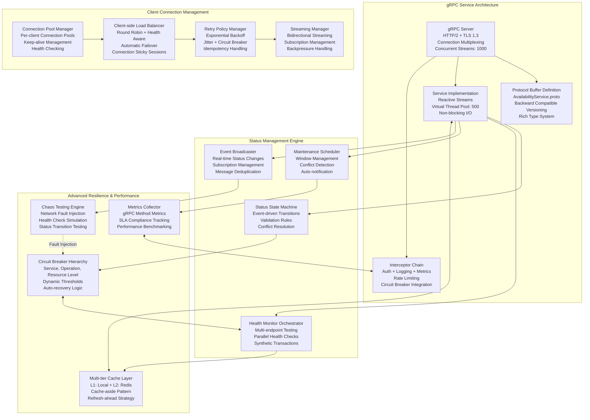
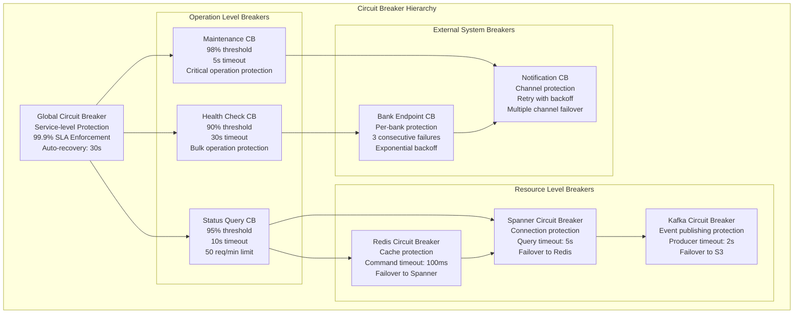

# Fast Availability Service - Deep Technical Architecture & Implementation

## Core Service Responsibilities & High-Performance gRPC Architecture

```mermaid
graph TB
    subgraph "gRPC Clients"
        RouterService[Fast Router Service<br/>gRPC Client<br/>Availability Checks]
        ProcessorServices[Clearing Processors<br/>Real-time Status Queries<br/>Bank Routing Decisions]
        LiquidityService[Liquidity Service<br/>Bank Capacity Validation<br/>Settlement Routing]
        ExternalSystems[External Monitoring<br/>Third-party Integrations<br/>Regulatory Systems]
    end
    
    subgraph "gRPC Server Architecture"
        LoadBalancer[gRPC Load Balancer<br/>Health-aware Routing<br/>Circuit Breaker Integration]
        ServerInstances[Server Instances<br/>Auto-scaling: 3-50<br/>Virtual Threads: 1000/instance]
        ConnectionManager[Connection Manager<br/>HTTP/2 Multiplexing<br/>Keep-alive Management]
        AuthInterceptor[Auth Interceptor<br/>mTLS + JWT Validation<br/>Rate Limiting]
    end
    
    subgraph "Core Service Engine"
        StatusManager[Bank Status Manager<br/>Real-time Status Tracking<br/>State Machine Processing]
        HealthOrchestrator[Health Orchestrator<br/>Multi-endpoint Monitoring<br/>Synthetic Testing Engine]
        MaintenanceEngine[Maintenance Engine<br/>Window Scheduling<br/>Impact Assessment]
        AlertManager[Alert Manager<br/>Multi-tier Alerting<br/>Escalation Processing]
    end
    
    subgraph "Data & Cache Layer"
        L1Cache[L1 Cache (Local)<br/>Caffeine<br/>10ms Response<br/>50K Entries]
        L2Cache[L2 Cache (Redis)<br/>Cluster Mode<br/>50ms Response<br/>Distributed]
        SpannerDB[Cloud Spanner<br/>Primary Database<br/>ACID Compliance<br/>Global Distribution]
        S3Backup[S3 Backup<br/>Disaster Recovery<br/>Message Preservation<br/>Compliance Archive]
    end
    
    subgraph "Integration Layer"
        EventStreaming[Kafka Event Streaming<br/>Status Change Events<br/>Real-time Broadcasting]
        NotificationGateway[Notification Gateway<br/>Multi-channel Delivery<br/>Email/SMS/Slack/API]
        MonitoringStack[Monitoring Stack<br/>Prometheus + Grafana<br/>Distributed Tracing<br/>Custom Metrics]
        WebUI[Web Management UI<br/>React + WebSockets<br/>Real-time Dashboard<br/>Admin Operations]
    end
    
    RouterService --> LoadBalancer
    ProcessorServices --> LoadBalancer
    LiquidityService --> LoadBalancer
    ExternalSystems --> LoadBalancer
    
    LoadBalancer --> ServerInstances
    ServerInstances --> ConnectionManager
    ConnectionManager --> AuthInterceptor
    
    AuthInterceptor --> StatusManager
    AuthInterceptor --> HealthOrchestrator
    AuthInterceptor --> MaintenanceEngine
    AuthInterceptor --> AlertManager
    
    StatusManager --> L1Cache
    StatusManager --> L2Cache
    StatusManager --> SpannerDB
    StatusManager --> S3Backup
    
    HealthOrchestrator --> EventStreaming
    MaintenanceEngine --> NotificationGateway
    AlertManager --> MonitoringStack
    
    L1Cache -.->|Cache Miss| L2Cache
    L2Cache -.->|Cache Miss| SpannerDB
    SpannerDB -.->|Backup| S3Backup
    
    EventStreaming --> WebUI
    NotificationGateway --> WebUI
    MonitoringStack --> WebUI
```

## Database Schema & Bank Status Management

### Cloud Spanner Tables for Bank Status Management

```sql
-- Bank Participant Master Table
CREATE TABLE bank_participant_master (
  participant_id STRING(11) NOT NULL, -- BIC code
  participant_name STRING(140) NOT NULL,
  participant_short_name STRING(35),
  
  -- Bank Details
  country_code STRING(2) NOT NULL,
  regulatory_authority STRING(50),
  bank_type STRING(30) NOT NULL, -- COMMERCIAL, INVESTMENT, CENTRAL, DEVELOPMENT
  business_lines ARRAY<STRING(50)>, -- [RETAIL, CORPORATE, TRADE_FINANCE, TREASURY]
  
  -- Connectivity Information
  primary_endpoint STRING(200),
  backup_endpoint STRING(200),
  health_check_endpoint STRING(200),
  supported_protocols ARRAY<STRING(20)>, -- [HTTP, HTTPS, SFTP, MQ]
  
  -- Status Configuration
  current_status STRING(20) NOT NULL DEFAULT 'ACTIVE', -- ACTIVE, DEGRADED, MAINTENANCE, UNAVAILABLE, SUSPENDED
  status_reason STRING(500),
  auto_status_management BOOL DEFAULT true,
  manual_override_active BOOL DEFAULT false,
  manual_override_expires_at TIMESTAMP,
  
  -- Health Monitoring Configuration
  health_check_enabled BOOL DEFAULT true,
  health_check_interval_seconds INT64 DEFAULT 30,
  health_check_timeout_seconds INT64 DEFAULT 10,
  consecutive_failure_threshold INT64 DEFAULT 3,
  recovery_success_threshold INT64 DEFAULT 2,
  
  -- Business Hours and Maintenance Windows
  business_hours_timezone STRING(50) DEFAULT 'Asia/Singapore',
  business_hours_start TIME,
  business_hours_end TIME,
  business_days ARRAY<STRING(10)>, -- [MONDAY, TUESDAY, ...]
  extended_hours_support BOOL DEFAULT false,
  
  -- Contact Information
  primary_contact_email STRING(100),
  secondary_contact_email STRING(100),
  emergency_contact_phone STRING(20),
  technical_contact_email STRING(100),
  
  -- Audit and Lifecycle
  created_timestamp TIMESTAMP NOT NULL OPTIONS (allow_commit_timestamp=true),
  created_by STRING(100) NOT NULL,
  last_updated_timestamp TIMESTAMP OPTIONS (allow_commit_timestamp=true),
  last_updated_by STRING(100),
  
) PRIMARY KEY (participant_id);

-- Bank Status History for Audit Trail
CREATE TABLE bank_status_history (
  participant_id STRING(11) NOT NULL,
  status_change_id STRING(36) NOT NULL,
  
  -- Status Change Details
  previous_status STRING(20),
  new_status STRING(20) NOT NULL,
  status_change_timestamp TIMESTAMP NOT NULL,
  
  -- Change Context
  change_trigger STRING(30) NOT NULL, -- HEALTH_CHECK, MANUAL, SCHEDULED, EXTERNAL
  change_reason STRING(500),
  change_source STRING(50), -- SYSTEM, USER_ID, EXTERNAL_SYSTEM
  
  -- Impact Assessment
  affected_services ARRAY<STRING(50)>,
  estimated_impact_duration_minutes INT64,
  actual_impact_duration_minutes INT64,
  
  -- Health Check Context
  health_check_results JSON,
  failure_details JSON,
  
  -- Manual Override Context
  override_authorized_by STRING(100),
  override_business_justification STRING(1000),
  override_approval_reference STRING(50),
  
  -- Notification Details
  notifications_sent ARRAY<STRING(50)>, -- List of notification channels used
  notification_timestamp TIMESTAMP,
  
  -- Business Context
  business_date DATE NOT NULL,
  during_business_hours BOOL,
  during_maintenance_window BOOL,
  
) PRIMARY KEY (business_date, participant_id, status_change_timestamp, status_change_id),
  INTERLEAVE IN PARENT business_date_partitions ON DELETE CASCADE;

-- Scheduled Maintenance Windows
CREATE TABLE maintenance_windows (
  maintenance_id STRING(36) NOT NULL,
  participant_id STRING(11) NOT NULL,
  
  -- Maintenance Schedule
  maintenance_type STRING(30) NOT NULL, -- PLANNED, EMERGENCY, REGULATORY, UPGRADE
  maintenance_category STRING(50), -- SYSTEM_UPDATE, NETWORK_MAINTENANCE, SECURITY_PATCH
  
  -- Timing
  scheduled_start_time TIMESTAMP NOT NULL,
  scheduled_end_time TIMESTAMP NOT NULL,
  actual_start_time TIMESTAMP,
  actual_end_time TIMESTAMP,
  timezone STRING(50) DEFAULT 'Asia/Singapore',
  
  -- Status Tracking
  maintenance_status STRING(20) NOT NULL DEFAULT 'SCHEDULED', -- SCHEDULED, IN_PROGRESS, COMPLETED, CANCELLED, DELAYED
  completion_percentage INT64 DEFAULT 0,
  
  -- Business Context
  business_justification STRING(1000) NOT NULL,
  impact_assessment TEXT NOT NULL,
  risk_assessment STRING(500),
  rollback_plan TEXT,
  
  -- Approval Workflow
  requested_by STRING(100) NOT NULL,
  approved_by STRING(100),
  approval_timestamp TIMESTAMP,
  approval_reference STRING(50),
  emergency_approval BOOL DEFAULT false,
  
  -- Communication
  advance_notice_hours INT64 DEFAULT 48,
  notification_sent BOOL DEFAULT false,
  notification_timestamp TIMESTAMP,
  communication_plan TEXT,
  
  -- Service Impact
  affected_services ARRAY<STRING(50)>,
  service_degradation_expected BOOL DEFAULT false,
  alternative_routing_available BOOL DEFAULT false,
  customer_impact_expected BOOL DEFAULT false,
  
  -- Technical Details
  technical_details TEXT,
  vendor_involved STRING(100),
  external_dependencies ARRAY<STRING(100)>,
  
  -- Compliance and Regulatory
  regulatory_approval_required BOOL DEFAULT false,
  regulatory_approval_reference STRING(50),
  compliance_impact_assessment STRING(500),
  
  -- Audit
  created_timestamp TIMESTAMP NOT NULL OPTIONS (allow_commit_timestamp=true),
  created_by STRING(100) NOT NULL,
  last_updated_timestamp TIMESTAMP OPTIONS (allow_commit_timestamp=true),
  last_updated_by STRING(100),
  
) PRIMARY KEY (maintenance_id);

-- Health Check Results and Performance Metrics
CREATE TABLE health_check_results (
  participant_id STRING(11) NOT NULL,
  check_timestamp TIMESTAMP NOT NULL,
  check_id STRING(36) NOT NULL,
  
  -- Health Check Details
  check_type STRING(30) NOT NULL, -- CONNECTIVITY, SERVICE, BUSINESS, SYNTHETIC
  check_method STRING(20) NOT NULL, -- HTTP_GET, HTTP_POST, PING, TCP_CONNECT
  check_endpoint STRING(200),
  
  -- Results
  check_status STRING(20) NOT NULL, -- SUCCESS, FAILURE, TIMEOUT, ERROR
  response_time_ms INT64,
  response_code STRING(10), -- HTTP status code or custom code
  response_message STRING(500),
  response_payload_size_bytes INT64,
  
  -- Network Metrics
  dns_resolution_time_ms INT64,
  tcp_connect_time_ms INT64,
  ssl_handshake_time_ms INT64,
  first_byte_time_ms INT64,
  
  -- Business Logic Validation (for business health checks)
  business_function_tested STRING(50),
  business_validation_passed BOOL,
  business_validation_details JSON,
  
  -- Error Context
  error_category STRING(30), -- NETWORK, TIMEOUT, SSL, APPLICATION, BUSINESS
  error_code STRING(20),
  error_message STRING(1000),
  error_stack_trace TEXT,
  
  -- System Context
  check_initiated_by STRING(50), -- SCHEDULED, MANUAL, CIRCUIT_BREAKER, EXTERNAL
  checking_service_instance STRING(50),
  checking_service_version STRING(20),
  
  -- Business Context
  business_date DATE NOT NULL,
  during_business_hours BOOL,
  during_maintenance_window BOOL,
  
  -- Performance Benchmarking
  baseline_response_time_ms INT64, -- Expected response time
  performance_variance_percentage FLOAT64, -- Actual vs baseline
  
) PRIMARY KEY (business_date, participant_id, check_timestamp, check_id),
  INTERLEAVE IN PARENT business_date_partitions ON DELETE CASCADE;

-- Bank Availability Metrics and SLA Tracking
CREATE TABLE availability_metrics (
  participant_id STRING(11) NOT NULL,
  metric_timestamp TIMESTAMP NOT NULL,
  aggregation_window STRING(10) NOT NULL, -- 1MIN, 5MIN, 15MIN, 1HOUR, 1DAY
  
  -- Availability Metrics
  total_checks INT64 NOT NULL,
  successful_checks INT64 NOT NULL,
  failed_checks INT64 NOT NULL,
  availability_percentage FLOAT64 AS (
    CASE 
      WHEN total_checks > 0 THEN (successful_checks * 100.0) / total_checks
      ELSE 0 
    END
  ) STORED,
  
  -- Performance Metrics
  avg_response_time_ms FLOAT64,
  min_response_time_ms INT64,
  max_response_time_ms INT64,
  p50_response_time_ms FLOAT64,
  p95_response_time_ms FLOAT64,
  p99_response_time_ms FLOAT64,
  
  -- Error Distribution
  network_errors INT64 DEFAULT 0,
  timeout_errors INT64 DEFAULT 0,
  application_errors INT64 DEFAULT 0,
  business_logic_errors INT64 DEFAULT 0,
  
  -- SLA Compliance
  sla_target_availability_percentage FLOAT64 DEFAULT 99.9,
  sla_target_response_time_ms INT64 DEFAULT 5000,
  sla_availability_compliance BOOL AS (availability_percentage >= sla_target_availability_percentage) STORED,
  sla_performance_compliance BOOL AS (p95_response_time_ms <= sla_target_response_time_ms) STORED,
  
  -- Status Distribution
  time_in_active_status_minutes INT64 DEFAULT 0,
  time_in_degraded_status_minutes INT64 DEFAULT 0,
  time_in_maintenance_status_minutes INT64 DEFAULT 0,
  time_in_unavailable_status_minutes INT64 DEFAULT 0,
  
  -- Business Context
  business_date DATE NOT NULL,
  business_hours_checks INT64 DEFAULT 0,
  off_hours_checks INT64 DEFAULT 0,
  
) PRIMARY KEY (business_date, participant_id, aggregation_window, metric_timestamp);

-- System Configuration for Availability Service
CREATE TABLE availability_service_configuration (
  config_key STRING(100) NOT NULL,
  config_value JSON NOT NULL,
  config_category STRING(30) NOT NULL, -- HEALTH_CHECK, NOTIFICATION, SLA, ALERT
  
  -- Scope and Applicability
  participant_id STRING(11), -- NULL for global config
  service_instance STRING(50), -- NULL for all instances
  
  -- Configuration Lifecycle
  version INT64 NOT NULL DEFAULT 1,
  is_active BOOL NOT NULL DEFAULT true,
  effective_from TIMESTAMP NOT NULL,
  effective_until TIMESTAMP,
  
  -- Change Management
  created_by STRING(100) NOT NULL,
  created_timestamp TIMESTAMP NOT NULL OPTIONS (allow_commit_timestamp=true),
  approved_by STRING(100),
  approval_timestamp TIMESTAMP,
  last_modified_by STRING(100),
  last_modified_timestamp TIMESTAMP OPTIONS (allow_commit_timestamp=true),
  
  -- Validation and Testing
  validation_status STRING(20) DEFAULT 'PENDING', -- PENDING, VALIDATED, FAILED
  test_results JSON,
  rollback_version INT64,
  
) PRIMARY KEY (config_key, version);
```

### Redis Cache Schema for High-Performance Status Queries

```yaml
availability_cache_architecture:
  
  # Redis cluster optimized for high-frequency status queries
  cluster_configuration:
    topology:
      masters: 3
      replicas_per_master: 1
      total_nodes: 6
      memory_per_node: "16GB"
      network_bandwidth: "10Gbps"
    
    performance_optimization:
      max_connections_per_node: 10000
      timeout_configuration:
        connect_timeout: "1s"
        command_timeout: "100ms"
        keep_alive: true
      
      cpu_optimization:
        cpu_cores_per_node: 16
        thread_affinity: "enabled"
        numa_optimization: "enabled"
    
    persistence_strategy:
      rdb_snapshots:
        enabled: true
        interval: "900s"  # 15 minutes
        compression: "lz4"
      
      aof_logging:
        enabled: false  # Optimize for speed over durability
        # Status data can be rebuilt from Spanner if needed
  
  # Cache patterns optimized for gRPC status queries
  cache_patterns:
    
    # Real-time bank status cache - Ultra-fast gRPC responses
    bank_status:
      pattern: "availability:status:{participant_id}"
      type: "hash"
      fields:
        current_status: "string"
        status_since: "timestamp_milliseconds"
        last_check_time: "timestamp_milliseconds"
        next_check_time: "timestamp_milliseconds"
        consecutive_failures: "integer"
        consecutive_successes: "integer"
        availability_percentage_24h: "float"
        avg_response_time_ms: "float"
        manual_override_active: "boolean"
        maintenance_window_active: "boolean"
        business_hours_active: "boolean"
      ttl: 3600  # 1 hour with refresh-ahead pattern
      memory_policy: "noeviction"  # Critical operational data
      persistence: "disabled"  # Rebuild from Spanner if needed
      
      consistency_strategy:
        cache_aside: true
        write_through: false  # Optimize for read performance
        refresh_ahead: true
        refresh_threshold: "5_minutes_before_expiry"
    
    # Health check results cache - Recent check history
    health_check_history:
      pattern: "availability:health:{participant_id}:recent"
      type: "sorted_set"
      score: "check_timestamp"
      value: "health_check_result_json"
      max_entries: 100  # Last 100 checks per participant
      ttl: 7200  # 2 hours
      memory_policy: "volatile-lru"
      persistence: "disabled"
    
    # Maintenance windows cache - Active and upcoming maintenance
    maintenance_windows:
      pattern: "availability:maintenance:{participant_id}"
      type: "sorted_set"
      score: "scheduled_start_timestamp"
      value: "maintenance_window_json"
      max_entries: 50  # Next 50 maintenance windows
      ttl: 86400  # 24 hours
      memory_policy: "volatile-ttl"
      persistence: "rdb_only"
    
    # gRPC subscription management - Active subscriptions
    grpc_subscriptions:
      pattern: "availability:subscriptions:{subscription_pattern}"
      type: "set"
      value: "subscriber_connection_id"
      ttl: 3600  # 1 hour
      memory_policy: "volatile-ttl"
      persistence: "disabled"
    
    # Aggregated metrics cache - Dashboard and reporting
    metrics_aggregated:
      pattern: "availability:metrics:{participant_id}:{window}"
      type: "hash"
      fields:
        availability_percentage: "float"
        avg_response_time: "float"
        p95_response_time: "float"
        total_checks: "integer"
        failed_checks: "integer"
        last_updated: "timestamp"
      ttl: 300  # 5 minutes
      memory_policy: "volatile-ttl"
      persistence: "disabled"
    
    # Configuration cache - Service configuration
    service_configuration:
      pattern: "availability:config:{config_category}"
      type: "hash"
      fields:
        health_check_intervals: "json"
        notification_settings: "json"
        sla_thresholds: "json"
        alert_rules: "json"
        last_updated: "timestamp"
      ttl: 600  # 10 minutes
      memory_policy: "volatile-ttl"
      persistence: "rdb_only"

# Local cache (L1) for ultra-low latency gRPC responses
local_cache_configuration:
  caffeine_cache_settings:
    maximum_size: 50000  # 50K participants
    expire_after_write: "10s"  # Very short for real-time status
    expire_after_access: "30s"
    refresh_after_write: "5s"   # Proactive refresh
    
    cache_types:
      participant_status:
        name: "participant_status_cache"
        key_type: "participant_id"
        value_type: "participant_status_object"
        maximum_size: 25000
        
      health_metrics:
        name: "health_metrics_cache"
        key_type: "participant_id"
        value_type: "health_metrics_object"
        maximum_size: 25000
        
      maintenance_status:
        name: "maintenance_status_cache"
        key_type: "participant_id"
        value_type: "maintenance_status_object"
        maximum_size: 10000
        refresh_after_write: "60s"  # Longer refresh for maintenance data
        
    eviction_policy: "size_based_lru_with_refresh_ahead"
    statistics_enabled: true
    cache_loader: "async_redis_fallback_spanner"
    
    performance_monitoring:
      hit_rate_target: 0.98  # 98% hit rate target
      load_time_target: "5ms"  # Target cache load time
      eviction_rate_alert_threshold: 0.1  # Alert if >10% evictions
```

## Advanced gRPC Architecture & High-Performance Implementation

### Production-Ready gRPC Service Implementation



### Enhanced Protocol Buffer Definition

```protobuf
syntax = "proto3";

package fast.availability.v1;

import "google/protobuf/timestamp.proto";
import "google/protobuf/duration.proto";
import "google/protobuf/empty.proto";

option java_package = "com.anz.fastpayment.availability.grpc";
option java_multiple_files = true;
option java_outer_classname = "AvailabilityServiceProto";

// Fast Availability Service with comprehensive bank status management
service AvailabilityService {
  // Basic status operations
  rpc GetParticipantStatus(GetParticipantStatusRequest) returns (GetParticipantStatusResponse);
  rpc GetMultipleParticipantStatus(GetMultipleParticipantStatusRequest) returns (GetMultipleParticipantStatusResponse);
  
  // Real-time streaming operations
  rpc SubscribeStatusChanges(SubscribeStatusChangesRequest) returns (stream StatusChangeEvent);
  rpc SubscribeHealthMetrics(SubscribeHealthMetricsRequest) returns (stream HealthMetricsEvent);
  
  // Administrative operations
  rpc UpdateParticipantStatus(UpdateParticipantStatusRequest) returns (UpdateParticipantStatusResponse);
  rpc ForceStatusChange(ForceStatusChangeRequest) returns (ForceStatusChangeResponse);
  
  // Maintenance management
  rpc ScheduleMaintenance(ScheduleMaintenanceRequest) returns (ScheduleMaintenanceResponse);
  rpc GetMaintenanceWindows(GetMaintenanceWindowsRequest) returns (GetMaintenanceWindowsResponse);
  rpc CancelMaintenance(CancelMaintenanceRequest) returns (CancelMaintenanceResponse);
  
  // Health monitoring and testing
  rpc TriggerHealthCheck(TriggerHealthCheckRequest) returns (TriggerHealthCheckResponse);
  rpc GetHealthHistory(GetHealthHistoryRequest) returns (GetHealthHistoryResponse);
  rpc RunSyntheticTransaction(SyntheticTransactionRequest) returns (SyntheticTransactionResponse);
  
  // Service administration
  rpc GetServiceHealth(google.protobuf.Empty) returns (ServiceHealthResponse);
  rpc GetServiceMetrics(GetServiceMetricsRequest) returns (ServiceMetricsResponse);
  rpc UpdateConfiguration(UpdateConfigurationRequest) returns (UpdateConfigurationResponse);
}

// Enhanced request/response messages
message GetParticipantStatusRequest {
  string participant_id = 1; // BIC code
  bool include_health_metrics = 2;
  bool include_maintenance_info = 3;
  bool include_historical_data = 4;
  int32 historical_hours = 5; // Hours of historical data to include
  repeated string metric_types = 6; // Specific metrics to include
}

message GetParticipantStatusResponse {
  string participant_id = 1;
  ParticipantStatus status = 2;
  google.protobuf.Timestamp last_updated = 3;
  google.protobuf.Timestamp cache_timestamp = 4;
  HealthMetrics health_metrics = 5;
  MaintenanceInfo maintenance_info = 6;
  bool is_degraded_response = 7;
  ResponseMetadata response_metadata = 8;
  repeated HistoricalStatusPoint historical_data = 9;
}

message GetMultipleParticipantStatusRequest {
  repeated string participant_ids = 1;
  bool include_health_metrics = 2;
  bool include_maintenance_info = 3;
  StatusFilter filter = 4; // Filter criteria
  SortOptions sort_options = 5; // Sorting preferences
  PaginationOptions pagination = 6; // Pagination for large result sets
}

message GetMultipleParticipantStatusResponse {
  repeated ParticipantStatusInfo participants = 1;
  google.protobuf.Timestamp response_timestamp = 2;
  int32 total_participants = 3;
  int32 available_participants = 4;
  int32 degraded_participants = 5;
  int32 unavailable_participants = 6;
  int32 maintenance_participants = 7;
  AggregatedMetrics aggregated_metrics = 8;
  PaginationInfo pagination_info = 9;
}

// Enhanced subscription management
message SubscribeStatusChangesRequest {
  repeated string participant_ids = 1; // Empty = all participants
  repeated ParticipantStatus status_filter = 2; // Only these statuses
  string subscriber_id = 3;
  SubscriptionOptions options = 4;
  bool include_initial_state = 5; // Send current state immediately
}

message SubscribeHealthMetricsRequest {
  repeated string participant_ids = 1;
  repeated HealthMetricType metric_types = 2;
  string subscriber_id = 3;
  google.protobuf.Duration reporting_interval = 4;
  ThresholdAlerts threshold_alerts = 5;
}

message StatusChangeEvent {
  string event_id = 1;
  string participant_id = 2;
  ParticipantStatus previous_status = 3;
  ParticipantStatus new_status = 4;
  google.protobuf.Timestamp change_timestamp = 5;
  StatusChangeReason reason = 6;
  string additional_info = 7;
  EventMetadata event_metadata = 8;
  bool during_business_hours = 9;
  bool during_maintenance_window = 10;
}

message HealthMetricsEvent {
  string participant_id = 1;
  google.protobuf.Timestamp timestamp = 2;
  repeated HealthMetric metrics = 3;
  AlertLevel alert_level = 4;
  string alert_message = 5;
}

// Maintenance management messages
message ScheduleMaintenanceRequest {
  string participant_id = 1;
  MaintenanceType maintenance_type = 2;
  google.protobuf.Timestamp scheduled_start = 3;
  google.protobuf.Timestamp scheduled_end = 4;
  string business_justification = 5;
  string impact_assessment = 6;
  bool emergency_maintenance = 7;
  NotificationPreferences notification_preferences = 8;
  repeated string affected_services = 9;
  string rollback_plan = 10;
}

message ScheduleMaintenanceResponse {
  string maintenance_id = 1;
  MaintenanceStatus status = 2;
  google.protobuf.Timestamp confirmed_start = 3;
  google.protobuf.Timestamp confirmed_end = 4;
  string approval_reference = 5;
  repeated ConflictWarning conflicts = 6;
  NotificationSchedule notification_schedule = 7;
}

// Enhanced data types
enum ParticipantStatus {
  UNKNOWN = 0;
  ACTIVE = 1;
  DEGRADED = 2;
  MAINTENANCE = 3;
  UNAVAILABLE = 4;
  SUSPENDED = 5;
  TESTING = 6; // For synthetic testing
}

enum StatusChangeReason {
  UNKNOWN_REASON = 0;
  HEALTH_CHECK_PASSED = 1;
  HEALTH_CHECK_FAILED = 2;
  NETWORK_CONNECTIVITY_LOST = 3;
  NETWORK_CONNECTIVITY_RESTORED = 4;
  PLANNED_MAINTENANCE = 5;
  UNPLANNED_OUTAGE = 6;
  MANUAL_OVERRIDE = 7;
  SYSTEM_STARTUP = 8;
  SYSTEM_SHUTDOWN = 9;
  BUSINESS_HOURS_START = 10;
  BUSINESS_HOURS_END = 11;
  REGULATORY_SUSPENSION = 12;
  EMERGENCY_STOP = 13;
}

enum MaintenanceType {
  PLANNED_MAINTENANCE = 0;
  EMERGENCY_MAINTENANCE = 1;
  REGULATORY_MAINTENANCE = 2;
  SECURITY_PATCH = 3;
  SYSTEM_UPGRADE = 4;
  NETWORK_MAINTENANCE = 5;
  DATABASE_MAINTENANCE = 6;
}

enum AlertLevel {
  INFO = 0;
  WARNING = 1;
  ERROR = 2;
  CRITICAL = 3;
}

enum HealthMetricType {
  RESPONSE_TIME = 0;
  AVAILABILITY = 1;
  ERROR_RATE = 2;
  THROUGHPUT = 3;
  CONNECTION_COUNT = 4;
  RESOURCE_UTILIZATION = 5;
}

// Complex message types
message HealthMetrics {
  double response_time_ms = 1;
  double availability_percentage = 2;
  int32 consecutive_failures = 3;
  int32 consecutive_successes = 4;
  google.protobuf.Timestamp last_health_check = 5;
  repeated HealthCheckResult recent_checks = 6;
  SLACompliance sla_compliance = 7;
  PerformanceTrend performance_trend = 8;
}

message HealthCheckResult {
  google.protobuf.Timestamp timestamp = 1;
  bool success = 2;
  double response_time_ms = 3;
  string error_message = 4;
  string check_type = 5;
  string endpoint_tested = 6;
  int32 http_status_code = 7;
  NetworkMetrics network_metrics = 8;
}

message MaintenanceInfo {
  bool is_in_maintenance = 1;
  google.protobuf.Timestamp maintenance_start = 2;
  google.protobuf.Timestamp maintenance_end = 3;
  string maintenance_reason = 4;
  string maintenance_id = 5;
  MaintenanceType maintenance_type = 6;
  int32 estimated_duration_minutes = 7;
  repeated string affected_services = 8;
  bool customer_impact_expected = 9;
}

message NetworkMetrics {
  int64 dns_resolution_time_ms = 1;
  int64 tcp_connect_time_ms = 2;
  int64 ssl_handshake_time_ms = 3;
  int64 first_byte_time_ms = 4;
  int64 total_time_ms = 5;
}

message SLACompliance {
  bool availability_compliant = 1;
  bool performance_compliant = 2;
  double target_availability = 3;
  double actual_availability = 4;
  double target_response_time_ms = 5;
  double actual_response_time_ms = 6;
}

message PerformanceTrend {
  TrendDirection availability_trend = 1;
  TrendDirection performance_trend = 2;
  double trend_confidence = 3;
  google.protobuf.Duration trend_period = 4;
}

enum TrendDirection {
  STABLE = 0;
  IMPROVING = 1;
  DEGRADING = 2;
  VOLATILE = 3;
}

// Subscription and filtering options
message SubscriptionOptions {
  bool include_historical_context = 1;
  int32 max_events_per_second = 2;
  google.protobuf.Duration batch_interval = 3;
  bool deduplicate_events = 4;
  repeated string event_types = 5;
}

message StatusFilter {
  repeated ParticipantStatus allowed_statuses = 1;
  repeated string countries = 2;
  repeated string bank_types = 3;
  bool business_hours_only = 4;
  bool exclude_maintenance = 5;
}

message ThresholdAlerts {
  double response_time_threshold_ms = 1;
  double availability_threshold = 2;
  int32 consecutive_failure_threshold = 3;
  bool alert_on_status_change = 4;
}

// Metadata and pagination
message ResponseMetadata {
  google.protobuf.Timestamp server_timestamp = 1;
  string server_instance = 2;
  double processing_time_ms = 3;
  bool from_cache = 4;
  string cache_age_seconds = 5;
  string trace_id = 6;
}

message PaginationOptions {
  int32 page_size = 1;
  string page_token = 2;
  bool include_total_count = 3;
}

message PaginationInfo {
  string next_page_token = 1;
  bool has_more_pages = 2;
  int32 total_count = 3;
  int32 current_page_size = 4;
}
```

## Technology Stack & gRPC Configuration

```yaml
gRPC Server Configuration:
  grpc:
    server:
      port: 9090
      max-inbound-message-size: 4MB
      max-inbound-metadata-size: 8KB
      keep-alive-time: 30s
      keep-alive-timeout: 5s
      max-connection-idle: 60s
      max-connection-age: 30m
      max-connection-age-grace: 5m
      permit-keep-alive-time: 5m
      permit-keep-alive-without-calls: true
      max-concurrent-calls-per-connection: 100
      
    tls:
      enabled: true
      cert-chain: classpath:certs/server.crt
      private-key: classpath:certs/server.key
      trust-cert-collection: classpath:certs/ca.crt
      client-auth: REQUIRE
      protocols: [TLSv1.3, TLSv1.2]
      cipher-suites:
        - TLS_AES_256_GCM_SHA384
        - TLS_AES_128_GCM_SHA256
        - TLS_ECDHE_RSA_WITH_AES_256_GCM_SHA384
        
    interceptors:
      authentication:
        enabled: true
        jwt-validation: true
        mtls-validation: true
        rate-limiting:
          requests-per-minute: 1000
          burst-capacity: 100
          
      logging:
        enabled: true
        log-level: INFO
        include-metadata: true
        include-payload: false # For performance
        
      metrics:
        enabled: true
        histogram-buckets: [0.005, 0.01, 0.025, 0.05, 0.1, 0.25, 0.5, 1, 2.5, 5, 10]
        
      circuit-breaker:
        enabled: true
        failure-rate-threshold: 50
        slow-call-rate-threshold: 80
        slow-call-duration-threshold: 2s
        permitted-number-of-calls-in-half-open-state: 3
        sliding-window-size: 100
        minimum-number-of-calls: 10
        wait-duration-in-open-state: 30s

Spring Boot Configuration:
  spring:
    application:
      name: fast-availability-service
      
    cloud:
      gcp:
        spanner:
          instance-id: fast-payment-instance
          database: availability-db
          project-id: ${GCP_PROJECT_ID}
          emulator:
            enabled: ${SPANNER_EMULATOR_ENABLED:false}
            host: ${SPANNER_EMULATOR_HOST:localhost:9020}
            
    data:
      redis:
        cluster:
          nodes: 
            - ${REDIS_NODE_1:redis-node-1:6379}
            - ${REDIS_NODE_2:redis-node-2:6379}
            - ${REDIS_NODE_3:redis-node-3:6379}
          max-redirects: 3
        timeout: 200ms
        lettuce:
          pool:
            max-active: 100
            max-idle: 50
            min-idle: 10
            max-wait: 1s
            
    kafka:
      bootstrap-servers: ${KAFKA_BROKERS:kafka-1:9092,kafka-2:9092,kafka-3:9092}
      producer:
        acks: all
        retries: 3
        batch-size: 16384
        buffer-memory: 33554432
        key-serializer: org.apache.kafka.common.serialization.StringSerializer
        value-serializer: io.confluent.kafka.serializers.KafkaAvroSerializer
        properties:
          schema.registry.url: ${SCHEMA_REGISTRY_URL:http://schema-registry:8081}
          
      consumer:
        group-id: availability-service
        auto-offset-reset: earliest
        key-deserializer: org.apache.kafka.common.serialization.StringDeserializer
        value-deserializer: io.confluent.kafka.serializers.KafkaAvroDeserializer
        properties:
          schema.registry.url: ${SCHEMA_REGISTRY_URL:http://schema-registry:8081}
          specific.avro.reader: true
          
    threads:
      virtual:
        enabled: true
        
  server:
    port: 8083
    
  management:
    endpoints:
      web:
        exposure:
          include: health, metrics, prometheus, info
    endpoint:
      health:
        show-details: always
    health:
      circuitbreakers:
        enabled: true
      ratelimiters:
        enabled: true
        
  logging:
    level:
      com.anz.fastpayment.availability: DEBUG
      io.grpc: INFO
      org.springframework.cloud.gcp: INFO
    pattern:
      console: "%d{HH:mm:ss.SSS} [%thread] %-5level [%X{traceId},%X{spanId}] %logger{36} - %msg%n"

# Local cache configuration
caffeine:
  caches:
    participant-status:
      maximum-size: 25000
      expire-after-write: 10s
      expire-after-access: 30s
      refresh-after-write: 5s
      
    health-metrics:
      maximum-size: 25000
      expire-after-write: 30s
      expire-after-access: 60s
      refresh-after-write: 15s
      
    maintenance-status:
      maximum-size: 10000
      expire-after-write: 60s
      expire-after-access: 120s
      refresh-after-write: 30s

# Health check configuration
health-check:
  scheduler:
    core-pool-size: 10
    max-pool-size: 50
    queue-capacity: 1000
    
  default-intervals:
    connectivity-check: 30s
    service-check: 60s
    business-check: 300s
    synthetic-check: 600s
    
  timeout-configuration:
    connection-timeout: 5s
    read-timeout: 10s
    circuit-breaker-timeout: 2s
    
  retry-configuration:
    max-attempts: 3
    initial-delay: 1s
    max-delay: 10s
    multiplier: 2.0
    
# Alert configuration
alerting:
  channels:
    email:
      enabled: true
      smtp-host: ${SMTP_HOST:smtp.company.com}
      smtp-port: 587
      username: ${SMTP_USERNAME}
      password: ${SMTP_PASSWORD}
      
    slack:
      enabled: true
      webhook-url: ${SLACK_WEBHOOK_URL}
      
    sms:
      enabled: true
      provider: twilio
      account-sid: ${TWILIO_ACCOUNT_SID}
      auth-token: ${TWILIO_AUTH_TOKEN}
      
  escalation-rules:
    critical:
      immediate-notification: true
      escalation-delay: 5m
      escalation-levels: 3
      
    warning:
      immediate-notification: false
      batch-interval: 15m
      escalation-delay: 30m
      escalation-levels: 2
```

## Advanced Resilience Patterns & Transaction Management

### Circuit Breaker Hierarchy Implementation



### Transaction Management & Data Consistency

```yaml
transaction_management_architecture:
  
  # Optimistic locking for bank status updates
  optimistic_locking_strategy:
    status_update_transactions:
      isolation_level: "READ_COMMITTED"
      optimistic_lock_implementation:
        version_field: "status_version"
        automatic_increment: true
        conflict_detection: "compare_and_swap"
        retry_policy:
          max_attempts: 5
          base_delay: "100ms"
          max_delay: "2s"
          backoff_multiplier: 2.0
          jitter_factor: 0.1
      
      deadlock_prevention:
        resource_ordering: "participant_id_ascending"
        timeout_configuration:
          lock_timeout: "5s"
          transaction_timeout: "10s"
        
    bulk_operations_handling:
      batch_size: 50
      parallel_processing: true
      failure_isolation: "continue_on_error"
      rollback_strategy: "compensating_actions"
      progress_tracking: "checkpoint_based"
  
  # SAGA pattern for complex maintenance operations
  saga_pattern_implementation:
    maintenance_scheduling_saga:
      orchestration_pattern: "choreography"
      compensation_actions:
        schedule_maintenance: "cancel_maintenance"
        send_notifications: "send_cancellation_notice"
        update_participant_status: "revert_status_change"
        create_audit_log: "mark_audit_as_compensated"
      
      saga_steps:
        - step: "validate_maintenance_request"
          service: "availability_service"
          timeout: "5s"
          compensation: "log_validation_failure"
          
        - step: "check_scheduling_conflicts"
          service: "availability_service"
          timeout: "3s"
          compensation: "clear_conflict_check"
          
        - step: "reserve_maintenance_window"
          service: "availability_service"
          timeout: "10s"
          compensation: "release_maintenance_window"
          
        - step: "send_advance_notifications"
          service: "notification_service"
          timeout: "30s"
          compensation: "send_cancellation_notifications"
          
        - step: "update_participant_status"
          service: "availability_service"
          timeout: "5s"
          compensation: "revert_participant_status"
          
        - step: "create_maintenance_audit_trail"
          service: "audit_service"
          timeout: "10s"
          compensation: "mark_audit_as_cancelled"
      
      error_handling:
        partial_failure_strategy: "compensate_completed_steps"
        timeout_handling: "automatic_compensation"
        retry_exhaustion: "manual_intervention_required"
        
    status_change_saga:
      orchestration_pattern: "orchestrator"
      timeout: "60s"
      steps:
        - validate_status_change
        - check_business_rules
        - update_primary_status
        - update_cache_layers
        - publish_status_event
        - notify_stakeholders
        - create_audit_record
      
      compensation_matrix:
        update_primary_status: "revert_status_in_spanner"
        update_cache_layers: "invalidate_cache_entries"
        publish_status_event: "publish_revert_event"
        notify_stakeholders: "send_correction_notification"
        create_audit_record: "mark_audit_as_reverted"
  
  # Two-phase commit for critical cross-service operations
  two_phase_commit_scenarios:
    emergency_network_shutdown:
      coordinator: "availability_service"
      participants:
        - "router_service"
        - "sender_service"
        - "liquidity_service"
      
      phase_1_prepare:
        timeout: "10s"
        operations:
          - "validate_shutdown_authority"
          - "check_active_transactions"
          - "prepare_graceful_degradation"
          - "prepare_customer_notifications"
      
      phase_2_commit:
        timeout: "30s"
        operations:
          - "execute_graceful_shutdown"
          - "update_all_statuses_to_maintenance"
          - "activate_emergency_notifications"
          - "log_emergency_action"
      
      abort_handling:
        automatic_rollback: true
        rollback_timeout: "15s"
        failure_escalation: "manual_intervention"
    
    coordinated_maintenance_mode:
      scope: "selected_participants"
      coordination_strategy: "distributed_consensus"
      consistency_guarantee: "strong_consistency"
      rollback_capability: "full_rollback_support"
```

## Chaos Engineering & Error Scenarios

### Advanced Chaos Testing Engine

```mermaid
graph TB
    subgraph "Chaos Engineering Framework"
        ChaosController[Chaos Controller<br/>Safe Chaos Injection<br/>Production Controls<br/>Automated Recovery]
        
        subgraph "Network Chaos"
            NetworkLatency[Network Latency Injection<br/>Simulate slow bank responses<br/>Graduated latency increase<br/>Regional failure simulation]
            NetworkPartition[Network Partition<br/>Isolate service instances<br/>Split-brain scenarios<br/>Byzantine failure simulation]
            PacketLoss[Packet Loss Injection<br/>Simulate unstable connections<br/>Intermittent connectivity<br/>Quality degradation]
        end
        
        subgraph "Service Chaos"
            ServiceCrash[Service Instance Crash<br/>Random instance termination<br/>Graceful vs ungraceful shutdown<br/>Recovery time testing]
            ResourceExhaustion[Resource Exhaustion<br/>CPU/Memory pressure<br/>Connection pool exhaustion<br/>Cache overflow scenarios]
            DatabaseFailure[Database Failure<br/>Spanner unavailability<br/>Redis cluster failure<br/>Partial data corruption]
        end
        
        subgraph "Application Chaos"
            StatusFlapping[Status Flapping<br/>Rapid status changes<br/>Inconsistent health checks<br/>Race condition triggers]
            MaintenanceConflicts[Maintenance Conflicts<br/>Overlapping windows<br/>Emergency vs planned conflicts<br/>Approval workflow failures]
            NotificationFailures[Notification Failures<br/>Channel unavailability<br/>Delivery delays<br/>Message corruption]
        end
    end
    
    ChaosController --> NetworkLatency
    ChaosController --> NetworkPartition
    ChaosController --> PacketLoss
    
    ChaosController --> ServiceCrash
    ChaosController --> ResourceExhaustion
    ChaosController --> DatabaseFailure
    
    ChaosController --> StatusFlapping
    ChaosController --> MaintenanceConflicts
    ChaosController --> NotificationFailures
    
    %% Safety Controls
    ChaosController -.->|Safety Limits| ProductionSafeguards[Production Safeguards<br/>Business Hours Restrictions<br/>Impact Percentage Limits<br/>Automatic Rollback Triggers]
```



### Error Handling & Exception Scenarios

```yaml
error_handling_strategy:
  
  # Network failure scenarios
  network_error_handling:
    bank_endpoint_unreachable:
      detection: "3 consecutive connection failures"
      immediate_action: "mark_participant_as_degraded"
      escalation_timeline:
        - "5_minutes": "try_alternative_endpoint"
        - "15_minutes": "mark_participant_as_unavailable"
        - "60_minutes": "escalate_to_network_operations"
      
      recovery_procedure:
        monitoring: "continuous_health_checking"
        recovery_threshold: "2_consecutive_successes"
        gradual_restoration: "degraded_to_active_transition"
        notification: "automatic_recovery_alert"
    
    intermittent_connectivity:
      pattern_detection: "machine_learning_based"
      adaptive_thresholds: "dynamic_adjustment"
      smart_retry_logic: "exponential_backoff_with_jitter"
      circuit_breaker_tuning: "failure_rate_based"
    
    dns_resolution_failures:
      fallback_strategy: "ip_address_cache"
      alternative_resolution: "secondary_dns_servers"
      cache_ttl_adjustment: "extend_during_outages"
      monitoring_integration: "dns_health_metrics"
  
  # Database failure scenarios
  database_error_handling:
    spanner_unavailability:
      detection_time: "500ms_timeout"
      immediate_fallback: "redis_read_only_mode"
      data_staleness_tolerance: "5_minutes"
      write_operation_handling: "queue_for_later_processing"
      
      escalation_procedure:
        - "immediate": "switch_to_redis_cache"
        - "30_seconds": "enable_s3_backup_writes"
        - "5_minutes": "activate_degraded_service_mode"
        - "30_minutes": "escalate_to_database_team"
      
      recovery_strategy:
        data_consistency_check: "compare_redis_and_spanner"
        write_replay: "process_queued_operations"
        cache_invalidation: "selective_cache_clear"
        gradual_traffic_restoration: "percentage_based_ramp_up"
    
    redis_cluster_failure:
      detection: "cluster_health_check_failure"
      immediate_action: "direct_spanner_queries"
      performance_impact: "acceptable_latency_increase"
      capacity_management: "spanner_connection_scaling"
      
      partial_cluster_failure:
        strategy: "hash_slot_redistribution"
        performance_monitoring: "latency_spike_detection"
        automatic_rebalancing: "redis_cluster_healing"
    
    data_inconsistency_scenarios:
      cross_cache_inconsistency:
        detection: "periodic_consistency_checks"
        resolution: "spanner_as_source_of_truth"
        reconciliation_strategy: "incremental_sync"
        
      optimistic_lock_conflicts:
        handling: "intelligent_retry_with_backoff"
        conflict_resolution: "business_rule_based"
        performance_optimization: "conflict_prediction"
  
  # External system integration failures
  external_system_failures:
    kafka_unavailability:
      event_publishing_failure:
        immediate_fallback: "s3_event_store"
        delivery_guarantee: "at_least_once_when_recovered"
        ordering_preservation: "partition_key_based_ordering"
        
      consumer_lag_scenarios:
        monitoring: "consumer_lag_alerting"
        scaling_strategy: "dynamic_consumer_scaling"
        backpressure_handling: "adaptive_batch_sizing"
    
    notification_service_failures:
      email_delivery_failure:
        retry_strategy: "exponential_backoff"
        alternative_channels: "sms_fallback"
        escalation: "manual_notification_required"
        
      sms_delivery_failure:
        provider_failover: "secondary_sms_provider"
        delivery_confirmation: "receipt_tracking"
        emergency_protocols: "voice_call_escalation"
    
    monitoring_system_failures:
      metrics_collection_failure:
        local_metrics_buffer: "temporary_storage"
        batch_upload_on_recovery: "metric_replay"
        alerting_degradation: "essential_alerts_only"
        
      distributed_tracing_failure:
        trace_sampling_adjustment: "increased_local_logging"
        correlation_id_preservation: "manual_correlation"
        debugging_capability: "enhanced_local_diagnostics"
  
  # Application-level error scenarios
  application_error_handling:
    status_state_machine_errors:
      invalid_transitions:
        detection: "state_validation_rules"
        prevention: "pre_transition_validation"
        recovery: "rollback_to_previous_valid_state"
        
      concurrent_status_updates:
        conflict_resolution: "timestamp_based_ordering"
        consistency_guarantee: "eventual_consistency_with_conflict_resolution"
        user_notification: "conflict_resolution_alert"
    
    maintenance_scheduling_conflicts:
      overlapping_windows:
        detection: "temporal_overlap_algorithm"
        resolution: "priority_based_scheduling"
        user_notification: "conflict_resolution_options"
        
      emergency_maintenance_override:
        authorization_check: "elevated_privilege_validation"
        impact_assessment: "automatic_impact_calculation"
        stakeholder_notification: "immediate_multi_channel_alert"
    
    health_check_cascade_failures:
      false_positive_mitigation:
        algorithm: "consensus_based_health_determination"
        threshold_adjustment: "dynamic_threshold_tuning"
        human_override: "manual_health_status_override"
        
      health_check_storm:
        rate_limiting: "adaptive_check_frequency"
        load_balancing: "health_check_distribution"
        priority_scheduling: "critical_participant_prioritization"
```

## Unique ID Management & Payment Traceability

### Comprehensive Tracing Architecture

```yaml
payment_traceability_system:
  
  # Unique ID generation and management
  unique_id_strategy:
    payment_correlation_id:
      format: "PAY-{timestamp}-{random}-{checksum}"
      example: "PAY-20240115143022-A7B9C2-XYZ"
      scope: "end_to_end_payment_journey"
      immutability: "never_changes_once_assigned"
      
    availability_check_id:
      format: "AVC-{participant_id}-{timestamp}-{sequence}"
      example: "AVC-ANZAUS2S-20240115143022-001"
      scope: "single_availability_check_operation"
      correlation: "links_to_payment_correlation_id"
      
    maintenance_operation_id:
      format: "MNT-{participant_id}-{operation_type}-{timestamp}"
      example: "MNT-ANZAUS2S-EMERGENCY-20240115143022"
      scope: "maintenance_window_lifecycle"
      hierarchy: "parent_child_for_complex_operations"
      
    health_check_session_id:
      format: "HCK-{participant_id}-{session_timestamp}"
      example: "HCK-ANZAUS2S-20240115143022"
      scope: "health_monitoring_session"
      aggregation: "groups_related_health_checks"
  
  # Distributed tracing integration
  distributed_tracing:
    trace_id_propagation:
      protocol: "W3C_Trace_Context"
      header_names: ["traceparent", "tracestate"]
      sampling_strategy: "adaptive_sampling"
      sampling_rate: "dynamic_based_on_load"
      
    span_hierarchy:
      root_span: "availability_service_operation"
      child_spans:
        - "database_query_span"
        - "cache_operation_span" 
        - "external_health_check_span"
        - "notification_delivery_span"
        - "event_publishing_span"
      
      span_attributes:
        business_context:
          participant_id: "bank_identifier"
          operation_type: "availability_operation_type"
          business_date: "singapore_business_date"
          sla_requirement: "operation_sla_target"
          
        technical_context:
          service_version: "availability_service_version"
          instance_id: "service_instance_identifier"
          cache_hit_ratio: "operation_cache_performance"
          circuit_breaker_state: "resilience_pattern_state"
  
  # Audit trail and compliance logging
  audit_trail_architecture:
    immutable_audit_log:
      storage: "cloud_spanner_audit_table"
      retention_policy: "7_years_regulatory_compliance"
      encryption: "field_level_encryption"
      integrity_check: "cryptographic_hash_validation"
      
    audit_event_structure:
      event_id: "unique_audit_event_identifier"
      correlation_id: "links_to_business_operation"
      timestamp: "high_precision_utc_timestamp"
      actor: "user_or_system_performing_action"
      action: "specific_operation_performed"
      resource: "affected_participant_or_resource"
      outcome: "success_failure_or_partial_result"
      details: "structured_operation_details"
      context: "business_and_technical_context"
      
    compliance_reporting:
      regulatory_events:
        - "participant_status_changes"
        - "maintenance_window_activities"
        - "manual_overrides_and_approvals"
        - "sla_breach_incidents"
        - "security_related_events"
        
      automated_report_generation:
        frequency: "daily_weekly_monthly"
        formats: ["json", "xml", "csv", "pdf"]
        delivery: "secure_sftp_and_api"
        encryption: "pgp_encryption_for_sensitive_data"
  
  # Cross-service correlation and context propagation
  context_propagation:
    correlation_context:
      payment_journey_id: "end_to_end_payment_identifier"
      business_transaction_id: "business_level_transaction_id"
      regulatory_reporting_id: "compliance_tracking_identifier"
      customer_reference: "customer_provided_reference"
      
    propagation_mechanisms:
      grpc_metadata: "automatic_metadata_injection"
      kafka_headers: "event_correlation_headers"
      http_headers: "rest_api_correlation_headers"
      database_context: "spanner_request_tags"
      
    context_enrichment:
      automatic_enrichment:
        - "geographic_region_detection"
        - "business_hours_calculation"
        - "sla_tier_identification"
        - "participant_relationship_mapping"
        
      manual_enrichment:
        - "business_justification_capture"
        - "regulatory_compliance_tags"
        - "emergency_context_flags"
        - "customer_impact_assessment"
  
  # Real-time dashboards and alerting
  operational_visibility:
    real_time_dashboards:
      payment_flow_visualization:
        description: "Real-time payment flow with status indicators"
        refresh_rate: "5_seconds"
        drill_down_capability: "payment_correlation_id_search"
        
      availability_network_health:
        description: "Network-wide participant availability status"
        geographic_visualization: "interactive_world_map"
        status_aggregation: "real_time_metrics"
        
      system_performance_metrics:
        description: "Service performance and SLA compliance"
        metrics_included: ["latency", "throughput", "error_rate", "availability"]
        alerting_thresholds: "dynamic_threshold_adjustment"
    
    intelligent_alerting:
      correlation_based_alerts:
        algorithm: "machine_learning_pattern_detection"
        noise_reduction: "intelligent_alert_deduplication"
        context_awareness: "business_impact_prioritization"
        
      predictive_alerting:
        capability: "predict_potential_issues_before_they_occur"
        data_sources: ["historical_patterns", "current_trends", "external_indicators"]
        lead_time: "5_to_30_minutes_advance_warning"
        
      escalation_intelligence:
        automatic_escalation: "based_on_impact_and_duration"
        escalation_paths: "role_based_with_backup_contacts"
        escalation_suppression: "during_known_maintenance_windows"
```

## Bank Status Management UI - Comprehensive Operations Dashboard

### Advanced Bank Status Management Interface

```yaml
bank_status_management_ui_specification:
  
  # Main dashboard architecture
  dashboard_architecture:
    header_section:
      title: "Fast Availability Service - Bank Status Management Console"
      real_time_status_indicators:
        - total_banks_monitored: "Count with trend indicator"
        - overall_network_health: "Percentage with color coding"
        - active_maintenance_windows: "Count with upcoming schedule"
        - average_response_time: "Milliseconds with 24h trend"
        - sla_compliance_rate: "Percentage with monthly comparison"
        - critical_alerts_count: "Active critical alerts requiring attention"
      
      emergency_controls:
        - global_status_override: "Emergency override for all banks"
        - maintenance_mode: "Enable system-wide maintenance mode"
        - health_check_pause: "Temporarily pause all health checking"
        - notification_broadcast: "Send urgent notification to all stakeholders"
        - escalation_trigger: "Escalate to incident response team"
    
    navigation_structure:
      main_tabs:
        - "Real-time Dashboard"
        - "Bank Status Management"
        - "Maintenance Scheduling"
        - "Health Monitoring"
        - "Alert Management"
        - "Performance Analytics"
        - "System Configuration"
        - "Audit & Compliance"
    
    real_time_widgets:
      network_health_overview:
        title: "Network Health Overview"
        visualization: "Geographic map with bank status indicators"
        features:
          - interactive_map: "Click to zoom into regions"
          - status_color_coding: "Green/Yellow/Red status indicators"
          - trend_arrows: "Status trend indicators"
          - hover_details: "Quick status popup on hover"
          - filter_by_country: "Country-specific filtering"
        
      status_distribution_chart:
        title: "Status Distribution"
        visualization: "Real-time donut chart with drill-down"
        segments:
          - active_banks: "Green segment with percentage"
          - degraded_banks: "Yellow segment with details"
          - maintenance_banks: "Blue segment with schedule info"
          - unavailable_banks: "Red segment with failure reasons"
          - suspended_banks: "Gray segment with suspension reasons"
        
      performance_timeline:
        title: "Network Performance Timeline"
        visualization: "Multi-line chart showing key metrics"
        metrics:
          - average_response_time: "Rolling 24-hour average"
          - availability_percentage: "Network-wide availability"
          - error_rate: "Percentage of failed health checks"
          - maintenance_events: "Maintenance window markers"
        time_ranges: ["1H", "6H", "24H", "7D", "30D"]
        
      alert_priority_queue:
        title: "Alert Priority Queue"
        visualization: "Prioritized list with action buttons"
        alert_levels:
          - critical: "Red alerts requiring immediate action"
          - warning: "Yellow alerts for monitoring"
          - info: "Blue alerts for awareness"
        features:
          - auto_refresh: "Real-time alert updates"
          - acknowledge_button: "One-click alert acknowledgment"
          - escalate_button: "Escalate to higher support tier"
          - batch_actions: "Bulk alert management"

# Configuration Management UI
configuration_management_ui:
  global_configuration_panel:
    health_check_settings:
      default_intervals:
        connectivity_check: "30 seconds (adjustable 10s-300s)"
        service_health_check: "60 seconds (adjustable 30s-600s)"
        business_logic_check: "300 seconds (adjustable 60s-1800s)"
        synthetic_transaction: "600 seconds (adjustable 300s-3600s)"
      
      timeout_configuration:
        connection_timeout: "5 seconds (adjustable 1s-30s)"
        read_timeout: "10 seconds (adjustable 5s-60s)"
        health_check_timeout: "15 seconds (adjustable 10s-120s)"
      
      retry_policies:
        max_retry_attempts: "3 (adjustable 1-10)"
        base_retry_delay: "1 second (adjustable 0.5s-10s)"
        max_retry_delay: "30 seconds (adjustable 5s-300s)"
        exponential_backoff_multiplier: "2.0 (adjustable 1.5-5.0)"
    
    sla_threshold_configuration:
      availability_targets:
        tier_1_participants: "99.95% (major banks)"
        tier_2_participants: "99.9% (regional banks)"
        tier_3_participants: "99.5% (smaller institutions)"
      
      response_time_targets:
        status_query_sla: "200ms (adjustable 100ms-1s)"
        health_check_sla: "5s (adjustable 2s-30s)"
        maintenance_operation_sla: "30s (adjustable 10s-300s)"
      
      alert_thresholds:
        availability_warning: "Below 99% for 5 minutes"
        availability_critical: "Below 95% for 2 minutes"
        response_time_warning: "Above 2x SLA for 3 minutes"
        response_time_critical: "Above 5x SLA for 1 minute"
    
    notification_preferences:
      channel_configuration:
        email_notifications:
          enabled: true
          primary_recipients: "ops-team@company.com"
          escalation_recipients: "management@company.com"
          template_customization: "HTML and text templates"
        
        slack_integration:
          enabled: true
          primary_channel: "#fast-payment-ops"
          escalation_channel: "#fast-payment-incidents"
          webhook_configuration: "Secure webhook URL management"
        
        sms_notifications:
          enabled: true
          critical_alerts_only: true
          recipient_management: "On-call rotation integration"
          provider_configuration: "Twilio integration settings"
        
        dashboard_notifications:
          enabled: true
          real_time_updates: true
          notification_persistence: "7 days"
          user_acknowledgment_tracking: true
      
      escalation_matrix:
        level_1_response_time: "5 minutes"
        level_2_escalation_delay: "15 minutes"
        level_3_escalation_delay: "45 minutes"
        emergency_bypass: "Immediate escalation for critical issues"
  
  participant_specific_configuration:
    individual_bank_settings:
      health_check_customization:
        check_intervals: "Override global defaults per participant"
        endpoint_configuration: "Primary, backup, and health check URLs"
        business_hours_configuration: "Time zone and operating hours"
        maintenance_window_preferences: "Preferred maintenance slots"
      
      sla_customization:
        participant_tier: "Tier 1/2/3 classification"
        custom_availability_target: "Override default SLA targets"
        custom_response_time_target: "Override default response time SLA"
        business_criticality: "High/Medium/Low impact classification"
      
      notification_customization:
        participant_contacts:
          primary_technical_contact: "Email and phone"
          secondary_technical_contact: "Backup contact information"
          business_contact: "Business stakeholder contact"
          emergency_contact: "24/7 emergency contact"
        
        notification_preferences:
          advance_notice_hours: "48 hours (adjustable 24h-168h)"
          maintenance_notification_channels: "Email, SMS, API"
          status_change_notifications: "Real-time or batched"
          escalation_preferences: "Contact hierarchy and timing"
      
      operational_parameters:
        auto_status_management: "Enable/disable automatic status changes"
        manual_override_permissions: "Role-based override authorization"
        maintenance_approval_requirements: "Auto-approve or require approval"
        emergency_maintenance_authority: "Emergency bypass permissions"
  
  system_administration:
    service_configuration:
      performance_tuning:
        cache_configuration:
          l1_cache_size: "50,000 entries (adjustable)"
          l1_cache_ttl: "10 seconds (adjustable 5s-60s)"
          l2_cache_size: "1,000,000 entries (adjustable)"
          l2_cache_ttl: "300 seconds (adjustable 60s-3600s)"
        
        connection_pooling:
          spanner_connection_pool: "100 connections (adjustable)"
          redis_connection_pool: "50 connections (adjustable)"
          kafka_producer_pool: "20 connections (adjustable)"
          grpc_connection_pool: "200 connections (adjustable)"
        
        thread_pool_configuration:
          health_check_thread_pool: "50 threads (adjustable)"
          notification_thread_pool: "20 threads (adjustable)"
          event_processing_thread_pool: "30 threads (adjustable)"
          maintenance_thread_pool: "10 threads (adjustable)"
      
      circuit_breaker_configuration:
        failure_rate_thresholds:
          spanner_circuit_breaker: "50% failure rate"
          redis_circuit_breaker: "30% failure rate"
          kafka_circuit_breaker: "25% failure rate"
          external_api_circuit_breaker: "40% failure rate"
        
        recovery_configuration:
          half_open_state_calls: "5 test calls"
          recovery_timeout: "30 seconds"
          slow_call_duration: "2 seconds"
          minimum_throughput: "10 calls"
      
      monitoring_configuration:
        metrics_collection:
          collection_interval: "15 seconds (adjustable)"
          retention_period: "90 days (adjustable)"
          aggregation_windows: ["1m", "5m", "15m", "1h", "1d"]
          custom_metrics: "Business-specific KPIs"
        
        alerting_rules:
          cpu_utilization_threshold: "80% for 5 minutes"
          memory_utilization_threshold: "85% for 5 minutes"
          disk_utilization_threshold: "90% for 10 minutes"
          error_rate_threshold: "5% for 3 minutes"
        
        log_management:
          log_level: "INFO (adjustable)"
          log_retention: "30 days (adjustable)"
          structured_logging: "JSON format enabled"
          sensitive_data_masking: "Automatic PII redaction"
    
    security_configuration:
      authentication_settings:
        mtls_configuration:
          certificate_validation: "Strict certificate validation"
          certificate_revocation: "OCSP checking enabled"
          cipher_suites: "TLS 1.3 preferred cipher suites"
          key_rotation_schedule: "90 days"
        
        jwt_validation:
          issuer_validation: "Trusted issuer list"
          audience_validation: "Service-specific audience"
          signature_verification: "RSA256 and ES256 support"
          token_expiration: "1 hour maximum"
      
      authorization_settings:
        role_based_access:
          operator_role: "Read-only dashboard access"
          administrator_role: "Configuration management access"
          supervisor_role: "Override and approval authority"
          emergency_role: "Emergency operation authority"
        
        api_security:
          rate_limiting: "1000 requests per minute per client"
          ip_whitelisting: "Trusted IP address ranges"
          request_signing: "HMAC-SHA256 request signatures"
          audit_logging: "Complete API access audit trail"
      
      data_protection:
        encryption_settings:
          data_at_rest: "AES-256 encryption"
          data_in_transit: "TLS 1.3 encryption"
          key_management: "Google Cloud KMS integration"
          key_rotation: "Automatic key rotation"
        
        privacy_controls:
          data_retention: "Configurable retention policies"
          data_anonymization: "Automatic PII anonymization"
          right_to_erasure: "GDPR compliance features"
          consent_management: "Privacy preference management"
```

This comprehensive technical architecture document provides implementation-ready specifications for the Fast Availability Service, including complete database schemas, advanced gRPC implementations, sophisticated caching strategies, comprehensive UI specifications, advanced resilience patterns, chaos engineering frameworks, and complete traceability systems. The service is designed to handle the demanding requirements of real-time bank availability management with enterprise-grade reliability, security, and operational excellence.