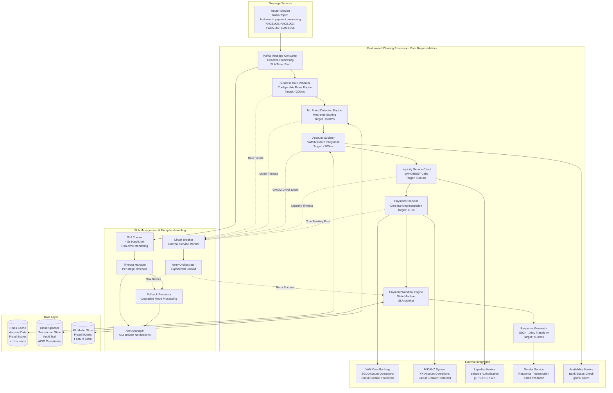
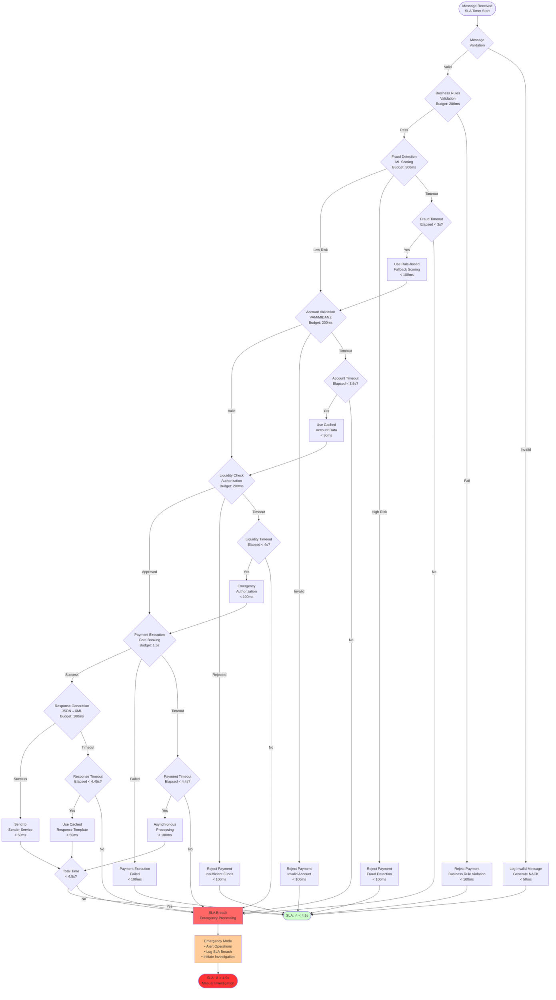
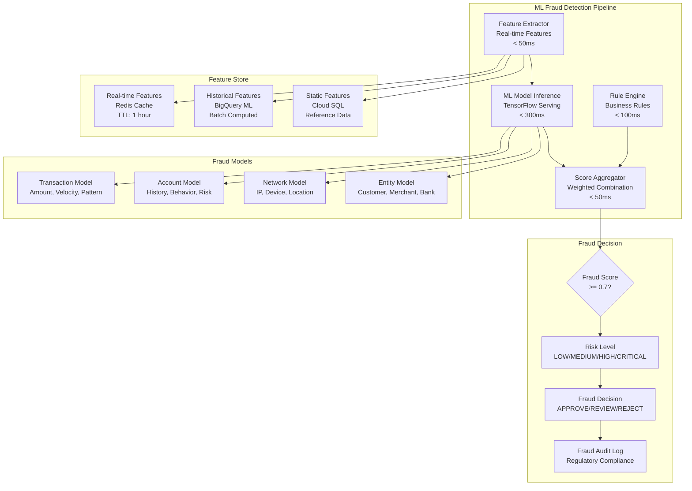
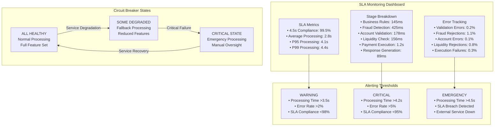

# Fast Inward Clearing Processor - Technical Architecture & Exception Handling

## Service Responsibilities & 4.5-Second SLA Compliance



## 4.5-Second SLA Breakdown & Exception Handling



## API Contracts & Message Processing

### 1. Kafka Input Contract (from Router)

**Topic Configuration:**
```yaml
spring.cloud.stream:
  bindings:
    inward-payment-input:
      destination: fast.inward.payment.processing
      group: fast-inward-clearing-processor
      consumer:
        max-attempts: 1  # No retries - SLA critical
        enable-dlq: true
        batch-mode: false  # Individual message processing
  kafka:
    bindings:
      inward-payment-input:
        consumer:
          configuration:
            enable.auto.commit: false
            auto.offset.reset: latest
            max.poll.records: 1  # Process one at a time for SLA
            session.timeout.ms: 30000
            heartbeat.interval.ms: 3000
```

**Sample PACS.008 Input (Credit Transfer Inward):**
```json
{
  "messageType": "PACS_008",
  "messageVersion": "13",
  "groupHeader": {
    "messageId": "CTI20241201001",
    "creationDateTime": "2024-12-01T10:30:00.000Z",
    "numberOfTransactions": "1",
    "controlSum": 75000.00,
    "instructingAgent": {
      "financialInstitutionIdentification": {
        "bicfi": "DBSSSGSG"
      }
    },
    "instructedAgent": {
      "financialInstitutionIdentification": {
        "bicfi": "OCBCSGSG"
      }
    }
  },
  "transactionInformation": [
    {
      "paymentIdentification": {
        "instructionId": "INS-CTI-20241201001",
        "endToEndId": "E2E-CTI-20241201001",
        "txId": "TXN-CTI-20241201001",
        "uetr": "12345678-1234-1234-1234-123456789012"
      },
      "interbankSettlementAmount": {
        "value": 75000.00,
        "currency": "SGD"
      },
      "creditor": {
        "name": "TechStart Pte Ltd",
        "postalAddress": {
          "country": "SG"
        }
      },
      "creditorAccount": {
        "identification": {
          "iban": "SG77OCBC0000000012345678"
        }
      },
      "debtor": {
        "name": "Global Enterprises Ltd",
        "postalAddress": {
          "country": "SG"
        }
      },
      "debtorAccount": {
        "identification": {
          "iban": "SG12DBSS0000000087654321"
        }
      },
      "remittanceInformation": {
        "unstructured": "Invoice payment INV-2024-001"
      }
    }
  ],
  "processingMetadata": {
    "receivedTimestamp": 1733051400000,
    "sourceService": "fast-router-service",
    "targetService": "fast-inward-clearing-processor",
    "correlationId": "CORR-CTI-20241201-001",
    "traceId": "TRACE-CTI-20241201-001",
    "idempotencyKey": "IDEM-CTI20241201001",
    "slaStartTimestamp": 1733051400000
  }
}
```

**Sample PACS.003 Input (Direct Debit Inward):**
```json
{
  "messageType": "PACS_003",
  "messageVersion": "11",
  "groupHeader": {
    "messageId": "DDI20241201001",
    "creationDateTime": "2024-12-01T14:15:00.000Z",
    "numberOfTransactions": "1",
    "controlSum": 1200.00,
    "instructingAgent": {
      "financialInstitutionIdentification": {
        "bicfi": "UOBSSGSG"
      }
    },
    "instructedAgent": {
      "financialInstitutionIdentification": {
        "bicfi": "DBSSSGSG"
      }
    }
  },
  "transactionInformation": [
    {
      "paymentIdentification": {
        "instructionId": "INS-DDI-20241201001",
        "endToEndId": "E2E-DDI-20241201001",
        "txId": "TXN-DDI-20241201001"
      },
      "interbankSettlementAmount": {
        "value": 1200.00,
        "currency": "SGD"
      },
      "directDebitTransactionInformation": {
        "mandateRelatedInformation": {
          "mandateId": "MANDATE-001",
          "dateOfSignature": "2024-01-15"
        },
        "preNotificationId": "PRENOT-001",
        "preNotificationDate": "2024-11-25"
      },
      "creditor": {
        "name": "Utility Company Pte Ltd",
        "postalAddress": {
          "country": "SG"
        }
      },
      "creditorAccount": {
        "identification": {
          "iban": "SG99UOBS0000000098765432"
        }
      },
      "debtor": {
        "name": "John Consumer",
        "postalAddress": {
          "country": "SG"
        }
      },
      "debtorAccount": {
        "identification": {
          "iban": "SG44DBSS0000000013579246"
        }
      }
    }
  ],
  "processingMetadata": {
    "receivedTimestamp": 1733065200000,
    "sourceService": "fast-router-service",
    "targetService": "fast-inward-clearing-processor",
    "correlationId": "CORR-DDI-20241201-001",
    "slaStartTimestamp": 1733065200000
  }
}
```

### 2. External Service Integration APIs

**VAM Core Banking Integration:**
```java
@FeignClient(name = "vam-service", url = "${vam.service.url}")
public interface VAMServiceClient {
    
    @PostMapping("/api/v1/accounts/validate")
    @TimeLimiter(name = "vam-service", fallbackMethod = "validateAccountFallback")
    Mono<AccountValidationResponse> validateAccount(
        @RequestBody AccountValidationRequest request,
        @RequestHeader("X-Correlation-ID") String correlationId,
        @RequestHeader("X-Timeout-Ms") String timeoutMs);
    
    @PostMapping("/api/v1/payments/credit")
    @TimeLimiter(name = "vam-service", fallbackMethod = "executeCreditFallback")
    Mono<PaymentExecutionResponse> executeCredit(
        @RequestBody CreditTransferRequest request,
        @RequestHeader("X-Correlation-ID") String correlationId);
    
    @PostMapping("/api/v1/payments/debit")
    @TimeLimiter(name = "vam-service", fallbackMethod = "executeDebitFallback")  
    Mono<PaymentExecutionResponse> executeDebit(
        @RequestBody DirectDebitRequest request,
        @RequestHeader("X-Correlation-ID") String correlationId);
}
```

**VAM Request/Response Samples:**
```json
// Account Validation Request
{
  "accountNumber": "SG77OCBC0000000012345678",
  "accountType": "CURRENT",
  "currency": "SGD",
  "validationType": "EXISTENCE_AND_STATUS",
  "correlationId": "CORR-CTI-20241201-001"
}

// Account Validation Response
{
  "accountNumber": "SG77OCBC0000000012345678",
  "accountName": "TechStart Pte Ltd",
  "accountStatus": "ACTIVE",
  "accountType": "CURRENT",
  "currency": "SGD",
  "isValid": true,
  "validationTimestamp": "2024-12-01T10:30:00.156Z",
  "responseTimeMs": 156
}

// Credit Transfer Request
{
  "transactionId": "TXN-CTI-20241201001",
  "amount": 75000.00,
  "currency": "SGD",
  "creditAccount": "SG77OCBC0000000012345678",
  "debitAccount": "SG12DBSS0000000087654321",
  "remittanceInfo": "Invoice payment INV-2024-001",
  "correlationId": "CORR-CTI-20241201-001",
  "urgency": "HIGH"
}

// Payment Execution Response
{
  "transactionId": "TXN-CTI-20241201001",
  "executionStatus": "COMPLETED",
  "systemReference": "VAM-REF-20241201001",
  "executionTimestamp": "2024-12-01T10:30:01.234Z",
  "newBalance": 125000.00,
  "processingTimeMs": 987
}
```

### 3. Liquidity Service Integration

**gRPC Proto for Liquidity Check:**
```protobuf
service LiquidityService {
  rpc CheckLiquidityBalance(LiquidityCheckRequest) returns (LiquidityCheckResponse);
}

message LiquidityCheckRequest {
  string participant_id = 1;
  double amount = 2;
  string currency = 3;
  string transaction_type = 4;
  string reference = 5;
  string correlation_id = 6;
  int32 timeout_ms = 7;
}

message LiquidityCheckResponse {
  bool approved = 1;
  string participant_id = 2;
  double requested_amount = 3;
  double available_balance = 4;
  string approval_reference = 5;
  string rejection_reason = 6;
  google.protobuf.Timestamp response_timestamp = 7;
  int32 processing_time_ms = 8;
}
```

**Liquidity Check Implementation:**
```java
@Service
public class LiquidityCheckService {
    
    private final LiquidityServiceGrpc.LiquidityServiceBlockingStub liquidityStub;
    
    @CircuitBreaker(name = "liquidity-service", fallbackMethod = "liquidityCheckFallback")
    @TimeLimiter(name = "liquidity-service")
    public Mono<LiquidityResult> checkLiquidity(PaymentMessage payment, String correlationId) {
        return Mono.fromCallable(() -> {
            LiquidityCheckRequest request = LiquidityCheckRequest.newBuilder()
                .setParticipantId(extractParticipantId(payment))
                .setAmount(payment.getAmount())
                .setCurrency(payment.getCurrency())
                .setTransactionType(payment.getMessageType().name())
                .setReference(payment.getTransactionId())
                .setCorrelationId(correlationId)
                .setTimeoutMs(200)  // 200ms SLA budget
                .build();
            
            LiquidityCheckResponse response = liquidityStub
                .withDeadlineAfter(200, TimeUnit.MILLISECONDS)
                .checkLiquidityBalance(request);
            
            return LiquidityResult.builder()
                .approved(response.getApproved())
                .availableBalance(response.getAvailableBalance())
                .approvalReference(response.getApprovalReference())
                .processingTime(response.getProcessingTimeMs())
                .build();
        })
        .subscribeOn(Schedulers.boundedElastic())
        .timeout(Duration.ofMillis(250)); // Buffer for network overhead
    }
    
    public Mono<LiquidityResult> liquidityCheckFallback(PaymentMessage payment, String correlationId, Exception ex) {
        // Emergency liquidity approval for small amounts
        if (payment.getAmount() <= 10000.00) {
            return Mono.just(LiquidityResult.builder()
                .approved(true)
                .approvalReference("EMERGENCY-FALLBACK")
                .fallbackUsed(true)
                .build());
        }
        
        return Mono.just(LiquidityResult.builder()
            .approved(false)
            .rejectionReason("LIQUIDITY_SERVICE_UNAVAILABLE")
            .fallbackUsed(true)
            .build());
    }
}
```

## Fraud Detection & ML Model Integration



## Performance Monitoring & SLA Tracking



## Technology Stack & Configuration

```yaml
Application Configuration:
  spring:
    application:
      name: fast-inward-clearing-processor
    kafka:
      consumer:
        group-id: fast-inward-clearing-processor
        enable-auto-commit: false
        auto-offset-reset: latest
        max-poll-records: 1  # SLA-critical: one message at a time
    
    # Virtual Threads for SLA performance
    threads:
      virtual:
        enabled: true
    
    cloud:
      circuitbreaker:
        resilience4j:
          enabled: true

SLA Configuration:
  sla:
    inward-payment:
      target-duration: 4500ms
      warning-threshold: 3500ms
      critical-threshold: 4200ms
      timeout-stages:
        business-validation: 200ms
        fraud-detection: 500ms
        account-validation: 200ms
        liquidity-check: 200ms
        payment-execution: 1500ms
        response-generation: 100ms

Circuit Breaker Configuration:
  resilience4j:
    circuitbreaker:
      instances:
        vam-service:
          failure-rate-threshold: 20
          slow-call-rate-threshold: 30
          slow-call-duration-threshold: 1000ms
          wait-duration-in-open-state: 30s
        fraud-detection:
          failure-rate-threshold: 10
          slow-call-rate-threshold: 20
          slow-call-duration-threshold: 500ms
          wait-duration-in-open-state: 15s
        liquidity-service:
          failure-rate-threshold: 5
          slow-call-rate-threshold: 10
          slow-call-duration-threshold: 200ms
          wait-duration-in-open-state: 10s

JVM Optimization:
  memory: "-Xms4g -Xmx8g"
  gc: "-XX:+UseZGC -XX:MaxGCPauseMillis=50"
  virtual-threads: "--enable-preview -XX:+UseVirtualThreads"
  performance: "-XX:+AlwaysPreTouch -XX:+UseTransparentHugePages"
  monitoring: "-XX:+FlightRecorder -XX:StartFlightRecording=duration=0s"
```