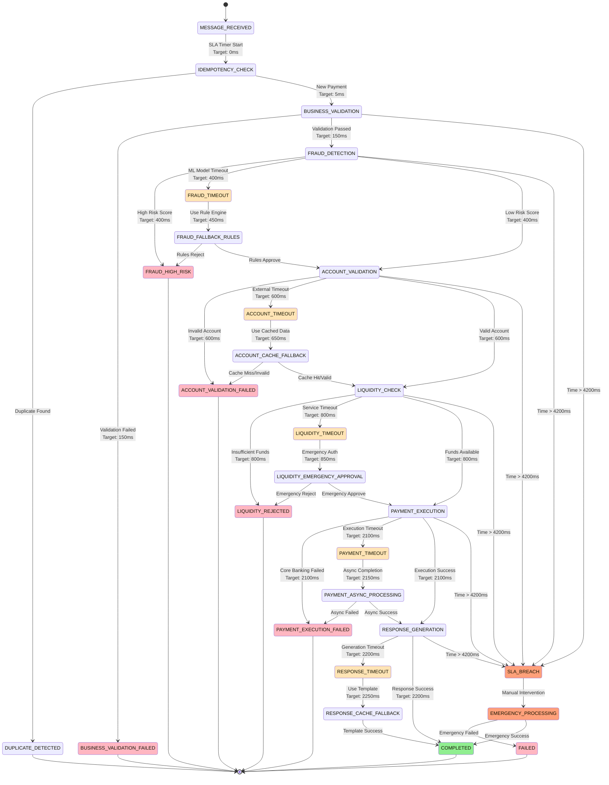
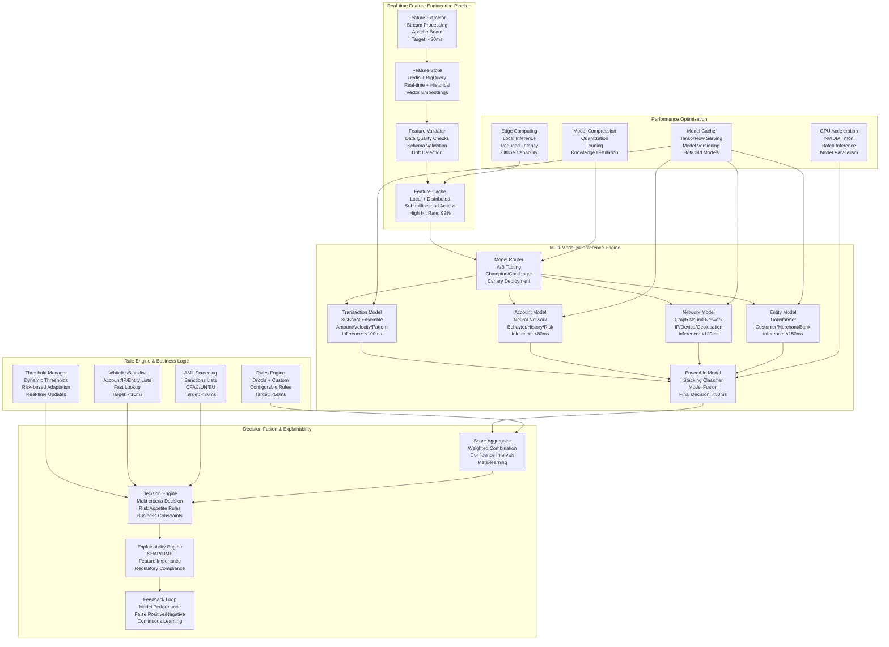

# Fast Inward Clearing Processor - Deep Technical Architecture & 4.5s SLA Implementation

## Core Service Responsibilities & Ultra-High Performance Architecture

```mermaid
graph TB
    subgraph "Message Ingestion Layer"
        KafkaConsumer[Kafka Consumer<br/>Dedicated Virtual Threads<br/>Zero-Copy Message Processing<br/>SLA Timer: Immediate Start]
        MessageRouter[Message Router<br/>Type-based Routing<br/>PACS.008/003/007/CAMT.056<br/>Parallel Pipeline Activation]
        IdempotencyManager[Idempotency Manager<br/>Redis-based Deduplication<br/>Sub-5ms Lookup<br/>Bloom Filter Optimization]
    end

    subgraph "High-Performance Processing Pipeline"
        ValidationEngine[Validation Engine<br/>JSON Schema + Business Rules<br/>Multi-threaded Validation<br/>Target: <150ms]
        FraudDetectionML[ML Fraud Detection<br/>TensorFlow Serving + Redis<br/>Real-time Feature Store<br/>Target: <400ms]
        AccountOrchestrator[Account Orchestrator<br/>Parallel VAM/MIDANZ Calls<br/>Async Circuit Breakers<br/>Target: <180ms]
        LiquidityGateway[Liquidity Gateway<br/>gRPC Connection Pool<br/>Sub-200ms Response<br/>Smart Caching Layer]
        PaymentExecutor[Payment Executor<br/>Transactional State Machine<br/>ACID Compliance<br/>Target: <1.3s]
        ResponseGenerator[Response Generator<br/>Template-based Generation<br/>JSON-to-XML Transform<br/>Target: <80ms]
    end

    subgraph "SLA Enforcement & Monitoring"
        SLAOrchestrator[SLA Orchestrator<br/>Real-time SLA Tracking<br/>Stage-wise Timeout Management<br/>Emergency Escalation]
        PerformanceProfiler[Performance Profiler<br/>Nanosecond Precision<br/>Stage Breakdown Analysis<br/>Bottleneck Detection]
        CircuitBreakerHierarchy[Circuit Breaker Hierarchy<br/>Service/Operation/Resource Level<br/>Adaptive Thresholds<br/>Auto-recovery Logic]
        EmergencyProcessor[Emergency Processor<br/>SLA Breach Handler<br/>Graceful Degradation<br/>Manual Override]
    end

    subgraph "High-Performance Data Layer"
        L1Cache[L1 Cache (Caffeine)<br/>Account & Fraud Data<br/>100K entries<br/>Sub-1ms Access]
        L2Cache[L2 Cache (Redis Cluster)<br/>Feature Store & Decisions<br/>Distributed Caching<br/>Sub-5ms Access]
        SpannerCluster[Spanner Primary<br/>Payment State & Audit<br/>Strong Consistency<br/>Global Transactions]
        MLFeatureStore[ML Feature Store<br/>Real-time + Historical<br/>BigQuery ML Integration<br/>Vector Embeddings]
    end

    subgraph "External Integration Layer"
        VAMConnector[VAM Connector<br/>SGD Account Operations<br/>Connection Pool: 100<br/>Circuit Breaker Protected]
        MIDANZConnector[MIDANZ Connector<br/>Multi-currency Operations<br/>Connection Pool: 50<br/>Advanced Retry Logic]
        LiquidityConnector[Liquidity Service Connector<br/>gRPC Streaming<br/>Keep-alive: 30s<br/>Load Balancing]
        AvailabilityConnector[Availability Connector<br/>Bank Status Validation<br/>Cached Status Queries<br/>Fallback Strategies]
        EventBroadcaster[Event Broadcaster<br/>Kafka Producer<br/>Async Publishing<br/>Message Ordering]
    end

    KafkaConsumer --> MessageRouter
    MessageRouter --> IdempotencyManager
    IdempotencyManager --> ValidationEngine

    ValidationEngine --> FraudDetectionML
    FraudDetectionML --> AccountOrchestrator
    AccountOrchestrator --> LiquidityGateway
    LiquidityGateway --> PaymentExecutor
    PaymentExecutor --> ResponseGenerator
    ResponseGenerator --> EventBroadcaster

    %% SLA Monitoring Integration
    SLAOrchestrator -.->|Monitor| ValidationEngine
    SLAOrchestrator -.->|Monitor| FraudDetectionML
    SLAOrchestrator -.->|Monitor| AccountOrchestrator
    SLAOrchestrator -.->|Monitor| LiquidityGateway
    SLAOrchestrator -.->|Monitor| PaymentExecutor
    SLAOrchestrator -.->|Monitor| ResponseGenerator

    PerformanceProfiler -.->|Profile| SLAOrchestrator
    CircuitBreakerHierarchy -.->|Protect| AccountOrchestrator
    CircuitBreakerHierarchy -.->|Protect| LiquidityGateway
    CircuitBreakerHierarchy -.->|Protect| PaymentExecutor

    %% Data Layer Integration
    ValidationEngine <--> L1Cache
    FraudDetectionML <--> MLFeatureStore
    AccountOrchestrator <--> L2Cache
    PaymentExecutor <--> SpannerCluster

    %% External System Integration
    AccountOrchestrator --> VAMConnector
    AccountOrchestrator --> MIDANZConnector
    LiquidityGateway --> LiquidityConnector
    ValidationEngine --> AvailabilityConnector
    ResponseGenerator --> EventBroadcaster

    %% Emergency Handling
    SLAOrchestrator -.->|SLA Breach| EmergencyProcessor
    CircuitBreakerHierarchy -.->|System Failure| EmergencyProcessor
    EmergencyProcessor -.->|Override| PaymentExecutor
```

## Database Schema & Payment State Management

### Cloud Spanner Tables for High-Performance Payment Processing

```sql
-- Payment Transaction State Management
CREATE TABLE payment_transactions (
  payment_id STRING(36) NOT NULL,
  correlation_id STRING(50) NOT NULL,
  business_date DATE NOT NULL,

  -- Message Information
  message_type STRING(20) NOT NULL, -- PACS_008, PACS_003, PACS_007, CAMT_056
  message_version STRING(10) NOT NULL,
  original_message_id STRING(35) NOT NULL,
  end_to_end_id STRING(35) NOT NULL,
  transaction_id STRING(35) NOT NULL,
  instruction_id STRING(35) NOT NULL,
  uetr STRING(36), -- Unique End-to-end Transaction Reference (ISO 20022)

  -- Payment Details
  amount NUMERIC NOT NULL,
  currency STRING(3) NOT NULL DEFAULT 'SGD',
  settlement_method STRING(20) DEFAULT 'INSTANT',
  priority STRING(10) DEFAULT 'HIGH', -- HIGH, NORMAL, LOW

  -- Participant Information
  instructing_agent_bic STRING(11) NOT NULL,
  instructed_agent_bic STRING(11) NOT NULL,
  debtor_account STRING(50),
  debtor_name STRING(140),
  creditor_account STRING(50),
  creditor_name STRING(140),

  -- Processing State
  processing_status STRING(30) NOT NULL DEFAULT 'RECEIVED',
  -- RECEIVED, VALIDATING, FRAUD_CHECKING, ACCOUNT_VALIDATING, LIQUIDITY_CHECKING,
  -- EXECUTING, COMPLETED, REJECTED, FAILED, TIMEOUT, EMERGENCY_PROCESSED

  processing_stage STRING(30) NOT NULL DEFAULT 'MESSAGE_RECEIVED',
  -- MESSAGE_RECEIVED, BUSINESS_VALIDATION, FRAUD_DETECTION, ACCOUNT_VALIDATION,
  -- LIQUIDITY_CHECK, PAYMENT_EXECUTION, RESPONSE_GENERATION, COMPLETED

  current_attempt INT64 NOT NULL DEFAULT 1,
  max_attempts INT64 NOT NULL DEFAULT 3,

  -- SLA Tracking
  sla_start_timestamp TIMESTAMP NOT NULL,
  sla_target_timestamp TIMESTAMP NOT NULL,
  sla_warning_timestamp TIMESTAMP NOT NULL,
  sla_critical_timestamp TIMESTAMP NOT NULL,
  processing_completed_timestamp TIMESTAMP,
  total_processing_time_ms INT64,
  sla_compliant BOOL,
  sla_breach_reason STRING(500),

  -- Stage Timing (for performance analysis)
  stage_timings JSON, -- {"validation": 145, "fraud": 425, "account": 178, ...}

  -- Validation Results
  business_validation_result JSON,
  business_validation_time_ms INT64,

  -- Fraud Detection Results
  fraud_detection_score FLOAT64,
  fraud_risk_level STRING(20), -- LOW, MEDIUM, HIGH, CRITICAL
  fraud_decision STRING(20), -- APPROVE, REVIEW, REJECT
  fraud_model_version STRING(20),
  fraud_features JSON,
  fraud_detection_time_ms INT64,

  -- Account Validation Results
  account_validation_result JSON,
  account_validation_time_ms INT64,
  vam_response JSON,
  midanz_response JSON,

  -- Liquidity Check Results
  liquidity_check_result JSON,
  liquidity_approval_reference STRING(50),
  liquidity_available_balance NUMERIC,
  liquidity_check_time_ms INT64,

  -- Payment Execution Results
  payment_execution_result JSON,
  payment_execution_reference STRING(50),
  core_banking_reference STRING(50),
  execution_time_ms INT64,

  -- Response Generation
  response_message JSON,
  response_generation_time_ms INT64,

  -- Error Handling
  error_code STRING(20),
  error_message STRING(1000),
  error_details JSON,
  retry_count INT64 DEFAULT 0,
  fallback_used BOOL DEFAULT false,
  fallback_reason STRING(500),

  -- Circuit Breaker Context
  circuit_breaker_states JSON, -- States of all circuit breakers during processing
  external_service_response_times JSON, -- Response times from external services

  -- Audit and Compliance
  regulatory_reporting_required BOOL DEFAULT true,
  aml_screening_required BOOL DEFAULT true,
  sanctions_screening_required BOOL DEFAULT true,

  created_timestamp TIMESTAMP NOT NULL OPTIONS (allow_commit_timestamp=true),
  last_updated_timestamp TIMESTAMP NOT NULL OPTIONS (allow_commit_timestamp=true),
  created_by STRING(100) NOT NULL DEFAULT 'FAST_INWARD_PROCESSOR',
  last_updated_by STRING(100) NOT NULL DEFAULT 'FAST_INWARD_PROCESSOR',

) PRIMARY KEY (business_date, payment_id),
  INTERLEAVE IN PARENT business_date_partitions ON DELETE CASCADE;

-- Payment State History for Audit Trail
CREATE TABLE payment_state_history (
  payment_id STRING(36) NOT NULL,
  state_change_id STRING(36) NOT NULL,
  business_date DATE NOT NULL,

  -- State Transition Details
  previous_status STRING(30),
  new_status STRING(30) NOT NULL,
  previous_stage STRING(30),
  new_stage STRING(30) NOT NULL,
  state_change_timestamp TIMESTAMP NOT NULL,

  -- Processing Context
  processing_node STRING(50), -- Service instance handling the payment
  thread_id STRING(50), -- Virtual thread ID for debugging
  correlation_id STRING(50) NOT NULL,

  -- Performance Metrics
  stage_duration_ms INT64,
  cumulative_processing_time_ms INT64,
  sla_remaining_ms INT64,

  -- Stage Results
  stage_result JSON,
  stage_metrics JSON,
  external_call_times JSON,

  -- Error Context (if applicable)
  error_occurred BOOL DEFAULT false,
  error_code STRING(20),
  error_message STRING(1000),
  error_recovery_action STRING(100),

  -- Circuit Breaker Context
  active_circuit_breakers ARRAY<STRING(50)>,
  fallback_actions_taken ARRAY<STRING(100)>,

  -- Business Context
  business_impact_level STRING(20), -- LOW, MEDIUM, HIGH, CRITICAL
  customer_impact BOOL DEFAULT false,

) PRIMARY KEY (business_date, payment_id, state_change_timestamp, state_change_id),
  INTERLEAVE IN PARENT payment_transactions ON DELETE CASCADE;

-- Fraud Detection Model Results and Feature Store
CREATE TABLE fraud_detection_results (
  payment_id STRING(36) NOT NULL,
  detection_timestamp TIMESTAMP NOT NULL,
  business_date DATE NOT NULL,

  -- Model Information
  model_name STRING(50) NOT NULL,
  model_version STRING(20) NOT NULL,
  model_type STRING(30) NOT NULL, -- TRANSACTION, ACCOUNT, NETWORK, ENTITY

  -- Scoring Results
  fraud_score FLOAT64 NOT NULL,
  confidence_score FLOAT64,
  risk_level STRING(20) NOT NULL, -- LOW, MEDIUM, HIGH, CRITICAL
  decision STRING(20) NOT NULL, -- APPROVE, REVIEW, REJECT

  -- Feature Values (for model explainability)
  transaction_features JSON,
  account_features JSON,
  network_features JSON,
  entity_features JSON,
  derived_features JSON,

  -- Model Performance Metrics
  inference_time_ms INT64,
  feature_extraction_time_ms INT64,
  total_processing_time_ms INT64,

  -- Rule Engine Results
  business_rules_triggered ARRAY<STRING(100)>,
  rule_engine_decision STRING(20),
  rule_engine_time_ms INT64,

  -- Explainability and Audit
  feature_importance JSON, -- Which features contributed most to the score
  decision_reasoning TEXT, -- Human-readable explanation
  model_drift_detected BOOL DEFAULT false,
  data_quality_score FLOAT64,

  -- Feedback Loop (for model improvement)
  actual_fraud_outcome BOOL, -- To be updated later if fraud is confirmed
  false_positive BOOL,
  false_negative BOOL,
  feedback_timestamp TIMESTAMP,

  -- Regulatory Compliance
  explainable_ai_report JSON,
  bias_detection_results JSON,

) PRIMARY KEY (business_date, payment_id, detection_timestamp);

-- Account Validation Cache and Results
CREATE TABLE account_validation_cache (
  account_key STRING(100) NOT NULL, -- Hash of account details
  cache_timestamp TIMESTAMP NOT NULL,

  -- Account Information
  account_number STRING(50) NOT NULL,
  account_name STRING(140),
  account_type STRING(30),
  account_status STRING(20),
  account_currency STRING(3),

  -- Validation Results
  is_valid BOOL NOT NULL,
  validation_source STRING(20), -- VAM, MIDANZ, CACHE
  validation_timestamp TIMESTAMP NOT NULL,
  validation_response_time_ms INT64,

  -- Bank Information
  bank_bic STRING(11),
  bank_name STRING(140),
  bank_country STRING(2),

  -- Risk Information
  account_risk_level STRING(20), -- LOW, MEDIUM, HIGH
  aml_status STRING(20), -- CLEAR, PENDING, FLAGGED
  sanctions_status STRING(20), -- CLEAR, PENDING, FLAGGED

  -- Cache Management
  cache_ttl_seconds INT64 NOT NULL DEFAULT 3600, -- 1 hour
  cache_hit_count INT64 DEFAULT 0,
  last_accessed_timestamp TIMESTAMP,

  -- Data Quality
  data_completeness_score FLOAT64,
  data_freshness_score FLOAT64,

) PRIMARY KEY (account_key);

-- Payment Execution Audit Trail
CREATE TABLE payment_execution_audit (
  payment_id STRING(36) NOT NULL,
  execution_step_id STRING(36) NOT NULL,
  business_date DATE NOT NULL,
  execution_timestamp TIMESTAMP NOT NULL,

  -- Execution Details
  execution_step STRING(50) NOT NULL, -- PRE_EXECUTION, DEBIT, CREDIT, POST_EXECUTION, ROLLBACK
  execution_status STRING(20) NOT NULL, -- STARTED, COMPLETED, FAILED, ROLLED_BACK

  -- Core Banking Integration
  core_banking_system STRING(20), -- VAM, MIDANZ
  core_banking_request JSON,
  core_banking_response JSON,
  core_banking_reference STRING(50),
  response_time_ms INT64,

  -- Transaction Details
  transaction_amount NUMERIC,
  transaction_currency STRING(3),
  debit_account STRING(50),
  credit_account STRING(50),

  -- Balances (before and after)
  debit_account_balance_before NUMERIC,
  debit_account_balance_after NUMERIC,
  credit_account_balance_before NUMERIC,
  credit_account_balance_after NUMERIC,

  -- Execution Context
  execution_node STRING(50),
  execution_thread STRING(50),
  transaction_isolation_level STRING(20),

  -- Error Handling
  error_occurred BOOL DEFAULT false,
  error_code STRING(20),
  error_message STRING(1000),
  error_recovery_action STRING(100),
  retry_attempt INT64 DEFAULT 0,

  -- Regulatory and Compliance
  regulatory_transaction_id STRING(50),
  aml_transaction_id STRING(50),
  audit_trail_reference STRING(50),

) PRIMARY KEY (business_date, payment_id, execution_timestamp, execution_step_id),
  INTERLEAVE IN PARENT payment_transactions ON DELETE CASCADE;

-- SLA Performance Metrics and Analytics
CREATE TABLE sla_performance_metrics (
  metric_timestamp TIMESTAMP NOT NULL,
  aggregation_window STRING(10) NOT NULL, -- 1MIN, 5MIN, 15MIN, 1HOUR, 1DAY
  business_date DATE NOT NULL,

  -- SLA Compliance Metrics
  total_payments_processed INT64 NOT NULL,
  sla_compliant_payments INT64 NOT NULL,
  sla_compliance_percentage FLOAT64 AS (
    CASE
      WHEN total_payments_processed > 0 THEN (sla_compliant_payments * 100.0) / total_payments_processed
      ELSE 0
    END
  ) STORED,

  -- Processing Time Statistics
  avg_processing_time_ms FLOAT64,
  min_processing_time_ms INT64,
  max_processing_time_ms INT64,
  p50_processing_time_ms FLOAT64,
  p95_processing_time_ms FLOAT64,
  p99_processing_time_ms FLOAT64,
  p999_processing_time_ms FLOAT64,

  -- Stage Performance Breakdown
  avg_validation_time_ms FLOAT64,
  avg_fraud_detection_time_ms FLOAT64,
  avg_account_validation_time_ms FLOAT64,
  avg_liquidity_check_time_ms FLOAT64,
  avg_payment_execution_time_ms FLOAT64,
  avg_response_generation_time_ms FLOAT64,

  -- Error and Failure Metrics
  validation_errors INT64 DEFAULT 0,
  fraud_rejections INT64 DEFAULT 0,
  account_validation_errors INT64 DEFAULT 0,
  liquidity_rejections INT64 DEFAULT 0,
  execution_failures INT64 DEFAULT 0,
  timeout_failures INT64 DEFAULT 0,
  circuit_breaker_activations INT64 DEFAULT 0,

  -- Payment Type Breakdown
  pacs_008_count INT64 DEFAULT 0, -- Credit Transfer
  pacs_003_count INT64 DEFAULT 0, -- Direct Debit
  pacs_007_count INT64 DEFAULT 0, -- Payment Reversal
  camt_056_count INT64 DEFAULT 0, -- Payment Cancellation

  -- Currency Distribution
  sgd_amount_processed NUMERIC DEFAULT 0,
  usd_amount_processed NUMERIC DEFAULT 0,
  eur_amount_processed NUMERIC DEFAULT 0,
  other_currency_amount NUMERIC DEFAULT 0,

  -- Peak Performance Indicators
  peak_throughput_tps FLOAT64, -- Transactions per second
  peak_concurrent_payments INT64,
  resource_utilization_percentage FLOAT64,

  -- External Service Performance
  vam_avg_response_time_ms FLOAT64,
  midanz_avg_response_time_ms FLOAT64,
  liquidity_service_avg_response_time_ms FLOAT64,
  fraud_detection_avg_response_time_ms FLOAT64,

) PRIMARY KEY (business_date, aggregation_window, metric_timestamp);

-- System Configuration for Inward Clearing Processor
CREATE TABLE inward_processor_configuration (
  config_key STRING(100) NOT NULL,
  config_value JSON NOT NULL,
  config_category STRING(30) NOT NULL, -- SLA, FRAUD, VALIDATION, EXECUTION, CIRCUIT_BREAKER

  -- Scope and Applicability
  message_type STRING(20), -- NULL for global, or PACS_008, PACS_003, etc.
  currency STRING(3), -- NULL for global, or SGD, USD, etc.
  amount_range STRING(50), -- NULL for global, or "0-10000", "10000-100000", etc.
  service_instance STRING(50), -- NULL for all instances

  -- Configuration Lifecycle
  version INT64 NOT NULL DEFAULT 1,
  is_active BOOL NOT NULL DEFAULT true,
  effective_from TIMESTAMP NOT NULL,
  effective_until TIMESTAMP,

  -- Change Management
  created_by STRING(100) NOT NULL,
  created_timestamp TIMESTAMP NOT NULL OPTIONS (allow_commit_timestamp=true),
  approved_by STRING(100),
  approval_timestamp TIMESTAMP,
  last_modified_by STRING(100),
  last_modified_timestamp TIMESTAMP OPTIONS (allow_commit_timestamp=true),

  -- A/B Testing Support
  experiment_id STRING(50),
  experiment_percentage FLOAT64 DEFAULT 100.0,
  control_group_config JSON,

  -- Validation and Testing
  validation_status STRING(20) DEFAULT 'PENDING', -- PENDING, VALIDATED, FAILED
  test_results JSON,
  rollback_version INT64,

) PRIMARY KEY (config_key, version);
```

### Redis Cache Schema for Ultra-Low Latency Processing

```yaml
inward_processor_cache_architecture:

  # Redis cluster optimized for sub-5ms performance
  cluster_configuration:
    topology:
      masters: 6  # Higher master count for payment processing load
      replicas_per_master: 2  # Higher redundancy for critical data
      total_nodes: 18
      memory_per_node: "32GB"  # Larger memory for extensive caching
      network_bandwidth: "25Gbps"  # High bandwidth for payment data

    performance_optimization:
      max_connections_per_node: 20000
      timeout_configuration:
        connect_timeout: "500ms"  # Faster connection for SLA
        command_timeout: "50ms"   # Ultra-fast command execution
        keep_alive: true
        tcp_nodelay: true

      cpu_optimization:
        cpu_cores_per_node: 32
        thread_affinity: "enabled"
        numa_optimization: "enabled"
        cpu_governor: "performance"

    persistence_strategy:
      rdb_snapshots:
        enabled: true
        interval: "600s"  # 10 minutes
        compression: "lz4"
        background_save_optimized: true

      aof_logging:
        enabled: false  # Disabled for maximum speed
        # Payment data integrity maintained by Spanner

  # Cache patterns optimized for payment processing
  cache_patterns:

    # Account validation cache - Ultra-fast account lookups
    account_validation:
      pattern: "account:validation:{account_hash}"
      type: "hash"
      fields:
        account_number: "string"
        account_name: "string"
        account_status: "string"
        account_type: "string"
        is_valid: "boolean"
        validation_timestamp: "timestamp_milliseconds"
        validation_source: "string"
        bank_bic: "string"
        risk_level: "string"
        aml_status: "string"
        sanctions_status: "string"
      ttl: 3600  # 1 hour
      memory_policy: "noeviction"  # Critical for payment processing
      persistence: "disabled"

      consistency_strategy:
        cache_aside: true
        write_through: false
        refresh_ahead: true
        refresh_threshold: "10_minutes_before_expiry"

    # Fraud detection features - Real-time feature cache
    fraud_features:
      pattern: "fraud:features:{account_id}:{timeframe}"
      type: "hash"
      fields:
        transaction_velocity_1h: "integer"
        transaction_velocity_24h: "integer"
        total_amount_1h: "float"
        total_amount_24h: "float"
        unique_counterparties_24h: "integer"
        risk_score_historical: "float"
        last_fraud_check: "timestamp"
        account_age_days: "integer"
        geographic_risk_score: "float"
        behavioral_anomaly_score: "float"
      ttl: 3600  # 1 hour
      memory_policy: "volatile-lru"
      persistence: "disabled"

    # Fraud model cache - ML model results
    fraud_model_cache:
      pattern: "fraud:model:{model_version}:{feature_hash}"
      type: "hash"
      fields:
        fraud_score: "float"
        risk_level: "string"
        decision: "string"
        confidence: "float"
        model_inference_time: "integer"
        feature_importance: "json"
        cache_timestamp: "timestamp"
      ttl: 1800  # 30 minutes
      memory_policy: "volatile-lru"
      persistence: "disabled"

    # Payment deduplication - Idempotency cache
    payment_idempotency:
      pattern: "payment:idem:{idempotency_key}"
      type: "hash"
      fields:
        payment_id: "string"
        processing_status: "string"
        result: "json"
        first_attempt_timestamp: "timestamp"
        attempt_count: "integer"
        sla_timer_start: "timestamp"
      ttl: 7200  # 2 hours
      memory_policy: "noeviction"  # Critical for duplicate prevention
      persistence: "rdb_only"

    # SLA monitoring cache - Real-time performance data
    sla_monitoring:
      pattern: "sla:monitor:{time_window}"
      type: "sorted_set"
      score: "processing_time_ms"
      value: "payment_id:timestamp"
      max_entries: 10000  # Last 10K payments
      ttl: 3600  # 1 hour
      memory_policy: "volatile-lru"
      persistence: "disabled"

    # Circuit breaker state cache
    circuit_breaker_state:
      pattern: "cb:state:{service_name}"
      type: "hash"
      fields:
        state: "string"  # CLOSED, OPEN, HALF_OPEN
        failure_count: "integer"
        last_failure_time: "timestamp"
        success_count: "integer"
        last_success_time: "timestamp"
        next_attempt_time: "timestamp"
        failure_rate: "float"
        slow_call_rate: "float"
      ttl: 300  # 5 minutes
      memory_policy: "noeviction"
      persistence: "disabled"

    # Configuration cache - Runtime configuration
    configuration_cache:
      pattern: "config:{category}:{scope}"
      type: "hash"
      fields:
        sla_thresholds: "json"
        fraud_thresholds: "json"
        circuit_breaker_config: "json"
        validation_rules: "json"
        feature_flags: "json"
        last_updated: "timestamp"
      ttl: 600  # 10 minutes
      memory_policy: "volatile-ttl"
      persistence: "rdb_only"

# Local cache (L1) for ultra-low latency payment processing
local_cache_configuration:
  caffeine_cache_settings:
    maximum_size: 200000  # 200K entries for high-volume processing
    expire_after_write: "5s"  # Very short for real-time payment data
    expire_after_access: "10s"
    refresh_after_write: "2s"   # Aggressive refresh for SLA compliance

    cache_types:
      account_validation:
        name: "account_validation_cache"
        key_type: "account_hash"
        value_type: "account_validation_result"
        maximum_size: 100000
        expire_after_write: "30s"  # Slightly longer for account data

      fraud_features:
        name: "fraud_features_cache"
        key_type: "account_id"
        value_type: "fraud_feature_set"
        maximum_size: 50000

      payment_idempotency:
        name: "payment_idempotency_cache"
        key_type: "idempotency_key"
        value_type: "payment_result"
        maximum_size: 50000
        expire_after_write: "10s"  # Short for active payment tracking

      sla_metrics:
        name: "sla_metrics_cache"
        key_type: "metric_key"
        value_type: "sla_metric_data"
        maximum_size: 10000
        refresh_after_write: "1s"  # Real-time SLA monitoring

    eviction_policy: "size_based_lru_with_refresh_ahead"
    statistics_enabled: true
    cache_loader: "async_redis_fallback_spanner"

    performance_monitoring:
      hit_rate_target: 0.99  # 99% hit rate target for SLA compliance
      load_time_target: "1ms"  # Ultra-fast cache load time
      eviction_rate_alert_threshold: 0.05  # Alert if >5% evictions
```

## Advanced Payment State Machine & SLA Management

### Ultra-High Performance Payment State Machine



### Advanced SLA Enforcement Engine

```yaml
sla_enforcement_architecture:

  # Ultra-precise SLA timing management
  sla_timing_engine:
    precision: "nanosecond_precision"
    timer_implementation: "high_resolution_timer"
    clock_source: "system_monotonic_clock"

    sla_thresholds:
      target_sla: "4500ms"      # Hard limit
      warning_threshold: "3500ms"  # 77% of SLA
      critical_threshold: "4200ms" # 93% of SLA
      emergency_threshold: "4450ms" # 99% of SLA

    stage_budgets:
      idempotency_check: "5ms"
      business_validation: "150ms"
      fraud_detection: "400ms"
      account_validation: "200ms"
      liquidity_check: "200ms"
      payment_execution: "1300ms"
      response_generation: "80ms"
      kafka_publish: "50ms"
      buffer_time: "2115ms"  # Remaining time for overhead

    adaptive_timing:
      enabled: true
      dynamic_budget_allocation: true
      stage_prioritization:
        - "payment_execution"  # Highest priority
        - "fraud_detection"    # Second priority
        - "account_validation" # Third priority
        - "liquidity_check"    # Fourth priority
        - "business_validation" # Fifth priority
        - "response_generation" # Lowest priority

      budget_redistribution_rules:
        early_stage_completion_bonus: "redistribute_saved_time"
        critical_stage_extension: "borrow_from_lower_priority"
        emergency_mode_activation: "minimum_viable_processing"

  # Real-time performance monitoring
  performance_monitoring:
    measurement_granularity: "microsecond"

    metrics_collection:
      stage_timings: "individual_stage_performance"
      cumulative_timings: "running_total_tracking"
      external_service_times: "dependency_performance"
      queue_wait_times: "kafka_consumption_delay"
      gc_pause_times: "jvm_garbage_collection_impact"
      context_switch_times: "virtual_thread_overhead"

    real_time_dashboards:
      sla_compliance_gauge:
        current_compliance_rate: "percentage"
        target_compliance_rate: "99.5%"
        alert_threshold: "98.0%"

      processing_time_histogram:
        buckets: [500, 1000, 1500, 2000, 2500, 3000, 3500, 4000, 4500]
        real_time_updates: "5_second_intervals"

      stage_performance_breakdown:
        average_times: "per_stage_averages"
        p95_times: "95th_percentile_per_stage"
        outlier_detection: "statistical_anomaly_detection"

    predictive_analytics:
      sla_breach_prediction:
        machine_learning_model: "gradient_boosting_classifier"
        prediction_horizon: "predict_2_stages_ahead"
        confidence_threshold: "80%"

      capacity_planning:
        load_forecasting: "time_series_prediction"
        resource_scaling_recommendations: "auto_scaling_triggers"
        performance_degradation_alerts: "proactive_alerting"

  # Emergency handling and circuit breaking
  emergency_handling:
    sla_breach_response:
      immediate_actions:
        - "alert_operations_team"
        - "log_detailed_performance_metrics"
        - "activate_emergency_processing_mode"
        - "prepare_manual_intervention_tools"

      emergency_processing_mode:
        bypass_non_critical_validations: true
        use_cached_fraud_decisions: true
        parallel_execution_where_possible: true
        reduce_audit_logging_detail: true

      manual_intervention_capabilities:
        force_payment_completion: "operator_override"
        emergency_timeout_extension: "sla_exception"
        bypass_circuit_breakers: "emergency_connectivity"

    circuit_breaker_integration:
      dependency_failure_handling:
        vam_unavailable: "use_midanz_if_possible"
        midanz_unavailable: "use_vam_if_possible"
        liquidity_service_down: "emergency_authorization_logic"
        fraud_detection_timeout: "rule_based_fallback"

      cascade_failure_prevention:
        rate_limiting: "adaptive_rate_limiting"
        queue_management: "priority_queue_processing"
        resource_isolation: "bulkhead_pattern"

  # Performance optimization strategies
  performance_optimization:
    jvm_optimization:
      garbage_collector: "ZGC"  # Ultra-low latency GC
      gc_tuning:
        max_gc_pause: "5ms"
        gc_threads: "parallel_gc_threads"
        heap_sizing: "optimized_for_throughput"

      virtual_threads:
        enabled: true
        carrier_threads: "optimized_for_cpu_cores"
        thread_pool_sizing: "dynamic_sizing"

      memory_optimization:
        off_heap_caching: "chronicle_map"
        direct_buffer_usage: "nio_optimization"
        memory_mapped_files: "zero_copy_io"

    network_optimization:
      connection_pooling:
        keep_alive_optimization: true
        connection_validation: "fast_validation"
        pool_sizing: "based_on_concurrent_load"

      protocol_optimization:
        http2_multiplexing: true
        grpc_optimization: "high_performance_settings"
        kafka_producer_optimization: "batch_and_compression"

    database_optimization:
      spanner_optimization:
        read_write_separation: true
        prepared_statement_caching: true
        connection_pool_optimization: true
        query_optimization: "index_usage_optimization"

      redis_optimization:
        pipeline_operations: true
        connection_multiplexing: true
        memory_optimization: "data_structure_optimization"
```

## Advanced Fraud Detection & ML Pipeline

### Production-Ready ML Fraud Detection Architecture



### Comprehensive Fraud Detection Implementation

```yaml
fraud_detection_architecture:

  # Real-time feature engineering
  feature_engineering:
    real_time_features:
      transaction_features:
        - amount_percentile_account_30d: "Transaction amount percentile for account in last 30 days"
        - velocity_count_1h: "Number of transactions in last 1 hour"
        - velocity_count_24h: "Number of transactions in last 24 hours"
        - velocity_amount_1h: "Total amount in last 1 hour"
        - velocity_amount_24h: "Total amount in last 24 hours"
        - time_since_last_transaction: "Minutes since last transaction"
        - amount_deviation_from_average: "Standard deviations from historical average"
        - weekday_hour_pattern: "Encoded weekday and hour pattern"
        - transaction_type_frequency: "Frequency of this transaction type"

      account_features:
        - account_age_days: "Age of account in days"
        - average_monthly_volume: "Average monthly transaction volume"
        - account_balance_ratio: "Transaction amount to account balance ratio"
        - dormancy_period: "Days since account last active"
        - risk_profile_score: "Pre-computed account risk profile"
        - kyc_verification_level: "KYC verification completeness"
        - previous_fraud_score_avg: "Average fraud score over last 30 days"
        - account_type_risk: "Risk associated with account type"

      network_features:
        - ip_geolocation_risk: "Risk score for IP geolocation"
        - device_fingerprint_familiarity: "Device familiarity score"
        - ip_velocity_1h: "Number of transactions from IP in last hour"
        - geolocation_velocity: "Geographic velocity (km/h)"
        - time_zone_consistency: "Consistency with account's usual timezone"
        - network_reputation_score: "IP/ASN reputation score"
        - vpn_proxy_detection: "VPN or proxy usage detection"
        - behavioral_biometrics: "Mouse/keyboard behavior patterns"

      entity_features:
        - counterparty_relationship: "Relationship with counterparty"
        - counterparty_risk_score: "Counterparty risk assessment"
        - merchant_category_risk: "Risk associated with merchant category"
        - cross_entity_velocity: "Velocity across related entities"
        - entity_network_centrality: "Centrality in transaction network"
        - seasonal_pattern_deviation: "Deviation from seasonal patterns"

    feature_store_architecture:
      real_time_store:
        technology: "Redis Cluster"
        ttl_strategy: "tiered_expiration"
        data_format: "binary_protocol_buffers"
        update_frequency: "streaming_updates"

      historical_store:
        technology: "BigQuery + Cloud Bigtable"
        aggregation_windows: ["1h", "1d", "7d", "30d", "90d"]
        materialized_views: "pre_computed_aggregations"
        batch_update_frequency: "hourly"

      feature_pipeline:
        stream_processing: "Apache Beam + Dataflow"
        feature_validation: "data_quality_monitoring"
        schema_evolution: "backward_compatible_versioning"
        feature_monitoring: "drift_detection_alerts"

  # Multi-model ML architecture
  ml_model_architecture:
    model_ensemble:
      champion_challenger_strategy:
        champion_model: "best_performing_production_model"
        challenger_models: "a_b_testing_candidates"
        traffic_split: "90_10_split"
        performance_tracking: "real_time_metrics"

      model_types:
        transaction_anomaly_model:
          algorithm: "XGBoost"
          features: "transaction_features + account_features"
          target: "anomaly_score"
          inference_time: "80ms"
          accuracy_metrics: ["auc_roc", "precision_recall"]

        behavioral_analysis_model:
          algorithm: "LSTM Neural Network"
          features: "sequence_of_transactions"
          target: "behavioral_anomaly"
          inference_time: "100ms"
          temporal_window: "30_days_history"

        network_analysis_model:
          algorithm: "Graph Neural Network"
          features: "transaction_graph + entity_embeddings"
          target: "network_risk_score"
          inference_time: "120ms"
          graph_size: "real_time_subgraph"

        ensemble_model:
          algorithm: "Stacking Classifier"
          base_models: ["transaction", "behavioral", "network"]
          meta_learner: "Logistic Regression"
          inference_time: "50ms"
          prediction_confidence: "calibrated_probabilities"

    model_optimization:
      performance_optimization:
        model_quantization: "int8_quantization"
        model_pruning: "structured_pruning"
        batch_inference: "micro_batching"
        gpu_acceleration: "tensorrt_optimization"

      model_serving:
        serving_platform: "TensorFlow Serving + NVIDIA Triton"
        model_versioning: "semantic_versioning"
        canary_deployment: "gradual_rollout"
        model_monitoring: "performance_degradation_detection"

      feature_optimization:
        feature_selection: "mutual_information_ranking"
        dimensionality_reduction: "pca_for_high_dimensional_features"
        feature_encoding: "target_encoding_for_categorical"
        feature_scaling: "robust_scaler_for_outliers"

  # Advanced rule engine
  rule_engine_architecture:
    rule_categories:
      velocity_rules:
        - daily_amount_threshold: "amount > account_daily_limit"
        - hourly_transaction_count: "count_1h > threshold"
        - velocity_spike_detection: "current_velocity > 3 * historical_average"
        - cross_channel_velocity: "sum_across_channels > limit"

      pattern_rules:
        - round_number_detection: "amount ends in multiple zeros"
        - time_pattern_anomaly: "transaction outside normal hours"
        - location_impossibility: "geographic impossibility"
        - device_switching_rapid: "multiple devices in short time"

      relationship_rules:
        - new_counterparty_large_amount: "first_time_counterparty && amount > threshold"
        - circular_transaction_detection: "detect transaction cycles"
        - mule_account_pattern: "rapid in-out transaction pattern"
        - structuring_detection: "multiple transactions just below reporting threshold"

      aml_rules:
        - sanctions_screening: "counterparty on sanctions list"
        - pep_screening: "politically exposed person detection"
        - high_risk_jurisdiction: "transaction to/from high-risk country"
        - cash_intensive_business: "merchant category high risk"

    rule_execution_engine:
      execution_strategy: "parallel_rule_evaluation"
      rule_optimization: "rule_dependency_analysis"
      rule_conflict_resolution: "priority_based_resolution"
      rule_performance_monitoring: "execution_time_tracking"

      dynamic_threshold_management:
        adaptive_thresholds: "ml_based_threshold_adjustment"
        risk_appetite_integration: "business_risk_tolerance"
        seasonal_adjustments: "time_based_threshold_variation"
        feedback_integration: "false_positive_rate_optimization"

  # Decision engine and explainability
  decision_architecture:
    multi_criteria_decision:
      scoring_aggregation:
        ml_score_weight: "70%"
        rule_score_weight: "25%"
        manual_review_score_weight: "5%"

      risk_calibration:
        score_calibration: "isotonic_regression"
        confidence_intervals: "bayesian_calibration"
        uncertainty_quantification: "monte_carlo_dropout"

      decision_thresholds:
        auto_approve: "score < 0.1"
        manual_review: "0.1 <= score < 0.7"
        auto_reject: "score >= 0.7"
        emergency_review: "score >= 0.9"

    explainability_engine:
      model_explanations:
        global_explanations: "feature_importance_rankings"
        local_explanations: "shap_values_per_prediction"
        counterfactual_explanations: "what_if_scenarios"

      regulatory_compliance:
        audit_trail: "complete_decision_audit"
        explanation_templates: "human_readable_explanations"
        bias_detection: "fairness_metrics_monitoring"

      business_explanations:
        risk_factor_breakdown: "top_contributing_factors"
        similar_case_analysis: "nearest_neighbor_explanations"
        trend_analysis: "risk_score_trend_over_time"
```

## Chaos Engineering & Ultra-High Performance Testing

### Production-Safe Chaos Engineering for SLA-Critical Systems

```mermaid
graph TB
    subgraph "Chaos Engineering Control System"
        ChaosController[Chaos Controller<br/>Production-Safe Controls<br/>SLA-Aware Chaos Injection<br/>Automated Recovery]
        SafetyController[Safety Controller<br/>SLA Compliance Monitoring<br/>Emergency Chaos Termination<br/>Business Hours Restrictions]
        ExperimentPlanner[Experiment Planner<br/>Risk Assessment<br/>Impact Prediction<br/>Hypothesis Generation]
    end

    subgraph "Payment Processing Chaos Scenarios"
        LatencyInjection[Latency Injection<br/>External Service Delays<br/>Graduated Latency Increase<br/>SLA Boundary Testing]
        ServiceFailure[Service Failure<br/>VAM/MIDANZ Unavailability<br/>Partial vs Complete Failure<br/>Recovery Time Testing]
        ResourceExhaustion[Resource Exhaustion<br/>CPU/Memory/Network Limits<br/>Connection Pool Exhaustion<br/>GC Pressure Simulation]
        DataCorruption[Data Corruption<br/>Message Format Corruption<br/>Encoding Issues<br/>Partial Data Loss]
    end

    subgraph "SLA-Specific Chaos Tests"
        SLABoundaryTesting[SLA Boundary Testing<br/>4.5s Threshold Testing<br/>Stage-wise Timeout Testing<br/>Emergency Processing Validation]
        CascadeFailureTesting[Cascade Failure Testing<br/>Multi-service Failure<br/>Circuit Breaker Validation<br/>Fallback Mechanism Testing]
        LoadSpikeTesting[Load Spike Testing<br/>Sudden Traffic Increase<br/>Resource Scaling Testing<br/>Performance Degradation]
        ConcurrencyTesting[Concurrency Testing<br/>Race Condition Detection<br/>Deadlock Prevention<br/>Resource Contention]
    end

    subgraph "ML Model Chaos Testing"
        ModelFailure[Model Failure<br/>ML Model Unavailability<br/>Inference Timeout<br/>Model Version Mismatch]
        FeatureStoreFault[Feature Store Fault<br/>Feature Unavailability<br/>Stale Feature Data<br/>Feature Schema Changes]
        ModelDrift[Model Drift Simulation<br/>Performance Degradation<br/>Accuracy Drop<br/>Bias Introduction]
        ExplainabilityFailure[Explainability Failure<br/>SHAP/LIME Unavailability<br/>Audit Trail Corruption<br/>Compliance Violation]
    end

    subgraph "Financial Data Chaos"
        AmountPrecisionFault[Amount Precision Fault<br/>Floating Point Errors<br/>Rounding Discrepancies<br/>Currency Conversion Issues]
        AccountDataCorruption[Account Data Corruption<br/>IBAN Validation Errors<br/>Account Status Inconsistency<br/>Balance Discrepancies]
        TransactionIdConflict[Transaction ID Conflict<br/>Duplicate ID Generation<br/>UETR Collision<br/>Idempotency Violations]
    end

    ChaosController --> SafetyController
    ChaosController --> ExperimentPlanner

    SafetyController -.->|Monitor| LatencyInjection
    SafetyController -.->|Monitor| ServiceFailure
    SafetyController -.->|Monitor| ResourceExhaustion
    SafetyController -.->|Monitor| DataCorruption

    ExperimentPlanner --> SLABoundaryTesting
    ExperimentPlanner --> CascadeFailureTesting
    ExperimentPlanner --> LoadSpikeTesting
    ExperimentPlanner --> ConcurrencyTesting

    ExperimentPlanner --> ModelFailure
    ExperimentPlanner --> FeatureStoreFault
    ExperimentPlanner --> ModelDrift
    ExperimentPlanner --> ExplainabilityFailure

    ExperimentPlanner --> AmountPrecisionFault
    ExperimentPlanner --> AccountDataCorruption
    ExperimentPlanner --> TransactionIdConflict

    %% Safety Integration
    SLABoundaryTesting -.->|SLA Violation| SafetyController
    CascadeFailureTesting -.->|System Impact| SafetyController
    LoadSpikeTesting -.->|Performance Impact| SafetyController
```



### Advanced Chaos Engineering Configuration

```yaml
chaos_engineering_framework:

  # Production safety controls
  safety_controls:
    sla_protection:
      max_sla_impact: "2%"  # Maximum allowed SLA degradation
      auto_stop_threshold: "1_sla_breach_per_minute"
      monitoring_frequency: "1_second_intervals"
      emergency_stop_triggers:
        - "sla_compliance_below_98_percent"
        - "error_rate_above_5_percent"
        - "response_time_p95_above_4_seconds"

    business_hours_restrictions:
      chaos_allowed_hours: "02:00-06:00_SGT"  # Low traffic hours
      weekend_testing: "saturday_sunday_only"
      holiday_restrictions: "no_chaos_on_holidays"
      approval_required: "business_hours_testing"

    impact_limitations:
      max_affected_transactions: "100_per_hour"
      max_duration: "30_minutes"
      gradual_introduction: "5_minute_ramp_up"
      automatic_rollback: "5_minute_timeout"

  # SLA-specific chaos scenarios
  sla_chaos_scenarios:
    latency_injection:
      external_service_delays:
        vam_service_delay:
          delay_range: "100ms-800ms"
          probability: "10%"
          duration: "5_minutes"
          expected_impact: "stage_timeout_testing"

        fraud_model_delay:
          delay_range: "200ms-600ms"
          probability: "15%"
          duration: "3_minutes"
          expected_impact: "ml_fallback_testing"

        liquidity_service_delay:
          delay_range: "50ms-300ms"
          probability: "5%"
          duration: "2_minutes"
          expected_impact: "emergency_approval_testing"

      network_delays:
        redis_latency:
          delay_range: "5ms-50ms"
          probability: "20%"
          expected_impact: "cache_miss_handling"

        spanner_latency:
          delay_range: "10ms-100ms"
          probability: "10%"
          expected_impact: "database_timeout_handling"

    resource_exhaustion:
      memory_pressure:
        heap_utilization: "85%"
        duration: "10_minutes"
        expected_behavior: "gc_pressure_handling"

      cpu_saturation:
        cpu_utilization: "90%"
        duration: "5_minutes"
        expected_behavior: "thread_pool_throttling"

      connection_pool_exhaustion:
        target_services: ["vam", "midanz", "liquidity"]
        exhaustion_percentage: "95%"
        duration: "3_minutes"
        expected_behavior: "connection_queuing"

    failure_scenarios:
      external_service_failures:
        vam_service_failure:
          failure_type: "complete_unavailability"
          duration: "2_minutes"
          expected_behavior: "midanz_fallback"

        fraud_detection_failure:
          failure_type: "model_timeout"
          duration: "1_minute"
          expected_behavior: "rule_engine_fallback"

        liquidity_service_failure:
          failure_type: "grpc_unavailability"
          duration: "30_seconds"
          expected_behavior: "emergency_authorization"

      data_corruption:
        message_format_corruption:
          corruption_type: "json_field_truncation"
          affected_fields: ["amount", "account_number"]
          probability: "5%"
          expected_behavior: "validation_rejection"

        encoding_issues:
          corruption_type: "utf8_encoding_errors"
          affected_fields: ["creditor_name", "remittance_info"]
          probability: "3%"
          expected_behavior: "encoding_fallback"

  # ML model chaos testing
  ml_chaos_scenarios:
    model_performance_degradation:
      accuracy_degradation:
        accuracy_drop: "10%"
        duration: "15_minutes"
        monitoring: "false_positive_rate_increase"

      inference_latency_increase:
        latency_multiplier: "3x"
        duration: "5_minutes"
        expected_behavior: "model_timeout_fallback"

      feature_store_corruption:
        missing_features: "20%"
        stale_features: "30%"
        duration: "10_minutes"
        expected_behavior: "feature_imputation"

    model_explanation_failures:
      shap_unavailability:
        failure_probability: "50%"
        duration: "5_minutes"
        expected_behavior: "fallback_explanation"

      audit_trail_corruption:
        corruption_probability: "10%"
        duration: "3_minutes"
        expected_behavior: "compliance_alert"

  # Financial precision chaos testing
  financial_chaos_scenarios:
    precision_errors:
      floating_point_precision:
        error_magnitude: "0.01_currency_units"
        probability: "1%"
        expected_behavior: "precision_validation_rejection"

      currency_conversion_errors:
        exchange_rate_corruption: "0.1%_deviation"
        probability: "2%"
        expected_behavior: "rate_validation_failure"

    account_data_inconsistencies:
      account_status_mismatch:
        inconsistency_probability: "5%"
        duration: "2_minutes"
        expected_behavior: "real_time_validation"

      balance_discrepancies:
        discrepancy_amount: "1_SGD"
        probability: "3%"
        expected_behavior: "balance_reconciliation"

  # Automated recovery and learning
  chaos_automation:
    experiment_design:
      hypothesis_generation: "automated_based_on_metrics"
      experiment_scheduling: "optimal_timing_algorithm"
      impact_prediction: "ml_based_impact_modeling"

    automated_recovery:
      recovery_triggers:
        - "sla_breach_detected"
        - "error_rate_threshold_exceeded"
        - "manual_intervention_requested"

      recovery_actions:
        - "stop_chaos_injection"
        - "restore_baseline_configuration"
        - "verify_system_stability"
        - "generate_incident_report"

    learning_integration:
      weakness_identification: "automated_bottleneck_detection"
      improvement_recommendations: "actionable_remediation_suggestions"
      regression_testing: "chaos_test_suite_updates"
      knowledge_base_updates: "runbook_improvements"
```

## Operational UI & SLA Management Dashboard

### Comprehensive Payment Processing Operations Dashboard

```yaml
inward_processor_operations_ui:

  # Real-time SLA monitoring dashboard
  sla_monitoring_dashboard:
    header_section:
      title: "Fast Inward Clearing Processor - Real-time SLA Dashboard"
      real_time_indicators:
        - current_sla_compliance: "99.7% (Target: 99.5%)"
        - average_processing_time: "2.8s (Target: <4.5s)"
        - p95_processing_time: "4.1s (Warning: >3.5s)"
        - p99_processing_time: "4.4s (Critical: >4.2s)"
        - active_payments_in_pipeline: "127 payments"
        - payments_at_risk_of_sla_breach: "3 payments"
        - circuit_breaker_status: "All systems healthy"
        - ml_model_health: "Fraud detection: 99.2% accuracy"

      emergency_controls:
        - emergency_processing_mode: "Enable emergency bypass"
        - sla_extension_authorization: "Grant SLA extension"
        - circuit_breaker_override: "Override circuit breakers"
        - fraud_detection_bypass: "Bypass fraud checks"
        - manual_payment_intervention: "Manual processing queue"

    real_time_widgets:
      sla_compliance_gauge:
        title: "SLA Compliance Rate"
        visualization: "Real-time gauge with color coding"
        current_value: "99.7%"
        target_threshold: "99.5%"
        warning_threshold: "99.0%"
        critical_threshold: "98.0%"
        trend_indicator: "↗ +0.2% from last hour"

      processing_time_distribution:
        title: "Processing Time Distribution"
        visualization: "Real-time histogram with SLA boundaries"
        buckets: ["0-1s", "1-2s", "2-3s", "3-4s", "4-4.5s", ">4.5s"]
        percentages: ["15%", "35%", "30%", "15%", "4%", "1%"]
        sla_boundary_markers: ["3.5s Warning", "4.2s Critical", "4.5s Breach"]

      stage_performance_breakdown:
        title: "Stage Performance Breakdown"
        visualization: "Stacked bar chart with target times"
        stages:
          - business_validation: "145ms (Target: 150ms)"
          - fraud_detection: "425ms (Target: 400ms) ⚠️"
          - account_validation: "178ms (Target: 200ms)"
          - liquidity_check: "156ms (Target: 200ms)"
          - payment_execution: "1.2s (Target: 1.3s)"
          - response_generation: "89ms (Target: 80ms) ⚠️"

      payment_pipeline_visualization:
        title: "Real-time Payment Pipeline"
        visualization: "Flowing diagram with payment counts"
        pipeline_stages:
          - received: "45 payments/min"
          - validating: "12 payments"
          - fraud_checking: "8 payments"
          - account_validating: "6 payments"
          - liquidity_checking: "4 payments"
          - executing: "15 payments"
          - completing: "3 payments"
        bottleneck_detection: "Fraud detection: +50ms average"

    performance_analytics:
      hourly_performance_trends:
        title: "24-Hour Performance Trends"
        metrics:
          - sla_compliance_rate: "Line chart with hourly averages"
          - average_processing_time: "Line chart with trend analysis"
          - throughput_tps: "Transactions per second"
          - error_rate_percentage: "Error rate trend"
        annotations:
          - peak_hours: "09:00-11:00 SGT, 14:00-16:00 SGT"
          - maintenance_windows: "Scheduled maintenance markers"
          - incident_markers: "Performance incidents"

      stage_performance_matrix:
        title: "Stage Performance Heat Map"
        visualization: "Heat map showing performance by hour and stage"
        dimensions: ["Hour (0-23)", "Processing Stage"]
        color_coding: "Green (fast) to Red (slow) performance"
        drill_down: "Click for detailed stage analysis"

      external_service_health:
        title: "External Service Health Dashboard"
        services:
          vam_service:
            status: "Healthy"
            avg_response_time: "156ms"
            success_rate: "99.8%"
            circuit_breaker_state: "CLOSED"

          midanz_service:
            status: "Degraded"
            avg_response_time: "245ms"
            success_rate: "97.2%"
            circuit_breaker_state: "HALF_OPEN"

          liquidity_service:
            status: "Healthy"
            avg_response_time: "89ms"
            success_rate: "99.9%"
            circuit_breaker_state: "CLOSED"

          fraud_detection:
            status: "Warning"
            avg_response_time: "456ms"
            success_rate: "98.5%"
            model_accuracy: "99.2%"

  # Payment tracking and management
  payment_tracking_interface:
    payment_search_and_filter:
      search_capabilities:
        - correlation_id_search: "Exact correlation ID lookup"
        - payment_id_search: "Payment ID or transaction ID"
        - account_number_search: "Debtor or creditor account"
        - amount_range_search: "Min/max amount filtering"
        - time_range_search: "Processing time range"
        - status_filter: "Processing status filtering"
        - sla_status_filter: "SLA compliant/breach filtering"

      advanced_filters:
        - message_type: "PACS.008, PACS.003, PACS.007, CAMT.056"
        - currency: "SGD, USD, EUR, other"
        - bank_bic: "Instructing/instructed agent BIC"
        - fraud_risk_level: "LOW, MEDIUM, HIGH, CRITICAL"
        - processing_stage: "Current processing stage"
        - error_type: "Error category filtering"
        - processing_node: "Service instance handling payment"

    payment_detail_view:
      payment_overview:
        - payment_summary: "Key payment details card"
        - sla_status: "SLA compliance status with timeline"
        - processing_progress: "Current stage with progress bar"
        - fraud_assessment: "Fraud score and risk assessment"
        - external_service_calls: "Status of VAM/MIDANZ/Liquidity calls"

      stage_timeline:
        - interactive_timeline: "Visual timeline of processing stages"
        - stage_durations: "Actual vs target time for each stage"
        - error_indicators: "Errors or retries at each stage"
        - circuit_breaker_events: "Circuit breaker activations"
        - performance_annotations: "Performance warnings or alerts"

      technical_details:
        - message_content: "Original and transformed message content"
        - validation_results: "Business rule validation details"
        - fraud_detection_details: "ML model results and explanations"
        - account_validation_results: "VAM/MIDANZ responses"
        - liquidity_check_results: "Liquidity service responses"
        - execution_audit_trail: "Core banking execution details"

    batch_operations:
      bulk_payment_management:
        - bulk_status_update: "Update status for multiple payments"
        - bulk_retry: "Retry failed payments in bulk"
        - bulk_emergency_processing: "Emergency processing for selected payments"
        - bulk_sla_extension: "Grant SLA extensions"
        - bulk_fraud_override: "Override fraud decisions"

      reporting_and_export:
        - payment_performance_report: "Detailed performance analysis"
        - sla_compliance_report: "SLA compliance trending"
        - fraud_detection_report: "Fraud detection effectiveness"
        - external_service_report: "External service performance"
        - regulatory_reporting: "AML and compliance reports"

  # Fraud detection management
  fraud_management_interface:
    fraud_detection_dashboard:
      real_time_fraud_metrics:
        - fraud_detection_rate: "1.2% of payments flagged"
        - false_positive_rate: "0.8% (Target: <1%)"
        - false_negative_rate: "0.02% (Target: <0.1%)"
        - model_accuracy: "99.2% (Target: >99%)"
        - average_scoring_time: "425ms (Target: <400ms)"
        - model_explainability_success: "98.5%"

      fraud_score_distribution:
        - score_histogram: "Distribution of fraud scores"
        - threshold_visualization: "Decision thresholds overlay"
        - risk_level_breakdown: "LOW/MEDIUM/HIGH/CRITICAL distribution"
        - trend_analysis: "Fraud score trends over time"

      ml_model_performance:
        - model_version_tracking: "Current and historical model versions"
        - a_b_testing_results: "Champion vs challenger performance"
        - feature_importance: "Top contributing fraud features"
        - model_drift_detection: "Performance degradation alerts"
        - calibration_metrics: "Score calibration accuracy"

    fraud_case_management:
      high_risk_payment_queue:
        - critical_risk_payments: "Fraud score >= 0.9"
        - high_risk_payments: "Fraud score 0.7-0.9"
        - manual_review_queue: "Payments requiring review"
        - escalation_queue: "Cases requiring expert review"

      fraud_investigation_tools:
        - payment_network_analysis: "Transaction network visualization"
        - behavioral_pattern_analysis: "Account behavior timeline"
        - similar_case_finder: "Find similar fraud cases"
        - explanation_generator: "Human-readable fraud explanations"
        - evidence_collector: "Compile evidence for investigations"

      fraud_rule_management:
        - rule_configuration: "Configure fraud detection rules"
        - threshold_management: "Adjust decision thresholds"
        - whitelist_blacklist: "Manage account/IP lists"
        - rule_performance_tracking: "Rule effectiveness metrics"
        - a_b_testing_framework: "Test new fraud rules"

  # System configuration and administration
  system_administration:
    configuration_management:
      sla_configuration:
        - target_sla_settings: "4.5s target with stage budgets"
        - warning_thresholds: "3.5s warning, 4.2s critical"
        - emergency_procedures: "SLA breach response procedures"
        - escalation_matrix: "Automatic escalation rules"

      performance_tuning:
        - jvm_optimization: "GC settings and memory tuning"
        - thread_pool_sizing: "Virtual thread configuration"
        - connection_pool_settings: "Database and external service pools"
        - cache_configuration: "L1 and L2 cache settings"

      circuit_breaker_configuration:
        - failure_thresholds: "Failure rate and slow call thresholds"
        - timeout_settings: "Service timeout configurations"
        - recovery_settings: "Half-open state and recovery logic"
        - monitoring_integration: "Circuit breaker state monitoring"

      fraud_model_configuration:
        - model_deployment: "Deploy new fraud models"
        - feature_store_management: "Feature store configuration"
        - threshold_optimization: "Optimize decision thresholds"
        - explainability_settings: "Configure model explanations"

    monitoring_and_alerting:
      alert_configuration:
        - sla_breach_alerts: "Immediate notification for SLA breaches"
        - performance_degradation: "Proactive performance alerts"
        - fraud_model_alerts: "Model performance degradation"
        - external_service_alerts: "Circuit breaker and timeout alerts"

      metric_dashboards:
        - business_metrics: "Payment volume, success rate, SLA compliance"
        - technical_metrics: "Response times, error rates, throughput"
        - fraud_metrics: "Detection rates, model performance"
        - operational_metrics: "System resources, external services"

      log_management:
        - structured_logging: "JSON-formatted log configuration"
        - log_aggregation: "Centralized log collection"
        - log_analysis: "Automated log analysis and alerting"
        - audit_trail_management: "Regulatory compliance logging"
```

This comprehensive technical architecture document provides implementation-ready specifications for the Fast Inward Clearing Processor, including complete database schemas for payment state management, advanced ML fraud detection pipelines, ultra-high performance SLA enforcement, sophisticated chaos engineering frameworks, and comprehensive operational dashboards. The service is designed to consistently meet the critical 4.5-second SLA requirement while providing enterprise-grade fraud detection, resilience, and operational excellence.