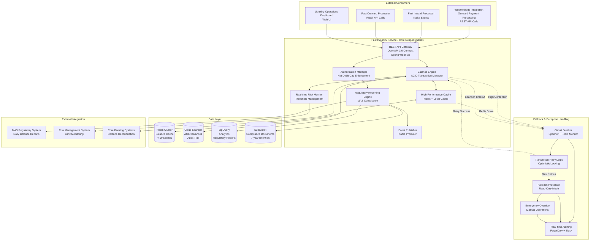
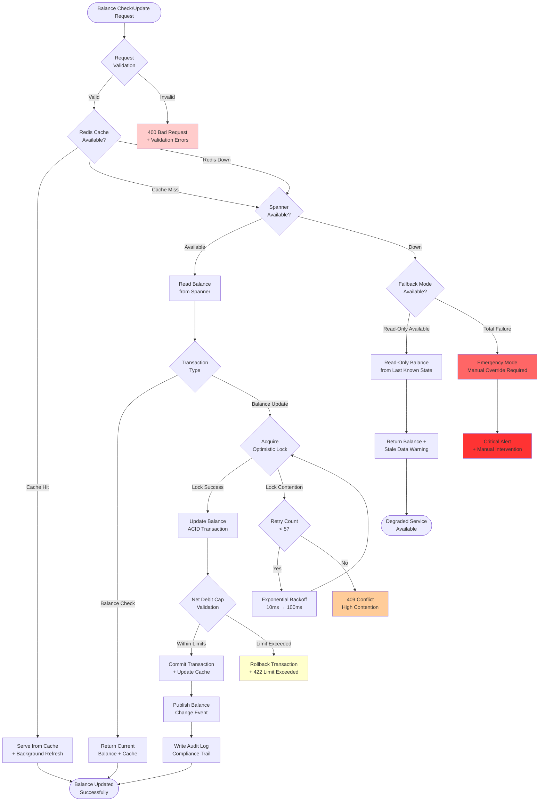
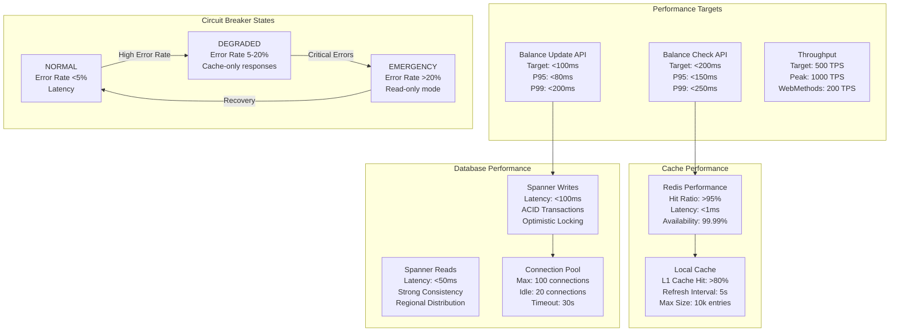

# Fast Liquidity Service - Technical Architecture & Exception Handling

## Service Responsibilities & Integration Architecture



## Exception Handling & Liquidity Continuity



## REST API Contracts for WebMethods Integration

### 1. Balance Check API (Most Frequent - WebMethods)

```yaml
openapi: 3.0.3
info:
  title: Fast Liquidity Service API
  version: 1.0.0
  description: Real-time liquidity management for WebMethods integration

paths:
  /api/v1/liquidity/balance/check:
    post:
      summary: Check participant liquidity balance
      description: High-frequency API for WebMethods outward payment processing
      operationId: checkLiquidityBalance
      requestBody:
        required: true
        content:
          application/json:
            schema:
              $ref: '#/components/schemas/BalanceCheckRequest'
            examples:
              webMethodsOutward:
                summary: WebMethods Outward Payment Check
                value:
                  participantId: "OCBCSGSG"
                  amount: 50000.00
                  currency: "SGD"
                  transactionType: "OUTWARD_CREDIT_TRANSFER"
                  reference: "WM-OUT-20241201-001"
                  priority: "HIGH"
                  timeoutMs: 150
                  webMethodsCorrelationId: "WM-CORR-20241201-001"
              inwardProcessorCheck:
                summary: Inward Processor Liquidity Check
                value:
                  participantId: "DBSSSGSG"
                  amount: 25000.00
                  currency: "SGD"
                  transactionType: "INWARD_DIRECT_DEBIT"
                  reference: "INW-DD-20241201-001"
                  priority: "NORMAL"
                  timeoutMs: 100
      responses:
        200:
          description: Balance check successful
          content:
            application/json:
              schema:
                $ref: '#/components/schemas/BalanceCheckResponse'
              examples:
                approved:
                  summary: Sufficient liquidity available
                  value:
                    approved: true
                    participantId: "OCBCSGSG"
                    requestedAmount: 50000.00
                    availableBalance: 2500000.00
                    reservedAmount: 150000.00
                    netDebitCapUsed: 75.5
                    netDebitCapLimit: 5000000.00
                    approvalReference: "LIQ-APP-20241201-001"
                    responseTimestamp: "2024-12-01T16:30:00.125Z"
                    processingTimeMs: 125
                rejected:
                  summary: Insufficient liquidity
                  value:
                    approved: false
                    participantId: "OCBCSGSG"
                    requestedAmount: 50000.00
                    availableBalance: 25000.00
                    rejectionReason: "INSUFFICIENT_BALANCE"
                    rejectionCode: "LIQ_001"
                    responseTimestamp: "2024-12-01T16:30:00.098Z"
                    processingTimeMs: 98
        400:
          description: Invalid request
          content:
            application/json:
              schema:
                $ref: '#/components/schemas/ErrorResponse'
        422:
          description: Business validation failed
          content:
            application/json:
              schema:
                $ref: '#/components/schemas/ErrorResponse'
        429:
          description: Rate limit exceeded
        503:
          description: Service temporarily unavailable

  /api/v1/liquidity/balance/update:
    post:
      summary: Update participant liquidity balance
      description: Atomic balance update with ACID guarantees
      operationId: updateLiquidityBalance
      requestBody:
        required: true
        content:
          application/json:
            schema:
              $ref: '#/components/schemas/BalanceUpdateRequest'
            examples:
              webMethodsSettlement:
                summary: WebMethods Settlement Update
                value:
                  participantId: "OCBCSGSG"
                  amount: -50000.00
                  currency: "SGD"
                  transactionType: "OUTWARD_SETTLEMENT"
                  reference: "WM-SETTLE-20241201-001"
                  authorizationReference: "LIQ-APP-20241201-001"
                  settlementTimestamp: "2024-12-01T16:35:00.000Z"
                  webMethodsTransactionId: "WM-TXN-20241201-001"
      responses:
        200:
          description: Balance updated successfully
          content:
            application/json:
              schema:
                $ref: '#/components/schemas/BalanceUpdateResponse'
              examples:
                success:
                  summary: Successful balance update
                  value:
                    success: true
                    participantId: "OCBCSGSG"
                    previousBalance: 2500000.00
                    newBalance: 2450000.00
                    transactionAmount: -50000.00
                    updateReference: "LIQ-UPD-20241201-001"
                    updateTimestamp: "2024-12-01T16:35:00.234Z"
                    processingTimeMs: 89
        409:
          description: Optimistic lock conflict - retry required
        422:
          description: Net debit cap exceeded
          content:
            application/json:
              schema:
                $ref: '#/components/schemas/ErrorResponse'
              example:
                error: "NET_DEBIT_CAP_EXCEEDED"
                message: "Transaction would exceed net debit cap limit"
                participantId: "OCBCSGSG"
                currentCapUsage: 95.5
                capLimit: 5000000.00
                requestedAmount: 500000.00

  /api/v1/liquidity/balance/{participantId}:
    get:
      summary: Get current participant balance
      description: Real-time balance inquiry
      parameters:
        - name: participantId
          in: path
          required: true
          schema:
            type: string
            pattern: '^[A-Z]{8}$'
          example: "OCBCSGSG"
        - name: includeReserved
          in: query
          schema:
            type: boolean
            default: false
          description: Include reserved amounts in response
      responses:
        200:
          description: Current balance information
          content:
            application/json:
              schema:
                $ref: '#/components/schemas/ParticipantBalanceResponse'
              example:
                participantId: "OCBCSGSG"
                availableBalance: 2450000.00
                reservedBalance: 125000.00
                totalBalance: 2575000.00
                netDebitCapUsed: 73.2
                netDebitCapLimit: 5000000.00
                lastUpdateTimestamp: "2024-12-01T16:35:00.234Z"
                status: "ACTIVE"

components:
  schemas:
    BalanceCheckRequest:
      type: object
      required:
        - participantId
        - amount
        - currency
        - transactionType
        - reference
      properties:
        participantId:
          type: string
          pattern: '^[A-Z]{8}$'
          description: BIC code of the participant
        amount:
          type: number
          minimum: 0.01
          maximum: 999999999.99
          description: Amount to check in minor currency units
        currency:
          type: string
          enum: [SGD, USD, EUR, GBP, JPY]
          description: ISO 4217 currency code
        transactionType:
          type: string
          enum: 
            - OUTWARD_CREDIT_TRANSFER
            - INWARD_CREDIT_TRANSFER
            - OUTWARD_DIRECT_DEBIT
            - INWARD_DIRECT_DEBIT
            - SETTLEMENT
        reference:
          type: string
          maxLength: 35
          description: Unique transaction reference
        priority:
          type: string
          enum: [HIGH, NORMAL, LOW]
          default: NORMAL
        timeoutMs:
          type: integer
          minimum: 50
          maximum: 500
          default: 200
          description: Maximum processing time in milliseconds
        webMethodsCorrelationId:
          type: string
          description: WebMethods correlation ID for tracing
        
    BalanceCheckResponse:
      type: object
      required:
        - approved
        - participantId
        - requestedAmount
        - responseTimestamp
        - processingTimeMs
      properties:
        approved:
          type: boolean
          description: Whether the liquidity check passed
        participantId:
          type: string
        requestedAmount:
          type: number
        availableBalance:
          type: number
          description: Current available balance
        reservedAmount:
          type: number
          description: Currently reserved amounts
        netDebitCapUsed:
          type: number
          description: Percentage of net debit cap used
        netDebitCapLimit:
          type: number
          description: Total net debit cap limit
        approvalReference:
          type: string
          description: Reference for approved checks
        rejectionReason:
          type: string
          enum: 
            - INSUFFICIENT_BALANCE
            - NET_DEBIT_CAP_EXCEEDED
            - PARTICIPANT_SUSPENDED
            - SYSTEM_MAINTENANCE
        rejectionCode:
          type: string
          description: Machine-readable rejection code
        responseTimestamp:
          type: string
          format: date-time
        processingTimeMs:
          type: integer
          description: Actual processing time
```

### 2. WebMethods Integration Patterns

**WebMethods Outward Payment Flow:**
```xml
<!-- WebMethods Service Call -->
<soapenv:Envelope xmlns:soapenv="http://schemas.xmlsoap.org/soap/envelope/">
  <soapenv:Header>
    <wm:CorrelationID>WM-CORR-20241201-001</wm:CorrelationID>
    <wm:Timeout>150</wm:Timeout>
  </soapenv:Header>
  <soapenv:Body>
    <liq:BalanceCheckRequest>
      <participantId>OCBCSGSG</participantId>
      <amount>50000.00</amount>
      <currency>SGD</currency>
      <transactionType>OUTWARD_CREDIT_TRANSFER</transactionType>
      <reference>WM-OUT-20241201-001</reference>
      <priority>HIGH</priority>
      <webMethodsCorrelationId>WM-CORR-20241201-001</webMethodsCorrelationId>
    </liq:BalanceCheckRequest>
  </soapenv:Body>
</soapenv:Envelope>
```

**REST API Response for WebMethods:**
```json
{
  "approved": true,
  "participantId": "OCBCSGSG",
  "requestedAmount": 50000.00,
  "availableBalance": 2500000.00,
  "reservedAmount": 150000.00,
  "netDebitCapUsed": 75.5,
  "netDebitCapLimit": 5000000.00,
  "approvalReference": "LIQ-APP-20241201-001",
  "responseTimestamp": "2024-12-01T16:30:00.125Z",
  "processingTimeMs": 125,
  "webMethodsCorrelationId": "WM-CORR-20241201-001"
}
```

### 3. Kafka Event Publishing

**Balance Change Event:**
```json
{
  "eventType": "BALANCE_UPDATED",
  "eventId": "EVT-20241201-001",
  "timestamp": "2024-12-01T16:35:00.234Z",
  "participantId": "OCBCSGSG",
  "balanceChange": {
    "previousBalance": 2500000.00,
    "newBalance": 2450000.00,
    "changeAmount": -50000.00,
    "transactionType": "OUTWARD_SETTLEMENT",
    "reference": "WM-SETTLE-20241201-001"
  },
  "netDebitCapInfo": {
    "previousUsagePercent": 78.2,
    "newUsagePercent": 73.2,
    "limitAmount": 5000000.00
  },
  "metadata": {
    "sourceSystem": "FAST_LIQUIDITY_SERVICE",
    "webMethodsCorrelationId": "WM-CORR-20241201-001",
    "processingTimeMs": 89
  }
}
```

## Performance Monitoring & SLA Management



## Technology Stack & Configuration

```yaml
Application Configuration:
  spring:
    application:
      name: fast-liquidity-service
    webflux:
      # Enable virtual threads for reactive processing
      virtual-threads: true
    cloud:
      gcp:
        spanner:
          instance-id: fast-payment-instance
          database: liquidity_db
          pool:
            max-sessions: 100
            min-sessions: 25
            max-idle-sessions: 50
    data:
      redis:
        cluster:
          nodes: 
            - redis-node-1:6379
            - redis-node-2:6379
            - redis-node-3:6379
        timeout: 1000ms
        lettuce:
          pool:
            max-active: 20
            max-idle: 10
            min-idle: 5

Security Configuration:
  spring:
    security:
      oauth2:
        resourceserver:
          jwt:
            issuer-uri: https://auth.anz.com.sg/oauth2
        
Rate Limiting:
  bucket4j:
    filters:
      - id: webmethods-rate-limit
        url: "/api/v1/liquidity/.*"
        rate-limits:
          - bandwidths:
              - capacity: 1000
                time: 1
                unit: minutes
                refill-speed: interval
        cache-name: rate-limit-cache

Monitoring:
  management:
    endpoints:
      web:
        exposure:
          include: health,metrics,prometheus,liquidity
    endpoint:
      health:
        show-details: always
    metrics:
      tags:
        service: fast-liquidity-service
        version: 1.0.0
      export:
        prometheus:
          enabled: true

JVM Configuration:
  memory: "-Xms4g -Xmx8g"
  gc: "-XX:+UseZGC -XX:+UnlockExperimentalVMOptions"
  virtual-threads: "--enable-preview -XX:+UseVirtualThreads"
  monitoring: "-XX:+FlightRecorder -XX:StartFlightRecording=duration=0s"
```