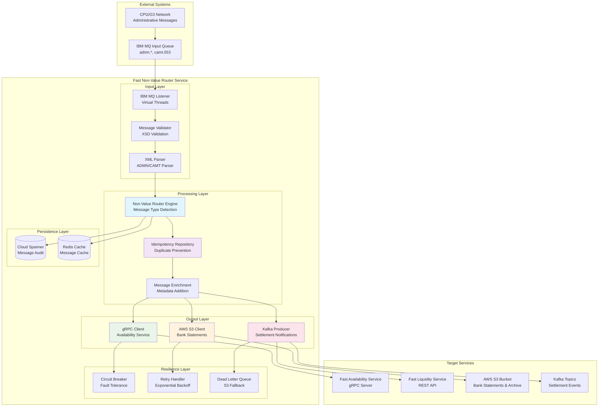
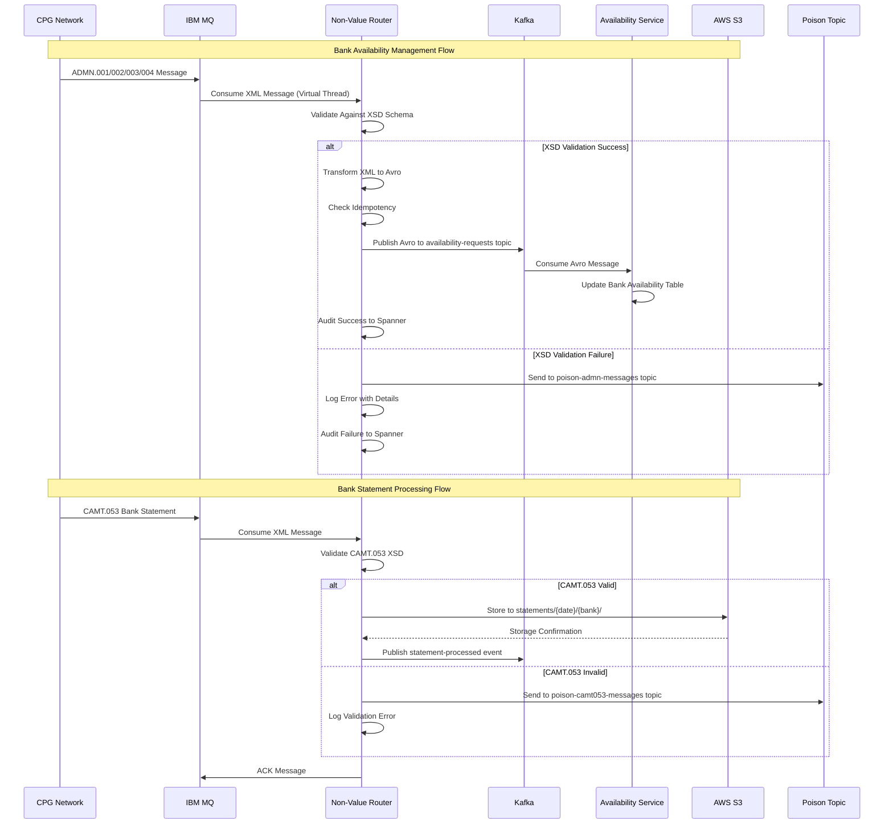

# FAST Non-Value Router Service - Technical Implementation Diagrams

## Service Overview

The **Fast Non-Value Router Service** handles all administrative and non-value payment messages within the APEAFAST-SG ClearPath Gateway system. This service processes ADMN (administrative) messages, bank statements (CAMT.053), settlement notifications, and other operational messages that do not involve actual payment values.

## Service Architecture Diagram



## Message Processing Flow Diagram



## Message Type Routing Logic

```mermaid
flowchart TD
    START([Message Received]) --> PARSE[Parse Message Type]
    
    PARSE --> ADMN_001{ADMN.001<br/>Sign-On Request}
    PARSE --> ADMN_002{ADMN.002<br/>Sign-On Response}
    PARSE --> ADMN_003{ADMN.003<br/>Sign-Off Request}
    PARSE --> ADMN_004{ADMN.004<br/>Sign-Off Response}
    PARSE --> CAMT_053{CAMT.053<br/>Bank Statement}
    PARSE --> SETTLEMENT{Settlement<br/>Notification - Future}
    
    ADMN_001 --> XSD_VALIDATE[XSD Schema Validation]
    ADMN_002 --> XSD_VALIDATE
    ADMN_003 --> XSD_VALIDATE
    ADMN_004 --> XSD_VALIDATE
    
    XSD_VALIDATE --> VALID{Validation<br/>Success?}
    
    VALID -->|Yes| XML_TO_AVRO[Transform XML to Avro]
    VALID -->|No| POISON_ADMN[Send to poison-admn-messages<br/>Topic]
    
    XML_TO_AVRO --> IDEMPOTENCY[Check Idempotency]
    IDEMPOTENCY --> KAFKA_AVRO[Publish Avro to<br/>availability-requests Topic]
    
    CAMT_053 --> CAMT_VALIDATE[CAMT.053 XSD Validation]
    CAMT_VALIDATE --> CAMT_VALID{Validation<br/>Success?}
    
    CAMT_VALID -->|Yes| S3_STORE[Store to S3 Bucket<br/>statements/{date}/{bank}/]
    CAMT_VALID -->|No| POISON_CAMT[Send to poison-camt053-messages<br/>Topic]
    
    SETTLEMENT --> FUTURE[Future Implementation<br/>Settlement Processing]
    
    KAFKA_AVRO --> AUDIT_SUCCESS[Audit Success to Spanner]
    S3_STORE --> EVENT_STATEMENT[Publish statement-processed Event]
    POISON_ADMN --> AUDIT_ERROR[Audit Error to Spanner]
    POISON_CAMT --> AUDIT_ERROR
    
    AUDIT_SUCCESS --> END([Processing Complete])
    EVENT_STATEMENT --> END
    AUDIT_ERROR --> END
    
    style XSD_VALIDATE fill:#e1f5fe
    style XML_TO_AVRO fill:#e8f5e8
    style KAFKA_AVRO fill:#e8f5e8
    style S3_STORE fill:#fff3e0
    style POISON_ADMN fill:#ffebee
    style POISON_CAMT fill:#ffebee
    style FUTURE fill:#f3e5f5
```

## Database Schema Design

### Cloud Spanner Tables

#### 1. NonValueMessageAudit Table
```sql
CREATE TABLE NonValueMessageAudit (
    message_id STRING(50) NOT NULL,
    message_type STRING(20) NOT NULL,
    received_timestamp TIMESTAMP NOT NULL,
    processed_timestamp TIMESTAMP,
    source_system STRING(50),
    target_service STRING(50),
    processing_status STRING(20),
    correlation_id STRING(50),
    content_hash STRING(64),
    message_size_bytes INT64,
    processing_duration_ms INT64,
    retry_count INT64 DEFAULT 0,
    error_details STRING(MAX),
    created_at TIMESTAMP NOT NULL DEFAULT (CURRENT_TIMESTAMP()),
    updated_at TIMESTAMP NOT NULL DEFAULT (CURRENT_TIMESTAMP())
) PRIMARY KEY (message_id, received_timestamp DESC);

-- Partitioning by received_timestamp for performance
ALTER TABLE NonValueMessageAudit ADD ROW DELETION POLICY (OLDER_THAN(received_timestamp, INTERVAL 90 DAY));
```

#### 2. BankStatusHistory Table
```sql
CREATE TABLE BankStatusHistory (
    bank_code STRING(20) NOT NULL,
    status_change_timestamp TIMESTAMP NOT NULL,
    previous_status STRING(20),
    new_status STRING(20) NOT NULL,
    change_reason STRING(50),
    initiated_by STRING(50),
    message_id STRING(50),
    effective_from TIMESTAMP NOT NULL,
    effective_to TIMESTAMP,
    created_at TIMESTAMP NOT NULL DEFAULT (CURRENT_TIMESTAMP())
) PRIMARY KEY (bank_code, status_change_timestamp DESC);
```

#### 3. IdempotencyRepository Table
```sql
CREATE TABLE NonValueIdempotency (
    message_key STRING(100) NOT NULL,
    message_id STRING(50) NOT NULL,
    message_type STRING(20) NOT NULL,
    processed_timestamp TIMESTAMP NOT NULL,
    response_cache JSON,
    created_at TIMESTAMP NOT NULL DEFAULT (CURRENT_TIMESTAMP())
) PRIMARY KEY (message_key);

-- TTL for cleanup (24 hours)
ALTER TABLE NonValueIdempotency ADD ROW DELETION POLICY (OLDER_THAN(created_at, INTERVAL 1 DAY));
```

### Redis Caching Strategy

```yaml
# Bank Status Cache
bank_status_cache:
  key_pattern: "bank:status:{bank_code}"
  ttl: 300  # 5 minutes
  data: |
    {
      "bankCode": "DBSSSGSG",
      "status": "AVAILABLE",
      "lastUpdate": "2024-02-17T10:30:00Z",
      "nextMaintenanceWindow": "2024-02-18T02:00:00Z"
    }

# Message Processing Cache
message_cache:
  key_pattern: "nonval:msg:{message_id}"
  ttl: 3600  # 1 hour
  data: |
    {
      "messageId": "ADM001234567",
      "messageType": "ADMN.001",
      "status": "PROCESSED",
      "targetService": "availability-service",
      "processedAt": "2024-02-17T10:30:00Z"
    }
```

## Performance Requirements & SLA Targets

### Processing Performance Targets
| Metric | Target | Monitoring |
|--------|--------|------------|
| **Message Processing Latency** | < 2 seconds | 95th percentile |
| **Throughput** | 1,000 messages/minute | Average sustained |
| **Availability** | 99.9% uptime | Monthly |
| **gRPC Call Latency** | < 500ms | 95th percentile |
| **S3 Upload Latency** | < 3 seconds | 95th percentile |
| **Memory Usage** | < 2GB heap | Peak usage |

### SLA Breakdown (2-second budget)
```
Total Budget: 2.0 seconds
├── MQ Message Consumption: 50ms
├── XSD Validation: 100ms  
├── XML Parsing: 150ms
├── Idempotency Check: 50ms
├── Message Routing Logic: 100ms
├── Target Service Call: 500ms (gRPC) / 2000ms (S3)
├── Kafka Event Publishing: 200ms
├── Spanner Audit: 300ms
└── Response/ACK: 50ms
```

## Resilience Patterns & Error Handling

### Circuit Breaker Configuration
```yaml
circuit_breakers:
  availability_service:
    failure_threshold: 5
    recovery_timeout: 30s
    timeout: 2s
    
  liquidity_service:
    failure_threshold: 3
    recovery_timeout: 60s
    timeout: 5s
    
  s3_service:
    failure_threshold: 10
    recovery_timeout: 120s
    timeout: 10s
```

### Retry Strategy
```yaml
retry_policies:
  grpc_calls:
    max_attempts: 3
    initial_interval: 1s
    max_interval: 30s
    multiplier: 2.0
    
  s3_uploads:
    max_attempts: 5
    initial_interval: 2s
    max_interval: 60s
    multiplier: 1.5
    
  kafka_publishing:
    max_attempts: 3
    initial_interval: 500ms
    max_interval: 10s
    multiplier: 2.0
```

### Multi-Tier Fallback Strategy
```
Primary: Target Service (gRPC/REST/S3)
    ↓ (on failure)
Fallback-1: Kafka Dead Letter Topic
    ↓ (on failure)  
Fallback-2: Cloud Spanner Error Table
    ↓ (on failure)
Fallback-3: AWS S3 Emergency Bucket
```

## Chaos Engineering Test Scenarios

### Availability Service Resilience Tests
1. **Service Unavailability**: Test with availability service down
2. **Slow Response**: Simulate 10-second gRPC response times
3. **Partial Failures**: Random 50% failure rate for 10 minutes
4. **Network Partitioning**: Block gRPC traffic for 5 minutes

### S3 Storage Resilience Tests
1. **S3 Service Degradation**: Simulate 503 Service Unavailable
2. **Upload Timeouts**: Force 30-second upload delays
3. **Bucket Access Denied**: Test permission failures
4. **Large File Uploads**: Test with 100MB bank statement files

### IBM MQ Resilience Tests
1. **Queue Manager Failure**: Test MQ connection loss
2. **Message Poison**: Inject malformed XML messages
3. **Queue Full**: Test queue capacity limits
4. **Connection Pool Exhaustion**: Simulate connection leaks

## Security & Compliance

### Message Encryption
- **In-Transit**: TLS 1.3 for all gRPC/REST calls
- **At-Rest**: AES-256 encryption for S3 storage
- **Message Signing**: Digital signatures for ADMN messages

### Access Control
```yaml
rbac_policies:
  service_account: "fast-nonval-router-sa"
  permissions:
    - "spanner.databases.read"
    - "spanner.databases.write"
    - "s3.buckets.put"
    - "kafka.topics.produce"
    - "mq.queues.consume"
```

### Audit Requirements
- All ADMN messages logged with full traceability
- Bank status changes tracked with approval workflow
- Settlement notifications monitored for suspicious patterns
- Compliance reporting for regulatory authorities

## Monitoring & Observability

### Key Metrics
```yaml
business_metrics:
  - name: "admn_messages_processed_total"
    type: "counter"
    labels: ["message_type", "bank_code", "status"]
    
  - name: "bank_status_changes_total"
    type: "counter"
    labels: ["bank_code", "old_status", "new_status"]
    
  - name: "statement_files_processed_total"
    type: "counter"
    labels: ["bank_code", "file_size_category"]

technical_metrics:
  - name: "message_processing_duration_seconds"
    type: "histogram"
    labels: ["message_type", "target_service"]
    
  - name: "grpc_calls_duration_seconds"
    type: "histogram"
    labels: ["service", "method", "status"]
```

### Health Check Endpoints
```yaml
endpoints:
  - path: "/actuator/health"
    checks: ["mq", "spanner", "redis", "availability-service"]
    
  - path: "/actuator/metrics"
    metrics: ["jvm", "business", "technical"]
    
  - path: "/actuator/info"
    info: ["build", "git", "environment"]
```

## Operational UI Requirements

### Non-Value Message Dashboard
- **Real-time Processing Queue**: Current messages in processing
- **Bank Status Overview**: Live bank availability status grid
- **Statement Processing**: CAMT.053 file upload status
- **Message Replay**: Ability to reprocess failed messages
- **Settlement Tracking**: Settlement notification status

### Configuration Management
- **Message Routing Rules**: Configure routing logic per message type
- **Bank Maintenance Windows**: Schedule planned downtime
- **Circuit Breaker Thresholds**: Adjust failure tolerances
- **Retry Policies**: Modify retry configurations
- **S3 Bucket Settings**: Manage storage policies

## Integration Protocols & APIs

### Kafka Topics & Avro Schemas

#### Availability Requests Topic
```yaml
topic: availability-requests
key: bank_code (string)
value: Avro schema below
partitions: 6
replication: 3
```

#### Avro Schema for ADMN Messages
**Location:** `services/fast-nonval-router/src/main/resources/avro/admn-message.avsc`

```json
{
  "type": "record",
  "name": "AdmnMessage",
  "namespace": "com.anz.fastpayment.nonval.avro",
  "fields": [
    {"name": "messageId", "type": "string"},
    {"name": "messageType", "type": {"type": "enum", "name": "AdmnType", "symbols": ["ADMN_001", "ADMN_002", "ADMN_003", "ADMN_004"]}},
    {"name": "creationDateTime", "type": {"type": "long", "logicalType": "timestamp-millis"}},
    {"name": "instructingAgentBIC", "type": "string"},
    {"name": "instructedAgentBIC", "type": "string"},
    {"name": "instructionId", "type": "string"},
    {"name": "originalInstructionId", "type": ["null", "string"], "default": null},
    {"name": "status", "type": ["null", {"type": "enum", "name": "StatusType", "symbols": ["ACTC", "RJCT"]}], "default": null},
    {"name": "statusReason", "type": ["null", "string"], "default": null},
    {"name": "clearingSystemMemberId", "type": "string"},
    {"name": "originalXmlContent", "type": "string"},
    {"name": "processingMetadata", "type": {
      "type": "record",
      "name": "ProcessingMetadata", 
      "fields": [
        {"name": "sourceQueue", "type": "string"},
        {"name": "receivedTimestamp", "type": {"type": "long", "logicalType": "timestamp-millis"}},
        {"name": "correlationId", "type": "string"}
      ]
    }}
  ]
}
```

#### Poison Topic Schemas  
**Location:** `services/fast-nonval-router/src/main/resources/avro/poison-message.avsc`

```json
{
  "poison_message": {
    "messageId": "uuid",
    "originalMessage": "base64_encoded_xml",
    "errorType": "XSD_VALIDATION_FAILURE",
    "errorDetails": "detailed_error_description",
    "timestamp": "2024-02-17T10:30:00Z",
    "sourceQueue": "CPG.NONVAL.ADMN.IN",
    "attemptCount": 1
  }
}
```

## Conclusion

The Fast Non-Value Router Service provides critical operational message handling for the APEAFAST-SG payment system, ensuring reliable processing of administrative messages, bank statements, and settlement notifications with enterprise-grade resilience and monitoring capabilities.