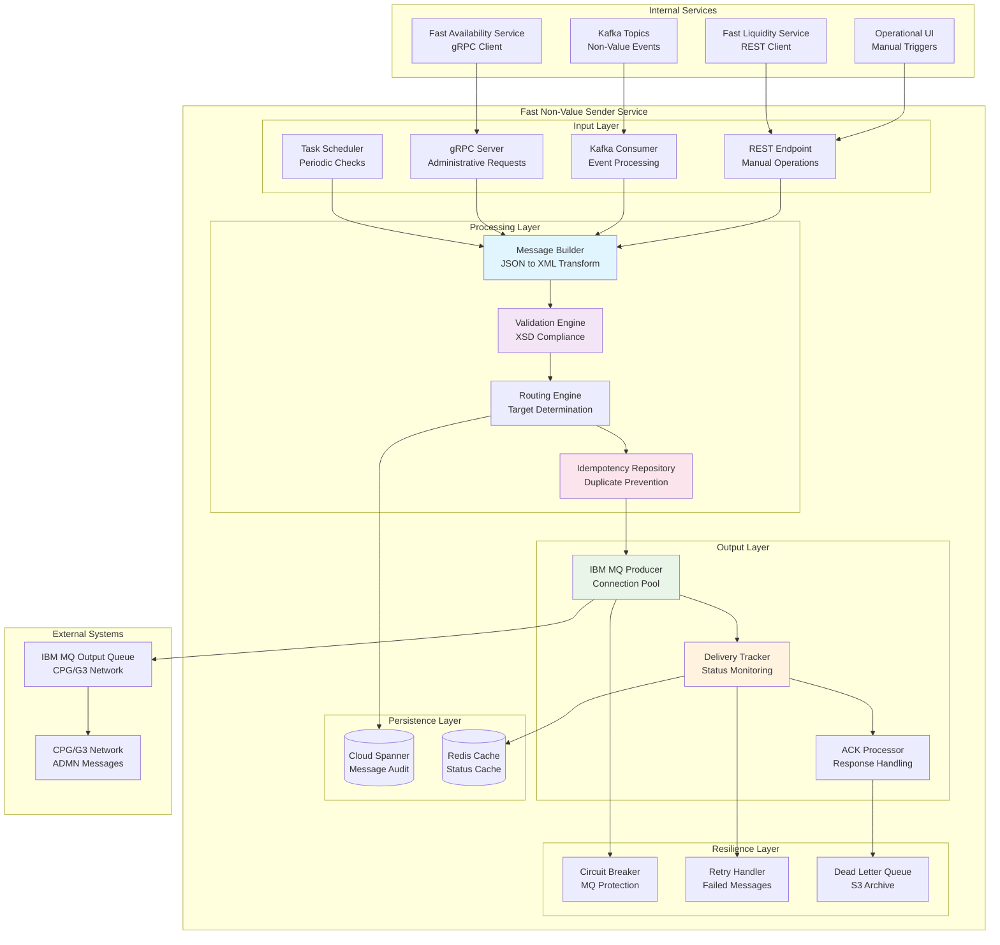
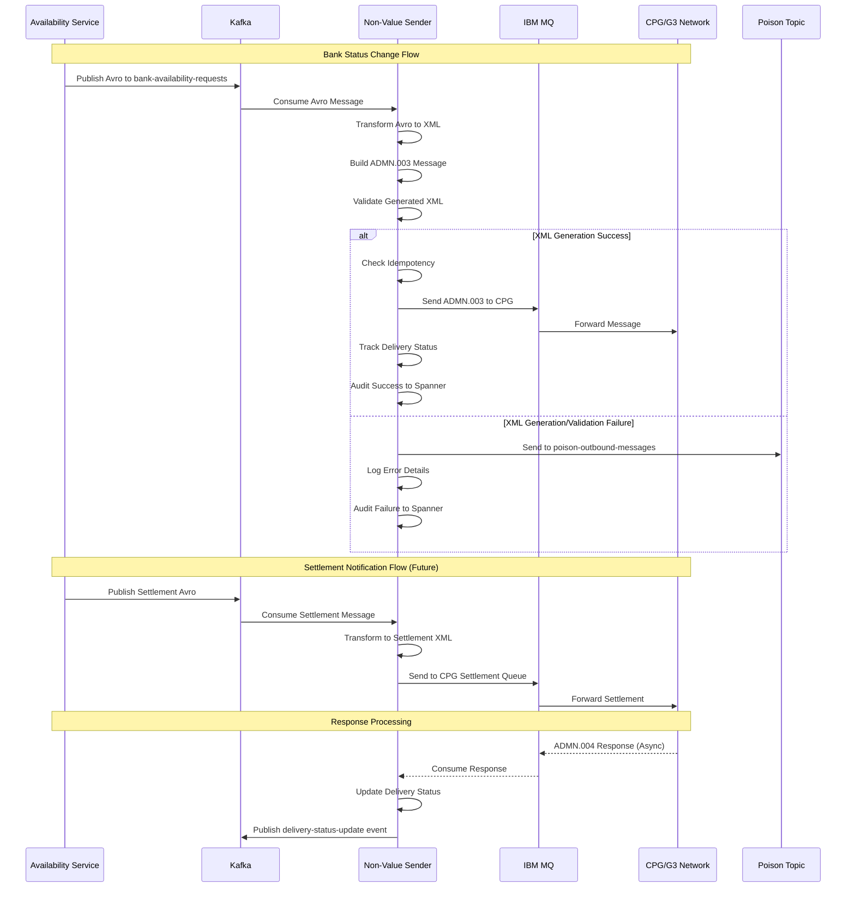
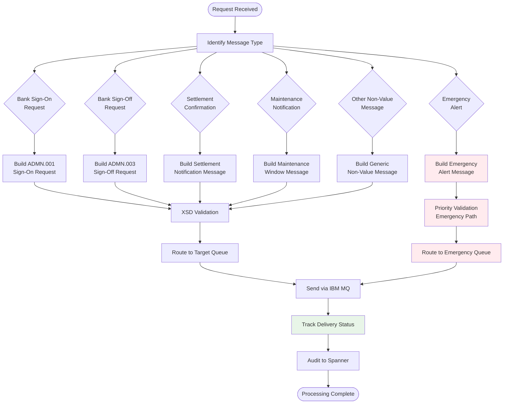

# FAST Non-Value Sender Service - Technical Implementation Diagrams

## Service Overview

The **Fast Non-Value Sender Service** handles outbound transmission of all administrative and non-value messages from the APEAFAST-SG ClearPath Gateway system to the CPG/G3 network. This service processes bank availability notifications, administrative messages, settlement confirmations, and other operational messages that do not involve actual payment values.

## Service Architecture Diagram



## Message Processing Flow Diagram



## Message Type Processing Logic



## Database Schema Design

### Cloud Spanner Tables

#### 1. NonValueOutboundAudit Table
```sql
CREATE TABLE NonValueOutboundAudit (
    message_id STRING(50) NOT NULL,
    correlation_id STRING(50),
    message_type STRING(20) NOT NULL,
    target_queue STRING(100),
    created_timestamp TIMESTAMP NOT NULL,
    sent_timestamp TIMESTAMP,
    acknowledged_timestamp TIMESTAMP,
    delivery_status STRING(20) NOT NULL,
    retry_count INT64 DEFAULT 0,
    priority_level STRING(10),
    source_service STRING(50),
    message_size_bytes INT64,
    delivery_duration_ms INT64,
    error_details STRING(MAX),
    created_at TIMESTAMP NOT NULL DEFAULT (CURRENT_TIMESTAMP()),
    updated_at TIMESTAMP NOT NULL DEFAULT (CURRENT_TIMESTAMP())
) PRIMARY KEY (message_id, created_timestamp DESC);

-- Partitioning and TTL
ALTER TABLE NonValueOutboundAudit ADD ROW DELETION POLICY (OLDER_THAN(created_timestamp, INTERVAL 90 DAY));
```

#### 2. DeliveryTracker Table
```sql
CREATE TABLE DeliveryTracker (
    message_id STRING(50) NOT NULL,
    queue_name STRING(100) NOT NULL,
    delivery_attempts INT64 DEFAULT 0,
    last_attempt_timestamp TIMESTAMP,
    next_retry_timestamp TIMESTAMP,
    delivery_status STRING(20) NOT NULL,
    failure_reason STRING(MAX),
    max_retry_count INT64 DEFAULT 3,
    created_at TIMESTAMP NOT NULL DEFAULT (CURRENT_TIMESTAMP()),
    updated_at TIMESTAMP NOT NULL DEFAULT (CURRENT_TIMESTAMP())
) PRIMARY KEY (message_id);

-- TTL for completed deliveries
ALTER TABLE DeliveryTracker ADD ROW DELETION POLICY (OLDER_THAN(updated_at, INTERVAL 7 DAY));
```

#### 3. MessageTemplates Table
```sql
CREATE TABLE MessageTemplates (
    template_id STRING(50) NOT NULL,
    message_type STRING(20) NOT NULL,
    template_version STRING(10) NOT NULL,
    xsd_schema STRING(MAX),
    xml_template STRING(MAX),
    field_mappings JSON,
    validation_rules JSON,
    is_active BOOL NOT NULL DEFAULT TRUE,
    created_at TIMESTAMP NOT NULL DEFAULT (CURRENT_TIMESTAMP()),
    updated_at TIMESTAMP NOT NULL DEFAULT (CURRENT_TIMESTAMP())
) PRIMARY KEY (template_id);
```

### Redis Caching Strategy

```yaml
# Delivery Status Cache
delivery_status_cache:
  key_pattern: "delivery:status:{message_id}"
  ttl: 7200  # 2 hours
  data: |
    {
      "messageId": "NVS001234567",
      "status": "DELIVERED",
      "sentAt": "2024-02-17T10:30:00Z",
      "acknowledgedAt": "2024-02-17T10:30:15Z",
      "deliveryDuration": 15000
    }

# Message Template Cache
template_cache:
  key_pattern: "template:{message_type}:{version}"
  ttl: 86400  # 24 hours
  data: |
    {
      "templateId": "ADMN_001_V1",
      "messageType": "ADMN.001",
      "xmlTemplate": "<admn:SignOnRequest>...",
      "fieldMappings": {...},
      "validationRules": {...}
    }
```

## Performance Requirements & SLA Targets

### Processing Performance Targets
| Metric | Target | Monitoring |
|--------|--------|------------|
| **Message Build Latency** | < 500ms | 95th percentile |
| **MQ Delivery Latency** | < 2 seconds | 95th percentile |
| **Throughput** | 500 messages/minute | Average sustained |
| **Availability** | 99.95% uptime | Monthly |
| **Emergency Message SLA** | < 10 seconds | 100% compliance |
| **Memory Usage** | < 1.5GB heap | Peak usage |

### SLA Breakdown (2-second budget)
```
Total Budget: 2.0 seconds (Normal) / 10.0 seconds (Emergency)
├── Message Building: 200ms
├── XSD Validation: 100ms  
├── Idempotency Check: 50ms
├── Routing Logic: 50ms
├── MQ Connection Setup: 100ms
├── Message Transmission: 800ms
├── Delivery Confirmation: 200ms
├── Status Update: 100ms
├── Audit Logging: 200ms
└── Response Generation: 200ms
```

## Resilience Patterns & Error Handling

### Circuit Breaker Configuration
```yaml
circuit_breakers:
  ibm_mq:
    failure_threshold: 5
    recovery_timeout: 60s
    timeout: 5s
    
  emergency_queue:
    failure_threshold: 2
    recovery_timeout: 30s
    timeout: 3s
```

### Retry Strategy with Exponential Backoff
```yaml
retry_policies:
  normal_messages:
    max_attempts: 3
    initial_interval: 2s
    max_interval: 60s
    multiplier: 2.0
    
  emergency_messages:
    max_attempts: 5
    initial_interval: 1s
    max_interval: 30s
    multiplier: 1.5
    
  settlement_messages:
    max_attempts: 5
    initial_interval: 3s
    max_interval: 120s
    multiplier: 2.0
```

### Multi-Tier Fallback Strategy
```
Primary: IBM MQ Direct Send
    ↓ (on failure)
Fallback-1: IBM MQ Alternative Queue
    ↓ (on failure)  
Fallback-2: Kafka Dead Letter Topic
    ↓ (on failure)
Fallback-3: AWS S3 Emergency Archive
```

## Message Templates & Transformations

### ADMN.001 Sign-On Request Template
```xml
<?xml version="1.0" encoding="UTF-8"?>
<admn:SignOnRequest xmlns:admn="urn:iso:std:iso:20022:tech:xsd:admn.001.001.01">
    <MsgId>${messageId}</MsgId>
    <CreDtTm>${creationDateTime}</CreDtTm>
    <InstgAgt>
        <FinInstnId>
            <BICFI>${instructingAgentBIC}</BICFI>
        </FinInstnId>
    </InstgAgt>
    <InstdAgt>
        <FinInstnId>
            <BICFI>${instructedAgentBIC}</BICFI>
        </FinInstnId>
    </InstdAgt>
    <SgnOnInf>
        <SgnOnTp>${signOnType}</SgnOnTp>
        <EffctvDt>${effectiveDate}</EffctvDt>
        <Rsn>${reason}</Rsn>
    </SgnOnInf>
</admn:SignOnRequest>
```

### ADMN.003 Sign-Off Request Template
```xml
<?xml version="1.0" encoding="UTF-8"?>
<admn:SignOffRequest xmlns:admn="urn:iso:std:iso:20022:tech:xsd:admn.003.001.01">
    <MsgId>${messageId}</MsgId>
    <CreDtTm>${creationDateTime}</CreDtTm>
    <InstgAgt>
        <FinInstnId>
            <BICFI>${instructingAgentBIC}</BICFI>
        </FinInstnId>
    </InstgAgt>
    <InstdAgt>
        <FinInstnId>
            <BICFI>${instructedAgentBIC}</BICFI>
        </FinInstnId>
    </InstdAgt>
    <SgnOffInf>
        <SgnOffTp>${signOffType}</SgnOffTp>
        <EffctvDt>${effectiveDate}</EffctvDt>
        <Rsn>${reason}</Rsn>
        <AnticptdDwnTm>${anticipatedDownTime}</AnticptdDwnTm>
    </SgnOffInf>
</admn:SignOffRequest>
```

## Chaos Engineering Test Scenarios

### IBM MQ Resilience Tests
1. **Queue Manager Failure**: Test MQ connection loss during send
2. **Queue Full**: Test queue capacity limits and backpressure
3. **Slow Network**: Simulate 10-second network delays
4. **Connection Pool Exhaustion**: Test connection pool limits
5. **Message Size Limits**: Test with oversized messages

### Emergency Processing Tests
1. **Emergency Queue Failure**: Test fallback to normal queue
2. **High Priority Flooding**: Test with 1000 emergency messages
3. **Concurrent Emergency Messages**: Test parallel emergency processing
4. **Emergency Timeout**: Test emergency SLA breach scenarios

### Integration Resilience Tests
1. **Availability Service Failure**: Test gRPC client failures
2. **Liquidity Service Timeout**: Test REST client timeouts
3. **Kafka Consumer Lag**: Test event processing delays
4. **Spanner Write Failures**: Test audit logging failures

## Security & Compliance

### Message Security
- **Message Signing**: Digital signatures for all ADMN messages
- **Content Encryption**: AES-256 encryption for sensitive data
- **Transport Security**: TLS 1.3 for all MQ communications
- **Access Control**: Role-based access for administrative operations

### Audit & Compliance
```yaml
audit_requirements:
  - "All outbound administrative messages logged"
  - "Bank status changes tracked with approver identity"
  - "Emergency messages flagged for compliance review"
  - "Settlement confirmations archived for 7 years"
  - "Message delivery failures escalated within 5 minutes"
```

## Monitoring & Observability

### Key Metrics
```yaml
business_metrics:
  - name: "admn_messages_sent_total"
    type: "counter"
    labels: ["message_type", "target_bank", "status"]
    
  - name: "emergency_messages_total"
    type: "counter"
    labels: ["priority", "delivery_status"]
    
  - name: "settlement_confirmations_total"
    type: "counter"
    labels: ["settlement_type", "status"]

technical_metrics:
  - name: "message_delivery_duration_seconds"
    type: "histogram"
    labels: ["message_type", "queue_name"]
    
  - name: "mq_connection_pool_size"
    type: "gauge"
    labels: ["pool_name", "status"]
    
  - name: "delivery_retry_attempts_total"
    type: "counter"
    labels: ["message_type", "retry_reason"]
```

### Alert Rules
```yaml
alerts:
  - name: "EmergencyMessageDelay"
    condition: "emergency_message_delivery > 10s"
    severity: "critical"
    
  - name: "MQConnectionFailure"
    condition: "mq_connection_failures > 5"
    severity: "high"
    
  - name: "DeliveryFailureRate"
    condition: "delivery_failure_rate > 5%"
    severity: "medium"
```

## Avro Schema Location

**ADMN Message Schema:** `services/fast-nonval-sender/src/main/resources/avro/admn-message.avsc`  
*Shared schema for consuming Avro messages and transforming to XML for CPG/G3 delivery*

## Integration APIs

### gRPC Service Interface
```protobuf
service NonValueSender {
  rpc SendBankStatusMessage(BankStatusMessageRequest) returns (MessageResponse);
  rpc SendSettlementConfirmation(SettlementRequest) returns (MessageResponse);
  rpc SendEmergencyAlert(EmergencyAlertRequest) returns (MessageResponse);
  rpc GetDeliveryStatus(DeliveryStatusQuery) returns (DeliveryStatusResponse);
}

message BankStatusMessageRequest {
  string bank_code = 1;
  string status_type = 2;  // SIGN_ON, SIGN_OFF
  string reason = 3;
  google.protobuf.Timestamp effective_from = 4;
  google.protobuf.Timestamp effective_to = 5;
  string priority = 6;     // NORMAL, HIGH, EMERGENCY
}

message MessageResponse {
  string message_id = 1;
  string status = 2;
  string correlation_id = 3;
  google.protobuf.Timestamp sent_at = 4;
}
```

### REST API Endpoints
```yaml
endpoints:
  - path: "/api/v1/send/settlement"
    method: "POST"
    description: "Send settlement confirmation to CPG"
    
  - path: "/api/v1/send/emergency"
    method: "POST"
    description: "Send emergency alert message"
    
  - path: "/api/v1/delivery/status/{messageId}"
    method: "GET"
    description: "Get message delivery status"
    
  - path: "/api/v1/resend/{messageId}"
    method: "POST"
    description: "Retry failed message delivery"
```

## Operational UI Requirements

### Message Delivery Dashboard
- **Live Delivery Queue**: Current messages in transmission
- **Delivery Status Grid**: Success/failure rates by message type
- **Emergency Message Monitor**: Real-time emergency message tracking
- **Failed Message Manager**: Retry and investigate failed deliveries

### Administrative Controls
- **Emergency Message Trigger**: Manual emergency alert sending
- **Bank Status Override**: Manual bank status change messages
- **Message Templates**: Configure and update message templates
- **Queue Management**: Monitor and manage MQ queues
- **Delivery Analytics**: Historical delivery performance reports

## Conclusion

The Fast Non-Value Sender Service ensures reliable and timely delivery of administrative and operational messages to the CPG/G3 network, providing critical infrastructure for bank status management, settlement confirmations, and emergency communications with enterprise-grade resilience and monitoring.