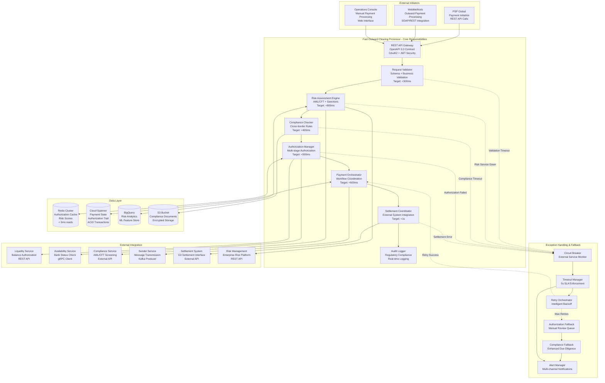
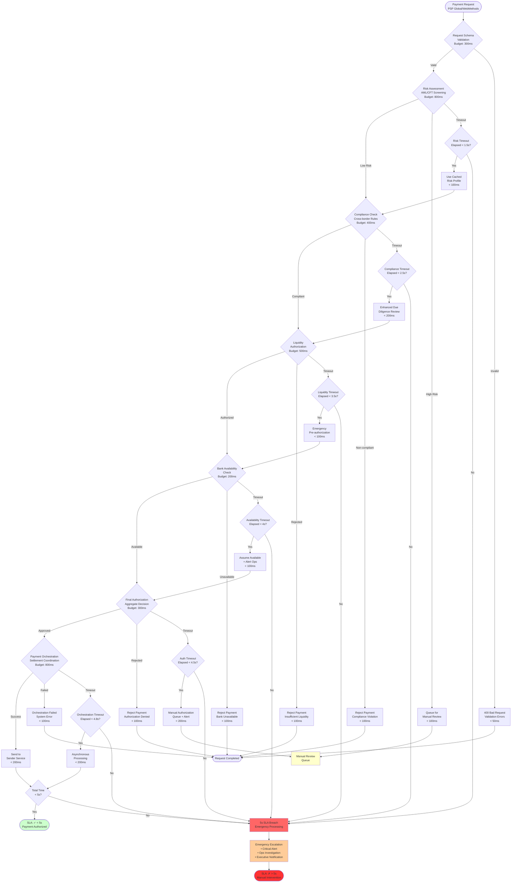
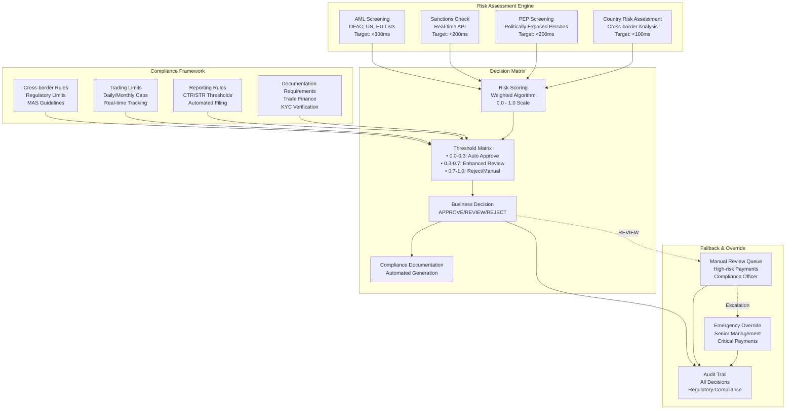

# Fast Outward Clearing Processor - Technical Architecture & Exception Handling

## Service Responsibilities & Authorization Architecture



## Multi-stage Authorization Flow & Exception Handling



## REST API Contracts for PSP Global & WebMethods

### 1. Payment Initiation API

```yaml
openapi: 3.0.3
info:
  title: Fast Outward Clearing Processor API
  version: 1.0.0
  description: Outward payment authorization and processing for PSP Global and WebMethods

paths:
  /api/v1/outward-payments/initiate:
    post:
      summary: Initiate outward payment
      description: 5-second SLA for complete authorization process
      operationId: initiateOutwardPayment
      security:
        - OAuth2: [payment:initiate]
        - ApiKey: []
      requestBody:
        required: true
        content:
          application/json:
            schema:
              $ref: '#/components/schemas/OutwardPaymentRequest'
            examples:
              pspGlobalRequest:
                summary: PSP Global Credit Transfer
                value:
                  requestId: "PSP-OUT-20241201-001"
                  paymentType: "CREDIT_TRANSFER"
                  amount: 250000.00
                  currency: "SGD"
                  urgency: "HIGH"
                  originator:
                    name: "ANZ Bank Singapore"
                    account: "SG12ANZB0000000012345678"
                    bic: "ANZBSGSG"
                  beneficiary:
                    name: "Global Trading Corp"
                    account: "SG99OCBC0000000087654321"
                    bic: "OCBCSGSG"
                    country: "SG"
                  remittanceInfo: "Trade finance settlement TF-2024-001"
                  regulatoryInfo:
                    purposeCode: "TRADE"
                    reportingFlag: true
                  pspGlobalCorrelationId: "PSP-CORR-20241201-001"
              webMethodsRequest:
                summary: WebMethods Cross-border Payment
                value:
                  requestId: "WM-OUT-20241201-001"
                  paymentType: "CROSS_BORDER_TRANSFER"
                  amount: 100000.00
                  currency: "USD"
                  urgency: "NORMAL"
                  originator:
                    name: "Singapore Export Co"
                    account: "SG44DBSS0000000098765432"
                    bic: "DBSSSGSG"
                  beneficiary:
                    name: "US Import LLC"
                    account: "US12CITI0000000013579246"
                    bic: "CITIUS33"
                    country: "US"
                  exchangeRate: 1.3456
                  remittanceInfo: "Export payment INV-EXP-2024-001"
                  regulatoryInfo:
                    purposeCode: "GOODS"
                    reportingFlag: true
                    crossBorderInfo:
                      sourceCountry: "SG"
                      destinationCountry: "US"
                      tradeReference: "TRADE-2024-001"
                  webMethodsTransactionId: "WM-TXN-20241201-001"
      responses:
        200:
          description: Payment authorized and processing initiated
          content:
            application/json:
              schema:
                $ref: '#/components/schemas/OutwardPaymentResponse'
              examples:
                authorized:
                  summary: Payment Authorized
                  value:
                    paymentId: "OUT-PAY-20241201-001"
                    requestId: "PSP-OUT-20241201-001"
                    status: "AUTHORIZED"
                    authorizationReference: "AUTH-20241201-001"
                    authorizationTimestamp: "2024-12-01T16:30:00.234Z"
                    estimatedSettlementTime: "2024-12-01T16:32:00.000Z"
                    processingTimeMs: 3456
                    riskScore: 0.15
                    riskLevel: "LOW"
                    liquidityStatus: "APPROVED"
                    complianceStatus: "CLEARED"
                    trackingInfo:
                      correlationId: "CORR-OUT-20241201-001"
                      traceId: "TRACE-OUT-20241201-001"
                rejected:
                  summary: Payment Rejected
                  value:
                    paymentId: "OUT-PAY-20241201-002"
                    requestId: "PSP-OUT-20241201-002"
                    status: "REJECTED"
                    rejectionReason: "HIGH_RISK_DETECTED"
                    rejectionCode: "RISK_001"
                    rejectionDetails: "Sanctions screening flagged beneficiary"
                    processingTimeMs: 1234
                    riskScore: 0.89
                    riskLevel: "HIGH"
                    reviewRequired: true
                    reviewReference: "REV-20241201-001"
        400:
          description: Invalid request
          content:
            application/json:
              schema:
                $ref: '#/components/schemas/ErrorResponse'
        401:
          description: Unauthorized
        403:
          description: Forbidden - insufficient permissions
        422:
          description: Business validation failed
          content:
            application/json:
              schema:
                $ref: '#/components/schemas/ErrorResponse'
              examples:
                liquidityRejection:
                  summary: Insufficient Liquidity
                  value:
                    error: "INSUFFICIENT_LIQUIDITY"
                    message: "Payment amount exceeds available liquidity"
                    details:
                      requestedAmount: 1000000.00
                      availableBalance: 750000.00
                      participantId: "ANZBSGSG"
                complianceRejection:
                  summary: Compliance Violation
                  value:
                    error: "COMPLIANCE_VIOLATION"
                    message: "Cross-border payment exceeds regulatory limit"
                    details:
                      violationType: "DAILY_LIMIT_EXCEEDED"
                      currentDailyTotal: 9500000.00
                      dailyLimit: 10000000.00
                      requestedAmount: 750000.00
        503:
          description: Service temporarily unavailable

  /api/v1/outward-payments/{paymentId}/status:
    get:
      summary: Get payment status
      parameters:
        - name: paymentId
          in: path
          required: true
          schema:
            type: string
        - name: includeDetailedStatus
          in: query
          schema:
            type: boolean
            default: false
      responses:
        200:
          description: Payment status
          content:
            application/json:
              schema:
                $ref: '#/components/schemas/PaymentStatusResponse'
              example:
                paymentId: "OUT-PAY-20241201-001"
                currentStatus: "SETTLING"
                statusHistory:
                  - status: "AUTHORIZED"
                    timestamp: "2024-12-01T16:30:00.234Z"
                  - status: "TRANSMITTED"
                    timestamp: "2024-12-01T16:30:01.567Z"
                  - status: "SETTLING"
                    timestamp: "2024-12-01T16:31:30.123Z"
                estimatedCompletion: "2024-12-01T16:32:00.000Z"
                transmissionReference: "TRANS-20241201-001"
                settlementReference: "SETTLE-20241201-001"

  /api/v1/outward-payments/{paymentId}/cancel:
    post:
      summary: Cancel pending payment
      parameters:
        - name: paymentId
          in: path
          required: true
          schema:
            type: string
      requestBody:
        required: true
        content:
          application/json:
            schema:
              $ref: '#/components/schemas/CancellationRequest'
            example:
              cancellationReason: "CUSTOMER_REQUEST"
              operatorId: "ops.user@anz.com"
              cancellationReference: "CANCEL-20241201-001"
      responses:
        200:
          description: Cancellation processed
        409:
          description: Payment cannot be cancelled (already settled)

components:
  schemas:
    OutwardPaymentRequest:
      type: object
      required:
        - requestId
        - paymentType
        - amount
        - currency
        - originator
        - beneficiary
      properties:
        requestId:
          type: string
          maxLength: 35
          description: Unique request identifier from initiating system
        paymentType:
          type: string
          enum: [CREDIT_TRANSFER, CROSS_BORDER_TRANSFER, URGENT_PAYMENT]
        amount:
          type: number
          minimum: 0.01
          maximum: 999999999.99
        currency:
          type: string
          enum: [SGD, USD, EUR, GBP, JPY, AUD]
        urgency:
          type: string
          enum: [HIGH, NORMAL, LOW]
          default: NORMAL
        originator:
          $ref: '#/components/schemas/PaymentParty'
        beneficiary:
          $ref: '#/components/schemas/PaymentParty'
        exchangeRate:
          type: number
          description: Exchange rate for cross-currency payments
        remittanceInfo:
          type: string
          maxLength: 1000
        regulatoryInfo:
          $ref: '#/components/schemas/RegulatoryInfo'
        pspGlobalCorrelationId:
          type: string
          description: PSP Global correlation ID
        webMethodsTransactionId:
          type: string
          description: WebMethods transaction ID
        
    PaymentParty:
      type: object
      required:
        - name
        - account
        - bic
      properties:
        name:
          type: string
          maxLength: 140
        account:
          type: string
          maxLength: 34
        bic:
          type: string
          pattern: '^[A-Z]{6}[A-Z0-9]{2}([A-Z0-9]{3})?$'
        country:
          type: string
          pattern: '^[A-Z]{2}$'
        address:
          $ref: '#/components/schemas/Address'
        
    RegulatoryInfo:
      type: object
      properties:
        purposeCode:
          type: string
          enum: [TRADE, SERVICES, INVESTMENT, PERSONAL, OTHER]
        reportingFlag:
          type: boolean
          default: false
        crossBorderInfo:
          type: object
          properties:
            sourceCountry:
              type: string
            destinationCountry:
              type: string
            tradeReference:
              type: string
```

### 2. WebMethods SOAP Integration

**SOAP Request Sample:**
```xml
<soapenv:Envelope xmlns:soapenv="http://schemas.xmlsoap.org/soap/envelope/" 
                  xmlns:out="http://anz.com/fastpayment/outward/v1">
  <soapenv:Header>
    <wm:CorrelationID>WM-CORR-20241201-001</wm:CorrelationID>
    <wm:TransactionID>WM-TXN-20241201-001</wm:TransactionID>
    <wm:Timeout>5000</wm:Timeout>
  </soapenv:Header>
  <soapenv:Body>
    <out:InitiateOutwardPaymentRequest>
      <requestId>WM-OUT-20241201-001</requestId>
      <paymentType>CROSS_BORDER_TRANSFER</paymentType>
      <amount>100000.00</amount>
      <currency>USD</currency>
      <urgency>NORMAL</urgency>
      <originator>
        <name>Singapore Export Co</name>
        <account>SG44DBSS0000000098765432</account>
        <bic>DBSSSGSG</bic>
      </originator>
      <beneficiary>
        <name>US Import LLC</name>
        <account>US12CITI0000000013579246</account>
        <bic>CITIUS33</bic>
        <country>US</country>
      </beneficiary>
      <exchangeRate>1.3456</exchangeRate>
      <remittanceInfo>Export payment INV-EXP-2024-001</remittanceInfo>
      <regulatoryInfo>
        <purposeCode>GOODS</purposeCode>
        <reportingFlag>true</reportingFlag>
        <crossBorderInfo>
          <sourceCountry>SG</sourceCountry>
          <destinationCountry>US</destinationCountry>
          <tradeReference>TRADE-2024-001</tradeReference>
        </crossBorderInfo>
      </regulatoryInfo>
      <webMethodsTransactionId>WM-TXN-20241201-001</webMethodsTransactionId>
    </out:InitiateOutwardPaymentRequest>
  </soapenv:Body>
</soapenv:Envelope>
```

**SOAP Response Sample:**
```xml
<soapenv:Envelope xmlns:soapenv="http://schemas.xmlsoap.org/soap/envelope/">
  <soapenv:Header>
    <wm:CorrelationID>WM-CORR-20241201-001</wm:CorrelationID>
    <wm:ResponseTime>3456</wm:ResponseTime>
  </soapenv:Header>
  <soapenv:Body>
    <out:InitiateOutwardPaymentResponse>
      <paymentId>OUT-PAY-20241201-001</paymentId>
      <requestId>WM-OUT-20241201-001</requestId>
      <status>AUTHORIZED</status>
      <authorizationReference>AUTH-20241201-001</authorizationReference>
      <authorizationTimestamp>2024-12-01T16:30:00.234Z</authorizationTimestamp>
      <estimatedSettlementTime>2024-12-01T16:32:00.000Z</estimatedSettlementTime>
      <processingTimeMs>3456</processingTimeMs>
      <riskScore>0.15</riskScore>
      <riskLevel>LOW</riskLevel>
      <liquidityStatus>APPROVED</liquidityStatus>
      <complianceStatus>CLEARED</complianceStatus>
      <trackingInfo>
        <correlationId>CORR-OUT-20241201-001</correlationId>
        <traceId>TRACE-OUT-20241201-001</traceId>
      </trackingInfo>
      <webMethodsTransactionId>WM-TXN-20241201-001</webMethodsTransactionId>
    </out:InitiateOutwardPaymentResponse>
  </soapenv:Body>
</soapenv:Envelope>
```

## Risk Assessment & Compliance Engine



## Performance Monitoring & 5-Second SLA Management

```mermaid
graph TB
    subgraph "SLA Performance Dashboard"
        SLAMetrics[5-Second SLA Metrics<br/>• Compliance Rate: 99.2%<br/>• Average Processing: 3.1s<br/>• P95 Processing: 4.7s<br/>• P99 Processing: 4.9s]
        
        StageBreakdown[Authorization Stage Breakdown<br/>• Request Validation: 289ms<br/>• Risk Assessment: 756ms<br/>• Compliance Check: 378ms<br/>• Liquidity Auth: 445ms<br/>• Final Authorization: 267ms<br/>• Orchestration: 634ms<br/>• Response Generation: 178ms]
        
        ErrorTracking[Error & Rejection Tracking<br/>• Validation Errors: 0.3%<br/>• Risk Rejections: 2.1%<br/>• Compliance Violations: 0.8%<br/>• Liquidity Rejections: 1.2%<br/>• System Errors: 0.2%]
    end
    
    subgraph "Business Intelligence"
        PaymentVolume[Payment Volume Analytics<br/>• Daily Volume: 2,500 payments<br/>• Peak TPS: 12 payments/sec<br/>• Average Amount: $125,000<br/>• Cross-border: 35%]
        
        RiskDistribution[Risk Score Distribution<br/>• Low Risk (0.0-0.3): 78%<br/>• Medium Risk (0.3-0.7): 19%<br/>• High Risk (0.7-1.0): 3%]
        
        ComplianceMetrics[Compliance Metrics<br/>• Manual Reviews: 2.8%<br/>• CTR Filings: 0.2%<br/>• STR Reports: 0.05%<br/>• Override Rate: 0.1%]
    end
    
    subgraph "Operational Alerting"
        SLAWarning[SLA WARNING<br/>• Processing >4s<br/>• Success Rate <98%<br/>• Queue Depth >50]
        
        SLACritical[SLA CRITICAL<br/>• Processing >4.5s<br/>• Success Rate <95%<br/>• External Service Down]
        
        BusinessCritical[BUSINESS CRITICAL<br/>• High Risk Spike<br/>• Compliance Violation<br/>• Manual Override Required]
    end
    
    SLAMetrics --> SLAWarning
    StageBreakdown --> SLACritical
    ErrorTracking --> BusinessCritical
    
    PaymentVolume --> SLAWarning
    RiskDistribution --> BusinessCritical
    ComplianceMetrics --> BusinessCritical
```

## Technology Stack & Security Configuration

```yaml
Application Configuration:
  spring:
    application:
      name: fast-outward-clearing-processor
    security:
      oauth2:
        resourceserver:
          jwt:
            issuer-uri: https://auth.anz.com.sg/oauth2
            jwk-set-uri: https://auth.anz.com.sg/.well-known/jwks.json
    
    webflux:
      # High-performance reactive stack
      max-connections: 1000
      connection-timeout: 30s
    
    # Virtual threads for authorization performance  
    threads:
      virtual:
        enabled: true

Security Configuration:
  oauth2:
    client:
      registration:
        psp-global:
          client-id: psp-global-client
          client-secret: ${PSP_GLOBAL_SECRET}
          scope: payment:initiate,payment:status
        webmethods:
          client-id: webmethods-client
          client-secret: ${WEBMETHODS_SECRET}
          scope: payment:initiate,payment:cancel
  
  api-security:
    rate-limiting:
      psp-global: 100/minute
      webmethods: 200/minute
      operations: 50/minute
    
    encryption:
      field-level: true
      algorithm: AES-256-GCM
      key-rotation: 90-days

Business Rules Configuration:
  authorization:
    sla:
      target-duration: 5000ms
      warning-threshold: 4000ms
      critical-threshold: 4500ms
    
    limits:
      single-payment-max: 10000000.00  # $10M SGD
      daily-participant-limit: 50000000.00  # $50M SGD
      cross-border-daily: 25000000.00  # $25M SGD
    
    risk-thresholds:
      auto-approve: 0.3
      manual-review: 0.7
      auto-reject: 0.9

Circuit Breaker Configuration:
  resilience4j:
    circuitbreaker:
      instances:
        liquidity-service:
          failure-rate-threshold: 10
          slow-call-rate-threshold: 20
          slow-call-duration-threshold: 500ms
          wait-duration-in-open-state: 30s
        compliance-service:
          failure-rate-threshold: 5
          slow-call-rate-threshold: 15
          slow-call-duration-threshold: 800ms
          wait-duration-in-open-state: 60s
        risk-management:
          failure-rate-threshold: 15
          slow-call-rate-threshold: 25
          slow-call-duration-threshold: 1000ms
          wait-duration-in-open-state: 45s

JVM Configuration:
  memory: "-Xms6g -Xmx12g"
  gc: "-XX:+UseZGC -XX:MaxGCPauseMillis=100"
  virtual-threads: "--enable-preview -XX:+UseVirtualThreads"
  security: "-Djava.security.properties=/app/config/java.security"
  monitoring: "-XX:+FlightRecorder -XX:StartFlightRecording=duration=0s"
```