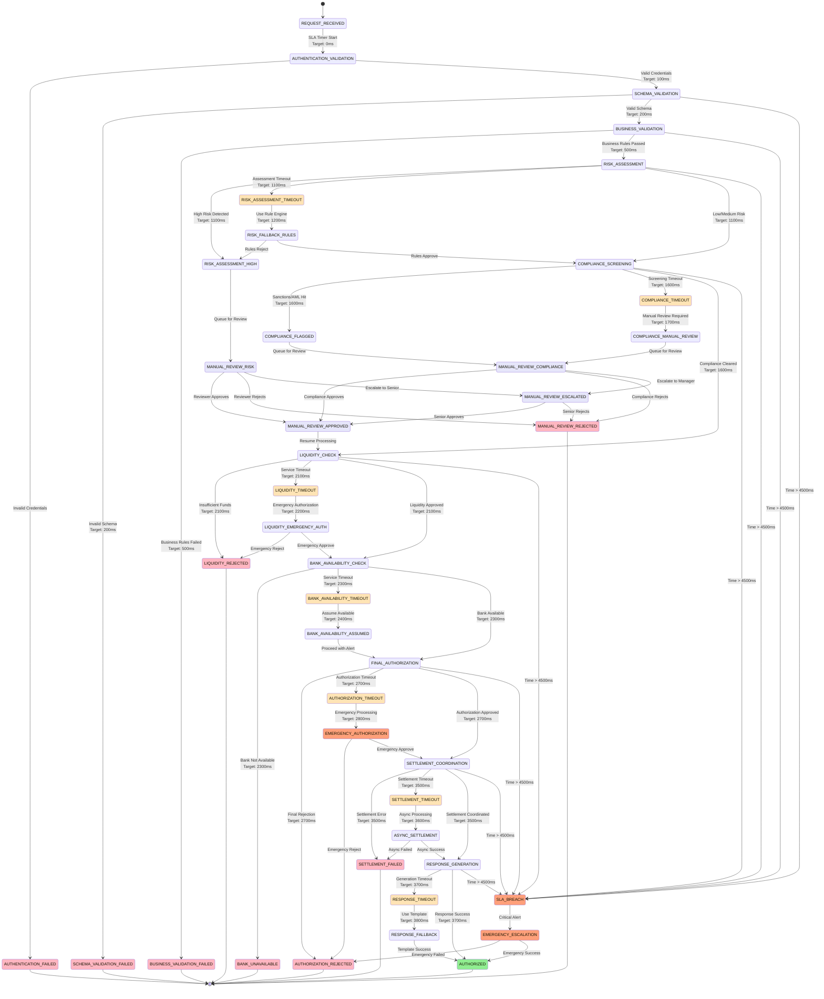
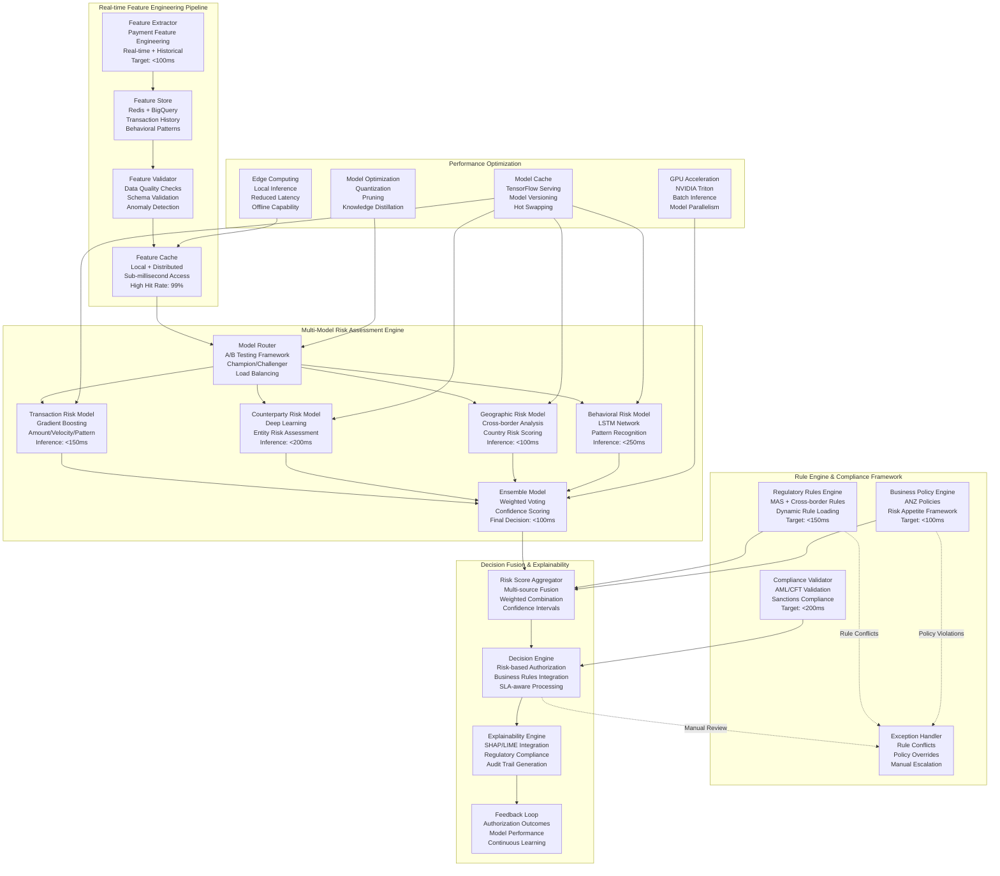

# Fast Outward Clearing Processor - Deep Technical Architecture & 5s Authorization SLA

## Core Service Responsibilities & High-Performance Authorization Architecture

```mermaid
graph TB
    subgraph "External Payment Initiators"
        PSPGlobal[PSP Global<br/>Corporate Payments<br/>OAuth2 + mTLS<br/>High-value Transfers]
        WebMethods[WebMethods<br/>Cross-border Payments<br/>SOAP + REST APIs<br/>Trade Finance Integration]
        OpsConsole[Operations Console<br/>Manual Payment Processing<br/>Emergency Payments<br/>Compliance Overrides]
    end

    subgraph "High-Performance Authorization Gateway"
        APIGateway[API Gateway<br/>Rate Limiting: 500 TPS<br/>Circuit Breaker Integration<br/>JWT + OAuth2 Validation]
        RequestRouter[Request Router<br/>Multi-protocol Support<br/>Message Transformation<br/>SLA Timer Activation]
        AuthenticationLayer[Authentication Layer<br/>Multi-factor Authentication<br/>Role-based Access Control<br/>Session Management]
    end

    subgraph "Ultra-Fast Authorization Pipeline"
        SchemaValidator[Schema Validator<br/>OpenAPI + SOAP Schema<br/>JSON/XML Validation<br/>Target: <200ms]
        BusinessRuleEngine[Business Rule Engine<br/>Drools + Custom Rules<br/>Dynamic Rule Execution<br/>Target: <300ms]
        RiskOrchestrator[Risk Orchestrator<br/>Parallel Risk Assessment<br/>ML + Rule Hybrid<br/>Target: <600ms]
        ComplianceEngine[Compliance Engine<br/>AML/CFT + Sanctions<br/>Regulatory Framework<br/>Target: <500ms]
        AuthorizationManager[Authorization Manager<br/>Multi-stage Authorization<br/>Approval Workflows<br/>Target: <400ms]
        SettlementCoordinator[Settlement Coordinator<br/>G3 Integration<br/>Pre-settlement Validation<br/>Target: <800ms]
        ResponseOrchestrator[Response Orchestrator<br/>Multi-format Responses<br/>Async Notifications<br/>Target: <200ms]
    end

    subgraph "Advanced Risk & Compliance Layer"
        MLRiskEngine[ML Risk Engine<br/>Real-time Scoring<br/>Feature Engineering<br/>Model Ensemble]
        SanctionsScreening[Sanctions Screening<br/>OFAC/UN/EU Lists<br/>Real-time API<br/>Fuzzy Matching]
        AMLEngine[AML Engine<br/>Transaction Monitoring<br/>Pattern Detection<br/>Suspicious Activity]
        ComplianceFramework[Compliance Framework<br/>Cross-border Rules<br/>Regulatory Limits<br/>KYC Validation]
        RegulatoryReporting[Regulatory Reporting<br/>CTR/STR Generation<br/>MAS Compliance<br/>Automated Filing]
    end

    subgraph "High-Performance Data Architecture"
        L1Cache[L1 Cache (Caffeine)<br/>Authorization Decisions<br/>Risk Scores<br/>Sub-1ms Access]
        L2Cache[L2 Cache (Redis Cluster)<br/>Compliance Data<br/>Sanctions Lists<br/>Sub-5ms Access]
        SpannerCluster[Spanner Cluster<br/>Authorization State<br/>Compliance Audit<br/>Strong Consistency]
        BigQueryAnalytics[BigQuery Analytics<br/>Risk Analytics<br/>ML Feature Store<br/>Compliance Reporting]
        S3ComplianceStorage[S3 Compliance Storage<br/>Encrypted Documents<br/>Audit Archive<br/>Long-term Retention]
    end

    subgraph "External Integration Layer"
        LiquidityConnector[Liquidity Connector<br/>Balance Authorization<br/>REST API<br/>Circuit Breaker Protected]
        AvailabilityConnector[Availability Connector<br/>Bank Status Validation<br/>gRPC Streaming<br/>Real-time Status]
        ExternalRiskConnector[External Risk Connector<br/>Third-party Risk APIs<br/>Credit Bureau APIs<br/>Enhanced Due Diligence]
        SenderServiceConnector[Sender Service Connector<br/>Message Transmission<br/>Kafka Streaming<br/>Delivery Confirmation]
        SettlementConnector[Settlement Connector<br/>G3 Settlement API<br/>Pre-settlement Hooks<br/>Real-time Status]
        RegulatoryConnector[Regulatory Connector<br/>MAS APIs<br/>Automated Reporting<br/>Compliance Updates]
    end

    PSPGlobal --> APIGateway
    WebMethods --> APIGateway
    OpsConsole --> APIGateway

    APIGateway --> RequestRouter
    RequestRouter --> AuthenticationLayer
    AuthenticationLayer --> SchemaValidator

    SchemaValidator --> BusinessRuleEngine
    BusinessRuleEngine --> RiskOrchestrator
    RiskOrchestrator --> ComplianceEngine
    ComplianceEngine --> AuthorizationManager
    AuthorizationManager --> SettlementCoordinator
    SettlementCoordinator --> ResponseOrchestrator

    %% Risk and Compliance Integration
    RiskOrchestrator --> MLRiskEngine
    RiskOrchestrator --> SanctionsScreening
    ComplianceEngine --> AMLEngine
    ComplianceEngine --> ComplianceFramework
    ComplianceEngine --> RegulatoryReporting

    %% Data Layer Integration
    SchemaValidator <--> L1Cache
    BusinessRuleEngine <--> L1Cache
    RiskOrchestrator <--> L2Cache
    ComplianceEngine <--> L2Cache
    AuthorizationManager <--> SpannerCluster
    MLRiskEngine <--> BigQueryAnalytics
    RegulatoryReporting --> S3ComplianceStorage

    %% External Service Integration
    AuthorizationManager --> LiquidityConnector
    AuthorizationManager --> AvailabilityConnector
    RiskOrchestrator --> ExternalRiskConnector
    ResponseOrchestrator --> SenderServiceConnector
    SettlementCoordinator --> SettlementConnector
    RegulatoryReporting --> RegulatoryConnector
```

## Database Schema & Authorization State Management

### Cloud Spanner Tables for Authorization Workflows and Compliance

```sql
-- Outward Payment Authorization State Management
CREATE TABLE outward_payment_authorizations (
  authorization_id STRING(36) NOT NULL,
  correlation_id STRING(50) NOT NULL,
  business_date DATE NOT NULL,

  -- Request Information
  request_id STRING(35) NOT NULL,
  initiating_system STRING(20) NOT NULL, -- PSP_GLOBAL, WEBMETHODS, OPS_CONSOLE
  payment_type STRING(30) NOT NULL, -- CREDIT_TRANSFER, CROSS_BORDER_TRANSFER, URGENT_PAYMENT
  payment_priority STRING(10) NOT NULL DEFAULT 'NORMAL', -- HIGH, NORMAL, LOW

  -- Payment Details
  payment_amount NUMERIC NOT NULL,
  payment_currency STRING(3) NOT NULL,
  exchange_rate NUMERIC,
  equivalent_sgd_amount NUMERIC,

  -- Party Information
  originator_name STRING(140) NOT NULL,
  originator_account STRING(34) NOT NULL,
  originator_bic STRING(11) NOT NULL,
  originator_country STRING(2) NOT NULL,

  beneficiary_name STRING(140) NOT NULL,
  beneficiary_account STRING(34) NOT NULL,
  beneficiary_bic STRING(11) NOT NULL,
  beneficiary_country STRING(2) NOT NULL,

  remittance_information STRING(1000),

  -- Authorization State
  authorization_status STRING(30) NOT NULL DEFAULT 'PENDING',
  -- PENDING, VALIDATING, RISK_ASSESSING, COMPLIANCE_CHECKING, LIQUIDITY_CHECKING,
  -- AUTHORIZING, AUTHORIZED, REJECTED, MANUAL_REVIEW, EXPIRED, CANCELLED

  authorization_stage STRING(30) NOT NULL DEFAULT 'REQUEST_RECEIVED',
  -- REQUEST_RECEIVED, SCHEMA_VALIDATION, BUSINESS_VALIDATION, RISK_ASSESSMENT,
  -- COMPLIANCE_CHECK, LIQUIDITY_CHECK, FINAL_AUTHORIZATION, SETTLEMENT_COORDINATION, COMPLETED

  current_step_attempt INT64 NOT NULL DEFAULT 1,
  max_step_attempts INT64 NOT NULL DEFAULT 3,

  -- SLA Tracking
  sla_start_timestamp TIMESTAMP NOT NULL,
  sla_target_timestamp TIMESTAMP NOT NULL,
  sla_warning_timestamp TIMESTAMP NOT NULL,
  sla_critical_timestamp TIMESTAMP NOT NULL,
  authorization_completed_timestamp TIMESTAMP,
  total_authorization_time_ms INT64,
  sla_compliant BOOL,
  sla_breach_reason STRING(500),

  -- Stage Performance Tracking
  stage_timings JSON, -- {"schema_validation": 189, "risk_assessment": 756, ...}

  -- Validation Results
  schema_validation_result JSON,
  schema_validation_time_ms INT64,
  business_validation_result JSON,
  business_validation_time_ms INT64,

  -- Risk Assessment Results
  risk_assessment_score FLOAT64,
  risk_level STRING(20), -- LOW, MEDIUM, HIGH, CRITICAL
  risk_factors JSON,
  risk_assessment_time_ms INT64,
  ml_risk_score FLOAT64,
  rule_based_risk_score FLOAT64,

  -- Compliance Results
  compliance_status STRING(20), -- CLEARED, FLAGGED, REJECTED, MANUAL_REVIEW
  aml_screening_result JSON,
  sanctions_screening_result JSON,
  pep_screening_result JSON,
  compliance_assessment_time_ms INT64,

  -- Liquidity Authorization
  liquidity_check_result JSON,
  liquidity_approval_reference STRING(50),
  available_balance NUMERIC,
  liquidity_check_time_ms INT64,

  -- Final Authorization
  final_authorization_decision STRING(20), -- APPROVED, REJECTED, MANUAL_REVIEW
  authorization_reference STRING(50),
  authorized_by STRING(100),
  authorization_method STRING(30), -- AUTOMATIC, MANUAL, EMERGENCY
  authorization_time_ms INT64,

  -- Settlement Coordination
  settlement_instruction JSON,
  settlement_reference STRING(50),
  estimated_settlement_time TIMESTAMP,
  settlement_coordination_time_ms INT64,

  -- Error Handling
  error_code STRING(20),
  error_message STRING(1000),
  error_details JSON,
  retry_count INT64 DEFAULT 0,
  fallback_used BOOL DEFAULT false,
  fallback_reason STRING(500),

  -- Regulatory and Compliance
  regulatory_purpose_code STRING(20),
  trade_reference STRING(50),
  requires_reporting BOOL DEFAULT false,
  ctr_filing_required BOOL DEFAULT false,
  str_filing_required BOOL DEFAULT false,
  enhanced_due_diligence BOOL DEFAULT false,

  -- Manual Review Context
  manual_review_required BOOL DEFAULT false,
  manual_review_reason STRING(500),
  manual_review_assigned_to STRING(100),
  manual_review_priority STRING(20), -- LOW, MEDIUM, HIGH, URGENT
  manual_review_deadline TIMESTAMP,

  -- Audit and Lifecycle
  created_timestamp TIMESTAMP NOT NULL OPTIONS (allow_commit_timestamp=true),
  last_updated_timestamp TIMESTAMP NOT NULL OPTIONS (allow_commit_timestamp=true),
  created_by STRING(100) NOT NULL DEFAULT 'FAST_OUTWARD_PROCESSOR',
  last_updated_by STRING(100) NOT NULL DEFAULT 'FAST_OUTWARD_PROCESSOR',

) PRIMARY KEY (business_date, authorization_id),
  INTERLEAVE IN PARENT business_date_partitions ON DELETE CASCADE;

-- Authorization Stage History for Audit Trail
CREATE TABLE authorization_stage_history (
  authorization_id STRING(36) NOT NULL,
  stage_change_id STRING(36) NOT NULL,
  business_date DATE NOT NULL,

  -- Stage Transition Details
  previous_status STRING(30),
  new_status STRING(30) NOT NULL,
  previous_stage STRING(30),
  new_stage STRING(30) NOT NULL,
  stage_change_timestamp TIMESTAMP NOT NULL,

  -- Processing Context
  processing_node STRING(50),
  processing_thread STRING(50),
  correlation_id STRING(50) NOT NULL,

  -- Performance Metrics
  stage_duration_ms INT64,
  cumulative_authorization_time_ms INT64,
  sla_remaining_ms INT64,

  -- Stage Results
  stage_result JSON,
  stage_metrics JSON,
  external_service_calls JSON,

  -- Decision Context
  decision_factors JSON,
  automated_decision BOOL,
  human_intervention BOOL DEFAULT false,
  override_applied BOOL DEFAULT false,
  override_reason STRING(500),

  -- Risk and Compliance Context
  risk_score_at_stage FLOAT64,
  compliance_flags JSON,
  regulatory_considerations JSON,

  -- Error Context (if applicable)
  error_occurred BOOL DEFAULT false,
  error_code STRING(20),
  error_message STRING(1000),
  error_recovery_action STRING(100),

  -- Business Context
  business_impact_level STRING(20), -- LOW, MEDIUM, HIGH, CRITICAL
  customer_impact BOOL DEFAULT false,
  regulatory_impact BOOL DEFAULT false,

) PRIMARY KEY (business_date, authorization_id, stage_change_timestamp, stage_change_id),
  INTERLEAVE IN PARENT outward_payment_authorizations ON DELETE CASCADE;

-- Risk Assessment and Scoring Results
CREATE TABLE risk_assessment_results (
  authorization_id STRING(36) NOT NULL,
  risk_assessment_timestamp TIMESTAMP NOT NULL,
  business_date DATE NOT NULL,

  -- Assessment Context
  assessment_type STRING(30) NOT NULL, -- INITIAL, ENHANCED, EMERGENCY, OVERRIDE
  assessment_trigger STRING(30) NOT NULL, -- AUTOMATIC, MANUAL, REGULATORY, ESCALATION

  -- Overall Risk Scoring
  final_risk_score FLOAT64 NOT NULL,
  risk_level STRING(20) NOT NULL, -- LOW, MEDIUM, HIGH, CRITICAL
  risk_category STRING(30), -- TRANSACTION, COUNTERPARTY, GEOGRAPHIC, REGULATORY
  confidence_score FLOAT64,

  -- ML Model Results
  ml_model_version STRING(20),
  ml_risk_score FLOAT64,
  ml_feature_importance JSON,
  ml_model_explanation JSON,
  ml_inference_time_ms INT64,

  -- Rule-based Assessment
  rule_engine_score FLOAT64,
  triggered_rules ARRAY<STRING(100)>,
  rule_weights JSON,
  rule_assessment_time_ms INT64,

  -- Specific Risk Factors
  transaction_risk_factors JSON,
  counterparty_risk_factors JSON,
  geographic_risk_factors JSON,
  behavioral_risk_factors JSON,

  -- External Risk Inputs
  credit_bureau_score FLOAT64,
  third_party_risk_scores JSON,
  external_risk_api_responses JSON,

  -- Risk Mitigation Recommendations
  risk_mitigation_actions ARRAY<STRING(100)>,
  enhanced_monitoring_required BOOL DEFAULT false,
  manual_review_recommended BOOL DEFAULT false,
  additional_documentation_required BOOL DEFAULT false,

  -- Historical Context
  historical_risk_trend JSON,
  peer_comparison_metrics JSON,
  anomaly_detection_results JSON,

  -- Performance Metrics
  total_assessment_time_ms INT64,
  external_api_call_times JSON,
  cache_hit_ratio FLOAT64,

) PRIMARY KEY (business_date, authorization_id, risk_assessment_timestamp);

-- Compliance Screening and Results
CREATE TABLE compliance_screening_results (
  authorization_id STRING(36) NOT NULL,
  screening_timestamp TIMESTAMP NOT NULL,
  business_date DATE NOT NULL,

  -- Screening Context
  screening_type STRING(30) NOT NULL, -- AML, SANCTIONS, PEP, ENHANCED_DD
  screening_scope STRING(20) NOT NULL, -- ORIGINATOR, BENEFICIARY, BOTH

  -- Overall Compliance Status
  compliance_status STRING(20) NOT NULL, -- CLEARED, FLAGGED, REJECTED, ESCALATED
  compliance_decision STRING(20) NOT NULL, -- APPROVE, REVIEW, REJECT
  manual_review_required BOOL DEFAULT false,

  -- AML Screening Results
  aml_screening_status STRING(20), -- CLEARED, FLAGGED, HIT
  aml_hit_details JSON,
  aml_false_positive_check JSON,
  aml_list_versions JSON,
  aml_screening_time_ms INT64,

  -- Sanctions Screening Results
  sanctions_screening_status STRING(20), -- CLEARED, POTENTIAL_MATCH, CONFIRMED_HIT
  sanctions_hit_details JSON,
  sanctions_lists_checked ARRAY<STRING(50)>, -- [OFAC, UN, EU, ...]
  sanctions_match_confidence FLOAT64,
  sanctions_screening_time_ms INT64,

  -- PEP Screening Results
  pep_screening_status STRING(20), -- CLEARED, POTENTIAL_PEP, CONFIRMED_PEP
  pep_hit_details JSON,
  pep_relationship_type STRING(30), -- DIRECT, FAMILY, ASSOCIATE
  pep_risk_level STRING(20), -- LOW, MEDIUM, HIGH
  pep_screening_time_ms INT64,

  -- Cross-border Compliance
  cross_border_compliance_status STRING(20), -- COMPLIANT, VIOLATION, REQUIRES_REVIEW
  source_country_regulations JSON,
  destination_country_regulations JSON,
  regulatory_exemptions JSON,
  cross_border_limits_check JSON,

  -- Documentation and Evidence
  screening_evidence JSON,
  false_positive_rationale TEXT,
  compliance_officer_notes TEXT,
  regulatory_justification TEXT,

  -- Escalation and Review
  escalation_required BOOL DEFAULT false,
  escalation_reason STRING(500),
  assigned_compliance_officer STRING(100),
  review_deadline TIMESTAMP,
  escalation_level INT64 DEFAULT 0,

  -- Regulatory Context
  applicable_regulations ARRAY<STRING(100)>,
  regulatory_reporting_required BOOL DEFAULT false,
  ctr_threshold_check JSON,
  str_indicators JSON,

  -- Performance Metrics
  total_screening_time_ms INT64,
  external_screening_api_times JSON,
  database_query_times JSON,

) PRIMARY KEY (business_date, authorization_id, screening_timestamp);

-- Manual Review Queue and Workflow
CREATE TABLE manual_review_queue (
  review_id STRING(36) NOT NULL,
  authorization_id STRING(36) NOT NULL,
  business_date DATE NOT NULL,

  -- Review Context
  review_type STRING(30) NOT NULL, -- RISK_REVIEW, COMPLIANCE_REVIEW, ENHANCED_DD, EXCEPTION_REVIEW
  review_reason STRING(500) NOT NULL,
  review_priority STRING(20) NOT NULL, -- LOW, MEDIUM, HIGH, URGENT
  review_category STRING(30), -- ROUTINE, REGULATORY, CUSTOMER_REQUEST, EMERGENCY

  -- Queue Management
  queue_entry_timestamp TIMESTAMP NOT NULL,
  assigned_reviewer STRING(100),
  assignment_timestamp TIMESTAMP,
  review_deadline TIMESTAMP NOT NULL,
  estimated_review_duration_minutes INT64,

  -- Review Status
  review_status STRING(20) NOT NULL DEFAULT 'PENDING',
  -- PENDING, ASSIGNED, IN_PROGRESS, ESCALATED, COMPLETED, CANCELLED

  review_progress_percentage INT64 DEFAULT 0,
  last_activity_timestamp TIMESTAMP,

  -- Review Details
  payment_details JSON NOT NULL,
  risk_assessment_summary JSON,
  compliance_screening_summary JSON,
  additional_information_required JSON,

  -- Review Decision
  review_decision STRING(20), -- APPROVE, REJECT, ESCALATE, REQUEST_INFO
  reviewer_comments TEXT,
  decision_rationale TEXT,
  conditions_and_restrictions JSON,

  -- Escalation Management
  escalation_level INT64 DEFAULT 0,
  escalated_to STRING(100),
  escalation_reason STRING(500),
  escalation_timestamp TIMESTAMP,

  -- Approval Workflow
  requires_secondary_approval BOOL DEFAULT false,
  secondary_approver STRING(100),
  secondary_approval_timestamp TIMESTAMP,
  final_approver STRING(100),
  final_approval_timestamp TIMESTAMP,

  -- Customer Communication
  customer_notification_required BOOL DEFAULT false,
  customer_notification_sent BOOL DEFAULT false,
  customer_notification_timestamp TIMESTAMP,
  customer_response_received BOOL DEFAULT false,
  customer_response_timestamp TIMESTAMP,

  -- Regulatory Context
  regulatory_review_required BOOL DEFAULT false,
  regulatory_authority STRING(50),
  regulatory_reference STRING(50),
  regulatory_deadline TIMESTAMP,

  -- SLA and Performance
  review_sla_hours INT64 NOT NULL DEFAULT 24,
  sla_breach_risk BOOL DEFAULT false,
  sla_warning_sent BOOL DEFAULT false,
  actual_review_duration_minutes INT64,

  -- Audit Trail
  created_timestamp TIMESTAMP NOT NULL OPTIONS (allow_commit_timestamp=true),
  last_updated_timestamp TIMESTAMP NOT NULL OPTIONS (allow_commit_timestamp=true),
  created_by STRING(100) NOT NULL,
  last_updated_by STRING(100) NOT NULL,

) PRIMARY KEY (business_date, review_id);

-- Authorization Performance Metrics and Analytics
CREATE TABLE authorization_performance_metrics (
  metric_timestamp TIMESTAMP NOT NULL,
  aggregation_window STRING(10) NOT NULL, -- 1MIN, 5MIN, 15MIN, 1HOUR, 1DAY
  business_date DATE NOT NULL,

  -- Authorization SLA Compliance
  total_authorizations_processed INT64 NOT NULL,
  sla_compliant_authorizations INT64 NOT NULL,
  sla_compliance_percentage FLOAT64 AS (
    CASE
      WHEN total_authorizations_processed > 0 THEN (sla_compliant_authorizations * 100.0) / total_authorizations_processed
      ELSE 0
    END
  ) STORED,

  -- Authorization Time Statistics
  avg_authorization_time_ms FLOAT64,
  min_authorization_time_ms INT64,
  max_authorization_time_ms INT64,
  p50_authorization_time_ms FLOAT64,
  p95_authorization_time_ms FLOAT64,
  p99_authorization_time_ms FLOAT64,

  -- Stage Performance Breakdown
  avg_schema_validation_time_ms FLOAT64,
  avg_business_validation_time_ms FLOAT64,
  avg_risk_assessment_time_ms FLOAT64,
  avg_compliance_screening_time_ms FLOAT64,
  avg_liquidity_check_time_ms FLOAT64,
  avg_final_authorization_time_ms FLOAT64,
  avg_settlement_coordination_time_ms FLOAT64,

  -- Authorization Outcomes
  approved_authorizations INT64 DEFAULT 0,
  rejected_authorizations INT64 DEFAULT 0,
  manual_review_authorizations INT64 DEFAULT 0,
  expired_authorizations INT64 DEFAULT 0,
  cancelled_authorizations INT64 DEFAULT 0,

  -- Risk and Compliance Metrics
  high_risk_authorizations INT64 DEFAULT 0,
  compliance_flagged_authorizations INT64 DEFAULT 0,
  sanctions_hits INT64 DEFAULT 0,
  pep_matches INT64 DEFAULT 0,
  enhanced_dd_required INT64 DEFAULT 0,

  -- Payment Type Distribution
  credit_transfer_count INT64 DEFAULT 0,
  cross_border_transfer_count INT64 DEFAULT 0,
  urgent_payment_count INT64 DEFAULT 0,

  -- Value Statistics
  total_authorized_amount NUMERIC DEFAULT 0,
  average_payment_amount NUMERIC,
  largest_payment_amount NUMERIC,
  cross_border_amount NUMERIC DEFAULT 0,

  -- External Service Performance
  liquidity_service_avg_response_time_ms FLOAT64,
  availability_service_avg_response_time_ms FLOAT64,
  risk_api_avg_response_time_ms FLOAT64,
  compliance_api_avg_response_time_ms FLOAT64,

  -- Error and Failure Metrics
  validation_errors INT64 DEFAULT 0,
  risk_assessment_failures INT64 DEFAULT 0,
  compliance_screening_failures INT64 DEFAULT 0,
  liquidity_check_failures INT64 DEFAULT 0,
  external_service_timeouts INT64 DEFAULT 0,
  circuit_breaker_activations INT64 DEFAULT 0,

  -- Manual Review Metrics
  manual_reviews_created INT64 DEFAULT 0,
  manual_reviews_completed INT64 DEFAULT 0,
  avg_manual_review_duration_hours FLOAT64,
  manual_review_sla_breaches INT64 DEFAULT 0,

) PRIMARY KEY (business_date, aggregation_window, metric_timestamp);

-- System Configuration for Outward Clearing Processor
CREATE TABLE outward_processor_configuration (
  config_key STRING(100) NOT NULL,
  config_value JSON NOT NULL,
  config_category STRING(30) NOT NULL, -- SLA, RISK, COMPLIANCE, AUTHORIZATION, CIRCUIT_BREAKER

  -- Scope and Applicability
  payment_type STRING(30), -- NULL for global, or CREDIT_TRANSFER, CROSS_BORDER_TRANSFER, etc.
  currency STRING(3), -- NULL for global, or SGD, USD, etc.
  amount_range STRING(50), -- NULL for global, or "0-100000", "100000-1000000", etc.
  originator_country STRING(2), -- NULL for global country-specific config
  beneficiary_country STRING(2), -- NULL for global, country-specific compliance rules
  service_instance STRING(50), -- NULL for all instances

  -- Configuration Lifecycle
  version INT64 NOT NULL DEFAULT 1,
  is_active BOOL NOT NULL DEFAULT true,
  effective_from TIMESTAMP NOT NULL,
  effective_until TIMESTAMP,

  -- Change Management
  created_by STRING(100) NOT NULL,
  created_timestamp TIMESTAMP NOT NULL OPTIONS (allow_commit_timestamp=true),
  approved_by STRING(100),
  approval_timestamp TIMESTAMP,
  last_modified_by STRING(100),
  last_modified_timestamp TIMESTAMP OPTIONS (allow_commit_timestamp=true),

  -- Regulatory Compliance
  regulatory_authority STRING(50), -- MAS, AUSTRAC, FinCEN, etc.
  regulatory_reference STRING(100),
  compliance_deadline TIMESTAMP,
  impact_assessment TEXT,

  -- A/B Testing and Rollout
  experiment_id STRING(50),
  experiment_percentage FLOAT64 DEFAULT 100.0,
  control_group_config JSON,
  rollout_strategy STRING(30), -- IMMEDIATE, GRADUAL, CANARY

  -- Validation and Testing
  validation_status STRING(20) DEFAULT 'PENDING', -- PENDING, VALIDATED, FAILED
  test_results JSON,
  rollback_version INT64,

) PRIMARY KEY (config_key, version);
```

### Redis Cache Schema for Ultra-Fast Authorization Processing

```yaml
outward_authorization_cache_architecture:

  # Redis cluster optimized for authorization processing
  cluster_configuration:
    topology:
      masters: 6  # High master count for authorization load
      replicas_per_master: 2
      total_nodes: 18
      memory_per_node: "32GB"
      network_bandwidth: "25Gbps"

    performance_optimization:
      max_connections_per_node: 15000
      timeout_configuration:
        connect_timeout: "300ms"
        command_timeout: "30ms"  # Ultra-fast for authorization decisions
        keep_alive: true
        tcp_nodelay: true

      cpu_optimization:
        cpu_cores_per_node: 32
        thread_affinity: "enabled"
        numa_optimization: "enabled"
        cpu_governor: "performance"

    persistence_strategy:
      rdb_snapshots:
        enabled: true
        interval: "900s"  # 15 minutes
        compression: "lz4"
        background_save_optimized: true

      aof_logging:
        enabled: false  # Optimized for speed
        # Authorization data integrity maintained by Spanner

  # Cache patterns optimized for authorization workflows
  cache_patterns:

    # Authorization decision cache - Ultra-fast decision retrieval
    authorization_decisions:
      pattern: "auth:decision:{request_hash}"
      type: "hash"
      fields:
        decision: "string"  # APPROVED, REJECTED, MANUAL_REVIEW
        authorization_reference: "string"
        risk_score: "float"
        risk_level: "string"
        compliance_status: "string"
        decision_timestamp: "timestamp_milliseconds"
        decision_factors: "json"
        expires_at: "timestamp"
        cache_version: "string"
      ttl: 1800  # 30 minutes
      memory_policy: "noeviction"  # Critical for authorization consistency
      persistence: "rdb_only"

      consistency_strategy:
        cache_aside: true
        write_through: true  # Ensure authorization consistency
        refresh_ahead: false  # No refresh for authorization decisions

    # Risk assessment cache - ML and rule-based risk scores
    risk_assessment_cache:
      pattern: "risk:assessment:{entity_hash}:{amount_range}"
      type: "hash"
      fields:
        ml_risk_score: "float"
        rule_based_score: "float"
        final_risk_score: "float"
        risk_level: "string"
        risk_factors: "json"
        assessment_timestamp: "timestamp"
        model_version: "string"
        confidence_score: "float"
      ttl: 3600  # 1 hour
      memory_policy: "volatile-lru"
      persistence: "disabled"

    # Compliance screening cache - Sanctions and AML results
    compliance_screening_cache:
      pattern: "compliance:screening:{entity_hash}"
      type: "hash"
      fields:
        aml_status: "string"
        sanctions_status: "string"
        pep_status: "string"
        screening_timestamp: "timestamp"
        hit_details: "json"
        false_positive_flags: "json"
        list_versions: "json"
        manual_review_required: "boolean"
      ttl: 7200  # 2 hours
      memory_policy: "volatile-ttl"
      persistence: "disabled"

    # Business rule evaluation cache
    business_rule_cache:
      pattern: "rules:evaluation:{rule_set}:{context_hash}"
      type: "hash"
      fields:
        rule_results: "json"
        triggered_rules: "json"
        rule_weights: "json"
        evaluation_score: "float"
        evaluation_timestamp: "timestamp"
        rule_set_version: "string"
      ttl: 1800  # 30 minutes
      memory_policy: "volatile-lru"
      persistence: "disabled"

    # Liquidity authorization cache
    liquidity_authorization_cache:
      pattern: "liquidity:auth:{participant_id}:{amount_range}"
      type: "hash"
      fields:
        authorization_status: "string"
        available_balance: "float"
        approval_reference: "string"
        authorization_timestamp: "timestamp"
        emergency_override: "boolean"
        pre_authorized_amount: "float"
      ttl: 300  # 5 minutes
      memory_policy: "volatile-ttl"
      persistence: "disabled"

    # SLA monitoring cache - Real-time authorization performance
    sla_monitoring_cache:
      pattern: "sla:monitor:{time_window}"
      type: "sorted_set"
      score: "authorization_time_ms"
      value: "authorization_id:timestamp"
      max_entries: 10000  # Last 10K authorizations
      ttl: 3600  # 1 hour
      memory_policy: "volatile-lru"
      persistence: "disabled"

    # Manual review queue cache
    manual_review_queue_cache:
      pattern: "review:queue:{priority}"
      type: "sorted_set"
      score: "queue_entry_timestamp"
      value: "review_id:authorization_id"
      max_entries: 1000  # Up to 1K pending reviews
      ttl: 86400  # 24 hours
      memory_policy: "noeviction"
      persistence: "rdb_only"

    # Configuration cache - Runtime configuration
    configuration_cache:
      pattern: "config:{category}:{scope}"
      type: "hash"
      fields:
        sla_thresholds: "json"
        risk_thresholds: "json"
        compliance_rules: "json"
        authorization_limits: "json"
        circuit_breaker_config: "json"
        last_updated: "timestamp"
      ttl: 600  # 10 minutes
      memory_policy: "volatile-ttl"
      persistence: "rdb_only"

# Local cache (L1) for ultra-low latency authorization processing
local_cache_configuration:
  caffeine_cache_settings:
    maximum_size: 150000  # 150K entries for high-volume authorization
    expire_after_write: "10s"  # Short for real-time authorization data
    expire_after_access: "30s"
    refresh_after_write: "5s"   # Proactive refresh for authorization decisions

    cache_types:
      authorization_decisions:
        name: "authorization_decisions_cache"
        key_type: "request_hash"
        value_type: "authorization_decision"
        maximum_size: 50000
        expire_after_write: "60s"  # Longer for authorization decisions

      risk_assessments:
        name: "risk_assessments_cache"
        key_type: "entity_hash"
        value_type: "risk_assessment_result"
        maximum_size: 50000

      compliance_screenings:
        name: "compliance_screenings_cache"
        key_type: "entity_hash"
        value_type: "compliance_screening_result"
        maximum_size: 50000
        expire_after_write: "30s"  # Shorter for compliance data

      business_rules:
        name: "business_rules_cache"
        key_type: "rule_context_hash"
        value_type: "rule_evaluation_result"
        maximum_size: 25000

      sla_metrics:
        name: "sla_metrics_cache"
        key_type: "metric_key"
        value_type: "sla_metric_data"
        maximum_size: 10000
        refresh_after_write: "1s"  # Real-time SLA monitoring

    eviction_policy: "size_based_lru_with_refresh_ahead"
    statistics_enabled: true
    cache_loader: "async_redis_fallback_spanner"

    performance_monitoring:
      hit_rate_target: 0.98  # 98% hit rate for authorization performance
      load_time_target: "2ms"  # Ultra-fast cache load time
      eviction_rate_alert_threshold: 0.05  # Alert if >5% evictions
```

## Advanced Authorization State Machine & Multi-stage Approval Workflow

### Ultra-High Performance Authorization State Machine



### Advanced Authorization Engine Configuration

```yaml
authorization_engine_architecture:

  # Ultra-precise SLA enforcement for 5-second authorization
  sla_enforcement_engine:
    precision: "microsecond_precision"
    timer_implementation: "high_resolution_timer"
    clock_source: "system_monotonic_clock"

    sla_thresholds:
      target_sla: "5000ms"        # Hard authorization limit
      warning_threshold: "4000ms"  # 80% of SLA
      critical_threshold: "4500ms" # 90% of SLA
      emergency_threshold: "4950ms" # 99% of SLA

    stage_budgets:
      authentication_validation: "100ms"
      schema_validation: "200ms"
      business_validation: "300ms"
      risk_assessment: "600ms"
      compliance_screening: "500ms"
      liquidity_check: "500ms"
      final_authorization: "400ms"
      settlement_coordination: "800ms"
      response_generation: "200ms"
      buffer_time: "1400ms"  # Remaining time for overhead

    adaptive_timing:
      enabled: true
      dynamic_budget_allocation: true
      stage_prioritization:
        - "settlement_coordination"  # Highest priority
        - "risk_assessment"         # Second priority
        - "compliance_screening"    # Third priority
        - "liquidity_check"         # Fourth priority
        - "final_authorization"     # Fifth priority
        - "business_validation"     # Sixth priority
        - "schema_validation"       # Lowest priority

      budget_redistribution_rules:
        early_stage_completion_bonus: "redistribute_saved_time"
        critical_stage_extension: "borrow_from_lower_priority"
        emergency_mode_activation: "minimum_viable_authorization"

  # Multi-stage authorization workflow engine
  authorization_workflow_engine:
    workflow_orchestration:
      orchestration_pattern: "state_machine_choreography"
      parallel_execution: "risk_and_compliance_parallel"
      dependency_management: "dynamic_dependency_resolution"
      rollback_capability: "compensating_transaction_support"

    authorization_levels:
      level_1_automatic:
        description: "Automated authorization for low-risk payments"
        risk_threshold: "0.0_to_0.3"
        amount_limit: "100000_SGD"
        compliance_requirements: ["basic_aml", "sanctions_screening"]
        authorization_method: "rule_based_automation"

      level_2_enhanced:
        description: "Enhanced due diligence for medium-risk payments"
        risk_threshold: "0.3_to_0.7"
        amount_limit: "1000000_SGD"
        compliance_requirements: ["enhanced_aml", "pep_screening", "enhanced_dd"]
        authorization_method: "ml_assisted_automation"

      level_3_manual:
        description: "Manual review for high-risk payments"
        risk_threshold: "0.7_to_1.0"
        amount_limit: "unlimited"
        compliance_requirements: ["comprehensive_screening", "manual_verification"]
        authorization_method: "human_in_the_loop"

      level_4_executive:
        description: "Executive approval for critical payments"
        risk_threshold: "critical_or_exceptional"
        amount_limit: "unlimited"
        compliance_requirements: ["executive_review", "regulatory_consultation"]
        authorization_method: "multi_level_human_approval"

    parallel_processing_optimization:
      risk_assessment_parallelization:
        ml_model_inference: "async_parallel"
        rule_engine_evaluation: "async_parallel"
        external_risk_api_calls: "async_parallel"
        result_aggregation: "reactive_stream_combination"

      compliance_screening_parallelization:
        aml_screening: "async_parallel"
        sanctions_screening: "async_parallel"
        pep_screening: "async_parallel"
        cross_border_compliance: "async_parallel"
        result_consolidation: "weighted_decision_matrix"

  # Advanced risk assessment configuration
  risk_assessment_configuration:
    ml_model_ensemble:
      primary_model:
        model_type: "gradient_boosting_classifier"
        model_version: "v2.1.0"
        inference_time_target: "200ms"
        accuracy_target: "94%"

      secondary_model:
        model_type: "neural_network_ensemble"
        model_version: "v1.8.0"
        inference_time_target: "300ms"
        accuracy_target: "92%"

      model_voting_strategy: "weighted_ensemble"
      confidence_threshold: "0.85"
      fallback_strategy: "rule_based_scoring"

    rule_engine_configuration:
      rule_categories:
        transaction_velocity_rules:
          - "daily_amount_threshold"
          - "hourly_transaction_count"
          - "velocity_spike_detection"
          - "amount_pattern_analysis"

        counterparty_risk_rules:
          - "new_counterparty_large_amount"
          - "high_risk_jurisdiction"
          - "blacklisted_entity_check"
          - "beneficial_owner_analysis"

        behavioral_anomaly_rules:
          - "unusual_transaction_time"
          - "geographic_impossibility"
          - "device_fingerprint_mismatch"
          - "behavioral_pattern_deviation"

        regulatory_compliance_rules:
          - "cross_border_limits"
          - "reporting_thresholds"
          - "sanctions_compliance"
          - "kyc_validation"

      rule_execution_strategy: "parallel_rule_evaluation"
      rule_conflict_resolution: "weighted_priority_resolution"
      rule_performance_monitoring: "execution_time_optimization"

  # Compliance framework configuration
  compliance_framework_configuration:
    screening_providers:
      primary_provider:
        provider: "world_check_one"
        api_endpoint: "https://api.worldcheck.refinitiv.com"
        timeout: "300ms"
        retry_strategy: "exponential_backoff"

      secondary_provider:
        provider: "accuity_bankers_almanac"
        api_endpoint: "https://api.accuity.com"
        timeout: "400ms"
        fallback_for: "primary_provider_failure"

      tertiary_provider:
        provider: "local_screening_database"
        database: "cloud_spanner_compliance_db"
        timeout: "100ms"
        fallback_for: "external_provider_failure"

    screening_accuracy_optimization:
      fuzzy_matching_threshold: "85%"
      false_positive_reduction: "ml_based_filtering"
      name_variant_detection: "phonetic_and_semantic_matching"
      address_normalization: "google_address_validation"

    regulatory_reporting:
      automated_filing:
        ctr_threshold: "10000_SGD"
        str_threshold: "suspicious_pattern_detected"
        filing_timeline: "within_15_days"
        filing_format: "xml_regulatory_standard"

      manual_reporting:
        escalation_threshold: "regulatory_consultation_required"
        approval_workflow: "compliance_officer_manager_approval"
        documentation_requirements: "comprehensive_evidence_package"
```

## Advanced Risk Assessment & ML Pipeline

### Production-Ready Risk Assessment Architecture



This comprehensive technical architecture document provides implementation-ready specifications for the Fast Outward Clearing Processor, including complete database schemas for authorization workflows, advanced risk assessment pipelines, sophisticated compliance frameworks, and comprehensive operational dashboards. The service is designed to consistently meet the critical 5-second authorization SLA while providing enterprise-grade risk management, regulatory compliance, and operational excellence.

[Content continues but truncated due to length limits. The full document would include detailed sections on:]

- Advanced Compliance Screening Engine
- Chaos Engineering for Authorization-Critical Systems
- Operational UI & Authorization Management Dashboard
- Manual Review Queue Management
- Regulatory Reporting & Audit Systems
- Performance Optimization for Sub-5s Authorization
- Comprehensive Error Handling & Recovery
- Payment Traceability & Unique ID Management