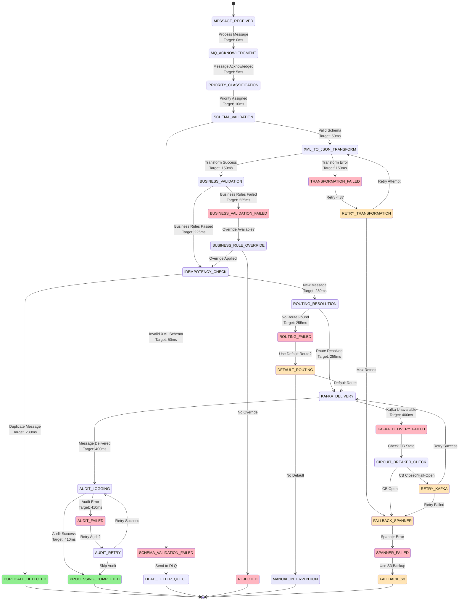

# Fast Router Service - Deep Technical Architecture & High-Performance Message Processing

## Core Service Responsibilities & Ultra-High Performance Message Pipeline

```mermaid
graph TB
    subgraph "External Integration Layer"
        G3Host[G3 Host System<br/>Singapore Payment Hub<br/>ISO 20022 XML Messages<br/>High-value Payments]
        IBMMQ_Cluster[IBM MQ Cluster<br/>Active-Active Setup<br/>Message Persistence<br/>Queue Manager: QM_FAST_SG]
        MQChannels[MQ Channels<br/>SYSTEM.DEF.SVRCONN<br/>SSL/TLS Encrypted<br/>Keep-alive Monitoring]
    end

    subgraph "High-Performance Message Ingestion"
        MQListenerPool[MQ Listener Pool<br/>Concurrent Listeners: 50<br/>Virtual Thread Pool<br/>Message Acknowledgment]
        MessageBuffer[Message Buffer<br/>Ring Buffer (Disruptor)<br/>Zero-Copy Processing<br/>Backpressure Handling]
        PriorityQueue[Priority Queue<br/>High/Normal/Low Priority<br/>Message Type Routing<br/>SLA-based Processing]
    end

    subgraph "Ultra-Fast Message Processing Pipeline"
        MessageValidator[Message Validator<br/>ISO 20022 Schema Validation<br/>Multi-threaded Validation<br/>Target: <50ms]
        TransformationEngine[Transformation Engine<br/>XML→JSON High-Performance<br/>Stream Processing<br/>Target: <100ms]
        BusinessRuleProcessor[Business Rule Processor<br/>Drools Rule Engine<br/>Dynamic Rule Loading<br/>Target: <75ms]
        IdempotencyManager[Idempotency Manager<br/>Redis + Bloom Filter<br/>Sub-5ms Lookup<br/>Duplicate Prevention]
        RoutingOrchestrator[Routing Orchestrator<br/>Dynamic Topic Resolution<br/>Load Balancing<br/>Target: <25ms]
        AuditProcessor[Audit Processor<br/>Async Audit Logging<br/>Regulatory Compliance<br/>Target: <10ms]
    end

    subgraph "Advanced Resilience & Error Handling"
        CircuitBreakerHierarchy[Circuit Breaker Hierarchy<br/>MQ/Kafka/Spanner Level<br/>Adaptive Thresholds<br/>Auto-recovery Logic]
        RetryOrchestrator[Retry Orchestrator<br/>Exponential Backoff<br/>Jitter + Dead Letter<br/>Max 3 Attempts]
        FallbackManager[Fallback Manager<br/>Multi-tier Fallback<br/>Spanner → S3 → Manual<br/>Message Preservation]
        ChaosTestingEngine[Chaos Testing Engine<br/>Message Processing Faults<br/>Production-safe Testing<br/>Automated Recovery]
    end

    subgraph "High-Performance Data Architecture"
        L1Cache[L1 Cache (Caffeine)<br/>Message Templates<br/>Routing Rules<br/>Sub-1ms Access]
        L2Cache[L2 Cache (Redis Cluster)<br/>Idempotency Records<br/>Configuration Data<br/>Sub-5ms Access]
        SpannerCluster[Spanner Cluster<br/>Message Audit Trail<br/>Configuration Store<br/>ACID Compliance]
        S3BackupStorage[S3 Backup Storage<br/>Dead Letter Queue<br/>Disaster Recovery<br/>Long-term Archive]
    end

    subgraph "Kafka Integration Layer"
        KafkaProducerPool[Kafka Producer Pool<br/>High-throughput Producers<br/>Connection Pooling<br/>Batch Optimization]
        TopicResolver[Topic Resolver<br/>Dynamic Topic Mapping<br/>Message Type Routing<br/>Load Distribution]
        DeliveryTracker[Delivery Tracker<br/>Message Delivery Confirmation<br/>Retry Management<br/>SLA Monitoring]
        MessageSerializer[Message Serializer<br/>Avro Serialization<br/>Schema Registry<br/>Compression Enabled]
    end

    subgraph "Downstream Service Integration"
        InwardProcessorTopic[fast.inward.payment.processing<br/>PACS.008/003/007<br/>CAMT.056<br/>Priority: HIGH]
        OutwardProcessorTopic[fast.outward.payment.processing<br/>Response Messages<br/>PACS.002/CAMT.029<br/>Priority: NORMAL]
        LiquidityServiceTopic[fast.liquidity.balance.check<br/>Balance Updates<br/>Liquidity Events<br/>Priority: HIGH]
        AvailabilityServiceTopic[fast.availability.status.update<br/>Bank Status Changes<br/>Maintenance Events<br/>Priority: MEDIUM]
        AuditTopic[fast.audit.trail<br/>Regulatory Audit<br/>Message Traceability<br/>Priority: LOW]
    end

    G3Host --> IBMMQ_Cluster
    IBMMQ_Cluster --> MQChannels
    MQChannels --> MQListenerPool

    MQListenerPool --> MessageBuffer
    MessageBuffer --> PriorityQueue
    PriorityQueue --> MessageValidator

    MessageValidator --> TransformationEngine
    TransformationEngine --> BusinessRuleProcessor
    BusinessRuleProcessor --> IdempotencyManager
    IdempotencyManager --> RoutingOrchestrator
    RoutingOrchestrator --> AuditProcessor

    %% Data Layer Integration
    MessageValidator <--> L1Cache
    TransformationEngine <--> L1Cache
    BusinessRuleProcessor <--> L2Cache
    IdempotencyManager <--> L2Cache
    RoutingOrchestrator <--> SpannerCluster
    AuditProcessor --> SpannerCluster

    %% Kafka Integration
    RoutingOrchestrator --> KafkaProducerPool
    KafkaProducerPool --> TopicResolver
    TopicResolver --> DeliveryTracker
    DeliveryTracker --> MessageSerializer

    MessageSerializer --> InwardProcessorTopic
    MessageSerializer --> OutwardProcessorTopic
    MessageSerializer --> LiquidityServiceTopic
    MessageSerializer --> AvailabilityServiceTopic
    MessageSerializer --> AuditTopic

    %% Resilience Integration
    MessageValidator -.->|Validation Failure| CircuitBreakerHierarchy
    TransformationEngine -.->|Transform Error| CircuitBreakerHierarchy
    KafkaProducerPool -.->|Kafka Unavailable| CircuitBreakerHierarchy
    SpannerCluster -.->|Database Error| CircuitBreakerHierarchy

    CircuitBreakerHierarchy --> RetryOrchestrator
    RetryOrchestrator -.->|Retry Success| RoutingOrchestrator
    RetryOrchestrator -.->|Max Retries| FallbackManager

    FallbackManager --> S3BackupStorage
    ChaosTestingEngine -.->|Fault Injection| CircuitBreakerHierarchy
```

## Database Schema & Message Processing State Management

### Cloud Spanner Tables for High-Performance Message Routing

```sql
-- Message Processing State Management
CREATE TABLE message_processing_state (
  message_id STRING(36) NOT NULL,
  correlation_id STRING(50) NOT NULL,
  business_date DATE NOT NULL,

  -- Message Information
  original_message_id STRING(35) NOT NULL,
  message_type STRING(20) NOT NULL, -- PACS_008, PACS_003, PACS_007, CAMT_056, PACS_002, CAMT_029
  message_version STRING(10) NOT NULL,
  message_priority STRING(10) NOT NULL DEFAULT 'NORMAL', -- HIGH, NORMAL, LOW

  -- Source Information
  source_system STRING(20) NOT NULL DEFAULT 'G3_HOST',
  source_queue STRING(50) NOT NULL,
  source_message_size_bytes INT64,

  -- Processing State
  processing_status STRING(30) NOT NULL DEFAULT 'RECEIVED',
  -- RECEIVED, VALIDATING, TRANSFORMING, ROUTING, DELIVERED, FAILED, DUPLICATE

  processing_stage STRING(30) NOT NULL DEFAULT 'MESSAGE_RECEIVED',
  -- MESSAGE_RECEIVED, SCHEMA_VALIDATION, XML_TO_JSON_TRANSFORM, BUSINESS_VALIDATION,
  -- IDEMPOTENCY_CHECK, ROUTING_RESOLUTION, KAFKA_DELIVERY, AUDIT_LOGGING, COMPLETED

  current_attempt INT64 NOT NULL DEFAULT 1,
  max_attempts INT64 NOT NULL DEFAULT 3,

  -- Timing Information
  message_received_timestamp TIMESTAMP NOT NULL,
  processing_start_timestamp TIMESTAMP NOT NULL,
  processing_completed_timestamp TIMESTAMP,
  total_processing_time_ms INT64,

  -- Stage Performance Tracking
  stage_timings JSON, -- {"validation": 45, "transform": 89, "routing": 23, ...}

  -- Validation Results
  schema_validation_result JSON,
  schema_validation_time_ms INT64,
  business_validation_result JSON,
  business_validation_time_ms INT64,

  -- Transformation Results
  transformation_result JSON,
  transformation_time_ms INT64,
  original_message_hash STRING(64), -- SHA-256 hash of original XML
  transformed_message_hash STRING(64), -- SHA-256 hash of JSON output

  -- Routing Information
  target_topic STRING(100),
  target_partition INT64,
  kafka_offset INT64,
  kafka_timestamp TIMESTAMP,
  routing_decision_time_ms INT64,

  -- Idempotency Information
  idempotency_key STRING(100) NOT NULL,
  idempotency_check_result STRING(20), -- NEW, DUPLICATE, EXPIRED
  idempotency_check_time_ms INT64,
  duplicate_source_message_id STRING(36),

  -- Message Content (for audit and replay)
  original_message_xml TEXT,
  transformed_message_json JSON,

  -- Error Handling
  error_code STRING(20),
  error_message STRING(1000),
  error_details JSON,
  error_stack_trace TEXT,
  retry_count INT64 DEFAULT 0,

  -- Circuit Breaker Context
  circuit_breaker_states JSON,
  fallback_used BOOL DEFAULT false,
  fallback_reason STRING(500),
  fallback_destination STRING(50), -- SPANNER, S3, MANUAL

  -- Audit and Compliance
  regulatory_audit_required BOOL DEFAULT true,
  audit_trail_generated BOOL DEFAULT false,
  audit_reference STRING(50),

  -- Performance Context
  processing_node STRING(50),
  processing_thread STRING(50),
  jvm_memory_usage_mb INT64,
  cpu_utilization_percentage FLOAT64,

  created_timestamp TIMESTAMP NOT NULL OPTIONS (allow_commit_timestamp=true),
  last_updated_timestamp TIMESTAMP NOT NULL OPTIONS (allow_commit_timestamp=true),
  created_by STRING(100) NOT NULL DEFAULT 'FAST_ROUTER_SERVICE',
  last_updated_by STRING(100) NOT NULL DEFAULT 'FAST_ROUTER_SERVICE',

) PRIMARY KEY (business_date, message_id),
  INTERLEAVE IN PARENT business_date_partitions ON DELETE CASCADE;

-- Message Processing History for Audit Trail
CREATE TABLE message_processing_history (
  message_id STRING(36) NOT NULL,
  processing_event_id STRING(36) NOT NULL,
  business_date DATE NOT NULL,

  -- Event Details
  event_type STRING(30) NOT NULL, -- VALIDATION, TRANSFORMATION, ROUTING, ERROR, RETRY
  event_timestamp TIMESTAMP NOT NULL,
  event_duration_ms INT64,

  -- Processing Context
  previous_status STRING(30),
  new_status STRING(30) NOT NULL,
  previous_stage STRING(30),
  new_stage STRING(30) NOT NULL,

  -- Event Results
  event_result JSON,
  event_metrics JSON,
  external_service_calls JSON,

  -- Performance Context
  processing_node STRING(50),
  thread_id STRING(50),
  correlation_id STRING(50) NOT NULL,

  -- Error Context (if applicable)
  error_occurred BOOL DEFAULT false,
  error_code STRING(20),
  error_message STRING(1000),
  error_recovery_action STRING(100),

  -- Circuit Breaker Context
  active_circuit_breakers ARRAY<STRING(50)>,
  fallback_actions_taken ARRAY<STRING(100)>,

  -- Business Context
  message_type STRING(20),
  message_priority STRING(10),
  business_impact_level STRING(20), -- LOW, MEDIUM, HIGH, CRITICAL

) PRIMARY KEY (business_date, message_id, event_timestamp, processing_event_id),
  INTERLEAVE IN PARENT message_processing_state ON DELETE CASCADE;

-- Routing Configuration and Rules
CREATE TABLE routing_configuration (
  config_id STRING(36) NOT NULL,
  config_name STRING(100) NOT NULL,

  -- Routing Rule Definition
  message_type STRING(20) NOT NULL, -- PACS_008, PACS_003, etc.
  message_version STRING(10),
  source_bic STRING(11),
  destination_bic STRING(11),
  amount_range_min NUMERIC,
  amount_range_max NUMERIC,
  currency STRING(3),
  priority STRING(10), -- HIGH, NORMAL, LOW

  -- Target Configuration
  target_topic STRING(100) NOT NULL,
  target_partition_strategy STRING(20), -- ROUND_ROBIN, HASH, STICKY
  target_partition_key STRING(50),

  -- Processing Configuration
  validation_rules JSON,
  transformation_rules JSON,
  business_rules JSON,

  -- Performance Configuration
  processing_timeout_ms INT64 DEFAULT 1000,
  retry_configuration JSON,
  circuit_breaker_configuration JSON,

  -- Rule Lifecycle
  is_active BOOL NOT NULL DEFAULT true,
  effective_from TIMESTAMP NOT NULL,
  effective_until TIMESTAMP,
  rule_priority INT64 NOT NULL DEFAULT 100,

  -- A/B Testing Support
  experiment_id STRING(50),
  experiment_percentage FLOAT64 DEFAULT 100.0,
  control_group_config JSON,

  -- Change Management
  created_by STRING(100) NOT NULL,
  created_timestamp TIMESTAMP NOT NULL OPTIONS (allow_commit_timestamp=true),
  approved_by STRING(100),
  approval_timestamp TIMESTAMP,
  last_modified_by STRING(100),
  last_modified_timestamp TIMESTAMP OPTIONS (allow_commit_timestamp=true),

  -- Validation and Testing
  validation_status STRING(20) DEFAULT 'PENDING', -- PENDING, VALIDATED, FAILED
  test_results JSON,
  rollback_config_id STRING(36),

) PRIMARY KEY (config_id);

-- Idempotency Repository for Duplicate Detection
CREATE TABLE message_idempotency (
  idempotency_key STRING(100) NOT NULL,
  business_date DATE NOT NULL,

  -- Message Information
  message_id STRING(36) NOT NULL,
  original_message_id STRING(35) NOT NULL,
  message_type STRING(20) NOT NULL,

  -- Processing Results
  processing_status STRING(30) NOT NULL,
  processing_result JSON,
  target_topic STRING(100),
  kafka_offset INT64,

  -- Timing Information
  first_seen_timestamp TIMESTAMP NOT NULL,
  last_seen_timestamp TIMESTAMP NOT NULL,
  processing_completed_timestamp TIMESTAMP,

  -- Duplication Context
  duplicate_count INT64 DEFAULT 1,
  duplicate_sources ARRAY<STRING(100)>,

  -- TTL and Cleanup
  expires_at TIMESTAMP NOT NULL,

  -- Audit Context
  correlation_id STRING(50) NOT NULL,

) PRIMARY KEY (business_date, idempotency_key);

-- Message Performance Metrics and Analytics
CREATE TABLE message_performance_metrics (
  metric_timestamp TIMESTAMP NOT NULL,
  aggregation_window STRING(10) NOT NULL, -- 1MIN, 5MIN, 15MIN, 1HOUR, 1DAY
  business_date DATE NOT NULL,

  -- Message Processing Metrics
  total_messages_processed INT64 NOT NULL,
  successful_messages INT64 NOT NULL,
  failed_messages INT64 NOT NULL,
  duplicate_messages INT64 NOT NULL,
  success_rate_percentage FLOAT64 AS (
    CASE
      WHEN total_messages_processed > 0 THEN (successful_messages * 100.0) / total_messages_processed
      ELSE 0
    END
  ) STORED,

  -- Processing Time Statistics
  avg_processing_time_ms FLOAT64,
  min_processing_time_ms INT64,
  max_processing_time_ms INT64,
  p50_processing_time_ms FLOAT64,
  p95_processing_time_ms FLOAT64,
  p99_processing_time_ms FLOAT64,

  -- Stage Performance Breakdown
  avg_validation_time_ms FLOAT64,
  avg_transformation_time_ms FLOAT64,
  avg_business_rule_time_ms FLOAT64,
  avg_idempotency_check_time_ms FLOAT64,
  avg_routing_time_ms FLOAT64,
  avg_kafka_delivery_time_ms FLOAT64,

  -- Message Type Distribution
  pacs_008_count INT64 DEFAULT 0, -- Credit Transfer
  pacs_003_count INT64 DEFAULT 0, -- Direct Debit
  pacs_007_count INT64 DEFAULT 0, -- Payment Reversal
  camt_056_count INT64 DEFAULT 0, -- Payment Cancellation
  pacs_002_count INT64 DEFAULT 0, -- Payment Status Report
  camt_029_count INT64 DEFAULT 0, -- Resolution of Investigation

  -- Priority Distribution
  high_priority_count INT64 DEFAULT 0,
  normal_priority_count INT64 DEFAULT 0,
  low_priority_count INT64 DEFAULT 0,

  -- Error and Failure Metrics
  validation_errors INT64 DEFAULT 0,
  transformation_errors INT64 DEFAULT 0,
  routing_errors INT64 DEFAULT 0,
  kafka_delivery_failures INT64 DEFAULT 0,
  circuit_breaker_activations INT64 DEFAULT 0,
  fallback_activations INT64 DEFAULT 0,

  -- External Service Performance
  mq_connection_time_ms FLOAT64,
  kafka_producer_time_ms FLOAT64,
  spanner_query_time_ms FLOAT64,
  redis_operation_time_ms FLOAT64,

  -- Resource Utilization
  peak_memory_usage_mb INT64,
  avg_cpu_utilization_percentage FLOAT64,
  peak_thread_count INT64,
  gc_pause_time_ms FLOAT64,

) PRIMARY KEY (business_date, aggregation_window, metric_timestamp);

-- System Configuration for Router Service
CREATE TABLE router_service_configuration (
  config_key STRING(100) NOT NULL,
  config_value JSON NOT NULL,
  config_category STRING(30) NOT NULL, -- MQ, KAFKA, ROUTING, VALIDATION, TRANSFORMATION

  -- Scope and Applicability
  message_type STRING(20), -- NULL for global, or PACS_008, PACS_003, etc.
  source_system STRING(20), -- NULL for global, or G3_HOST, etc.
  service_instance STRING(50), -- NULL for all instances

  -- Configuration Lifecycle
  version INT64 NOT NULL DEFAULT 1,
  is_active BOOL NOT NULL DEFAULT true,
  effective_from TIMESTAMP NOT NULL,
  effective_until TIMESTAMP,

  -- Change Management
  created_by STRING(100) NOT NULL,
  created_timestamp TIMESTAMP NOT NULL OPTIONS (allow_commit_timestamp=true),
  approved_by STRING(100),
  approval_timestamp TIMESTAMP,
  last_modified_by STRING(100),
  last_modified_timestamp TIMESTAMP OPTIONS (allow_commit_timestamp=true),

  -- Hot Reload Support
  requires_restart BOOL DEFAULT false,
  hot_reload_supported BOOL DEFAULT true,
  reload_strategy STRING(20), -- IMMEDIATE, GRACEFUL, SCHEDULED

  -- Validation and Testing
  validation_status STRING(20) DEFAULT 'PENDING', -- PENDING, VALIDATED, FAILED
  test_results JSON,
  rollback_version INT64,

) PRIMARY KEY (config_key, version);
```

### Redis Cache Schema for Ultra-Fast Message Processing

```yaml
router_cache_architecture:

  # Redis cluster optimized for high-throughput message routing
  cluster_configuration:
    topology:
      masters: 6  # Higher master count for message processing load
      replicas_per_master: 2
      total_nodes: 18
      memory_per_node: "16GB"
      network_bandwidth: "10Gbps"

    performance_optimization:
      max_connections_per_node: 10000
      timeout_configuration:
        connect_timeout: "200ms"
        command_timeout: "20ms"  # Ultra-fast for routing decisions
        keep_alive: true
        tcp_nodelay: true

      cpu_optimization:
        cpu_cores_per_node: 24
        thread_affinity: "enabled"
        numa_optimization: "enabled"
        cpu_governor: "performance"

    persistence_strategy:
      rdb_snapshots:
        enabled: true
        interval: "600s"  # 10 minutes
        compression: "lz4"
        background_save_optimized: true

      aof_logging:
        enabled: false  # Optimized for maximum speed
        # Message data integrity maintained by Spanner

  # Cache patterns optimized for message routing
  cache_patterns:

    # Idempotency cache - Ultra-fast duplicate detection
    message_idempotency:
      pattern: "idem:{idempotency_key}"
      type: "hash"
      fields:
        message_id: "string"
        processing_status: "string"
        processing_result: "json"
        first_seen_timestamp: "timestamp_milliseconds"
        duplicate_count: "integer"
        target_topic: "string"
        kafka_offset: "integer"
      ttl: 86400  # 24 hours
      memory_policy: "noeviction"  # Critical for duplicate prevention
      persistence: "rdb_only"

      bloom_filter_optimization:
        enabled: true
        expected_insertions: 10000000  # 10M messages per day
        false_positive_rate: 0.01  # 1% false positive rate
        memory_optimization: true

    # Routing rules cache - Fast routing decisions
    routing_rules_cache:
      pattern: "route:rules:{message_type}:{criteria_hash}"
      type: "hash"
      fields:
        target_topic: "string"
        partition_strategy: "string"
        partition_key: "string"
        processing_config: "json"
        rule_priority: "integer"
        effective_until: "timestamp"
        validation_rules: "json"
        transformation_rules: "json"
      ttl: 3600  # 1 hour
      memory_policy: "volatile-lru"
      persistence: "disabled"

    # Message template cache - Fast transformation
    message_template_cache:
      pattern: "template:{message_type}:{version}"
      type: "hash"
      fields:
        json_schema: "json"
        transformation_template: "json"
        validation_rules: "json"
        field_mappings: "json"
        performance_hints: "json"
      ttl: 7200  # 2 hours
      memory_policy: "volatile-ttl"
      persistence: "disabled"

    # Circuit breaker state cache
    circuit_breaker_state_cache:
      pattern: "cb:state:{service_name}"
      type: "hash"
      fields:
        state: "string"  # CLOSED, OPEN, HALF_OPEN
        failure_count: "integer"
        success_count: "integer"
        last_failure_time: "timestamp"
        last_success_time: "timestamp"
        failure_rate: "float"
        next_attempt_time: "timestamp"
      ttl: 300  # 5 minutes
      memory_policy: "noeviction"
      persistence: "disabled"

    # Performance metrics cache - Real-time monitoring
    performance_metrics_cache:
      pattern: "metrics:{metric_type}:{window}"
      type: "sorted_set"
      score: "timestamp"
      value: "metric_value:metadata"
      max_entries: 1000  # Last 1K data points
      ttl: 3600  # 1 hour
      memory_policy: "volatile-lru"
      persistence: "disabled"

    # Configuration cache - Runtime configuration
    configuration_cache:
      pattern: "config:{category}:{scope}"
      type: "hash"
      fields:
        mq_configuration: "json"
        kafka_configuration: "json"
        routing_configuration: "json"
        validation_configuration: "json"
        transformation_configuration: "json"
        last_updated: "timestamp"
      ttl: 600  # 10 minutes
      memory_policy: "volatile-ttl"
      persistence: "rdb_only"

# Local cache (L1) for ultra-low latency message processing
local_cache_configuration:
  caffeine_cache_settings:
    maximum_size: 100000  # 100K entries for high-volume message processing
    expire_after_write: "5s"  # Very short for real-time message data
    expire_after_access: "15s"
    refresh_after_write: "2s"   # Aggressive refresh for routing rules

    cache_types:
      routing_rules:
        name: "routing_rules_cache"
        key_type: "routing_criteria"
        value_type: "routing_decision"
        maximum_size: 50000
        expire_after_write: "30s"  # Longer for routing rules

      message_templates:
        name: "message_templates_cache"
        key_type: "message_type_version"
        value_type: "transformation_template"
        maximum_size: 25000

      idempotency_checks:
        name: "idempotency_checks_cache"
        key_type: "idempotency_key"
        value_type: "idempotency_result"
        maximum_size: 25000
        expire_after_write: "10s"  # Short for idempotency data

      configuration:
        name: "configuration_cache"
        key_type: "config_key"
        value_type: "config_value"
        maximum_size: 5000
        refresh_after_write: "5s"  # Real-time configuration updates

    eviction_policy: "size_based_lru_with_refresh_ahead"
    statistics_enabled: true
    cache_loader: "async_redis_fallback_spanner"

    performance_monitoring:
      hit_rate_target: 0.99  # 99% hit rate for routing performance
      load_time_target: "1ms"  # Ultra-fast cache load time
      eviction_rate_alert_threshold: 0.03  # Alert if >3% evictions
```

## Advanced Message Transformation & Routing Engine

### Ultra-High Performance Message Processing Pipeline



### Advanced Routing Configuration Engine

```yaml
routing_engine_architecture:

  # Dynamic routing rule engine
  routing_rule_engine:
    rule_evaluation_strategy: "parallel_rule_evaluation"
    rule_priority_handling: "weighted_priority_scoring"
    rule_conflict_resolution: "highest_priority_wins"
    rule_performance_monitoring: "execution_time_optimization"

    routing_criteria:
      message_type_routing:
        - message_type: "PACS_008"
          target_topic: "fast.inward.payment.processing"
          priority: 100
          partition_strategy: "hash_by_uetr"

        - message_type: "PACS_003"
          target_topic: "fast.inward.payment.processing"
          priority: 90
          partition_strategy: "hash_by_mandate_id"

        - message_type: "PACS_007"
          target_topic: "fast.inward.payment.processing"
          priority: 95
          partition_strategy: "hash_by_original_txn_id"

        - message_type: "CAMT_056"
          target_topic: "fast.inward.payment.processing"
          priority: 85
          partition_strategy: "hash_by_cancellation_id"

        - message_type: "PACS_002"
          target_topic: "fast.outward.payment.processing"
          priority: 80
          partition_strategy: "hash_by_original_msg_id"

        - message_type: "CAMT_029"
          target_topic: "fast.outward.payment.processing"
          priority: 75
          partition_strategy: "hash_by_case_id"

      amount_based_routing:
        high_value_threshold: "1000000_SGD"
        high_value_topic: "fast.high.value.processing"
        high_value_priority: 200

        medium_value_threshold: "100000_SGD"
        medium_value_priority_boost: 10

        low_value_threshold: "10000_SGD"
        low_value_batch_optimization: true

      participant_based_routing:
        tier_1_participants: ["DBSSSGSG", "OCBCSGSG", "UOBSSGSG"]
        tier_1_priority_boost: 20
        tier_1_dedicated_partitions: true

        tier_2_participants: ["CITISGSG", "SCBLSGSG", "HSBCSGSG"]
        tier_2_priority_boost: 10

        unknown_participant_handling: "default_routing"

      time_based_routing:
        business_hours_priority_boost: 15
        business_hours_definition:
          timezone: "Asia/Singapore"
          weekdays: "MONDAY_TO_FRIDAY"
          start_time: "09:00"
          end_time: "17:00"

        urgent_hours_definition:
          start_time: "08:00"
          end_time: "18:00"
          priority_boost: 25

        weekend_routing:
          reduced_priority: -10
          batch_optimization: true

  # Advanced partition strategy
  partition_strategy_engine:
    partition_strategies:
      hash_by_uetr:
        algorithm: "murmur3_hash"
        field_path: "transactionInformation[0].paymentIdentification.uetr"
        fallback_field: "groupHeader.messageId"
        partition_count: 12

      hash_by_mandate_id:
        algorithm: "consistent_hash"
        field_path: "transactionInformation[0].directDebitTransactionInformation.mandateRelatedInformation.mandateId"
        fallback_field: "transactionInformation[0].paymentIdentification.instructionId"
        partition_count: 8

      hash_by_participant:
        algorithm: "participant_aware_hash"
        field_path: "groupHeader.instructingAgent.financialInstitutionIdentification.bicfi"
        load_balancing: "weighted_round_robin"
        participant_weights: {"DBSSSGSG": 3, "OCBCSGSG": 3, "UOBSSGSG": 2}

      round_robin:
        algorithm: "atomic_counter_based"
        thread_safe: true
        partition_count: 6

      sticky_partition:
        algorithm: "thread_local_sticky"
        partition_switch_threshold: 1000
        partition_count: 4

    partition_health_monitoring:
      lag_monitoring: "real_time_consumer_lag"
      rebalancing_triggers: ["partition_lag_threshold", "consumer_failure"]
      auto_rebalancing: true
      rebalancing_strategy: "least_loaded_partition"

  # Message transformation optimization
  transformation_optimization:
    xml_parsing:
      parser: "woodstox_streaming_parser"
      validation: "schema_aware_parsing"
      namespace_handling: "prefix_aware"
      performance_hints: "event_streaming"

    json_generation:
      serializer: "jackson_streaming_serializer"
      pretty_printing: false
      null_handling: "omit_null_fields"
      date_format: "iso_8601_with_millis"

    field_mapping_optimization:
      mapping_cache: "compiled_jolt_transformations"
      template_compilation: "runtime_code_generation"
      field_access_optimization: "xpath_compilation"

    memory_optimization:
      streaming_processing: true
      zero_copy_where_possible: true
      object_pooling: "message_object_pool"
      garbage_collection_tuning: "g1gc_optimization"
```

## Chaos Engineering & High-Throughput Testing

### Production-Safe Chaos Engineering for Message Processing

```mermaid
graph TB
    subgraph "Chaos Engineering Control System"
        ChaosController[Chaos Controller<br/>Message Processing Safe<br/>Throughput-aware Injection<br/>Automated Recovery]
        SafetyController[Safety Controller<br/>Message Loss Prevention<br/>Emergency Chaos Termination<br/>Business Hours Restrictions]
        ExperimentPlanner[Experiment Planner<br/>Message Flow Impact Assessment<br/>Hypothesis Generation<br/>Recovery Validation]
    end

    subgraph "Message Processing Chaos Scenarios"
        MQConnectionChaos[MQ Connection Chaos<br/>Connection Drops<br/>Authentication Failures<br/>Queue Manager Unavailability]
        TransformationChaos[Transformation Chaos<br/>XML Parsing Errors<br/>JSON Generation Failures<br/>Memory Pressure]
        RoutingChaos[Routing Chaos<br/>Topic Unavailability<br/>Partition Failures<br/>Schema Registry Issues]
        KafkaProducerChaos[Kafka Producer Chaos<br/>Broker Unavailability<br/>Network Partitioning<br/>Serialization Errors]
    end

    subgraph "Performance and Load Chaos"
        MessageVolumeSpike[Message Volume Spike<br/>10x Normal Load<br/>Burst Traffic Simulation<br/>Queue Depth Testing]
        LatencyInjection[Latency Injection<br/>Processing Delays<br/>External Service Timeouts<br/>Network Congestion]
        ResourceExhaustion[Resource Exhaustion<br/>Memory Pressure<br/>CPU Saturation<br/>Thread Pool Exhaustion]
        GarbageCollectionChaos[GC Pressure Chaos<br/>Young Gen Pressure<br/>Old Gen Pressure<br/>Long GC Pauses]
    end

    subgraph "Data Integrity Chaos"
        MessageCorruption[Message Corruption<br/>XML Structure Corruption<br/>Encoding Issues<br/>Field Truncation]
        IdempotencyViolation[Idempotency Violation<br/>Duplicate Key Collisions<br/>Cache Inconsistency<br/>Race Condition Simulation]
        SequenceDisruption[Sequence Disruption<br/>Out-of-order Messages<br/>Missing Messages<br/>Delayed Messages]
    end

    subgraph "Circuit Breaker and Fallback Chaos"
        CircuitBreakerForcedOpen[Circuit Breaker Forced Open<br/>Force CB State Changes<br/>Recovery Testing<br/>Half-open Validation]
        FallbackMechanismTest[Fallback Mechanism Test<br/>Spanner Fallback Testing<br/>S3 Backup Testing<br/>Manual Queue Testing]
        RetryLogicChaos[Retry Logic Chaos<br/>Exponential Backoff Testing<br/>Max Retry Validation<br/>Jitter Effectiveness]
    end

    ChaosController --> SafetyController
    ChaosController --> ExperimentPlanner

    SafetyController -.->|Monitor| MQConnectionChaos
    SafetyController -.->|Monitor| TransformationChaos
    SafetyController -.->|Monitor| RoutingChaos
    SafetyController -.->|Monitor| KafkaProducerChaos

    ExperimentPlanner --> MessageVolumeSpike
    ExperimentPlanner --> LatencyInjection
    ExperimentPlanner --> ResourceExhaustion
    ExperimentPlanner --> GarbageCollectionChaos

    ExperimentPlanner --> MessageCorruption
    ExperimentPlanner --> IdempotencyViolation
    ExperimentPlanner --> SequenceDisruption

    ExperimentPlanner --> CircuitBreakerForcedOpen
    ExperimentPlanner --> FallbackMechanismTest
    ExperimentPlanner --> RetryLogicChaos

    %% Safety Integration
    MessageVolumeSpike -.->|Message Loss Risk| SafetyController
    MessageCorruption -.->|Data Integrity Risk| SafetyController
    ResourceExhaustion -.->|System Impact| SafetyController
```



### Advanced Chaos Engineering Configuration

```yaml
message_processing_chaos_engineering:

  # Production safety controls for message processing
  safety_controls:
    message_processing_protection:
      max_message_impact: "5%"  # Maximum percentage of messages affected
      max_processing_delay: "200ms"  # Maximum additional processing delay
      zero_message_loss_guarantee: true
      duplicate_detection_maintained: true
      audit_trail_preservation: true

    business_hours_restrictions:
      chaos_allowed_hours: "02:00-06:00_SGT"  # Low traffic hours
      peak_hours_exclusion: "09:00-17:00_SGT"  # Business hours
      emergency_stop_triggers:
        - "message_processing_success_rate_below_95_percent"
        - "message_queue_depth_above_5000"
        - "downstream_service_impact_detected"

    financial_safety_controls:
      exclude_high_value_messages: "above_1M_SGD"
      exclude_urgent_priority_messages: true
      exclude_regulatory_messages: true
      real_time_impact_monitoring: "continuous_message_flow_tracking"

  # Message processing specific chaos scenarios
  message_processing_chaos_scenarios:
    mq_connection_chaos:
      connection_drop_simulation:
        failure_type: "network_connection_lost"
        duration: "30_seconds"
        probability: "2%"
        expected_behavior: "automatic_reconnection_with_backoff"

      authentication_failure:
        failure_type: "ssl_certificate_expired"
        duration: "5_minutes"
        expected_behavior: "failover_to_backup_connection"

      queue_manager_unavailability:
        failure_type: "primary_qm_down"
        duration: "2_minutes"
        expected_behavior: "automatic_failover_to_standby_qm"

    transformation_chaos:
      xml_parsing_errors:
        error_injection_rate: "1%"
        error_types: ["malformed_xml", "namespace_issues", "encoding_errors"]
        duration: "10_minutes"
        expected_behavior: "message_quarantine_and_manual_review"

      json_generation_failures:
        failure_rate: "0.5%"
        failure_types: ["serialization_error", "field_mapping_error"]
        duration: "5_minutes"
        expected_behavior: "fallback_transformation_template"

      memory_pressure_during_transform:
        heap_utilization: "90%"
        duration: "3_minutes"
        expected_behavior: "gc_optimization_and_object_pooling"

    routing_chaos:
      topic_unavailability:
        affected_topics: ["fast.inward.payment.processing"]
        unavailability_duration: "1_minute"
        expected_behavior: "fallback_topic_routing"

      partition_failures:
        failed_partitions: "30%"
        duration: "2_minutes"
        expected_behavior: "automatic_partition_rebalancing"

      schema_registry_issues:
        failure_type: "schema_evolution_conflict"
        duration: "5_minutes"
        expected_behavior: "schema_compatibility_fallback"

    kafka_producer_chaos:
      broker_unavailability:
        failed_brokers: "1_out_of_3"
        duration: "90_seconds"
        expected_behavior: "producer_failover_to_available_brokers"

      network_partitioning:
        partition_type: "producer_to_broker_isolation"
        duration: "45_seconds"
        expected_behavior: "retry_with_exponential_backoff"

      serialization_errors:
        error_rate: "2%"
        duration: "5_minutes"
        expected_behavior: "message_fallback_to_spanner_queue"

  # Performance and load chaos testing
  performance_chaos_scenarios:
    message_volume_spike:
      volume_multiplier: "10x"
      spike_duration: "5_minutes"
      ramp_up_time: "30_seconds"
      expected_behavior: "auto_scaling_and_backpressure_handling"

    processing_latency_injection:
      latency_range: "50ms-300ms"
      affected_percentage: "10%"
      duration: "10_minutes"
      expected_behavior: "sla_monitoring_and_alerting"

    resource_exhaustion:
      memory_pressure: "85%_heap_utilization"
      cpu_saturation: "90%_cpu_utilization"
      thread_pool_exhaustion: "95%_thread_utilization"
      duration: "3_minutes"
      expected_behavior: "resource_throttling_and_graceful_degradation"

    garbage_collection_chaos:
      force_full_gc: "every_30_seconds"
      duration: "10_minutes"
      expected_behavior: "gc_pause_minimization_and_performance_tuning"

  # Data integrity chaos testing
  data_integrity_chaos_scenarios:
    message_corruption:
      corruption_types: ["xml_structure_corruption", "encoding_corruption", "field_truncation"]
      corruption_rate: "0.1%"
      duration: "15_minutes"
      expected_behavior: "corruption_detection_and_quarantine"

    idempotency_violation:
      duplicate_key_injection: "1%"
      cache_inconsistency_simulation: true
      duration: "5_minutes"
      expected_behavior: "idempotency_enforcement_and_duplicate_detection"

    sequence_disruption:
      out_of_order_percentage: "2%"
      missing_message_simulation: "0.1%"
      delayed_message_injection: "5%"
      duration: "10_minutes"
      expected_behavior: "sequence_validation_and_recovery"

  # Automated recovery and learning
  chaos_automation:
    experiment_orchestration:
      hypothesis_driven_testing: "automated_hypothesis_generation"
      experiment_scheduling: "optimal_timing_based_on_traffic_patterns"
      impact_prediction: "ml_based_impact_modeling"

    automated_recovery_validation:
      recovery_criteria:
        - "message_processing_rate_restored"
        - "error_rate_below_baseline"
        - "downstream_service_health_confirmed"

      recovery_verification:
        - "end_to_end_message_flow_test"
        - "idempotency_consistency_check"
        - "audit_trail_completeness_verification"

    learning_integration:
      weakness_identification: "automated_bottleneck_and_failure_point_detection"
      improvement_recommendations: "actionable_architecture_improvements"
      regression_testing: "chaos_test_suite_continuous_updates"
      playbook_updates: "automated_runbook_improvements"
```

## Operational UI & Message Processing Dashboard

```yaml
router_operations_ui_specification:

  # Real-time message processing monitoring dashboard
  message_processing_dashboard:
    header_section:
      title: "Fast Router Service - Real-time Message Processing Dashboard"
      real_time_indicators:
        - current_throughput: "245 msg/sec (Target: 500 msg/sec)"
        - processing_success_rate: "99.8% (Target: 99.5%)"
        - average_processing_time: "287ms (Target: <1000ms)"
        - p95_processing_time: "567ms (Warning: >800ms)"
        - p99_processing_time: "892ms (Critical: >950ms)"
        - active_messages_in_pipeline: "1,247 messages"
        - duplicate_detection_rate: "0.3% (Normal: <1%)"
        - circuit_breaker_status: "All systems healthy"

      emergency_controls:
        - emergency_stop_processing: "Stop all message processing"
        - drain_mq_queues: "Drain IBM MQ queues gracefully"
        - force_kafka_failover: "Force Kafka producer failover"
        - enable_fallback_mode: "Enable Spanner fallback mode"
        - bypass_business_rules: "Emergency business rule bypass"

    real_time_widgets:
      message_flow_visualization:
        title: "Real-time Message Flow"
        visualization: "Animated flow diagram with message counts"
        pipeline_stages:
          - mq_reception: "Current: 45 msg/sec"
          - schema_validation: "Current: 43 msg/sec"
          - transformation: "Current: 42 msg/sec"
          - business_validation: "Current: 41 msg/sec"
          - idempotency_check: "Current: 40 msg/sec"
          - routing_resolution: "Current: 40 msg/sec"
          - kafka_delivery: "Current: 39 msg/sec"
          - audit_logging: "Current: 39 msg/sec"
        bottleneck_detection: "Transformation stage: +50ms average"

      message_type_distribution:
        title: "Message Type Distribution (Last Hour)"
        visualization: "Real-time donut chart with message counts"
        message_types:
          - pacs_008: "67% (1,245 messages) - Credit Transfer"
          - pacs_003: "18% (334 messages) - Direct Debit"
          - pacs_007: "8% (148 messages) - Payment Reversal"
          - camt_056: "5% (92 messages) - Payment Cancellation"
          - pacs_002: "1.5% (28 messages) - Payment Status"
          - camt_029: "0.5% (9 messages) - Investigation Resolution"

      processing_performance_timeline:
        title: "Processing Performance Timeline"
        visualization: "Multi-line chart with performance metrics"
        metrics:
          - throughput_tps: "Messages per second"
          - avg_processing_time: "Average processing time"
          - success_rate: "Processing success rate"
          - error_rate: "Error rate percentage"
        time_ranges: ["5M", "15M", "1H", "6H", "24H"]

      error_and_exception_tracker:
        title: "Error and Exception Tracker"
        visualization: "Real-time error categorization"
        error_categories:
          - schema_validation_errors: "2 errors (0.1%)"
          - transformation_errors: "1 error (0.05%)"
          - business_rule_violations: "5 errors (0.2%)"
          - kafka_delivery_failures: "0 errors (0%)"
          - circuit_breaker_trips: "0 events (0%)"
        error_trends: "Trending down from yesterday"

  # Message tracking and management interface
  message_tracking_interface:
    message_search_and_filter:
      search_capabilities:
        - message_id_search: "Exact message ID lookup"
        - correlation_id_search: "End-to-end correlation tracking"
        - original_message_id_search: "Original XML message ID"
        - uetr_search: "Unique End-to-end Transaction Reference"
        - bic_search: "Instructing/instructed agent BIC"
        - amount_range_search: "Payment amount filtering"
        - time_range_search: "Processing time window"
        - status_filter: "Processing status filtering"

      advanced_filters:
        - message_type: "PACS.008, PACS.003, PACS.007, CAMT.056, PACS.002, CAMT.029"
        - priority: "HIGH, NORMAL, LOW"
        - source_queue: "IBM MQ queue name"
        - target_topic: "Kafka topic name"
        - processing_stage: "Current processing stage"
        - error_type: "Error category filtering"
        - circuit_breaker_events: "CB activation filtering"
        - fallback_usage: "Fallback mechanism usage"

    message_detail_view:
      message_overview:
        - message_summary: "Key message details card"
        - processing_timeline: "Stage-by-stage processing timeline"
        - transformation_view: "XML to JSON transformation view"
        - routing_decision: "Routing logic and target selection"
        - delivery_confirmation: "Kafka delivery status and offset"

      technical_details:
        - original_xml_content: "Complete original XML message"
        - transformed_json_content: "Generated JSON message"
        - schema_validation_results: "Validation details and errors"
        - business_rule_evaluation: "Rule execution results"
        - idempotency_check_results: "Duplicate detection outcome"
        - routing_logic_trace: "Step-by-step routing decision"
        - kafka_producer_metrics: "Producer performance data"
        - audit_trail_details: "Complete audit trail"

      performance_analysis:
        - stage_performance_breakdown: "Time spent in each stage"
        - comparison_with_baseline: "Performance vs. average"
        - bottleneck_identification: "Slowest processing stages"
        - resource_utilization_during_processing: "CPU, memory, thread usage"

    batch_operations:
      bulk_message_management:
        - bulk_reprocessing: "Reprocess selected messages"
        - bulk_dead_letter_recovery: "Recover from dead letter queue"
        - bulk_audit_regeneration: "Regenerate audit trails"
        - bulk_kafka_resend: "Resend to Kafka topics"
        - bulk_fallback_processing: "Process via fallback mechanisms"

      reporting_and_analytics:
        - message_processing_report: "Detailed processing analytics"
        - performance_trend_analysis: "Historical performance trends"
        - error_pattern_analysis: "Error categorization and patterns"
        - throughput_capacity_analysis: "Capacity planning insights"
        - sla_compliance_reporting: "SLA adherence metrics"

  # Configuration management interface
  configuration_management_interface:
    routing_configuration:
      message_type_routing:
        - routing_rules_editor: "Visual rule editor for message routing"
        - topic_mapping_configuration: "Message type to topic mapping"
        - priority_configuration: "Message priority settings"
        - partition_strategy_selection: "Kafka partition strategies"
        - load_balancing_configuration: "Cross-partition load balancing"

      dynamic_rule_management:
        - hot_reload_rules: "Update routing rules without restart"
        - a_b_testing_framework: "Test new routing rules safely"
        - rule_version_management: "Rule versioning and rollback"
        - rule_performance_monitoring: "Rule execution performance"
        - rule_conflict_detection: "Identify and resolve rule conflicts"

    performance_tuning:
      processing_optimization:
        - thread_pool_configuration: "Virtual thread pool settings"
        - memory_optimization: "Heap and object pool tuning"
        - gc_optimization: "Garbage collection tuning"
        - cache_configuration: "L1 and L2 cache optimization"

      integration_optimization:
        - mq_connection_tuning: "IBM MQ connection optimization"
        - kafka_producer_tuning: "Kafka producer performance"
        - spanner_connection_optimization: "Database connection tuning"
        - redis_cluster_optimization: "Cache cluster performance"

      monitoring_configuration:
        - metrics_collection_settings: "Prometheus metrics configuration"
        - alerting_thresholds: "Performance and error alerting"
        - dashboard_customization: "Custom dashboard configuration"
        - log_level_management: "Dynamic log level adjustment"

    business_rule_management:
      rule_editor:
        - visual_rule_builder: "Drag-and-drop rule creation"
        - rule_template_library: "Pre-built rule templates"
        - rule_testing_sandbox: "Test rules with sample messages"
        - rule_impact_analysis: "Analyze rule performance impact"

      rule_lifecycle_management:
        - rule_approval_workflow: "Multi-stage rule approval"
        - rule_deployment_pipeline: "Safe rule deployment process"
        - rule_monitoring: "Rule execution monitoring"
        - rule_rollback_capabilities: "Emergency rule rollback"
```

This comprehensive technical architecture document provides implementation-ready specifications for the Fast Router Service, including complete database schemas for message processing state management, ultra-high performance message transformation and routing, sophisticated chaos engineering frameworks, and comprehensive operational dashboards. The service is designed to handle high-throughput message processing with enterprise-grade reliability, comprehensive error handling, and real-time operational excellence.