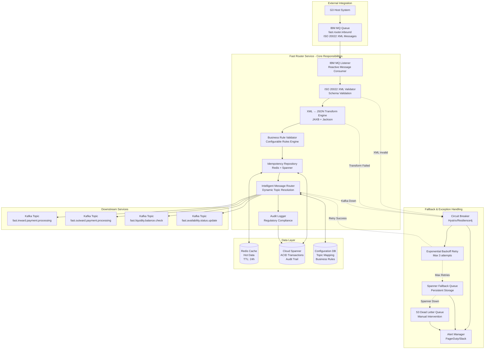
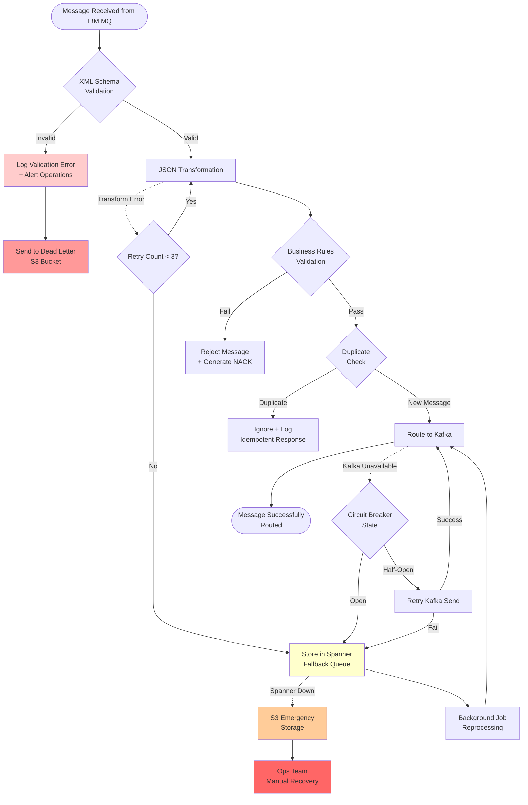
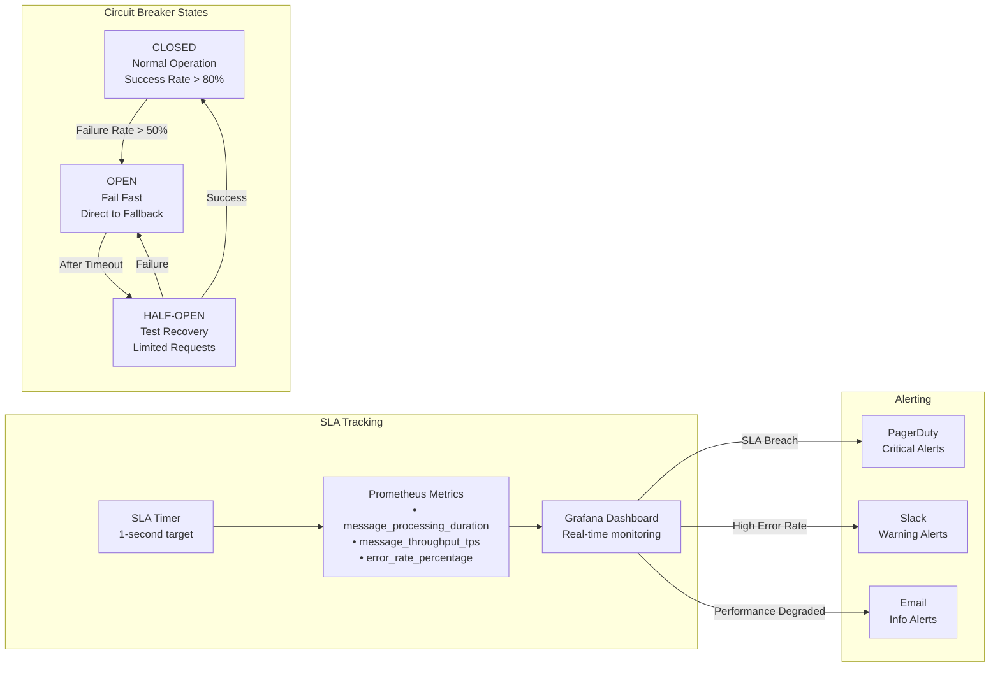

# Fast Router Service - Technical Architecture & Exception Handling

## Service Responsibilities & Data Flow



## Exception Handling Decision Tree



## API Contracts & Message Samples

### 1. IBM MQ Input Contract

**Queue Configuration:**
```yaml
ibm.mq:
  queue-manager: QM_FAST_SG
  channel: SYSTEM.DEF.SVRCONN
  connection-name: mq.anz.com(1414)
  user: fast_router_user
  
queues:
  inbound:
    name: FAST.ROUTER.INBOUND
    get-enabled: true
    put-enabled: false
    max-depth: 10000
    message-persistence: PERSISTENT
```

**Sample PACS.008 (Credit Transfer) Input:**
```xml
<?xml version="1.0" encoding="UTF-8"?>
<Document xmlns="urn:iso:std:iso:20022:tech:xsd:pacs.008.001.13">
  <FIToFICstmrCdtTrf>
    <GrpHdr>
      <MsgId>MSG20241201001</MsgId>
      <CreDtTm>2024-12-01T10:30:00.000Z</CreDtTm>
      <NbOfTxs>1</NbOfTxs>
      <CtrlSum>1000.00</CtrlSum>
      <TtlIntrBkSttlmAmt Ccy="SGD">1000.00</TtlIntrBkSttlmAmt>
      <IntrBkSttlmDt>2024-12-01</IntrBkSttlmDt>
      <SttlmInf>
        <SttlmMtd>CLRG</SttlmMtd>
        <ClrSys>
          <Cd>SGP</Cd>
        </ClrSys>
      </SttlmInf>
      <InstgAgt>
        <FinInstnId>
          <BICFI>DBSSSGSG</BICFI>
        </FinInstnId>
      </InstgAgt>
      <InstdAgt>
        <FinInstnId>
          <BICFI>OCBCSGSG</BICFI>
        </FinInstnId>
      </InstdAgt>
    </GrpHdr>
    <CdtTrfTxInf>
      <PmtId>
        <InstrId>INS20241201001</InstrId>
        <EndToEndId>E2E20241201001</EndToEndId>
        <TxId>TXN20241201001</TxId>
        <UETR>12345678-1234-1234-1234-123456789012</UETR>
      </PmtId>
      <IntrBkSttlmAmt Ccy="SGD">1000.00</IntrBkSttlmAmt>
      <ChrgBr>SLEV</ChrgBr>
      <Dbtr>
        <Nm>John Smith</Nm>
        <PstlAdr>
          <Ctry>SG</Ctry>
        </PstlAdr>
      </Dbtr>
      <DbtrAcct>
        <Id>
          <IBAN>SG12DBSS0000000012345678</IBAN>
        </Id>
      </DbtrAcct>
      <DbtrAgt>
        <FinInstnId>
          <BICFI>DBSSSGSG</BICFI>
        </FinInstnId>
      </DbtrAgt>
      <CdtrAgt>
        <FinInstnId>
          <BICFI>OCBCSGSG</BICFI>
        </FinInstnId>
      </CdtrAgt>
      <Cdtr>
        <Nm>Jane Doe</Nm>
        <PstlAdr>
          <Ctry>SG</Ctry>
        </PstlAdr>
      </Cdtr>
      <CdtrAcct>
        <Id>
          <IBAN>SG98OCBC0000000087654321</IBAN>
        </Id>
      </CdtrAcct>
      <RmtInf>
        <Ustrd>Payment for services</Ustrd>
      </RmtInf>
    </CdtTrfTxInf>
  </FIToFICstmrCdtTrf>
</Document>
```

**Sample CAMT.056 (Payment Cancellation) Input:**
```xml
<?xml version="1.0" encoding="UTF-8"?>
<Document xmlns="urn:iso:std:iso:20022:tech:xsd:camt.056.001.11">
  <FIToFIPmtCxlReq>
    <Assgnmt>
      <Id>CXL20241201001</Id>
      <Assgnr>
        <Agt>
          <FinInstnId>
            <BICFI>DBSSSGSG</BICFI>
          </FinInstnId>
        </Agt>
      </Assgnr>
      <Assgne>
        <Agt>
          <FinInstnId>
            <BICFI>OCBCSGSG</BICFI>
          </FinInstnId>
        </Agt>
      </Assgne>
      <CreDtTm>2024-12-01T11:00:00.000Z</CreDtTm>
    </Assgnmt>
    <Case>
      <Id>CASE20241201001</Id>
      <Cretr>
        <Agt>
          <FinInstnId>
            <BICFI>DBSSSGSG</BICFI>
          </FinInstnId>
        </Agt>
      </Cretr>
    </Case>
    <CtrlData>
      <NbOfCxlTxs>1</NbOfCxlTxs>
      <CtrlSum>1000.00</CtrlSum>
    </CtrlData>
    <Undrlyg>
      <TxInf>
        <CxlId>CXL20241201001</CxlId>
        <OrgnlInstrId>INS20241201001</OrgnlInstrId>
        <OrgnlEndToEndId>E2E20241201001</OrgnlEndToEndId>
        <OrgnlTxId>TXN20241201001</OrgnlTxId>
        <OrgnlIntrBkSttlmAmt Ccy="SGD">1000.00</OrgnlIntrBkSttlmAmt>
        <CxlRsnInf>
          <Rsn>
            <Cd>DUPL</Cd>
          </Rsn>
          <AddtlInf>Duplicate transaction detected</AddtlInf>
        </CxlRsnInf>
      </TxInf>
    </Undrlyg>
  </FIToFIPmtCxlReq>
</Document>
```

### 2. Unified JSON Output (Kafka)

**Sample Transformed PACS.008:**
```json
{
  "messageType": "PACS_008",
  "messageVersion": "13",
  "groupHeader": {
    "messageId": "MSG20241201001",
    "creationDateTime": "2024-12-01T10:30:00.000Z",
    "numberOfTransactions": "1",
    "controlSum": 1000.00,
    "totalInterbankSettlementAmount": {
      "value": 1000.00,
      "currency": "SGD"
    },
    "interbankSettlementDate": "2024-12-01",
    "settlementInformation": {
      "settlementMethod": "CLRG",
      "clearingSystem": {
        "code": "SGP"
      }
    },
    "instructingAgent": {
      "financialInstitutionIdentification": {
        "bicfi": "DBSSSGSG"
      }
    },
    "instructedAgent": {
      "financialInstitutionIdentification": {
        "bicfi": "OCBCSGSG"
      }
    }
  },
  "transactionInformation": [
    {
      "paymentIdentification": {
        "instructionId": "INS20241201001",
        "endToEndId": "E2E20241201001",
        "txId": "TXN20241201001",
        "uetr": "12345678-1234-1234-1234-123456789012"
      },
      "interbankSettlementAmount": {
        "value": 1000.00,
        "currency": "SGD"
      },
      "chargeBearer": "SLEV",
      "debtor": {
        "name": "John Smith",
        "postalAddress": {
          "country": "SG"
        }
      },
      "debtorAccount": {
        "identification": {
          "iban": "SG12DBSS0000000012345678"
        }
      },
      "debtorAgent": {
        "financialInstitutionIdentification": {
          "bicfi": "DBSSSGSG"
        }
      },
      "creditorAgent": {
        "financialInstitutionIdentification": {
          "bicfi": "OCBCSGSG"
        }
      },
      "creditor": {
        "name": "Jane Doe",
        "postalAddress": {
          "country": "SG"
        }
      },
      "creditorAccount": {
        "identification": {
          "iban": "SG98OCBC0000000087654321"
        }
      },
      "remittanceInformation": {
        "unstructured": "Payment for services"
      }
    }
  ],
  "processingMetadata": {
    "receivedTimestamp": 1733051400000,
    "sourceService": "fast-router-service",
    "targetService": "fast-inward-clearing-processor",
    "correlationId": "CORR-20241201-001",
    "traceId": "TRACE-20241201-001",
    "idempotencyKey": "IDEM-MSG20241201001",
    "retryCount": 0
  }
}
```

### 3. Internal Service APIs

**Configuration Management API:**
```yaml
paths:
  /api/v1/router/config/topics:
    get:
      summary: Get topic configuration
      responses:
        200:
          content:
            application/json:
              schema:
                type: object
                properties:
                  topics:
                    type: array
                    items:
                      type: object
                      properties:
                        messageType: 
                          type: string
                          enum: [PACS_008, PACS_003, PACS_007, CAMT_056, PACS_002, CAMT_029]
                        targetTopic:
                          type: string
                        enabled:
                          type: boolean
                        priority:
                          type: integer
                example:
                  topics:
                    - messageType: "PACS_008"
                      targetTopic: "fast.inward.payment.processing"
                      enabled: true
                      priority: 1
                    - messageType: "CAMT_056"
                      targetTopic: "fast.inward.cancellation.processing"
                      enabled: true
                      priority: 2

  /api/v1/router/health:
    get:
      summary: Health check endpoint
      responses:
        200:
          content:
            application/json:
              schema:
                type: object
                properties:
                  status:
                    type: string
                    enum: [UP, DOWN, DEGRADED]
                  components:
                    type: object
                    properties:
                      ibmMQ:
                        type: string
                      kafka:
                        type: string
                      spanner:
                        type: string
                      redis:
                        type: string
                example:
                  status: "UP"
                  components:
                    ibmMQ: "UP"
                    kafka: "UP"
                    spanner: "UP"
                    redis: "UP"
```

## Performance Monitoring & SLAs



## Technology Stack Details

```yaml
Dependencies:
  spring-boot: 3.2.1
  java: 21
  virtual-threads: enabled
  
  # IBM MQ Integration
  ibm-mq-spring-boot-starter: 3.2.1
  mq-jms-spring: 3.2.1
  
  # Kafka Integration
  spring-cloud-stream: 4.1.0
  spring-cloud-stream-binder-kafka: 4.1.0
  
  # Data Layer
  spring-cloud-gcp-starter-data-spanner: 4.9.0
  spring-data-redis: 3.2.1
  
  # Serialization
  jackson-databind: 2.16.1
  jakarta.xml.bind-api: 4.0.1
  
  # Monitoring
  micrometer-registry-prometheus: 1.12.1
  spring-boot-starter-actuator: 3.2.1
  
  # Resilience
  resilience4j-spring-boot3: 2.1.0
  
JVM Configuration:
  heap: "-Xms2g -Xmx4g"
  gc: "-XX:+UseZGC"
  virtual-threads: "-XX:+UseVirtualThreads"
  monitoring: "-XX:+FlightRecorder"
```