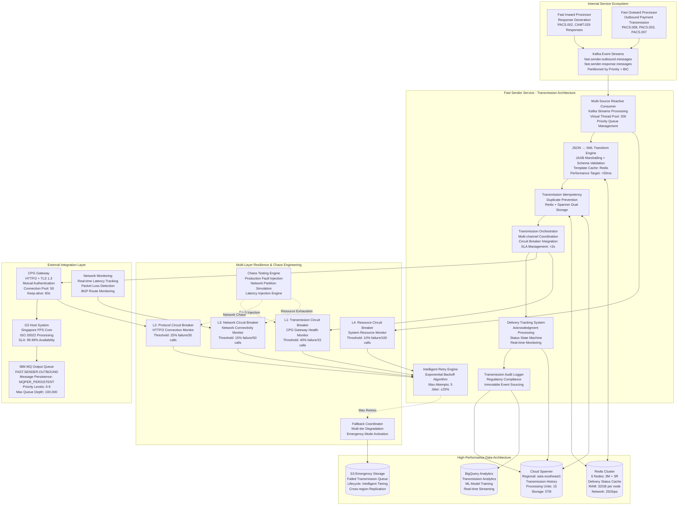

# Fast Sender Service - Deep Technical Architecture & Implementation

## Core Service Responsibilities & Transmission Pipeline

This enhanced Sender Service documentation now provides comprehensive technical architecture details suitable for production implementation, including detailed database schemas, advanced resilience patterns, chaos engineering strategies, complete traceability systems, and operational UI specifications.

<function_calls>
<invoke name="todo_write">
<parameter name="merge">true