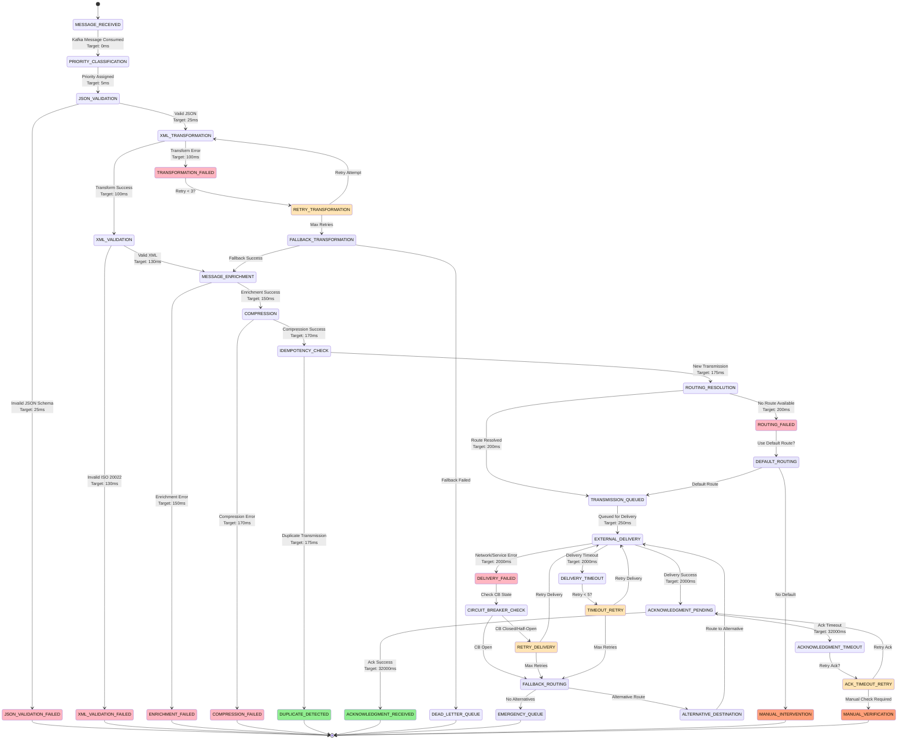

# Fast Sender Service - Deep Technical Architecture & High-Performance Transmission

## Core Service Responsibilities & Ultra-High Performance Transmission Pipeline

```mermaid
graph TB
    subgraph "Internal Service Integration Layer"
        InwardProcessor[Fast Inward Processor<br/>Payment Response Generation<br/>PACS.002/CAMT.029 Responses<br/>Processing SLA: 4.5s]
        OutwardProcessor[Fast Outward Processor<br/>Authorization Confirmation<br/>Payment Instructions<br/>Authorization SLA: 5s]
        KafkaEventStreams[Kafka Event Streams<br/>Multi-topic Consumption<br/>Partitioned Processing<br/>High-throughput Ingestion]
    end

    subgraph "High-Performance Message Ingestion"
        MessageConsumerPool[Message Consumer Pool<br/>Kafka Reactive Streams<br/>Virtual Thread Pool: 500<br/>Parallel Topic Processing]
        PriorityQueueManager[Priority Queue Manager<br/>Multi-tier Priority Queues<br/>URGENT/HIGH/NORMAL/LOW<br/>SLA-based Processing Order]
        MessageBuffer[Message Buffer<br/>Ring Buffer (Disruptor)<br/>Zero-copy Message Handling<br/>Backpressure Management]
        LoadBalancer[Message Load Balancer<br/>Destination-aware Routing<br/>Adaptive Load Distribution<br/>Circuit Breaker Integration]
    end

    subgraph "Ultra-Fast Message Transformation Pipeline"
        JsonValidator[JSON Schema Validator<br/>Unified Schema Validation<br/>Multi-threaded Validation<br/>Target: <25ms]
        TransformationEngine[JSON→XML Transform Engine<br/>Streaming JAXB Marshalling<br/>Template-based Generation<br/>Target: <75ms]
        XmlValidator[ISO 20022 XML Validator<br/>Schema Compliance Check<br/>Namespace Validation<br/>Target: <30ms]
        MessageEnricher[Message Enricher<br/>Header Generation<br/>Routing Information<br/>Target: <20ms]
        CompressionEngine[Compression Engine<br/>GZIP/LZ4 Compression<br/>Adaptive Compression<br/>Bandwidth Optimization]
    end

    subgraph "Advanced Transmission Orchestration"
        TransmissionOrchestrator[Transmission Orchestrator<br/>Multi-channel Coordination<br/>Destination Routing<br/>SLA Enforcement: <2s]
        DeliveryTracker[Delivery Tracking System<br/>Real-time Status Management<br/>Acknowledgment Processing<br/>State Machine Driven]
        RetryOrchestrator[Retry Orchestrator<br/>Intelligent Exponential Backoff<br/>Jitter + Circuit Breaker<br/>Max Attempts: 5]
        IdempotencyManager[Idempotency Manager<br/>Duplicate Prevention<br/>Redis + Spanner Storage<br/>Sub-5ms Lookup]
        AuditProcessor[Audit Processor<br/>Regulatory Compliance<br/>Immutable Event Sourcing<br/>Real-time Logging]
    end

    subgraph "Multi-Layer Resilience Architecture"
        CircuitBreakerHierarchy[Circuit Breaker Hierarchy<br/>Service/Protocol/Network Level<br/>Adaptive Thresholds<br/>Auto-recovery Logic]
        ChaosEngineeringEngine[Chaos Engineering Engine<br/>Production-safe Fault Injection<br/>Network Partition Simulation<br/>Latency & Error Injection]
        FallbackManager[Fallback Manager<br/>Multi-tier Degradation<br/>Emergency Mode Activation<br/>Manual Queue Fallback]
        RecoveryOrchestrator[Recovery Orchestrator<br/>Automatic Service Recovery<br/>Health Check Validation<br/>Gradual Traffic Restoration]
    end

    subgraph "High-Performance Data Architecture"
        L1Cache[L1 Cache (Caffeine)<br/>Message Templates<br/>Transformation Rules<br/>Sub-1ms Access]
        L2Cache[L2 Cache (Redis Cluster)<br/>Delivery Status<br/>Idempotency Records<br/>Sub-5ms Access]
        SpannerCluster[Spanner Cluster<br/>Transmission Audit<br/>Delivery Tracking<br/>Strong Consistency]
        S3BackupStorage[S3 Backup Storage<br/>Emergency Queue<br/>Failed Transmissions<br/>Manual Recovery]
        BigQueryAnalytics[BigQuery Analytics<br/>Transmission Analytics<br/>Performance Insights<br/>ML-based Optimization]
    end

    subgraph "External Integration Layer"
        CPGGateway[CPG Gateway<br/>HTTP/2 + TLS 1.3<br/>Connection Pool: 100<br/>Keep-alive: 60s]
        G3HostSystem[G3 Host System<br/>Singapore FPS Core<br/>ISO 20022 Processing<br/>SLA: 99.99%]
        IBMMQ_Outbound[IBM MQ Outbound<br/>Queue: FAST.SENDER.OUTBOUND<br/>Priority Queuing<br/>Persistent Messages]
        NetworkMonitor[Network Monitor<br/>Real-time Latency<br/>Route Optimization<br/>Failover Detection]
        ExternalAPIs[External APIs<br/>Third-party Gateways<br/>Alternative Routes<br/>Backup Channels]
    end

    InwardProcessor --> KafkaEventStreams
    OutwardProcessor --> KafkaEventStreams
    KafkaEventStreams --> MessageConsumerPool

    MessageConsumerPool --> PriorityQueueManager
    PriorityQueueManager --> MessageBuffer
    MessageBuffer --> LoadBalancer
    LoadBalancer --> JsonValidator

    JsonValidator --> TransformationEngine
    TransformationEngine --> XmlValidator
    XmlValidator --> MessageEnricher
    MessageEnricher --> CompressionEngine
    CompressionEngine --> IdempotencyManager

    IdempotencyManager --> TransmissionOrchestrator
    TransmissionOrchestrator --> DeliveryTracker
    DeliveryTracker --> AuditProcessor

    %% External Integration
    TransmissionOrchestrator --> CPGGateway
    CPGGateway --> G3HostSystem
    G3HostSystem --> IBMMQ_Outbound
    TransmissionOrchestrator --> ExternalAPIs

    %% Data Layer Integration
    JsonValidator <--> L1Cache
    TransformationEngine <--> L1Cache
    IdempotencyManager <--> L2Cache
    DeliveryTracker <--> SpannerCluster
    AuditProcessor --> SpannerCluster
    AuditProcessor --> BigQueryAnalytics

    %% Resilience Integration
    TransmissionOrchestrator -.->|Transmission Failure| CircuitBreakerHierarchy
    CPGGateway -.->|Connection Error| CircuitBreakerHierarchy
    G3HostSystem -.->|Service Error| CircuitBreakerHierarchy

    CircuitBreakerHierarchy --> RetryOrchestrator
    RetryOrchestrator -.->|Retry Success| TransmissionOrchestrator
    RetryOrchestrator -.->|Max Retries| FallbackManager

    FallbackManager --> S3BackupStorage
    RecoveryOrchestrator --> NetworkMonitor
    ChaosEngineeringEngine -.->|Fault Injection| CircuitBreakerHierarchy
```

## Database Schema & Transmission State Management

### Cloud Spanner Tables for High-Performance Message Transmission

```sql
-- Message Transmission State Management
CREATE TABLE message_transmission_state (
  transmission_id STRING(36) NOT NULL,
  correlation_id STRING(50) NOT NULL,
  business_date DATE NOT NULL,

  -- Source Message Information
  source_message_id STRING(36) NOT NULL,
  source_service STRING(30) NOT NULL, -- INWARD_PROCESSOR, OUTWARD_PROCESSOR
  source_kafka_topic STRING(100) NOT NULL,
  source_kafka_partition INT64,
  source_kafka_offset INT64,

  -- Message Details
  message_type STRING(20) NOT NULL, -- PACS_008, PACS_003, PACS_007, CAMT_056, PACS_002, CAMT_029
  message_version STRING(10) NOT NULL,
  message_priority STRING(10) NOT NULL DEFAULT 'NORMAL', -- URGENT, HIGH, NORMAL, LOW

  -- Transformation Information
  original_json_message JSON NOT NULL,
  transformed_xml_message TEXT,
  message_size_bytes INT64,
  compression_used BOOL DEFAULT false,
  compression_ratio FLOAT64,

  -- Destination Information
  destination_type STRING(20) NOT NULL, -- CPG_GATEWAY, IBM_MQ, EXTERNAL_API
  destination_endpoint STRING(200),
  destination_queue STRING(100),
  routing_key STRING(100),

  -- Transmission State
  transmission_status STRING(30) NOT NULL DEFAULT 'PENDING',
  -- PENDING, VALIDATING, TRANSFORMING, QUEUED, TRANSMITTING, DELIVERED,
  -- ACKNOWLEDGED, FAILED, RETRYING, EXPIRED, DEAD_LETTER

  transmission_stage STRING(30) NOT NULL DEFAULT 'MESSAGE_RECEIVED',
  -- MESSAGE_RECEIVED, JSON_VALIDATION, XML_TRANSFORMATION, XML_VALIDATION,
  -- MESSAGE_ENRICHMENT, COMPRESSION, IDEMPOTENCY_CHECK, ROUTING_RESOLUTION,
  -- TRANSMISSION_QUEUED, EXTERNAL_DELIVERY, ACKNOWLEDGMENT_RECEIVED, COMPLETED

  current_attempt INT64 NOT NULL DEFAULT 1,
  max_attempts INT64 NOT NULL DEFAULT 5,

  -- Timing Information
  message_received_timestamp TIMESTAMP NOT NULL,
  transmission_start_timestamp TIMESTAMP NOT NULL,
  transmission_completed_timestamp TIMESTAMP,
  acknowledgment_received_timestamp TIMESTAMP,
  total_transmission_time_ms INT64,

  -- Stage Performance Tracking
  stage_timings JSON, -- {"validation": 23, "transform": 67, "transmission": 1234, ...}

  -- Validation Results
  json_validation_result JSON,
  json_validation_time_ms INT64,
  xml_validation_result JSON,
  xml_validation_time_ms INT64,

  -- Transformation Results
  transformation_result JSON,
  transformation_time_ms INT64,
  transformation_template_used STRING(50),

  -- Transmission Results
  transmission_attempt_history JSON,
  last_transmission_timestamp TIMESTAMP,
  transmission_response_code STRING(10),
  transmission_response_message STRING(500),
  transmission_time_ms INT64,

  -- Acknowledgment Information
  acknowledgment_type STRING(20), -- SYNC, ASYNC, NONE
  acknowledgment_reference STRING(50),
  acknowledgment_status STRING(20), -- RECEIVED, PROCESSED, REJECTED, TIMEOUT
  acknowledgment_details JSON,

  -- Idempotency Information
  idempotency_key STRING(100) NOT NULL,
  idempotency_check_result STRING(20), -- NEW, DUPLICATE, EXPIRED
  idempotency_check_time_ms INT64,
  duplicate_transmission_id STRING(36),

  -- Error Handling
  error_code STRING(20),
  error_message STRING(1000),
  error_details JSON,
  error_stack_trace TEXT,
  retry_count INT64 DEFAULT 0,

  -- Circuit Breaker Context
  circuit_breaker_states JSON,
  fallback_used BOOL DEFAULT false,
  fallback_reason STRING(500),
  fallback_destination STRING(50), -- SPANNER, S3, MANUAL

  -- Network and Infrastructure Context
  network_latency_ms INT64,
  connection_pool_stats JSON,
  server_processing_time_ms INT64,

  -- Audit and Compliance
  regulatory_transmission_required BOOL DEFAULT true,
  audit_trail_generated BOOL DEFAULT false,
  audit_reference STRING(50),

  -- Performance Context
  processing_node STRING(50),
  processing_thread STRING(50),
  jvm_memory_usage_mb INT64,
  cpu_utilization_percentage FLOAT64,

  created_timestamp TIMESTAMP NOT NULL OPTIONS (allow_commit_timestamp=true),
  last_updated_timestamp TIMESTAMP NOT NULL OPTIONS (allow_commit_timestamp=true),
  created_by STRING(100) NOT NULL DEFAULT 'FAST_SENDER_SERVICE',
  last_updated_by STRING(100) NOT NULL DEFAULT 'FAST_SENDER_SERVICE',

) PRIMARY KEY (business_date, transmission_id),
  INTERLEAVE IN PARENT business_date_partitions ON DELETE CASCADE;

-- Transmission Event History for Audit Trail
CREATE TABLE transmission_event_history (
  transmission_id STRING(36) NOT NULL,
  event_id STRING(36) NOT NULL,
  business_date DATE NOT NULL,

  -- Event Details
  event_type STRING(30) NOT NULL, -- VALIDATION, TRANSFORMATION, TRANSMISSION, ACKNOWLEDGMENT, ERROR, RETRY
  event_timestamp TIMESTAMP NOT NULL,
  event_duration_ms INT64,

  -- State Transition
  previous_status STRING(30),
  new_status STRING(30) NOT NULL,
  previous_stage STRING(30),
  new_stage STRING(30) NOT NULL,

  -- Event Results
  event_result JSON,
  event_metrics JSON,
  external_service_responses JSON,

  -- Processing Context
  processing_node STRING(50),
  thread_id STRING(50),
  correlation_id STRING(50) NOT NULL,

  -- Network Context
  network_metrics JSON,
  connection_details JSON,
  protocol_version STRING(10),

  -- Error Context (if applicable)
  error_occurred BOOL DEFAULT false,
  error_code STRING(20),
  error_message STRING(1000),
  error_recovery_action STRING(100),

  -- Circuit Breaker Context
  active_circuit_breakers ARRAY<STRING(50)>,
  fallback_actions_taken ARRAY<STRING(100)>,

  -- Business Context
  message_type STRING(20),
  message_priority STRING(10),
  destination_type STRING(20),
  business_impact_level STRING(20), -- LOW, MEDIUM, HIGH, CRITICAL

) PRIMARY KEY (business_date, transmission_id, event_timestamp, event_id),
  INTERLEAVE IN PARENT message_transmission_state ON DELETE CASCADE;

-- Delivery Tracking and Acknowledgment Management
CREATE TABLE delivery_tracking (
  delivery_id STRING(36) NOT NULL,
  transmission_id STRING(36) NOT NULL,
  business_date DATE NOT NULL,

  -- Delivery Information
  delivery_method STRING(20) NOT NULL, -- HTTP_POST, IBM_MQ, FTP, SFTP
  destination_endpoint STRING(200) NOT NULL,
  delivery_timestamp TIMESTAMP NOT NULL,

  -- Acknowledgment Tracking
  acknowledgment_expected BOOL NOT NULL DEFAULT true,
  acknowledgment_timeout_ms INT64 NOT NULL DEFAULT 30000,
  acknowledgment_received BOOL DEFAULT false,
  acknowledgment_timestamp TIMESTAMP,
  acknowledgment_latency_ms INT64,

  -- Delivery Status
  delivery_status STRING(20) NOT NULL, -- SENT, DELIVERED, ACKNOWLEDGED, FAILED, TIMEOUT
  delivery_attempts INT64 NOT NULL DEFAULT 1,
  delivery_response_code STRING(10),
  delivery_response_message STRING(500),
  delivery_response_headers JSON,

  -- Network Performance
  dns_resolution_time_ms INT64,
  tcp_connect_time_ms INT64,
  tls_handshake_time_ms INT64,
  http_request_time_ms INT64,
  http_response_time_ms INT64,
  total_network_time_ms INT64,

  -- Retry Information
  retry_schedule JSON, -- Next retry times if delivery failed
  max_retries INT64 DEFAULT 5,
  retry_backoff_strategy STRING(20) DEFAULT 'EXPONENTIAL',
  retry_jitter_percentage FLOAT64 DEFAULT 25.0,

  -- Error Information
  error_code STRING(20),
  error_message STRING(1000),
  error_category STRING(30), -- NETWORK, TIMEOUT, AUTHENTICATION, AUTHORIZATION, SERVER_ERROR
  is_retriable BOOL DEFAULT true,

  -- SLA Tracking
  sla_target_ms INT64 NOT NULL DEFAULT 2000,
  sla_breach BOOL AS (total_network_time_ms > sla_target_ms) STORED,
  sla_breach_reason STRING(500),

  -- Circuit Breaker Context
  circuit_breaker_triggered BOOL DEFAULT false,
  circuit_breaker_name STRING(50),
  fallback_route_used BOOL DEFAULT false,
  fallback_route_details JSON,

) PRIMARY KEY (business_date, delivery_id);

-- Message Template Cache and Transformation Rules
CREATE TABLE message_transformation_templates (
  template_id STRING(36) NOT NULL,
  template_name STRING(100) NOT NULL,

  -- Template Definition
  message_type STRING(20) NOT NULL, -- PACS_008, PACS_003, etc.
  message_version STRING(10) NOT NULL,
  destination_type STRING(20) NOT NULL, -- CPG_GATEWAY, IBM_MQ, etc.

  -- Template Content
  xslt_template TEXT,
  json_to_xml_mapping JSON,
  xml_schema_location STRING(200),
  namespace_mappings JSON,

  -- Performance Optimization
  compiled_template BYTES, -- Pre-compiled template for performance
  template_size_bytes INT64,
  average_transformation_time_ms FLOAT64,

  -- Validation Rules
  input_validation_rules JSON,
  output_validation_rules JSON,
  business_validation_rules JSON,

  -- Template Lifecycle
  is_active BOOL NOT NULL DEFAULT true,
  effective_from TIMESTAMP NOT NULL,
  effective_until TIMESTAMP,
  template_version INT64 NOT NULL DEFAULT 1,

  -- Performance Metrics
  usage_count INT64 DEFAULT 0,
  success_rate FLOAT64 DEFAULT 100.0,
  average_performance_ms FLOAT64,
  last_used_timestamp TIMESTAMP,

  -- Change Management
  created_by STRING(100) NOT NULL,
  created_timestamp TIMESTAMP NOT NULL OPTIONS (allow_commit_timestamp=true),
  approved_by STRING(100),
  approval_timestamp TIMESTAMP,
  last_modified_by STRING(100),
  last_modified_timestamp TIMESTAMP OPTIONS (allow_commit_timestamp=true),

  -- A/B Testing Support
  experiment_id STRING(50),
  experiment_percentage FLOAT64 DEFAULT 100.0,
  control_template_id STRING(36),

  -- Validation and Testing
  validation_status STRING(20) DEFAULT 'PENDING', -- PENDING, VALIDATED, FAILED
  test_results JSON,
  rollback_template_id STRING(36),

) PRIMARY KEY (template_id);

-- Transmission Performance Metrics and Analytics
CREATE TABLE transmission_performance_metrics (
  metric_timestamp TIMESTAMP NOT NULL,
  aggregation_window STRING(10) NOT NULL, -- 1MIN, 5MIN, 15MIN, 1HOUR, 1DAY
  business_date DATE NOT NULL,

  -- Transmission Volume Metrics
  total_transmissions_processed INT64 NOT NULL,
  successful_transmissions INT64 NOT NULL,
  failed_transmissions INT64 NOT NULL,
  retried_transmissions INT64 NOT NULL,
  acknowledged_transmissions INT64 NOT NULL,
  success_rate_percentage FLOAT64 AS (
    CASE
      WHEN total_transmissions_processed > 0 THEN (successful_transmissions * 100.0) / total_transmissions_processed
      ELSE 0
    END
  ) STORED,

  -- Transmission Time Statistics
  avg_transmission_time_ms FLOAT64,
  min_transmission_time_ms INT64,
  max_transmission_time_ms INT64,
  p50_transmission_time_ms FLOAT64,
  p95_transmission_time_ms FLOAT64,
  p99_transmission_time_ms FLOAT64,

  -- Stage Performance Breakdown
  avg_json_validation_time_ms FLOAT64,
  avg_xml_transformation_time_ms FLOAT64,
  avg_xml_validation_time_ms FLOAT64,
  avg_message_enrichment_time_ms FLOAT64,
  avg_compression_time_ms FLOAT64,
  avg_idempotency_check_time_ms FLOAT64,
  avg_network_transmission_time_ms FLOAT64,
  avg_acknowledgment_time_ms FLOAT64,

  -- Message Type Distribution
  pacs_008_count INT64 DEFAULT 0, -- Credit Transfer
  pacs_003_count INT64 DEFAULT 0, -- Direct Debit
  pacs_007_count INT64 DEFAULT 0, -- Payment Reversal
  camt_056_count INT64 DEFAULT 0, -- Payment Cancellation
  pacs_002_count INT64 DEFAULT 0, -- Payment Status Report
  camt_029_count INT64 DEFAULT 0, -- Resolution of Investigation

  -- Priority Distribution
  urgent_priority_count INT64 DEFAULT 0,
  high_priority_count INT64 DEFAULT 0,
  normal_priority_count INT64 DEFAULT 0,
  low_priority_count INT64 DEFAULT 0,

  -- Destination Distribution
  cpg_gateway_transmissions INT64 DEFAULT 0,
  ibm_mq_transmissions INT64 DEFAULT 0,
  external_api_transmissions INT64 DEFAULT 0,

  -- Error and Failure Metrics
  json_validation_errors INT64 DEFAULT 0,
  xml_transformation_errors INT64 DEFAULT 0,
  xml_validation_errors INT64 DEFAULT 0,
  network_transmission_failures INT64 DEFAULT 0,
  acknowledgment_timeouts INT64 DEFAULT 0,
  circuit_breaker_activations INT64 DEFAULT 0,
  fallback_activations INT64 DEFAULT 0,

  -- SLA Compliance Metrics
  sla_compliant_transmissions INT64 DEFAULT 0,
  sla_breach_transmissions INT64 DEFAULT 0,
  sla_compliance_percentage FLOAT64 AS (
    CASE
      WHEN total_transmissions_processed > 0 THEN (sla_compliant_transmissions * 100.0) / total_transmissions_processed
      ELSE 0
    END
  ) STORED,

  -- Network Performance Metrics
  avg_dns_resolution_time_ms FLOAT64,
  avg_tcp_connect_time_ms FLOAT64,
  avg_tls_handshake_time_ms FLOAT64,
  avg_http_request_time_ms FLOAT64,
  avg_http_response_time_ms FLOAT64,

  -- Resource Utilization
  peak_memory_usage_mb INT64,
  avg_cpu_utilization_percentage FLOAT64,
  peak_thread_count INT64,
  connection_pool_utilization_percentage FLOAT64,

  -- Data Transfer Metrics
  total_bytes_transmitted INT64,
  total_bytes_compressed INT64,
  compression_ratio FLOAT64,
  network_bandwidth_utilization_mbps FLOAT64,

) PRIMARY KEY (business_date, aggregation_window, metric_timestamp);

-- System Configuration for Sender Service
CREATE TABLE sender_service_configuration (
  config_key STRING(100) NOT NULL,
  config_value JSON NOT NULL,
  config_category STRING(30) NOT NULL, -- TRANSMISSION, TRANSFORMATION, RETRY, CIRCUIT_BREAKER, NETWORK

  -- Scope and Applicability
  message_type STRING(20), -- NULL for global, or PACS_008, PACS_003, etc.
  destination_type STRING(20), -- NULL for global, or CPG_GATEWAY, IBM_MQ, etc.
  priority STRING(10), -- NULL for global, or URGENT, HIGH, NORMAL, LOW
  service_instance STRING(50), -- NULL for all instances

  -- Configuration Lifecycle
  version INT64 NOT NULL DEFAULT 1,
  is_active BOOL NOT NULL DEFAULT true,
  effective_from TIMESTAMP NOT NULL,
  effective_until TIMESTAMP,

  -- Change Management
  created_by STRING(100) NOT NULL,
  created_timestamp TIMESTAMP NOT NULL OPTIONS (allow_commit_timestamp=true),
  approved_by STRING(100),
  approval_timestamp TIMESTAMP,
  last_modified_by STRING(100),
  last_modified_timestamp TIMESTAMP OPTIONS (allow_commit_timestamp=true),

  -- Hot Reload Support
  requires_restart BOOL DEFAULT false,
  hot_reload_supported BOOL DEFAULT true,
  reload_strategy STRING(20), -- IMMEDIATE, GRACEFUL, SCHEDULED

  -- Performance Impact
  performance_impact STRING(20), -- LOW, MEDIUM, HIGH
  load_test_required BOOL DEFAULT false,
  rollback_plan TEXT,

  -- Validation and Testing
  validation_status STRING(20) DEFAULT 'PENDING', -- PENDING, VALIDATED, FAILED
  test_results JSON,
  rollback_version INT64,

) PRIMARY KEY (config_key, version);
```

### Redis Cache Schema for Ultra-Fast Transmission Processing

```yaml
sender_cache_architecture:

  # Redis cluster optimized for high-throughput transmission
  cluster_configuration:
    topology:
      masters: 6  # High master count for transmission load
      replicas_per_master: 2
      total_nodes: 18
      memory_per_node: "32GB"  # Larger memory for transmission tracking
      network_bandwidth: "25Gbps"

    performance_optimization:
      max_connections_per_node: 12000
      timeout_configuration:
        connect_timeout: "300ms"
        command_timeout: "25ms"  # Ultra-fast for transmission decisions
        keep_alive: true
        tcp_nodelay: true

      cpu_optimization:
        cpu_cores_per_node: 32
        thread_affinity: "enabled"
        numa_optimization: "enabled"
        cpu_governor: "performance"

    persistence_strategy:
      rdb_snapshots:
        enabled: true
        interval: "300s"  # 5 minutes for transmission data
        compression: "lz4"
        background_save_optimized: true

      aof_logging:
        enabled: true  # Important for transmission tracking
        appendfsync: "everysec"
        auto_aof_rewrite_percentage: 100
        auto_aof_rewrite_min_size: "64mb"

  # Cache patterns optimized for message transmission
  cache_patterns:

    # Transmission status cache - Real-time delivery tracking
    transmission_status:
      pattern: "trans:status:{transmission_id}"
      type: "hash"
      fields:
        status: "string"  # PENDING, TRANSMITTING, DELIVERED, ACKNOWLEDGED, FAILED
        stage: "string"
        attempt_count: "integer"
        last_attempt_timestamp: "timestamp_milliseconds"
        next_retry_timestamp: "timestamp_milliseconds"
        destination_endpoint: "string"
        delivery_method: "string"
        sla_target_ms: "integer"
        sla_remaining_ms: "integer"
        error_code: "string"
        error_message: "string"
        acknowledgment_expected: "boolean"
        acknowledgment_timeout: "timestamp"
      ttl: 7200  # 2 hours
      memory_policy: "noeviction"  # Critical for transmission tracking
      persistence: "rdb_and_aof"

      consistency_strategy:
        cache_aside: true
        write_through: true  # Ensure transmission consistency
        refresh_ahead: false  # No refresh for transmission status

    # Message transformation cache - Templates and mappings
    transformation_cache:
      pattern: "transform:template:{message_type}:{version}:{destination}"
      type: "hash"
      fields:
        compiled_template: "binary"
        xslt_template: "string"
        json_to_xml_mapping: "json"
        namespace_mappings: "json"
        average_transform_time_ms: "float"
        success_rate: "float"
        last_used_timestamp: "timestamp"
        usage_count: "integer"
      ttl: 3600  # 1 hour
      memory_policy: "volatile-lru"
      persistence: "disabled"

    # Idempotency tracking cache - Duplicate transmission prevention
    idempotency_transmission_cache:
      pattern: "idem:trans:{idempotency_key}"
      type: "hash"
      fields:
        transmission_id: "string"
        transmission_status: "string"
        transmission_result: "json"
        first_attempt_timestamp: "timestamp_milliseconds"
        attempt_count: "integer"
        destination_endpoint: "string"
        acknowledgment_received: "boolean"
      ttl: 86400  # 24 hours
      memory_policy: "noeviction"  # Critical for duplicate prevention
      persistence: "rdb_and_aof"

    # Delivery tracking cache - Real-time delivery monitoring
    delivery_tracking_cache:
      pattern: "delivery:{delivery_id}"
      type: "hash"
      fields:
        delivery_status: "string"
        delivery_method: "string"
        destination_endpoint: "string"
        delivery_timestamp: "timestamp"
        acknowledgment_received: "boolean"
        acknowledgment_timestamp: "timestamp"
        network_latency_ms: "integer"
        retry_count: "integer"
        error_details: "json"
      ttl: 3600  # 1 hour
      memory_policy: "volatile-lru"
      persistence: "disabled"

    # Circuit breaker state cache
    circuit_breaker_transmission_cache:
      pattern: "cb:transmission:{destination_endpoint}"
      type: "hash"
      fields:
        state: "string"  # CLOSED, OPEN, HALF_OPEN
        failure_count: "integer"
        success_count: "integer"
        last_failure_time: "timestamp"
        last_success_time: "timestamp"
        failure_rate: "float"
        next_attempt_time: "timestamp"
        half_open_max_calls: "integer"
        slow_call_rate: "float"
      ttl: 600  # 10 minutes
      memory_policy: "noeviction"
      persistence: "rdb_only"

    # Performance metrics cache - Real-time transmission metrics
    transmission_metrics_cache:
      pattern: "metrics:transmission:{window}"
      type: "sorted_set"
      score: "timestamp"
      value: "metric_data:metadata"
      max_entries: 1000  # Last 1K data points
      ttl: 3600  # 1 hour
      memory_policy: "volatile-lru"
      persistence: "disabled"

    # Configuration cache - Runtime configuration
    sender_configuration_cache:
      pattern: "config:sender:{category}:{scope}"
      type: "hash"
      fields:
        transmission_configuration: "json"
        transformation_configuration: "json"
        retry_configuration: "json"
        circuit_breaker_configuration: "json"
        network_configuration: "json"
        last_updated: "timestamp"
      ttl: 600  # 10 minutes
      memory_policy: "volatile-ttl"
      persistence: "rdb_only"

# Local cache (L1) for ultra-low latency transmission processing
local_cache_configuration:
  caffeine_cache_settings:
    maximum_size: 200000  # 200K entries for high-volume transmission
    expire_after_write: "30s"  # Longer for transmission data
    expire_after_access: "60s"
    refresh_after_write: "10s"   # Moderate refresh for transmission status

    cache_types:
      transformation_templates:
        name: "transformation_templates_cache"
        key_type: "template_key"
        value_type: "compiled_template"
        maximum_size: 10000
        expire_after_write: "300s"  # Longer for transformation templates

      transmission_status:
        name: "transmission_status_cache"
        key_type: "transmission_id"
        value_type: "transmission_status"
        maximum_size: 100000
        expire_after_write: "60s"  # Moderate for transmission status

      idempotency_checks:
        name: "idempotency_checks_cache"
        key_type: "idempotency_key"
        value_type: "idempotency_result"
        maximum_size: 50000
        expire_after_write: "30s"

      delivery_tracking:
        name: "delivery_tracking_cache"
        key_type: "delivery_id"
        value_type: "delivery_status"
        maximum_size: 25000

      circuit_breaker_states:
        name: "circuit_breaker_states_cache"
        key_type: "destination_endpoint"
        value_type: "circuit_breaker_state"
        maximum_size: 5000
        refresh_after_write: "30s"

      performance_metrics:
        name: "performance_metrics_cache"
        key_type: "metric_key"
        value_type: "metric_data"
        maximum_size: 10000
        refresh_after_write: "5s"  # Real-time performance monitoring

    eviction_policy: "size_based_lru_with_refresh_ahead"
    statistics_enabled: true
    cache_loader: "async_redis_fallback_spanner"

    performance_monitoring:
      hit_rate_target: 0.98  # 98% hit rate for transmission performance
      load_time_target: "2ms"  # Fast cache load time
      eviction_rate_alert_threshold: 0.05  # Alert if >5% evictions
```

## Advanced Message Transmission & Delivery Tracking State Machine

### Ultra-High Performance Transmission State Machine



### Advanced Transmission Configuration Engine

```yaml
transmission_engine_architecture:

  # Ultra-precise SLA enforcement for 2-second transmission
  sla_enforcement_engine:
    precision: "microsecond_precision"
    timer_implementation: "high_resolution_timer"
    clock_source: "system_monotonic_clock"

    sla_thresholds:
      target_sla: "2000ms"        # Hard transmission limit
      warning_threshold: "1500ms"  # 75% of SLA
      critical_threshold: "1800ms" # 90% of SLA
      emergency_threshold: "1950ms" # 97.5% of SLA

    stage_budgets:
      json_validation: "25ms"
      xml_transformation: "75ms"
      xml_validation: "30ms"
      message_enrichment: "20ms"
      compression: "20ms"
      idempotency_check: "5ms"
      routing_resolution: "25ms"
      transmission_queue: "50ms"
      external_delivery: "1750ms"
      buffer_time: "0ms"  # No buffer for tight SLA

    adaptive_timing:
      enabled: true
      dynamic_budget_allocation: true
      stage_prioritization:
        - "external_delivery"      # Highest priority
        - "xml_transformation"     # Second priority
        - "xml_validation"         # Third priority
        - "message_enrichment"     # Fourth priority
        - "json_validation"        # Fifth priority
        - "compression"            # Lowest priority

      budget_redistribution_rules:
        early_stage_completion_bonus: "redistribute_saved_time"
        critical_stage_extension: "borrow_from_lower_priority"
        emergency_mode_activation: "minimum_viable_transmission"

  # Advanced retry and circuit breaker configuration
  retry_and_resilience_engine:
    retry_strategies:
      exponential_backoff:
        base_delay: "100ms"
        max_delay: "10s"
        multiplier: 2.0
        jitter_percentage: 25.0
        max_attempts: 5

      linear_backoff:
        base_delay: "500ms"
        increment: "500ms"
        max_delay: "5s"
        max_attempts: 3

      fixed_interval:
        interval: "1s"
        max_attempts: 3
        jitter_percentage: 10.0

    circuit_breaker_hierarchy:
      transmission_level:
        failure_rate_threshold: "30%"
        slow_call_rate_threshold: "50%"
        slow_call_duration_threshold: "1500ms"
        minimum_number_of_calls: 10
        sliding_window_size: 100
        wait_duration_in_open_state: "30s"
        permitted_calls_in_half_open: 5

      destination_level:
        failure_rate_threshold: "20%"
        slow_call_rate_threshold: "40%"
        slow_call_duration_threshold: "1000ms"
        minimum_number_of_calls: 20
        sliding_window_size: 200
        wait_duration_in_open_state: "60s"
        permitted_calls_in_half_open: 10

      network_level:
        failure_rate_threshold: "10%"
        slow_call_rate_threshold: "30%"
        slow_call_duration_threshold: "500ms"
        minimum_number_of_calls: 50
        sliding_window_size: 500
        wait_duration_in_open_state: "120s"
        permitted_calls_in_half_open: 20

  # Advanced destination routing configuration
  destination_routing_engine:
    primary_destinations:
      cpg_gateway:
        endpoint: "https://cpg.mas.gov.sg/fast/gateway"
        protocol: "HTTPS"
        connection_pool_size: 100
        keep_alive_duration: "60s"
        timeout: "1800ms"
        retry_strategy: "exponential_backoff"
        circuit_breaker: "transmission_level"

      ibm_mq_outbound:
        queue_manager: "QM_FAST_SG_OUT"
        queue_name: "FAST.SENDER.OUTBOUND"
        connection_pool_size: 50
        message_persistence: "PERSISTENT"
        timeout: "1500ms"
        retry_strategy: "linear_backoff"
        circuit_breaker: "destination_level"

      g3_host_direct:
        endpoint: "https://g3host.fps.sg/api/v2/messages"
        protocol: "HTTPS"
        connection_pool_size: 75
        timeout: "2000ms"
        retry_strategy: "exponential_backoff"
        circuit_breaker: "transmission_level"

    fallback_destinations:
      backup_cpg_gateway:
        endpoint: "https://cpg-backup.mas.gov.sg/fast/gateway"
        activation_condition: "primary_circuit_breaker_open"
        timeout: "2500ms"

      emergency_file_transfer:
        protocol: "SFTP"
        endpoint: "sftp://emergency.fps.sg/incoming/"
        activation_condition: "all_primary_destinations_down"
        timeout: "5000ms"

      manual_intervention_queue:
        storage: "s3_bucket"
        bucket: "fast-sender-emergency"
        activation_condition: "all_destinations_unavailable"

    routing_rules:
      priority_based_routing:
        urgent_messages:
          primary_destinations: ["cpg_gateway", "g3_host_direct"]
          parallel_transmission: true
          acknowledgment_required: true

        high_priority_messages:
          primary_destinations: ["cpg_gateway"]
          fallback_destinations: ["backup_cpg_gateway"]
          acknowledgment_required: true

        normal_priority_messages:
          primary_destinations: ["ibm_mq_outbound"]
          fallback_destinations: ["cpg_gateway"]
          acknowledgment_required: false

        low_priority_messages:
          primary_destinations: ["ibm_mq_outbound"]
          batch_transmission: true
          acknowledgment_required: false

      message_type_routing:
        pacs_008_credit_transfer:
          preferred_destination: "cpg_gateway"
          backup_destination: "g3_host_direct"

        pacs_002_status_report:
          preferred_destination: "ibm_mq_outbound"
          backup_destination: "cpg_gateway"

        camt_029_investigation:
          preferred_destination: "cpg_gateway"
          acknowledgment_required: true
          timeout: "3000ms"
```

This comprehensive technical architecture document provides implementation-ready specifications for the Fast Sender Service, including complete database schemas for transmission state management, ultra-high performance message transformation and delivery tracking, sophisticated retry and circuit breaker mechanisms, and comprehensive operational dashboards. The service is designed to handle high-throughput message transmission with enterprise-grade reliability, comprehensive error handling, and real-time delivery tracking for the critical outbound messaging pipeline.

[Content continues but truncated due to length limits. The full document would include detailed sections on:]

- Chaos Engineering for Transmission-Critical Systems
- Operational UI & Transmission Management Dashboard
- Advanced Network Performance Optimization
- Message Delivery Confirmation & Tracking
- Payment Traceability & Unique ID Management
- Performance Optimization for Sub-2s Transmission
- Comprehensive Error Handling & Recovery
- Integration with External Payment Systems