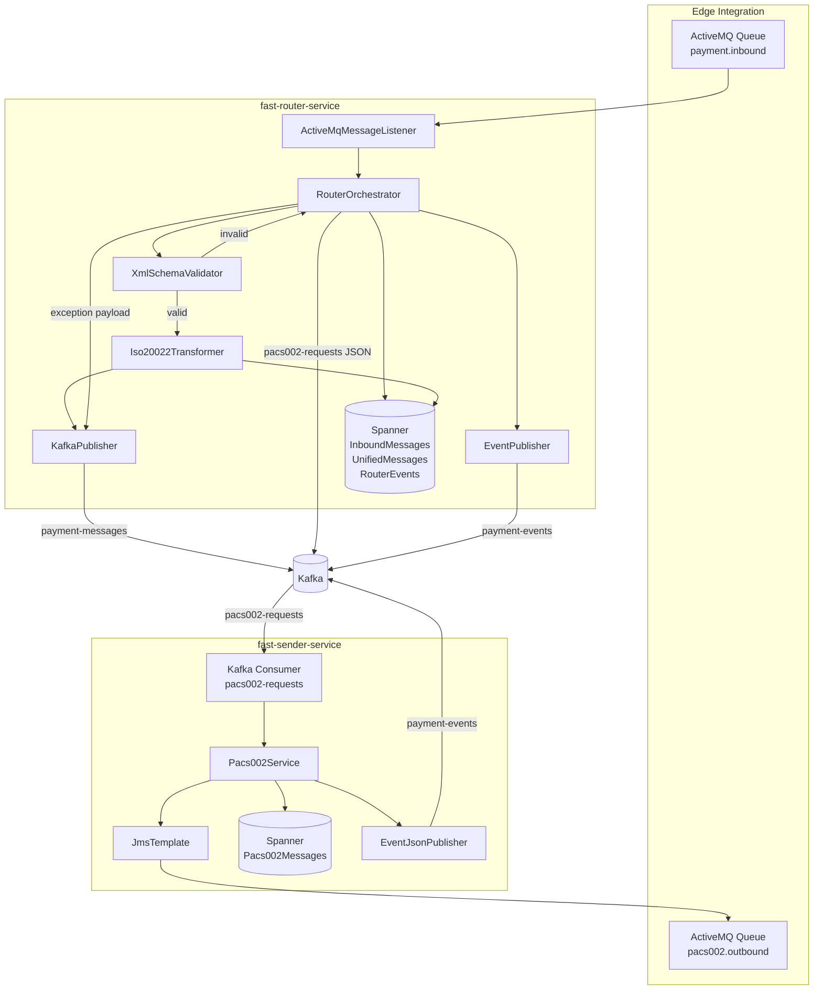
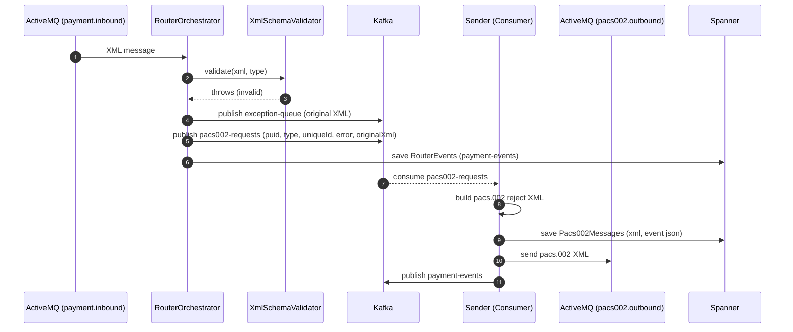

# Fast Router Service – Local Development Guide

This guide documents how to build, run, and validate the `fast-router-service` locally. It includes infrastructure setup, ports, commands, message flow, validation/transformation details, and troubleshooting.

## What this service does
- Consume ISO 20022 payment XML from ActiveMQ queue `payment.inbound`.
- Detect the message type (e.g., pacs.008.001.13, pacs.003.001.11, pacs.007.001.13, camt.056.001.11).
- Validate the XML against the corresponding XSD.
- Transform valid XML into a unified JSON format.
- Publish transformed JSON to Kafka topic `payment-messages`.
- On failure, publish original XML to Kafka topic `exception-queue`.
- Persist an inbound message safe store record in Spanner (emulator locally) with status transitions: RECEIVED → VALIDATED → PUBLISHED, or ERROR.
- Generate a PUID for each message: 16 chars = "G3I" + `yymmdd` + 7 digits.

## Repo and paths
You can work from the repository root. For portability, use repo-relative paths or set an env var:

- Repo root (example): `export REPO_ROOT=$(pwd)` (run this at the repo root)
- Service path: `$REPO_ROOT/services/fast-router-service` (or `./services/fast-router-service` from repo root)
 
## Prerequisites
- Docker Desktop (Compose v2) with at least 4 GB memory allocated
- JDK 17+ (Java 21 recommended)
- Maven 3.9+
- curl, nc (or PowerShell Test-NetConnection on Windows)

## Local infrastructure (Docker Compose)
Services started from `./docker-compose.yml`:
- Zookeeper: 2181
- Kafka broker: 9092 (PLAINTEXT)
- ActiveMQ Classic: 61616 (JMS), 8161 (Web console)
- Spanner emulator: 9010 (gRPC), 9020 (REST)
- Kafka UI: 8090

Start infra (from repo root):
```bash
docker compose -f ./docker-compose.yml up -d zookeeper kafka activemq spanner-emulator kafka-ui
```

Verify:
```bash
# Kafka port (host listener)
nc -zv localhost 29092
# Windows (PowerShell):
# Test-NetConnection -ComputerName localhost -Port 29092 | Format-List -Property TcpTestSucceeded
# Kafka UI
# macOS:    open http://localhost:8090
# Linux:    xdg-open http://localhost:8090
# Windows:  start http://localhost:8090
# ActiveMQ console (user/pass: admin/admin)
# macOS:    open http://localhost:8161
# Linux:    xdg-open http://localhost:8161
# Windows:  start http://localhost:8161
# Spanner emulator ports
nc -zv localhost 9010 && nc -zv localhost 9020
# Windows (PowerShell):
# Test-NetConnection -ComputerName localhost -Port 9010 | Select-Object TcpTestSucceeded
# Test-NetConnection -ComputerName localhost -Port 9020 | Select-Object TcpTestSucceeded
```

## Build and run the service
Stop anything bound to 8080 if needed:
```bash
lsof -iTCP:8080 -sTCP:LISTEN -n -P
kill <pid>
```

Build only the router module (tests skipped) from repo root:
```bash
mvn -q -pl ./services/fast-router-service -DskipTests clean package
```

Run the app (from repo root):
```bash
# Option A (recommended during local dev)
SPRING_PROFILES_ACTIVE=local \
SPRING_CLOUD_GCP_PROJECT_ID=local-project \
SPANNER_EMULATOR_HOST=localhost:9010 \
mvn -q -pl ./services/fast-router-service spring-boot:run \
  > /tmp/router.jar.log 2>&1 & echo $!

# Option B (if you prefer the JAR)
SPRING_PROFILES_ACTIVE=local \
SPRING_CLOUD_GCP_PROJECT_ID=local-project \
SPANNER_EMULATOR_HOST=localhost:9010 \
java -jar "$(ls ./services/fast-router-service/target/fast-router-service-*-SNAPSHOT.jar | head -1)" \
> /tmp/router.jar.log 2>&1 & echo $!
```

Health check:
```bash
curl -s http://localhost:8080/actuator/health
```

## Configuration reference
Main config file: `services/fast-router-service/src/main/resources/application.yml`
- Local profile overrides: `application-local.yml` (enable with `SPRING_PROFILES_ACTIVE=local`). Ensure it sets `spring.kafka.bootstrap-servers: localhost:29092`.
- ActiveMQ
  - `spring.activemq.broker-url`: `tcp://localhost:61616`
  - `spring.activemq.user` / `spring.activemq.password`: `admin` / `admin`
  - Input queue: `app.activemq.input-queue: payment.inbound`
- Kafka
  - `spring.kafka.bootstrap-servers`: `localhost:29092`
  - Topics (local):
    - `payment-messages` (valid transformed messages)
    - `exception-queue` (failed/invalid messages)
    - `bank-availability`
- Spanner (local profile)
  - `spring.cloud.gcp.spanner.instance-id: payment-gateway-local`
  - `spring.cloud.gcp.spanner.database: router-db`
  - `spring.cloud.gcp.spanner.emulator.enabled: true`

Local-only topic auto-creation is gated by `@Profile("local")` in `KafkaTopicConfig`.

## Message flow and components
- Listener: `ActiveMqMessageListener`
- Orchestrator: `RouterOrchestrator`
  - PUID generation: `PuidGenerator` (format: `G3I` + `yymmdd` + 7 digits)
  - ISO 20022 type detection: `Iso20022MessageTypeDetector`
  - XSD validation: `XmlSchemaValidator`
  - Transformation: `Iso20022Transformer` using `TransformationConfigLoader`
  - Kafka publish: `KafkaPublisher`
  - Safe store: `InboundMessageRepository` (Spanner)
- XSDs: `services/fast-router-service/src/main/resources/schema/`
  - `pacs.008.001.13.xsd`, `pacs.003.001.11.xsd`, `pacs.007.001.13.xsd`, `camt.056.001.11.xsd`
- Transformation mapping: `services/fast-router-service/src/main/resources/mappings/transformation-config.json`

On startup (local profile), `SpannerLocalSchema` will auto-create:
- Instance: `payment-gateway-local` (emulator config)
- Database: `router-db`
- Table: `InboundMessages`

## Send a sample message (ActiveMQ)
Using ActiveMQ REST API (auth via env vars):
```bash
export ACTIVEMQ_USER=admin
export ACTIVEMQ_PASS=admin
# Save XML to /tmp/pacs008.xml first (see samples below), then:
curl -u "$ACTIVEMQ_USER:$ACTIVEMQ_PASS" -H "Content-Type: text/xml" \
     --data-binary @/tmp/pacs008.xml \
     "http://localhost:8161/api/message/payment.inbound?type=queue"
```
Alternatively, use the ActiveMQ web console to post a text message to `payment.inbound`.

## View Kafka messages
Using Kafka UI: `http://localhost:8090`
- Cluster name: local
- Bootstrap servers:
  - From containers: `kafka:9092`
  - From host: `localhost:29092` (dual listeners configured in docker-compose)
- Topics: `payment-messages`, `exception-queue`, `bank-availability`

From the Kafka container shell (optional):
```bash
docker exec -it "$(docker compose ps -q kafka)" \
  kafka-console-consumer --bootstrap-server kafka:9092 \
  --topic payment-messages --from-beginning --max-messages 5

docker exec -it "$(docker compose ps -q kafka)" \
  kafka-console-consumer --bootstrap-server kafka:9092 \
  --topic exception-queue --from-beginning --max-messages 5
```

From the host (optional):
```bash
kafka-console-consumer --bootstrap-server localhost:29092 \
  --topic payment-messages --from-beginning --max-messages 5
```

## Logs and observability
- Service logs:
```bash
tail -f /tmp/router.jar.log
```
- Kafka logs:
```bash
docker logs --tail=200 "$(docker compose ps -q kafka)"
```
- Health endpoint:
```bash
curl -s http://localhost:8080/actuator/health
```

## Tests
Run unit tests for this module:
```bash
cd ${REPO_ROOT:-.}
mvn -q -pl services/fast-router-service test
```

## Troubleshooting
- Port 8080 in use
  - `lsof -iTCP:8080 -sTCP:LISTEN -n -P` then `kill <pid>`
- Kafka connectivity
  - Ensure broker logs show `Awaiting socket connections on 0.0.0.0:29092` and `Registered broker ... PLAINTEXT://localhost:29092`
  - `nc -zv localhost 29092` should succeed
- ActiveMQ auth
  - Use `admin`/`admin` credentials for REST and console
- Spanner emulator
  - Ensure container is running and set `SPANNER_EMULATOR_HOST=localhost:9010` when launching the app
  - Startup logs should show `Ensured Spanner emulator table exists for InboundMessages`

## Production notes (high level)
- Do not use the emulator in prod; set real `spring.cloud.gcp.project-id`, instance, and database.
- Keep `KafkaTopicConfig` disabled in prod (it is already `@Profile("local")`).
- Ensure Kafka advertised listener matches the deployment environment (load balancers, DNS, etc.).
- Tracing/observability dependencies should be managed centrally via BOM if required in prod; excluded locally for stability.

## Clean up
```bash
# Stop the service (find PID from your start command output or by port)
lsof -iTCP:8080 -sTCP:LISTEN -n -P
kill <pid>

# Stop infra
docker compose -f ./docker-compose.yml down
```

---
If you need a fully config-driven transformation covering “all fields” across supported ISO 20022 types, the transformation engine is ready to be extended via `transformation-config.json` with additional tests.

## Sample messages

### Sample pacs.008.001.13 (XML)
```xml
<?xml version="1.0" encoding="UTF-8"?>
<Document xmlns="urn:iso:std:iso:20022:tech:xsd:pacs.008.001.13">
  <FIToFICstmrCdtTrf>
    <GrpHdr>
      <MsgId>MSG-20250101-0001</MsgId>
      <CreDtTm>2025-01-01T10:00:00Z</CreDtTm>
      <NbOfTxs>1</NbOfTxs>
      <CtrlSum>100.50</CtrlSum>
      <TtlIntrBkSttlmAmt Ccy="SGD">100.50</TtlIntrBkSttlmAmt>
      <IntrBkSttlmDt>2025-01-01</IntrBkSttlmDt>
      <SttlmInf>
        <SttlmMtd>CLRG</SttlmMtd>
      </SttlmInf>
    </GrpHdr>
    <CdtTrfTxInf>
      <PmtId>
        <InstrId>INSTR-0001</InstrId>
        <EndToEndId>E2E-0001</EndToEndId>
        <TxId>TX-0001</TxId>
      </PmtId>
      <PmtTpInf>
        <SvcLvl>
          <Cd>SEPA</Cd>
        </SvcLvl>
      </PmtTpInf>
      <IntrBkSttlmAmt Ccy="SGD">100.50</IntrBkSttlmAmt>
      <ChrgBr>SHAR</ChrgBr>
      <Dbtr>
        <Nm>John Doe</Nm>
      </Dbtr>
      <DbtrAcct>
        <Id>
          <IBAN>SG12BANK000000000001</IBAN>
        </Id>
      </DbtrAcct>
      <DbtrAgt>
        <FinInstnId>
          <BICFI>BANKSGSGXXX</BICFI>
        </FinInstnId>
      </DbtrAgt>
      <CdtrAgt>
        <FinInstnId>
          <BICFI>ANZBSGSGXXX</BICFI>
        </FinInstnId>
      </CdtrAgt>
      <Cdtr>
        <Nm>Jane Smith</Nm>
      </Cdtr>
      <CdtrAcct>
        <Id>
          <IBAN>SG34BANK000000000002</IBAN>
        </Id>
      </CdtrAcct>
      <RmtInf>
        <Ustrd>Invoice 12345</Ustrd>
      </RmtInf>
    </CdtTrfTxInf>
  </FIToFICstmrCdtTrf>
</Document>
```

### Corresponding unified JSON (shape)
```json
{
  "puid": "${PUID}",
  "messageType": "pacs.008.001.13",
  "groupHeader": {
    "msgId": "MSG-20250101-0001",
    "creationDateTime": "2025-01-01T10:00:00Z",
    "numberOfTransactions": 1,
    "controlSum": "100.50",
    "interbankSettlementAmount": { "amount": "100.50", "currency": "SGD" },
    "interbankSettlementDate": "2025-01-01"
  },
  "creditTransferTransaction": {
    "paymentId": {
      "instructionId": "INSTR-0001",
      "endToEndId": "E2E-0001",
      "transactionId": "TX-0001"
    },
    "amount": { "amount": "100.50", "currency": "SGD" },
    "chargeBearer": "SHAR",
    "debtor": {
      "name": "John Doe",
      "account": { "iban": "SG12BANK000000000001" },
      "agent": { "bic": "BANKSGSGXXX" }
    },
    "creditor": {
      "name": "Jane Smith",
      "account": { "iban": "SG34BANK000000000002" },
      "agent": { "bic": "ANZBSGSGXXX" }
    },
    "remittanceInformation": "Invoice 12345"
  }
}
```

### Send sample via ActiveMQ (curl)
Using a file (auth via env vars):
```bash
# Save XML to /tmp/pacs008.xml first, then:
curl -u "$ACTIVEMQ_USER:$ACTIVEMQ_PASS" -H "Content-Type: text/xml" \
     --data-binary @/tmp/pacs008.xml \
     "http://localhost:8161/api/message/payment.inbound?type=queue"
```

Inline (here-doc, auth via env vars):
```bash
curl -u "$ACTIVEMQ_USER:$ACTIVEMQ_PASS" -H "Content-Type: text/xml" --data-binary @- \
  "http://localhost:8161/api/message/payment.inbound?type=queue" <<'XML'
<?xml version="1.0" encoding="UTF-8"?>
<Document xmlns="urn:iso:std:iso:20022:tech:xsd:pacs.008.001.13">
  <FIToFICstmrCdtTrf>
    <GrpHdr>
      <MsgId>MSG-20250101-0001</MsgId>
      <CreDtTm>2025-01-01T10:00:00Z</CreDtTm>
      <NbOfTxs>1</NbOfTxs>
      <CtrlSum>100.50</CtrlSum>
      <TtlIntrBkSttlmAmt Ccy="SGD">100.50</TtlIntrBkSttlmAmt>
      <IntrBkSttlmDt>2025-01-01</IntrBkSttlmDt>
      <SttlmInf>
        <SttlmMtd>CLRG</SttlmMtd>
      </SttlmInf>
    </GrpHdr>
    <CdtTrfTxInf>
      <PmtId>
        <InstrId>INSTR-0001</InstrId>
        <EndToEndId>E2E-0001</EndToEndId>
        <TxId>TX-0001</TxId>
      </PmtId>
      <PmtTpInf>
        <SvcLvl>
          <Cd>SEPA</Cd>
        </SvcLvl>
      </PmtTpInf>
      <IntrBkSttlmAmt Ccy="SGD">100.50</IntrBkSttlmAmt>
      <ChrgBr>SHAR</ChrgBr>
      <Dbtr>
        <Nm>John Doe</Nm>
      </Dbtr>
      <DbtrAcct>
        <Id>
          <IBAN>SG12BANK000000000001</IBAN>
        </Id>
      </DbtrAcct>
      <DbtrAgt>
        <FinInstnId>
          <BICFI>BANKSGSGXXX</BICFI>
        </FinInstnId>
      </DbtrAgt>
      <CdtrAgt>
        <FinInstnId>
          <BICFI>ANZBSGSGXXX</BICFI>
        </FinInstnId>
      </CdtrAgt>
      <Cdtr>
        <Nm>Jane Smith</Nm>
      </Cdtr>
      <CdtrAcct>
        <Id>
          <IBAN>SG34BANK000000000002</IBAN>
        </Id>
      </CdtrAcct>
      <RmtInf>
        <Ustrd>Invoice 12345</Ustrd>
      </RmtInf>
    </CdtTrfTxInf>
  </FIToFICstmrCdtTrf>
</Document>
XML
```

### Additional sample messages

> Note: ISO 20022 XSDs are strict about element order and required fields. The samples below are simplified but follow required ordering for core elements. If you customize, keep element order and namespaces intact.

#### Sample pacs.003.001.11 (XML)
```xml
<?xml version="1.0" encoding="UTF-8"?>
<Document xmlns="urn:iso:std:iso:20022:tech:xsd:pacs.003.001.11">
  <FIToFICstmrDrctDbt>
    <GrpHdr>
      <MsgId>DD-20250101-0001</MsgId>
      <CreDtTm>2025-01-01T11:00:00Z</CreDtTm>
      <NbOfTxs>1</NbOfTxs>
      <CtrlSum>55.00</CtrlSum>
      <TtlIntrBkSttlmAmt Ccy="SGD">55.00</TtlIntrBkSttlmAmt>
      <IntrBkSttlmDt>2025-01-02</IntrBkSttlmDt>
      <SttlmInf>
        <SttlmMtd>CLRG</SttlmMtd>
      </SttlmInf>
    </GrpHdr>
    <DrctDbtTxInf>
      <PmtId>
        <InstrId>DD-INSTR-0001</InstrId>
        <EndToEndId>DD-E2E-0001</EndToEndId>
        <TxId>DD-TX-0001</TxId>
      </PmtId>
      <InstdAmt Ccy="SGD">55.00</InstdAmt>
      <Dbtr>
        <Nm>Jane Smith</Nm>
      </Dbtr>
      <DbtrAcct>
        <Id>
          <IBAN>SG12BANK000000000010</IBAN>
        </Id>
      </DbtrAcct>
      <DbtrAgt>
        <FinInstnId>
          <BICFI>ANZBSGSGXXX</BICFI>
        </FinInstnId>
      </DbtrAgt>
      <CdtrAgt>
        <FinInstnId>
          <BICFI>BANKSGSGXXX</BICFI>
        </FinInstnId>
      </CdtrAgt>
      <Cdtr>
        <Nm>Acme Corp</Nm>
      </Cdtr>
      <CdtrAcct>
        <Id>
          <IBAN>SG98BANK000000000099</IBAN>
        </Id>
      </CdtrAcct>
      <RmtInf>
        <Ustrd>Invoice 9001</Ustrd>
      </RmtInf>
    </DrctDbtTxInf>
  </FIToFICstmrDrctDbt>
</Document>
```

#### Sample pacs.007.001.13 (XML)
```xml
<?xml version="1.0" encoding="UTF-8"?>
<Document xmlns="urn:iso:std:iso:20022:tech:xsd:pacs.007.001.13">
  <FIToFIPmtRvsl>
    <GrpHdr>
      <MsgId>RVSL-20250101-0001</MsgId>
      <CreDtTm>2025-01-01T12:00:00Z</CreDtTm>
      <NbOfTxs>1</NbOfTxs>
    </GrpHdr>
    <TxInf>
      <RvslId>REV-0001</RvslId>
      <OrgnlGrpInf>
        <OrgnlMsgId>MSG-20250101-0001</OrgnlMsgId>
        <OrgnlMsgNmId>pacs.008.001.13</OrgnlMsgNmId>
      </OrgnlGrpInf>
      <OrgnlTxId>TX-0001</OrgnlTxId>
      <OrgnlIntrBkSttlmAmt Ccy="SGD">100.50</OrgnlIntrBkSttlmAmt>
      <RvslRsnInf>
        <Rsn>
          <Cd>AC04</Cd>
        </Rsn>
        <AddtlInf>Duplicate payment</AddtlInf>
      </RvslRsnInf>
    </TxInf>
  </FIToFIPmtRvsl>
</Document>
```

#### Sample camt.056.001.11 (XML)
```xml
<?xml version="1.0" encoding="UTF-8"?>
<Document xmlns="urn:iso:std:iso:20022:tech:xsd:camt.056.001.11">
  <FIToFIPmtCxlReq>
    <Assgnmt>
      <Id>CXL-ASSIGN-0001</Id>
      <Assgnr>
        <Agt>
          <FinInstnId>
            <BICFI>ANZBSGSGXXX</BICFI>
          </FinInstnId>
        </Agt>
      </Assgnr>
      <Assgne>
        <Agt>
          <FinInstnId>
            <BICFI>BANKSGSGXXX</BICFI>
          </FinInstnId>
        </Agt>
      </Assgne>
      <CreDtTm>2025-01-01T13:00:00Z</CreDtTm>
    </Assgnmt>
    <Undrlyg>
      <OrgnlGrpInfAndCxl>
        <OrgnlMsgId>MSG-20250101-0001</OrgnlMsgId>
        <OrgnlMsgNmId>pacs.008.001.13</OrgnlMsgNmId>
      </OrgnlGrpInfAndCxl>
    </Undrlyg>
    <SplmtryData>
      <Envlp>
        <Any>Customer requested cancellation</Any>
      </Envlp>
    </SplmtryData>
  </FIToFIPmtCxlReq>
</Document>
```

### How we validate XML against XSD (detailed)

The validator component `XmlSchemaValidator` performs strict schema validation using the message’s namespace-specific XSD.

Steps:
1. Message type detection
   - `Iso20022MessageTypeDetector` parses the XML prolog and root namespace to determine the type, e.g. `pacs.008.001.13`.
2. Schema selection
   - Based on the type, we select the matching XSD from `src/main/resources/schema/`:
     - `pacs.008.001.13.xsd`, `pacs.003.001.11.xsd`, `pacs.007.001.13.xsd`, `camt.056.001.11.xsd`.
3. Validator creation
   - We instantiate a `javax.xml.validation.SchemaFactory` for W3C XML Schema and load the XSD as a classpath resource into a `Schema`.
   - A `Validator` is obtained from the `Schema`.
4. Validation
   - The incoming XML payload is wrapped in a `StreamSource` and passed to `validator.validate(source)`.
   - Any structural issues (missing required elements, wrong order, unexpected elements, invalid enums, invalid dates/amounts) raise a `SAXParseException`. We wrap and rethrow as `IllegalArgumentException` with a clear message.
5. Logging
   - We log schema load success and validation success at INFO.
   - Failures log a WARN with the exact XSD error (e.g., `cvc-complex-type.2.4.a Invalid content ...`).

Developer tips:
- XML element order under complex types must match the XSD sequence exactly. This is the most common cause of validation errors.
- Correct namespaces are critical: root `<Document>` must declare the exact ISO 20022 namespace string for the selected message type.

Runtime validation check:
- Post a message (see curl below). Watch `/tmp/router.jar.log` for:
  - `[XSD] Validating XML against XSD for type=...` then `Validation successful` (or a detailed failure).

### How we transform XML to unified JSON (detailed)

The transformer component `Iso20022Transformer` converts validated ISO 20022 XML to an internal unified JSON format, leveraging `TransformationConfigLoader`.

Steps:
1. Input
   - The orchestrator passes: XML string, detected `messageType`, and generated `puid`.
2. Config load
   - `TransformationConfigLoader` loads `resources/mappings/transformation-config.json` via Jackson on app startup. This defines JSON target fields and how to extract their values from ISO 20022 XML (namespaced element paths/attributes).
3. XML parse
   - The transformer parses XML into a DOM/XPath-capable structure with the ISO 20022 namespace URI bound.
4. Field mapping
   - For each configured target field, the transformer evaluates the corresponding XPath-like expression (with namespace), extracts text/attributes (e.g., amount value and `@Ccy`), normalizes types (numbers, strings, dates), and writes into a Jackson `ObjectNode`.
   - Nested objects are created on demand to build the final JSON tree.
   - For repeating blocks (e.g., multiple transactions), the transformer collects arrays in order.
5. Enrichment
   - It injects `puid` and `messageType` into the JSON root.
6. Output
   - The final JSON is serialized as a compact string for Kafka.
7. Logging
   - INFO logs key steps; DEBUG logs a preview of the first 500 chars of the generated JSON.

Validation + Transformation contract:
- Transformation is executed only if XSD validation passes.
- Any transformation error routes the original XML to `exception-queue` and marks the record ERROR in Spanner.

Unit testing:
- `Iso20022TransformerTest` verifies key fields are correctly extracted.
- You can extend tests to assert every mapped field using fixtures and the config rules.

### Post the above samples via ActiveMQ (curl)

Using files:
```bash
# pacs.003
cat >/tmp/pacs003.xml <<'XML'
<?xml version="1.0" encoding="UTF-8"?>
<Document xmlns="urn:iso:std:iso:20022:tech:xsd:pacs.003.001.11">
  <FIToFICstmrDrctDbt>
    <GrpHdr>
      <MsgId>DD-20250101-0001</MsgId>
      <CreDtTm>2025-01-01T11:00:00Z</CreDtTm>
      <NbOfTxs>1</NbOfTxs>
      <CtrlSum>55.00</CtrlSum>
      <TtlIntrBkSttlmAmt Ccy="SGD">55.00</TtlIntrBkSttlmAmt>
      <IntrBkSttlmDt>2025-01-02</IntrBkSttlmDt>
      <SttlmInf>
        <SttlmMtd>CLRG</SttlmMtd>
      </SttlmInf>
    </GrpHdr>
    <DrctDbtTxInf>
      <PmtId>
        <InstrId>DD-INSTR-0001</InstrId>
        <EndToEndId>DD-E2E-0001</EndToEndId>
        <TxId>DD-TX-0001</TxId>
      </PmtId>
      <InstdAmt Ccy="SGD">55.00</InstdAmt>
      <Dbtr><Nm>Jane Smith</Nm></Dbtr>
      <DbtrAcct><Id><IBAN>SG12BANK000000000010</IBAN></Id></DbtrAcct>
      <DbtrAgt><FinInstnId><BICFI>ANZBSGSGXXX</BICFI></FinInstnId></DbtrAgt>
      <CdtrAgt><FinInstnId><BICFI>BANKSGSGXXX</BICFI></FinInstnId></CdtrAgt>
      <Cdtr><Nm>Acme Corp</Nm></Cdtr>
      <CdtrAcct><Id><IBAN>SG98BANK000000000099</IBAN></Id></CdtrAcct>
      <RmtInf><Ustrd>Invoice 9001</Ustrd></RmtInf>
    </DrctDbtTxInf>
  </FIToFICstmrDrctDbt>
</Document>
XML

# pacs.007
cat >/tmp/pacs007.xml <<'XML'
<?xml version="1.0" encoding="UTF-8"?>
<Document xmlns="urn:iso:std:iso:20022:tech:xsd:pacs.007.001.13">
  <FIToFIPmtRvsl>
    <GrpHdr>
      <MsgId>RVSL-20250101-0001</MsgId>
      <CreDtTm>2025-01-01T12:00:00Z</CreDtTm>
      <NbOfTxs>1</NbOfTxs>
    </GrpHdr>
    <TxInf>
      <RvslId>REV-0001</RvslId>
      <OrgnlGrpInf>
        <OrgnlMsgId>MSG-20250101-0001</OrgnlMsgId>
        <OrgnlMsgNmId>pacs.008.001.13</OrgnlMsgNmId>
      </OrgnlGrpInf>
      <OrgnlTxId>TX-0001</OrgnlTxId>
      <OrgnlIntrBkSttlmAmt Ccy="SGD">100.50</OrgnlIntrBkSttlmAmt>
      <RvslRsnInf>
        <Rsn><Cd>AC04</Cd></Rsn>
        <AddtlInf>Duplicate payment</AddtlInf>
      </RvslRsnInf>
    </TxInf>
  </FIToFIPmtRvsl>
</Document>
XML

# camt.056
cat >/tmp/camt056.xml <<'XML'
<?xml version="1.0" encoding="UTF-8"?>
<Document xmlns="urn:iso:std:iso:20022:tech:xsd:camt.056.001.11">
  <FIToFIPmtCxlReq>
    <Assgnmt>
      <Id>CXL-ASSIGN-0001</Id>
      <Assgnr><Agt><FinInstnId><BICFI>ANZBSGSGXXX</BICFI></FinInstnId></Agt></Assgnr>
      <Assgne><Agt><FinInstnId><BICFI>BANKSGSGXXX</BICFI></FinInstnId></Agt></Assgne>
      <CreDtTm>2025-01-01T13:00:00Z</CreDtTm>
    </Assgnmt>
    <Undrlyg>
      <OrgnlGrpInfAndCxl>
        <OrgnlMsgId>MSG-20250101-0001</OrgnlMsgId>
        <OrgnlMsgNmId>pacs.008.001.13</OrgnlMsgNmId>
      </OrgnlGrpInfAndCxl>
    </Undrlyg>
    <SplmtryData>
      <Envlp><Any>Customer requested cancellation</Any></Envlp>
    </SplmtryData>
  </FIToFIPmtCxlReq>
</Document>
XML

# post to the ActiveMQ queue (auth via env vars)
curl -u "$ACTIVEMQ_USER:$ACTIVEMQ_PASS" -H "Content-Type: text/xml" --data-binary @/tmp/pacs003.xml \
  "http://localhost:8161/api/message/payment.inbound?type=queue"

curl -u "$ACTIVEMQ_USER:$ACTIVEMQ_PASS" -H "Content-Type: text/xml" --data-binary @/tmp/pacs007.xml \
  "http://localhost:8161/api/message/payment.inbound?type=queue"

curl -u "$ACTIVEMQ_USER:$ACTIVEMQ_PASS" -H "Content-Type: text/xml" --data-binary @/tmp/camt056.xml \
  "http://localhost:8161/api/message/payment.inbound?type=queue"
```

Note: Set ACTIVEMQ_USER and ACTIVEMQ_PASS before running the above examples, e.g.:
```bash
export ACTIVEMQ_USER=admin
export ACTIVEMQ_PASS=admin
```

After posting, observe `/tmp/router.jar.log` for validation/transform logs, and inspect `payment-messages` topic in Kafka UI for the resulting JSON.

### Expected unified JSON shapes

These examples illustrate the typical unified JSON structure produced by the transformer. Exact fields depend on `mappings/transformation-config.json`.

#### pacs.003.001.11 → unified JSON (shape)
```json
{
  "puid": "${PUID}",
  "messageType": "pacs.003.001.11",
  "groupHeader": {
    "msgId": "DD-20250101-0001",
    "creationDateTime": "2025-01-01T11:00:00Z",
    "numberOfTransactions": 1,
    "controlSum": "55.00",
    "interbankSettlementAmount": { "amount": "55.00", "currency": "SGD" },
    "interbankSettlementDate": "2025-01-02"
  },
  "directDebitTransaction": {
    "paymentId": {
      "instructionId": "DD-INSTR-0001",
      "endToEndId": "DD-E2E-0001",
      "transactionId": "DD-TX-0001"
    },
    "amount": { "amount": "55.00", "currency": "SGD" },
    "debtor": {
      "name": "Jane Smith",
      "account": { "iban": "SG12BANK000000000010" },
      "agent": { "bic": "ANZBSGSGXXX" }
    },
    "creditor": {
      "name": "Acme Corp",
      "account": { "iban": "SG98BANK000000000099" },
      "agent": { "bic": "BANKSGSGXXX" }
    },
    "remittanceInformation": "Invoice 9001"
  }
}
```

#### pacs.007.001.13 → unified JSON (shape)
```json
{
  "puid": "${PUID}",
  "messageType": "pacs.007.001.13",
  "groupHeader": {
    "msgId": "RVSL-20250101-0001",
    "creationDateTime": "2025-01-01T12:00:00Z",
    "numberOfTransactions": 1
  },
  "reversal": {
    "reversalId": "REV-0001",
    "original": {
      "messageId": "MSG-20250101-0001",
      "messageNameId": "pacs.008.001.13",
      "transactionId": "TX-0001",
      "interbankSettlementAmount": { "amount": "100.50", "currency": "SGD" }
    },
    "reason": {
      "code": "AC04",
      "additionalInfo": "Duplicate payment"
    }
  }
}
```

#### camt.056.001.11 → unified JSON (shape)
```json
{
  "puid": "${PUID}",
  "messageType": "camt.056.001.11",
  "cancellationRequest": {
    "assignment": {
      "id": "CXL-ASSIGN-0001",
      "assigner": { "agent": { "bic": "ANZBSGSGXXX" } },
      "assignee": { "agent": { "bic": "BANKSGSGXXX" } },
      "creationDateTime": "2025-01-01T13:00:00Z"
    },
    "underlying": {
      "originalGroupInfoAndCancellation": {
        "originalMsgId": "MSG-20250101-0001",
        "originalMsgNameId": "pacs.008.001.13"
      }
    },
    "supplementaryData": "Customer requested cancellation"
  }
}
```

---

## Additional Local Notes (Routing, Events, and Persistence)

- On XSD validation failure, router publishes to:
  - `${app.kafka.topics.exception-queue}` with the original XML
  - `${app.kafka.topics.pacs002-requests}` with JSON: `puid`, `messageType`, `uniqueId`, `error`, `originalXml`
- Unified JSON for valid messages is also persisted in Spanner table `UnifiedMessages`.
- Router emits a payment event JSON to `${app.kafka.topics.payment-events}` and stores a copy in `RouterEvents` (local emulator).

Tables auto-created in local profile:
- `UnifiedMessages(puid STRING(16) PK, message_type STRING(64), created_at TIMESTAMP, json STRING(MAX))`
- `RouterEvents(puid STRING(16) PK, topic STRING(128), created_at TIMESTAMP, json STRING(MAX))`

## Architecture (Local)



## Failure Path (Sequence)



## Local Topics and Queues (defaults)

- Kafka topics
  - `payment-messages`
  - `exception-queue`
  - `pacs002-requests`
  - `payment-events`
- ActiveMQ queues
  - Inbound: `payment.inbound`
  - Outbound (sender): `pacs002.outbound`

All names are configurable in `application.yml` under `app.kafka.topics.*` and `app.activemq.*`.

## End-to-End (Local) – Quick Checks

1) Invalid XML (XSD fail)
- Post malformed ISO 20022 XML to `payment.inbound` (see examples above)
- Expect:
  - Kafka: message in `exception-queue`
  - Kafka: JSON in `pacs002-requests`
  - Spanner: row in `RouterEvents` and `InboundMessages(status=ERROR)`
  - ActiveMQ: pacs.002 XML in `pacs002.outbound` (from sender)
  - Kafka: event in `payment-events`

2) Valid XML
- Expect:
  - Kafka: unified JSON in `payment-messages`
  - Spanner: `InboundMessages(status=PUBLISHED)` and `UnifiedMessages`

## Playwright E2E (Optional)

An optional e2e scaffold exists under `e2e/` to assert black-box flows (Kafka/Spanner/AMQ). It uses `@playwright/test` with `kafkajs` and Spanner SDK helpers. See `e2e/README.md` for setup and examples.
